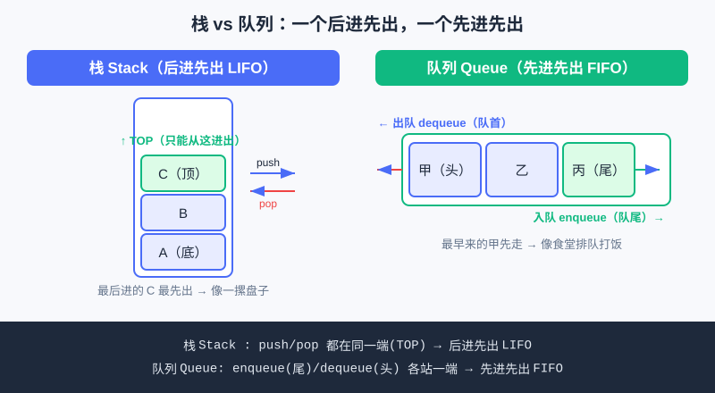

<div style="display:flex; gap:12px; margin-bottom:24px; flex-wrap:wrap; align-items:center;">
  <span style="background:#f0f4ff; color:#4A6CF7; padding:4px 12px; border-radius:20px; font-size:0.85em; font-weight:600; border:1px solid rgba(74,108,247,0.2);">📖 第21章</span>
  <span style="background:#f0fdf4; color:#16a34a; padding:4px 12px; border-radius:20px; font-size:0.85em; border:1px solid rgba(22,163,74,0.2);">⏱️ ~40 min read</span>
  <span style="background:#fef2f2; color:#ef4444; padding:4px 12px; border-radius:20px; font-size:0.85em; border:1px solid rgba(239,68,68,0.2);">🎯 Advanced</span>
</div>

# Chapter 21: 基础数据结构（栈 / 队列 / 链表模拟）

> 📝 **Before You Continue:** 先读完 [列表 list](../data-structures/lists.md)（知道 Python 的 `list` 能 `append`、`pop`、用下标取数）。本章在列表之上，认识三种"有性格"的数据结构：栈、队列、链表——它们不是新语言特性，而是**用已有的工具，按特定规则组织数据**。

你去食堂打饭，队伍有头有尾（先来先打）；你叠盘子，只能从最上面拿（最后放的先拿）；你玩解谜游戏，想反悔就一步步"撤销"——这些日常场景，背后就是三种最基础的数据结构。选对结构，程序能快一半；选错，代码又绕又慢。**数据结构的核心，就是"让数据按你需要的顺序进出"。**

<div class="story-scene">
<strong>🎬 开场小剧场：三位管理员吵起来了</strong>
<p>游乐场仓库来了三批物品：一摞盘子、一队游客、一串寻宝线索。小派想全都用同一种列表管理，结果撤销操作乱了、排队顺序错了、线索也接不上。</p>
<p>栈管理员说：“最后来的先处理。”队列管理员说：“先来的先服务。”链表向导说：“我不靠编号，我靠下一站线索。”这章就是认识三种有性格的数据结构。</p>
</div>

<div class="quest-card">
<strong>🎯 本章任务卡</strong>
<ul>
<li>用一摞盘子理解栈的后进先出。</li>
<li>用食堂排队理解队列的先进先出。</li>
<li>用寻宝线索理解链表的一节接一节。</li>
<li>知道什么时候用 <code>deque</code> 而不是普通列表。</li>
<li>把“数据怎么进出”当成选择结构的第一问题。</li>
</ul>
</div>

<div class="boss-bug">
<strong>👾 本章 Boss Bug：队列 pop(0) 卡顿怪</strong>
<p>它看起来能工作，但每次从队头弹出都要让后面所有人往前挪。打败它的武器是 <code>collections.deque</code> 和 <code>popleft()</code>。</p>
</div>

---

## 🧮 算法小课堂（接第17章首发）

> **不同结构适合不同操作，选对结构程序快一半。**
>
> 第17章我们学会给算法"称重"（Big-O）。但光会称重不够——很多时候**瓶颈不在算法，而在你存数据的方式**。比如"总从一头进出"用栈最快，"两端分别进出"用队列最自然。本章三样结构，就是给你的工具箱按"进出顺序"分类。

---

## 21.1 栈（Stack）：后进先出 LIFO

<div class="try-it">
<strong>🧩 练一练 21.1</strong>
<p>题目：栈（Stack）最主要的特点是什么？用生活比喻。</p>
<details><summary>💡 看看答案</summary>
<p>答案：<b>后进先出 LIFO</b>（Last In First Out），像一摞盘子——最后放上去的，最先被拿走。</p>
</details>
</div>

栈像一摞盘子——你只能从**最上面**放（push）和拿（pop），最下面的反而最后才能拿到。这叫 **LIFO（Last In, First Out，后进先出）**。

Python 的 `list` 天然能当栈用：
- **入栈 push** = `append(x)`（加在末尾，当作"栈顶"）
- **出栈 pop** = `pop()`（拿走末尾那个）
- **看栈顶** = `list[-1]`（不拿走）

```python
stack = []
stack.append("小明")      # push：小明入栈
stack.append("小红")      # push：小红入栈（现在她在顶上）
stack.append("小刚")      # push：小刚入栈（最顶）

print(stack[-1])          # 看栈顶 → 小刚
top = stack.pop()         # 出栈：拿走小刚
print(top)                # 小刚
print(stack)              # ['小明', '小红']
```

输出：
```
小刚
小刚
['小明', '小红']
```

> 💡 **Key Insight:** 栈最适合"最后发生的，最先处理"的场景——比如浏览器"后退"按钮、文本编辑器"撤销（Ctrl+Z）"、函数调用（没错，第20章的递归就是靠系统的栈在背后记录每一步的！）。

### 🧠 Mental Model: 栈像一摞盘子



上图左边就是栈：只能从 TOP 那一端 push/pop，最后放上去的 C 最先被取走。

---

## 21.2 队列（Queue）：先进先出 FIFO

<div class="try-it">
<strong>🧩 练一练 21.2</strong>
<p>题目：用 Python 列表模拟一个栈：入栈和出栈分别对应什么操作？</p>
<details><summary>💡 看看答案</summary>
<p>答案：入栈 <code>stack.append(x)</code>，出栈 <code>stack.pop()</code>（弹出最后一个）。</p>
</details>
</div>

队列像食堂打饭的队——**队首**先走（出队 dequeue），**队尾**新来（入队 enqueue）。这叫 **FIFO（First In, First Out，先进先出）**。

用 `list` 也能模拟，但有个坑：从 `list` **头部** `pop(0)` 要挪动后面所有元素，慢（O(n)）。Python 标准库专门给了 `collections.deque`（双端队列），两端进出都是 O(1)，排队请用它。

```python
from collections import deque

q = deque()
q.append("甲")        # 入队（到队尾）
q.append("乙")
q.append("丙")

print(q[0])           # 看队首 → 甲
first = q.popleft()   # 出队：从队首取走甲
print(first)          # 甲
print(q)              # deque(['乙', '丙'])
```

输出：
```
甲
甲
deque(['乙', '丙'])
```

> ⚠️ **Warning:** 别用普通 `list` 的 `pop(0)` 当队列！每出队一次，后面所有元素都要往前挪，n 个人排队总操作数约 O(n²)。人多就卡。`deque.popleft()` 才是正解，O(1)。

> 🤔 **Why 叫 deque？** `deque` = **d**ouble-**e**nded **que**ue（双端队列）：两端都能快速进出。它既能当队列（尾进头出），也能当栈用，是个"全能选手"。

---

## 21.3 链表（Linked List）：一节一节串起来

<div class="try-it">
<strong>🧩 练一练 21.3</strong>
<p>题目：队列（Queue）和栈相反，它的特点？</p>
<details><summary>💡 看看答案</summary>
<p>答案：<b>先进先出 FIFO</b>（First In First Out），像排队买票——先来的人先办完走。</p>
</details>
</div>

`list` 在内存里是一整块连续空间，中间插入/删除要挪动后面所有元素。链表换了个思路：**每个数据是一节"节点"，节点里除了存数据，还存"下一节在哪"的指针（`next`）**。就像寻宝游戏——每找到一个线索，它告诉你"下一个去哪找"。

我们用一个 `Node` 类来模拟（不深究内存，理解思想即可）：

```python
class Node:
    def __init__(self, data):
        self.data = data     # 这一节点存的数据
        self.next = None     # 指向下一个节点，暂时没有

# 串成  1 → 2 → 3
n1 = Node(1)
n2 = Node(2)
n3 = Node(3)
n1.next = n2        # 节点1 指向 节点2
n2.next = n3        # 节点2 指向 节点3

# 遍历整条链：从头部出发，顺着 next 一路走到 None
cur = n1
while cur is not None:
    print(cur.data)
    cur = cur.next   # 顺着指针走到下一节
```

输出：
```
1
2
3
```

> 💡 **Key Insight:** 链表的强项是**在中间插入/删除快**——只要改一下 `next` 指针，不用挪动其他节点。代价是"找第 k 个"得从头数过去（不能像 `list[k]` 直接跳到）。**没有万能结构，只有合不合适。**

> 📝 **Note:** 真实工程里 Python 常用 `list` 或 `deque` 代替手写链表（它们更快更好用）。但链表是**理解"指针/引用"和后面树、图算法**的基石——竞赛里很多数据结构都建立在它的思想上。

🔍 **计算思维聚焦（抽象与建模 Abstraction & Modeling）：** 栈、队列、链表都不是新东西，而是**同一种 `list` 数据，换一种"进出规则"和组织方式**。这就是抽象的力量——把"顺序"这件事，建模成不同性格的结构，分别适配不同问题。

---

## 21.4 三种结构怎么选（速查表）

<div class="try-it">
<strong>🧩 练一练 21.4</strong>
<p>题目：链表（Linked List）里每个“节点”由哪两部分组成？</p>
<details><summary>💡 看看答案</summary>
<p>答案：① <b>数据</b>（本节点存的值）；② <b>指针 / next</b>（指向下一个节点的地址）。</p>
</details>
</div>

| 结构 | 进出规则 | 典型场景 | Python 实现 | 关键操作代价 |
|------|---------|---------|------------|------------|
| **栈 Stack** | 后进先出 LIFO | 撤销、函数调用、括号匹配 | `list.append` / `list.pop` | 两端 O(1) |
| **队列 Queue** | 先进先出 FIFO | 排队、任务调度、广度优先搜索 | `collections.deque` | 两端 O(1) |
| **链表 List** | 顺着 `next` 串 | 频繁中间插入/删除、建模链式关系 | `Node` 类 | 插入 O(1)，随机访问 O(n) |

> ⚡ **Pro Tip:** 写题时先问自己一句："数据该从哪头进、哪头出？"——答案几乎直接告诉你该用栈还是队列。这是竞赛里省时间的肌肉记忆。

---

## ⚔️ 挑战擂台

<div class="try-it">
<strong>🧩 练一练 21.5</strong>
<p>题目：撤销（Ctrl+Z）功能更适合用栈还是队列？为什么？</p>
<details><summary>💡 看看答案</summary>
<p>答案：<b>栈</b>。撤销总是退回“最近一次”操作，正是后进先出。</p>
</details>
</div>

**擂台题 21（括号匹配）**：给定一串括号如 `"((()))"` 或 `"()()()"`，用**栈**判断它们是"完全配对"还是"没配对好"。规则：遇到 `(` 入栈，遇到 `)` 出栈；最后栈空且过程中不"没东西可弹"才算配对成功。

<details>
<summary>💡 思路提示（点开）</summary>

从左到右扫：遇左括号 `append` 进栈；遇右括号时，若栈空说明"多了一个右括号"→失败，否则 `pop` 一个。扫完若栈空 → 配对成功，否则失败。这正是栈"后进先出"的典型应用。

</details>

---

## 🛠️ 项目工坊：算法游乐场 · 用栈和队列做"游乐场排队"

> 贯穿项目"算法游乐场"([项目三：算法挑战擂台](../projects/algorithm-arena.md)) 继续加算法模块。本章给它加**栈（undo 撤销游客操作）**和**队列（售票口排队的游客）**。

**模块 A — 栈做"撤销上一步"（turtle 画一笔可撤销）**：用栈记录每一步画的动作，按撤销键就 `pop` 掉最后一步。

```python
import turtle

t = turtle.Turtle()
undo_stack = []   # 栈：记录每一步

def draw_step(length):
    t.forward(length)
    undo_stack.append(length)   # 把这一步压栈

def undo():
    if undo_stack:                  # 栈不空才能撤
        last = undo_stack.pop()     # 取出最后一步
        t.undo()                    # turtle 自带的撤销
        print("撤销了长度", last)

draw_step(100); draw_step(60)
undo()           # 撤掉最后画的 60
turtle.done()
```

**模块 B — 队列做"售票口排队"（纯终端）**：新游客从队尾进，窗口叫号从队首出。

```python
from collections import deque

ticket_line = deque(["小明", "小红", "小刚"])
print("现在排队：", list(ticket_line))

ticket_line.append("小美")              # 小美来排队（队尾）
print("小美来了：", list(ticket_line))

served = ticket_line.popleft()          # 窗口叫号（队首）
print("请", served, "入场！剩下：", list(ticket_line))
```

> 💡 **记住这一句：** 现在游乐场多了 **售票队列（先来先玩）和撤销栈（画错一步就退）**——数据"从哪进从哪出"，选对结构就顺了。

---

## 🏅 本章通关徽章：结构管理员

<div class="badge-card">
<strong>如果你能做到下面 4 件事，就获得“结构管理员”徽章：</strong>
<ul>
<li>能用“叠盘子”解释栈的后进先出。</li>
<li>能用“排队打饭”解释队列的先进先出。</li>
<li>能说出为什么队列推荐用 <code>deque</code>。</li>
<li>能用“线索串联”解释链表的基本想法。</li>
</ul>
</div>

---

## ⚠️ Common Mistakes in Chapter 21

| # | 误区 | 示例 | 为什么错 | 修正 |
|---|------|------|---------|------|
| 1 | 用 `list.pop(0)` 当队列 | 排队从头部弹出 | 每次挪动后面所有元素，O(n) | 用 `collections.deque` 的 `popleft()` |
| 2 | 栈用错端 | 用 `pop(0)` 当出栈 | 栈必须从同一端进出（末尾） | 入栈 `append`、出栈 `pop()` |
| 3 | 遍历链表后 `cur` 没前进 | `while cur:` 里忘了 `cur = cur.next` | 死循环，永远停在第一节 | 循环体里一定 `cur = cur.next` |
| 4 | 链表忘了把 `next` 接上 | 只建 `Node` 没设 `n1.next = n2` | 链子断成单节，遍历不到 | 建节点后把 `next` 指针串好 |
| 5 | `deque` 忘 `from collections import` | 直接 `deque()` 报红 | 没导入模块 | 文件头加 `from collections import deque` |

---

## Chapter Summary

### 📌 Key Takeaways

| 概念 | 要点 | 为什么重要 |
|------|------|------------|
| 栈 Stack | 后进先出，`append`/`pop` | 撤销、函数调用、括号匹配 |
| 队列 Queue | 先进先出，用 `deque.popleft()` | 排队、调度、广度优先搜索 |
| 链表 | `Node` + `next` 指针串起来 | 中间插入快，理解树/图的基础 |
| 选结构 | 先看"从哪进从哪出" | 选对结构，程序快一半 |

### ❓ FAQ

**Q1: 既然 `list` 能当栈也能当队列，为什么还要学 `deque`？**
> A: `list` 当栈没问题（末尾进出 O(1)），但**当队列**从头部 `pop(0)` 要挪动整列，人多就慢。排队请用 `deque`，两端都 O(1)。

**Q2: 链表比 `list` 好在哪儿？值得手写吗？**
> A: 链表擅长"中间插入/删除"（改个指针即可），但 Python 里 `list`/`deque` 通常更好用。学链表主要为了**理解指针思想**——它为后面树、图、动态数据结构打底，竞赛里常考。

**Q3: 栈和队列能互相替代吗？**
> A: 不能。它们进出顺序相反：栈处理"最近的"，队列处理"最早的"。场景错配会出逻辑 bug（比如用栈排食堂队，先来的反而最后打饭）。

### 🔗 Connections to Later Chapters

- **[第22章 贪心与模拟](greedy-simulation.md)** 的"模拟题"里，排队、状态维护经常用到队列和栈。
- **[项目三：算法挑战擂台](../projects/algorithm-arena.md)** 中，括号匹配、广度优先搜索等题都直接用到本章结构。
- 链表思想会延伸到树与图（更高阶），为 [下一步去哪？](../projects/next-steps.md) 的算法竞赛进阶铺路。

---


## 🎮 加练任务包

> 下面这些题目不一定比章末题更难，但更适合“多刷几遍、把手感练出来”。建议先独立做，再展开提示。

### 加练 21.A · 撤销栈 🟢

文本编辑器撤销操作更像栈还是队列？为什么？

<details>
<summary>💡 提示 / 答案要点</summary>

像栈。最后做的操作最先撤销，符合 LIFO 后进先出。

</details>

---

### 加练 21.B · 排队叫号 🟢

医院叫号系统更像栈还是队列？为什么？

<details>
<summary>💡 提示 / 答案要点</summary>

像队列。先取号的人先被服务，符合 FIFO 先进先出。

</details>

---

### 加练 21.C · deque 选择 🟡

为什么用普通列表 `pop(0)` 模拟队列不理想？

<details>
<summary>💡 提示 / 答案要点</summary>

因为头部弹出后，后面元素都要前移，单次 O(n)。`deque.popleft()` 两端操作是 O(1)。

</details>

---


---

## Practice Problems

---

**Problem 21.1 — 用栈判断括号是否配对** 🟢 Easy

用栈实现：输入 `"()()()"`，输出它是否完全配对（True/False）。可参考擂台题思路。

**Sample Input:** `"()()()"`
**Sample Output:** `True`

<details>
<summary>💡 Solution (click to reveal)</summary>

**Approach:** 左括号入栈；右括号时若栈空则失败，否则弹一个；最后栈空即成功。

```python
def is_balanced(s):
    stack = []
    for ch in s:
        if ch == "(":
            stack.append(ch)
        else:               # 遇到 ")"
            if not stack:   # 没东西可弹 → 多了一个右括号
                return False
            stack.pop()
    return len(stack) == 0  # 栈空才完全配对

print(is_balanced("()()()"))   # True
print(is_balanced("(()"))      # False
```

**Key points:** 输出 `True`。栈的"后进先出"恰好匹配括号"后开的先闭合"。

</details>

---

**Problem 21.2 — 用队列模拟食堂打饭** 🟡 Medium

有 5 位游客依次到来：`["小明","小红","小刚","小美","小帅"]`。每轮窗口叫号（队首）入场，请模拟并打印每轮"谁入场、还剩谁"。

**Sample Input:** `names = ["小明","小红","小刚","小美","小帅"]`
**Sample Output:** 依次打印 `请 小明 入场！... 请 小帅 入场！`

<details>
<summary>💡 Solution (click to reveal)</summary>

**Approach:** 全部入队后，不断 `popleft()` 直到队空，每轮打印队首姓名与剩余名单。

```python
from collections import deque

names = ["小明", "小红", "小刚", "小美", "小帅"]
q = deque(names)

while q:
    served = q.popleft()
    print(f"请 {served} 入场！剩下：{list(q)}")
```

**Key points:** 严格按 FIFO 出队，`小明`最先、`小帅`最后。这就是队列"先来先服务"的本色。

</details>

---

**Problem 21.3 — 链表反转（手撸指针）** 🟡 Medium

给定一个单向链表 `1 → 2 → 3`，写代码把它**反转**成 `3 → 2 → 1`，并遍历打印。要求用 `Node` 类，手动改 `next` 指针。

**Sample Input:** `1 → 2 → 3`
**Sample Output:** `3 2 1`

<details>
<summary>💡 Solution (click to reveal)</summary>

**Approach:** 三指针法——`prev`（已反转部分的头）、`cur`（当前节点）、`nxt`（暂存下一个）。每步把 `cur.next` 指向 `prev`，再整体右移。

```python
class Node:
    def __init__(self, data):
        self.data = data
        self.next = None

# 建链 1 → 2 → 3
n1, n2, n3 = Node(1), Node(2), Node(3)
n1.next, n2.next = n2, n3
head = n1

# 反转
prev = None
cur = head
while cur is not None:
    nxt = cur.next     # 暂存下一个
    cur.next = prev    # 调头：指向前面
    prev = cur         # prev 右移
    cur = nxt          # cur 右移
head = prev            # 新的头是原来的尾

# 遍历打印
out = []
while head is not None:
    out.append(str(head.data))
    head = head.next
print(" ".join(out))   # 3 2 1
```

**Key points:** 反转链表是链表最经典题，核心是"边走边改 `next` 指向"，并用 `nxt` 提前存好下一个，避免断链后找不到路。

</details>

---

**Problem 21.4 — 🏆 Challenge：用栈实现队列（竞赛思维）** 🔴 Hard

不用 `deque`，只用两个**栈**（`list` 的 `append`/`pop`）实现一个"队列"：支持 `enqueue(x)`（入队）和 `dequeue()`（出队，返回队首）。说明思路并给出可运行代码。

**Sample Input:** 依次 `enqueue(1)`, `enqueue(2)`, `enqueue(3)`, 再 `dequeue()`
**Sample Output:** `1`（队首先出）

<details>
<summary>💡 Solution (click to reveal)</summary>

**思路：** 一个栈 `in_stack` 负责接新元素（入队直接 `append`）。出队时，若 `out_stack` 空，就把 `in_stack` 所有元素倒进 `out_stack`——这一"倒"，顺序就反过来了，`out_stack` 的栈顶正好是**最早入队**的那个。之后从 `out_stack` `pop` 即可。

```python
class QueueWithStacks:
    def __init__(self):
        self.in_stack = []
        self.out_stack = []

    def enqueue(self, x):
        self.in_stack.append(x)          # 入队：压进 in 栈

    def dequeue(self):
        if not self.out_stack:           # out 空才倒一次
            while self.in_stack:
                self.out_stack.append(self.in_stack.pop())
        return self.out_stack.pop()      # 出队：从 out 栈顶取（最早来的）

q = QueueWithStacks()
q.enqueue(1); q.enqueue(2); q.enqueue(3)
print(q.dequeue())   # 1
print(q.dequeue())   # 2
```

**Key points:** 每个元素最多被"倒"一次，均摊下来每次进出仍是 O(1)。这是竞赛里"用简单结构拼出复杂结构"的经典思维训练——也呼应了第20章分治"把问题换角度拆"。
