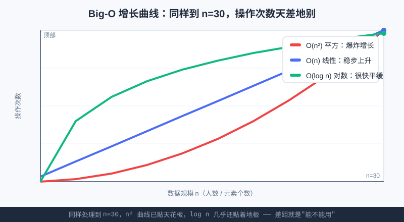

<div style="display:flex; gap:12px; margin-bottom:24px; flex-wrap:wrap; align-items:center;">
  <span style="background:#f0fdf4; color:#16a34a; padding:4px 12px; border-radius:20px; font-size:0.85em; font-weight:600; border:1px solid rgba(22,163,74,0.2);">📖 第17章</span>
  <span style="background:#f0fdf4; color:#16a34a; padding:4px 12px; border-radius:20px; font-size:0.85em; border:1px solid rgba(22,163,74,0.2);">⏱️ ~40 min read</span>
  <span style="background:#fef9ec; color:#d97706; padding:4px 12px; border-radius:20px; font-size:0.85em; border:1px solid rgba(217,119,6,0.2);">🎯 Intermediate</span>
</div>

# Chapter 17: 算法与效率入门 —— Big-O 直觉

> 📝 **Before You Continue:** 先把 [第16章 模块与标准库](../functions/modules.md) 看完，你已经会写函数、会读写列表（`list`）。本章开始，我们不只关心"代码能不能跑对"，还要关心它**跑得快不快、吃不吃内存**——这正是算法竞赛和 AI 路线的分水岭。

体育课上，老师让你从 100 个排队的同学里找出"小明"。你有两种办法：第一种，扯开嗓子喊一声"小明！"，小明自己举手——一秒钟搞定；第二种，从队头开始，挨个问"你是小明吗？"，问到第 100 个才找到。两种办法**结果一样**（都找到了），但**效率天差地别**。

写程序也一样。同一个问题，菜鸟的解法可能要电脑算 1 亿次，高手的只要算 1000 次——对 1000 个数据没差别，对 10 亿个数据，前者要算到天荒地老，后者瞬间完成。**算法启蒙篇**，就是教你学会"看效率"这一双眼睛。

<div class="story-scene">
<strong>🎬 开场小剧场：时间裁判吹哨</strong>
<p>算法擂台开赛了。两个选手都写出了正确答案：一个让检票员从第一个游客问到最后一个，另一个先看中间位置，每次排除一半。结果一公布：第一位选手还在满头大汗，第二位已经喝完奶茶。</p>
<p>时间裁判 Big-O 举起哨子：“答案对，只是入场券；跑得够快，才有资格通关。”从这一章开始，我们不只问“能不能做出来”，还要问“数据变大时，它会不会慢到爆炸”。</p>
</div>

<div class="quest-card">
<strong>🎯 本章任务卡</strong>
<ul>
<li>理解好算法的三个标准：正确、快、省内存。</li>
<li>学会数核心操作次数。</li>
<li>用生活比喻记住 O(1)、O(log n)、O(n)、O(n²)。</li>
<li>看懂为什么双重循环经常很慢。</li>
<li>能用复杂度判断一个方案会不会超时。</li>
</ul>
</div>

<div class="boss-bug">
<strong>👾 本章 Boss Bug：超时怪 TLE</strong>
<p>它不会让你的答案变错，只会让电脑算到比赛结束。打败它的第一步不是背公式，而是先问：我的代码会随着数据量变大，跑多少次核心操作？</p>
</div>

---

## 17.1 什么是"好算法"：正确 + 快 + 省内存

<div class="try-it">
<strong>🧩 练一练 17.1</strong>
<p>题目：衡量一个“好算法”的三个标准是什么？</p>
<details><summary>💡 看看答案</summary>
<p>答案：① <b>正确</b>；② <b>快</b>（时间）；③ <b>省内存</b>（空间）。</p>
</details>
</div>

一个好算法，要同时满足三件事：

1. **正确（Correct）**：结果必须对。这是底线，不对一切都白搭。
2. **快（Fast）**：运行时间短，也叫"时间效率高"。
3. **省（Frugal）**：占用的内存少，也叫"空间效率高"。

> 💡 **Key Insight:** 很多初学者只盯着"正确"，觉得"能跑出答案就行"。但竞赛里、真实工程里，**"慢的正确答案"常常等于"错误答案"**——因为比赛限时，超时（Time Limit Exceeded）直接 0 分。

### 🧠 Mental Model: 算法像做菜

把算法想成"做一道菜"的菜谱：
- **正确** = 照着做能做出能吃的菜，而不是黑暗料理；
- **快** = 半小时上桌，而不是炖三天；
- **省** = 不把整个厨房的锅碗瓢盆都占满。

三样都顾上，才是大厨的菜谱。

> 📝 **Note:** 本书后续算法篇主要精力放在"快"（时间效率）上，因为它最直观、竞赛最常考；"省内存"会顺带提，但不展开到很深。

---

## 17.2 时间复杂度：数"操作次数"

<div class="try-it">
<strong>🧩 练一练 17.2</strong>
<p>题目：数“操作次数”：把数组每个元素加一遍，和双重循环两两比较，复杂度分别是？</p>
<details><summary>💡 看看答案</summary>
<p>答案：逐个加是 <code>O(n)</code>（n 次）；双重循环是 <code>O(n²)</code>（约 n×n 次）。</p>
</details>
</div>

怎么衡量一个算法"快不快"？**最朴素、最靠谱的办法——数它做了多少次"核心操作"。**

所谓"核心操作"，就是算法里最关键的那个动作。比如"找人"时，核心操作是**问一次话 / 比较一次**；"求和"时，核心操作是**加一次**。

我们看两个真实例子。

### 例子 A：从 100 人里找某人

**办法一：喊名字（直接点名）**

```python
# 假设同学们站成一排，按学号排好，编号 0~99
students = ["小刚","小美","小明","阿强", ... ]   # 共 100 人
target = "小明"

# 你记得小明站在第 42 号位置（编号 41）
print(students[41])   # 一步到位，直接喊他
```

> 🤔 **Why 这算一步？** 在 Python 的列表里，按编号（下标）取元素 `students[41]` 是"瞬间"完成的，不管列表有 100 人还是 1 亿人，电脑都是一步拿到。这种"无论多少数据都只做固定次数操作"的情况，就是后面要讲的 **O(1)**。

**办法二：挨个问（线性查找）**

```python
def find_person(students, target):
    ops = 0                      # 用来数"问了几次"
    for i in range(len(students)):
        ops += 1                # 每问一个人，操作数 +1
        if students[i] == target:
            print(f"找到了，问了 {ops} 次")
            return i
    print(f"没找到，问了 {ops} 次")
    return -1

find_person(students, "小明")
```

最坏情况下，小明站在最后一个，你得问满 **100 次**。如果换成 1 万人排队，就要问 1 万次——**人数翻几倍，操作次数就翻几倍**。

### 例子 B：数组求和 vs 双重循环

```python
def sum_one_pass(nums):
    total = 0
    ops = 0
    for x in nums:
        ops += 1              # 每个数加一次
        total += x
    return total, ops         # 100 个数 → 加 100 次

def pair_count(n):
    count = 0
    ops = 0
    for i in range(n):
        for j in range(n):
            ops += 1          # 每个人和每个人都比一次
            count += 1
    return count, ops         # 100 → 100×100 = 10000 次！
```

> ⚠️ **Warning:** 注意 `pair_count` 里的双重 `for`。当 `n=100`，内层循环跑 100 次、外层又跑 100 次，合计 **1 万次**；当 `n=1000`，直接变成 **100 万次**。数据只多了 10 倍，操作次数却多了 **100 倍**——这种"指数级增长"是效率的头号杀手。

> 🧠 **计算思维聚焦（评估 Evaluation）：** "评估"就是**在动手前先估算方案的好坏**。数操作次数，就是最基础的评估能力。高手和新手最大的区别之一，就是高手在写代码前，脑子里已经大致知道"这玩意儿跑起来会有多快"。

---

## 17.3 四种最常见的复杂度 & 生活比喻

<div class="try-it">
<strong>🧩 练一练 17.3</strong>
<p>题目：用一句生活比喻分别说明 O(1)、O(log n)、O(n)、O(n²)。</p>
<details><summary>💡 看看答案</summary>
<p>答案：O(1) 喊名字（一下就好）；O(log n) 翻书找页（每次砍半）；O(n) 一页页翻（挨个问）；O(n²) 全班握手（人人两两见面）。</p>
</details>
</div>

把"操作次数随数据量 n 变化的规律"归纳成几种典型形状，给它们起名叫 **大 O 记号（Big-O）**。你先记住下面四种，它们覆盖了 90% 的场景。

| 记号 | 名字 | 生活比喻 | 操作次数随 n 的变化 |
|------|------|----------|----------------------|
| **O(1)** | 常数时间 | 点名喊人：不管 100 人还是 1 万人，喊一声就到 | 永远固定，不随 n 变 |
| **O(log n)** | 对数时间 | 翻书找页：每次翻到中间，扔掉一半，几下就到 | n 变大时增长极慢 |
| **O(n)** | 线性时间 | 一页页翻书 / 挨个问人：人数翻倍，时间翻倍 | 和 n 成正比 |
| **O(n²)** | 平方时间 | 每个人和每个人握手：n 人要有 n×n 次握手 | n 翻倍，时间翻 4 倍 |

### O(1)：喊名字（常数）

无论队伍多长，你知道位置就一步拿到。下标访问、简单加减，都是 O(1)。

### O(log n)：翻书找页（对数）

想象一本 1000 页的电话本找"张伟"。你**不会从第一页翻**——你会先翻到正中间（第 500 页），看"张"在左半边还是右半边，扔掉另一半；再在剩下的 500 页里翻到中间……每次都把范围**砍掉一半**。1000 页只需约 10 次（因为 2¹⁰≈1024），10 亿页也只要约 30 次！这就是对数增长的魔力。

> 💡 **Pro Tip:** `log` 在算法里默认指以 2 为底（log₂）。记住一个直觉：**O(log n) 的意思是"每次砍半，砍到不能砍为止"**——砍的次数就是答案。

### O(n)：一页页翻 / 挨个问（线性）

没有顺序可乘之机，只能从头到尾扫一遍。数据翻倍，时间翻倍。大多数"遍历"都是 O(n)。

### O(n²)：全员握手（平方）

每两个人握一次手，n 个人就有 n×(n−1)/2 次 ≈ n²/2 次。只要出现**两层嵌套循环**，基本就是 O(n²) 的预警。



上图把三条曲线画到同一张图上（都画到 n=30）。可以看到：**O(n²) 红线很快就贴到了天花板，O(log n) 绿线几乎还贴着地板**——这就是"选对算法 vs 选错算法"的差距。

> 🤔 **Why 我们关心形状而不是精确数字？** 因为电脑快慢、语言快慢都会让"操作次数"乘上一个系数。但我们真正要比较的是**当 n 变得超级大时，谁的曲线更平缓**。形状对了，快慢趋势就定了。

---

## 17.4 最坏情况（Worst Case）

<div class="try-it">
<strong>🧩 练一练 17.4</strong>
<p>题目：算法分析里常说的“最坏情况（Worst Case）”指什么？</p>
<details><summary>💡 看看答案</summary>
<p>答案：指<b>输入最不利</b>时算法的表现。我们通常用最坏情况来给算法“保底”估价。</p>
</details>
</div>

同一个算法，运气好和运气差，操作次数可能差很多。比如"挨个问找小明"：
- 小明正好是第一个 → 只问 1 次（最好情况）；
- 小明正好在最后 → 问满 n 次（最坏情况）。

算法分析里，我们**默认看最坏情况**。原因很实在：你没法保证每次都运气好，但你能保证"再差也不会比最坏情况更惨"。所以 Big-O 通常表示"最坏情况下的操作次数上界"。

> 📝 **Note:** 也有"平均情况"分析（比如随机数据时平均问 n/2 次），但初学阶段先死磕"最坏情况"最稳妥，竞赛题也常按最坏情况卡时间。

---

## 17.5 别被常数吓到：看趋势，忽略系数

<div class="try-it">
<strong>🧩 练一练 17.5</strong>
<p>题目：为什么比较 O(n) 和 O(2n) 时，说它们“差不多”？</p>
<details><summary>💡 看看答案</summary>
<p>答案：因为看的是<b>增长趋势</b>、忽略常数系数。n 很大时，n 和 2n 都比 n² 快得多。</p>
</details>
</div>

Big-O 有个重要脾气：**它只关心"增长形状"，不关心"前面乘了几倍"**。

下面两个算法，一个是 O(n)、一个是 O(n)，但我们数操作次数会发现：

```python
# 算法甲：每次循环做 1 次操作
def algo_a(n):
    for i in range(n):
        do_one_thing()        # 1 次操作 × n

# 算法乙：每次循环做 5 次操作
def algo_b(n):
    for i in range(n):
        do_one_thing()
        do_one_thing()
        do_one_thing()
        do_one_thing()
        do_one_thing()        # 5 次操作 × n
```

甲乙都是 O(n)，只是乙"每次多干 4 件小事"。当 n 很大（比如 100 万），"5 倍"的差距不过是常数倍，远没有"O(n) vs O(n²)"那种天壤之别重要。

> ⚡ **Pro Tip:** 所以 Big-O 会**把常数和低位项统统丢掉**：
> - `3n + 10` → 写成 **O(n)**
> - `0.5n² + 100n + 5` → 写成 **O(n²)**
> - `5` → 写成 **O(1)**
>
> 只看"最高阶那一项"——它决定了大 n 时谁说了算。

> 🐛 **Common Bug:** 初学者常陷入"我这个函数只少了 2 行，肯定更快"的误区。两行差别若不改变嵌套层级（比如还是双层循环），Big-O 没变，n 大了照样慢。优化要动"形状"，不是动"几行"。

---

## 🧮 算法小课堂（首发 · 系统讲）

从本章起，每章都会有一个"算法小课堂"。我们的目标不是背公式，而是建立**对效率的直觉**。

**Big-O 到底是什么？**
它是一种**描述"当数据变多时，算法会变多慢"的速记法**。我们不去数精确的次数（那太繁琐），而是抓住主导项，用 O(...) 把"增长规律"圈出来。

**怎么"数"出 Big-O？** 记住三步：
1. **找核心操作**：算法里最费时间的那一步（通常是比较、赋值、循环体里的动作）。
2. **数它随 n 跑几遍**：是每人一次（O(n)）？还是每人都要和其余每人比（O(n²)）？还是每次砍半（O(log n)）？
3. **丢掉常数和低阶项**：只留最高阶。

**为什么竞赛和 AI 都爱它？**
- 竞赛（USACO）每题都有时间限制，O(n²) 的解法在 n=10⁵ 时必超时，必须换 O(n log n)。
- AI / ML 里要处理百万级样本，一个 O(n²) 的距离计算在大数据下直接跑不动——很多"加速"技巧本质就是把 O(n²) 降到 O(n log n) 或 O(n)。

> 💡 **Key Insight:** Big-O 不是数学家的炫技，而是你写给自己的"效率说明书"：一眼看出"这个解法能不能扛住大数据"。

---

## ⚔️ 挑战擂台

**擂台题：** 假设有 100 万条用户记录，你想找出"年龄最大的那个人"。
- 方案甲：从头到尾扫一遍，边扫边记当前最大值 → 问：这是 O(?)？
- 方案乙：每两个人比一次，排出完整名次 → 问：这是 O(?)？

> 提示：甲只扫一遍；乙要"每个人和每个人比"。想一想，哪个在 100 万数据下还活得了？

<details>
<summary>💡 擂台揭晓（点击展开）</summary>

- 方案甲是 **O(n)**：扫一遍，100 万次操作，现代电脑眨眼完成。
- 方案乙是 **O(n²)**：100 万 × 100 万 ≈ 10¹² 次操作，电脑要算到地老天荒。

**结论**：找最大值根本不需要排序，一次遍历（O(n)）就够了。这正说明"先想清要什么，再选算法"有多重要。

</details>

---

## 🛠️ 项目工坊：给"算法游乐场"加一块效率招牌

回顾我们的贯穿项目 [算法游乐场](../projects/algorithm-arena.md)。现在游客越来越多了，园长想知道：**"数清楚今天来了多少游客，要花多久？"**

我们在游乐场入口装一个计数器，每进来一人就记一次。数总人数，就是从头到尾扫一遍名单：

```python
def count_visitors(visitors):
    """数游客总数。visitors 是今天刷票进场的名单（列表）。"""
    total = 0
    for _ in visitors:
        total += 1          # 每人数一次 → O(n)
    return total

# 试一下
today = ["小红","小刚","小明","阿强","小美"]
print("今天来了", count_visitors(today), "位游客")
```

> 💡 **项目笔记：** 现在游乐场多了 **"数游客要多久"** 这块招牌——它只扫一遍名单，是 O(n) 的。等下一章学了"快速找人"，我们就能给游乐场升级成"报出名字立刻定位到人在哪"了。

---

## 🏅 本章通关徽章：时间裁判学徒

<div class="badge-card">
<strong>如果你能做到下面 4 件事，就获得“时间裁判学徒”徽章：</strong>
<ul>
<li>能说清“正确答案”和“够快答案”的区别。</li>
<li>能用核心操作次数估算程序快慢。</li>
<li>能用生活例子解释 O(1)、O(log n)、O(n)、O(n²)。</li>
<li>看到两层循环时，会警觉它可能是 O(n²)。</li>
</ul>
</div>

---

## ⚠️ Common Mistakes in Chapter 17

| # | 误区 | 示例 | 为什么错 | 修正 |
|---|------|------|---------|------|
| 1 | 以为"能跑出答案就行" | 超时（TLE）还纳闷 | 竞赛限时，慢解=0 分 | 先估 Big-O 再写 |
| 2 | 把"少写两行"当优化 | 双层循环删 2 行以为变快 | 嵌套层级没变，Big-O 仍是 O(n²) | 优化要降"形状"，非降行数 |
| 3 | 混淆 O(n) 和 O(n²) | 用双重循环做本可一遍扫完的事 | n 一大就超时百倍 | 想清"每人一次"还是"每人×每人" |
| 4 | 忽略"有序"前提就谈效率 | 对乱序数组用 O(log n) 二分 | 二分要求有序，乱序会查错 | 先排序或保证有序 |
| 5 | 死抠精确次数 | 纠结 3n+10 还是 3n+12 | Big-O 本就丢常数 | 只留最高阶项 |
| 6 | 只看最好情况 | "小明第一个就找到了" | 运气不总好，最坏才可靠 | 用最坏情况评估 |

---

## Chapter Summary

### 📌 Key Takeaways

| 概念 | 要点 | 为什么重要 |
|------|------|------------|
| 好算法三标准 | 正确 + 快 + 省内存 | "慢的正确"常等于"错误" |
| 数操作次数 | 找核心操作，数它随 n 跑几遍 | 最朴素的效率衡量法 |
| O(1)/O(log n)/O(n)/O(n²) | 常数/对数/线性/平方 | 覆盖 90% 场景的形状 |
| 最坏情况 | 默认按最差评估 | 保证"再差也到此为止" |
| 忽略常数 | 只留最高阶项 | 看增长趋势，不被系数吓到 |

### ❓ FAQ

**Q1: Big-O 真的要背公式吗？**
> A: 不用背公式。记住四类形状和比喻（喊人、翻书、挨个问、握手），遇到代码数一数"核心操作跑几遍"就能判断。

**Q2: O(log n) 的 log 是以几为底？**
> A: 算法里默认以 2 为底（log₂）。但 Big-O 忽略常数，所以底数是 2 还是 10 都无所谓，形状一样平缓。

**Q3: 我的电脑很快，O(n²) 是不是也能凑合用？**
> A: 小数据（n 几百）可以。但竞赛/真实数据常是 n=10⁵ 甚至更大，那时 O(n²) 是 10¹⁰ 级操作，再快的电脑也救不了。

**Q4: 空间效率（省内存）本章怎么没细讲？**
> A: 初学先攻时间效率这一座大山。空间效率我们会在用到时（比如某些算法要开额外数组）顺带点一下。

### 🔗 Connections to Later Chapters

- **[第18章 搜索算法](../algorithms/searching.md)** 会让你亲手看到：线性查找是 O(n)，而"每次砍半"的二分查找是 O(log n)——把本章的对数直觉落地。
- **[第19章 排序算法](../algorithms/sorting.md)** 讲三种 O(n²) 排序，并埋下 O(n log n) 归并排序的伏笔。
- **[第20章 递归与分治](../algorithms/recursion-divide.md)** 正式讲"分而治之"，解释为什么 O(n log n) 能比 O(n²) 快那么多。

---


## 🎮 加练任务包

> 下面这些题目不一定比章末题更难，但更适合“多刷几遍、把手感练出来”。建议先独立做，再展开提示。

### 加练 17.A · 复杂度分类 🟢

一层循环遍历 n 个元素，通常是 O(1)、O(n) 还是 O(n²)？

<details>
<summary>💡 提示 / 答案要点</summary>

通常是 O(n)。因为 n 变大，循环次数跟着线性变大。

</details>

---

### 加练 17.B · 嵌套预警 🟢

两层循环各跑 n 次，大约做多少次操作？复杂度是什么？

<details>
<summary>💡 提示 / 答案要点</summary>

大约 n×n 次，即 O(n²)。数据翻倍，操作约翻 4 倍。

</details>

---

### 加练 17.C · 二分步数估计 🟡

100 万个有序元素用二分查找，大约需要比较多少次？

<details>
<summary>💡 提示 / 答案要点</summary>

约 20 次，因为 2^20 ≈ 1,048,576。O(log n) 增长很慢。

</details>

---


---

## Practice Problems

---

**Problem 17.1 — 判断复杂度（口算）** 🟢 Easy

下面每段代码的核心操作，随 n 增长属于 O(1)、O(n) 还是 O(n²)？写出你的判断和一句理由。

```python
# 片段 A
def last_element(a):
    return a[-1]            # 取最后一个

# 片段 B
def print_all(a):
    for x in a:
        print(x)

# 片段 C
def all_pairs(a):
    for i in a:
        for j in a:
            print(i, j)
```

<details>
<summary>💡 Solution (click to reveal)</summary>

- **片段 A → O(1)**：按下标取元素一步到位，与列表长度无关。
- **片段 B → O(n)**：每个元素打印一次，n 个就 n 次。
- **片段 C → O(n²)**：双层循环，每人都要和每人配对，约 n×n 次。

**Key points:** 判断是否出现嵌套循环、是否每次都从头扫，是快速判断形状的关键。

</details>

---

**Problem 17.2 — 数出真实操作次数** 🟡 Medium

修改下面的 `linear_search`，让它返回"比较次数"，然后分别用长度为 10、1000 的列表测试查找一个不存在的元素，观察次数变化。

```python
def linear_search(data, target):
    comparisons = 0
    for x in data:
        comparisons += 1
        if x == target:
            return comparisons
    return comparisons
```

<details>
<summary>💡 Solution (click to reveal)</summary>

**Approach:** 在循环里累加比较次数即可。找不到时，会扫完整个列表。

```python
def linear_search(data, target):
    comparisons = 0
    for x in data:
        comparisons += 1
        if x == target:
            return comparisons
    return comparisons

small = list(range(10))
big = list(range(1000))
print(linear_search(small, 999))   # 找不到 → 10 次
print(linear_search(big, 999))    # 找不到 → 1000 次
```

**Key points:** 列表长度从 10 变 1000（×100），比较次数也从 10 变 1000（×100）——正比例关系，印证 O(n)。这就是"数操作次数"把直觉变成可验证事实的过程。

</details>

---

**Problem 17.3 — 设计更快的"找最大值"** 🟢 Easy

给定 100 万个随机数，目标是找出最大值。请用 O(n) 的一次遍历实现，并解释为什么不能简单地"每两个数比一次排个序"。

```python
import random
data = [random.randint(0, 10**6) for _ in range(10**6)]

def find_max(nums):
    # 你的代码：一次遍历
    pass
```

<details>
<summary>💡 Solution (click to reveal)</summary>

```python
import random
data = [random.randint(0, 10**6) for _ in range(10**6)]

def find_max(nums):
    cur_max = nums[0]
    for x in nums:
        if x > cur_max:
            cur_max = x
    return cur_max

print(find_max(data))
```

**Key points:** 只扫一遍（O(n)），100 万次比较，瞬间完成。如果用"排序再取最后"的思路，最快也要 O(n log n)，而且排序本身还要额外工作——找最大值根本不需要完整排序，别为了杀鸡动用牛刀。

</details>

---

**Problem 17.4 — 🏆 Challenge：两个有序列表合并要多少次？** 🔴 Hard

有两个**已经排好序**的列表 `A` 和 `B`（长度分别为 n 和 m），要把它们合并成一个有序列表。直觉上你只需"每次从两个表头挑较小的那个"，不需要把全部重新排序。

请实现 `merge_two_sorted(A, B)`，并说明它的时间复杂度（用 Big-O 表示，考虑 n 和 m），以及为什么它比"先拼接再整体排序"快。

```python
def merge_two_sorted(A, B):
    # 返回合并后的有序列表
    pass

A = [1, 3, 5, 7]
B = [2, 4, 6, 8]
print(merge_two_sorted(A, B))   # [1,2,3,4,5,6,7,8]
```

<details>
<summary>💡 Solution (click to reveal)</summary>

**Approach:** 用两个指针 `i`、`j` 分别指向 A、B 的当前元素，每次比较两者表头，取较小的放入结果，并推进对应指针。任一列表用完就把另一个剩余部分直接接上。

```python
def merge_two_sorted(A, B):
    result = []
    i = j = 0
    # 两边都还有元素时，挑小的
    while i < len(A) and j < len(B):
        if A[i] <= B[j]:
            result.append(A[i]); i += 1
        else:
            result.append(B[j]); j += 1
    # 把没用完的那边剩余部分接上
    result.extend(A[i:])
    result.extend(B[j:])
    return result

A = [1, 3, 5, 7]
B = [2, 4, 6, 8]
print(merge_two_sorted(A, B))   # [1, 2, 3, 4, 5, 6, 7, 8]
```

**复杂度分析：** 每个元素最多被比较、放入结果各一次，总操作次数 = n + m。所以是 **O(n + m)**。

**为什么比"拼接后整体排序"快？** 拼接后排序（比如用下一章会学的 O(k²) 排序，k=n+m）要 (n+m)² 量级；即使是最快的 O(k log k) 排序也要 k·log k。而这里我们**利用了"两边本就有序"的前提**，只做一遍线性扫描就合并完——这正是"巧用已知条件（有序）来降复杂度"的经典思路，也是 [第20章 递归与分治](../algorithms/recursion-divide.md) 里归并排序的核心拼图。

</details>

---

> 💡 **记住这一句：** 好算法不只求"对"，还要求"当数据变多时，还撑得住"——而 Big-O 就是你看穿这一点的眼睛。
