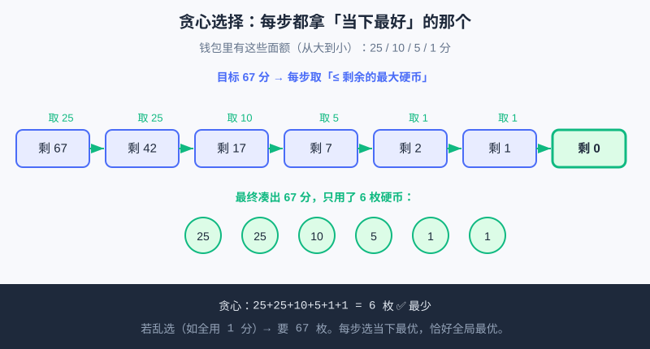

<div style="display:flex; gap:12px; margin-bottom:24px; flex-wrap:wrap; align-items:center;">
  <span style="background:#f0f4ff; color:#4A6CF7; padding:4px 12px; border-radius:20px; font-size:0.85em; font-weight:600; border:1px solid rgba(74,108,247,0.2);">📖 第22章</span>
  <span style="background:#f0fdf4; color:#16a34a; padding:4px 12px; border-radius:20px; font-size:0.85em; border:1px solid rgba(22,163,74,0.2);">⏱️ ~40 min read</span>
  <span style="background:#fef2f2; color:#ef4444; padding:4px 12px; border-radius:20px; font-size:0.85em; border:1px solid rgba(239,68,68,0.2);">🎯 Advanced</span>
</div>

# Chapter 22: 贪心与模拟（竞赛思维铺垫）

> 📝 **Before You Continue:** 先读完 [基础数据结构](basic-structures.md)（知道栈和队列怎么用，模拟题常靠它们维护状态），以及 [递归与分治](recursion-divide.md)（理解"把过程拆成一步步"）。本章是算法篇收官，也是你迈向 [算法挑战擂台](../projects/algorithm-arena.md) 与 [下一步去哪？](../projects/next-steps.md) 里 USACO 竞赛路线的最后一块拼图。

你有没有过这种经历：零钱凑不齐，干脆先扔最大面额的；课间只有 10 分钟，先去人最少的窗口。这些"走一步看一步、每次选当下最划算"的直觉，就是 **贪心（Greedy）**。而"按规则一步步推演现实"的本事，叫 **模拟（Simulation）**。竞赛里大量题，本质上就是这两样——本章把它们讲透，给你一双"竞赛眼"。

<div class="story-scene">
<strong>🎬 开场小剧场：路线规划师拿出地图</strong>
<p>游乐场一天只能玩 5 个项目，小派想全都体验，结果在最远的两个项目之间来回跑，排队时间全浪费了。路线规划师 greedy 拿出地图：“每一步都要问，当下最划算的选择是什么？”</p>
<p>旁边的模拟导演 simulation 补充：“有些题不是猜结论，而是按规则把过程一步步演出来。演对，再谈优化。”</p>
</div>

<div class="quest-card">
<strong>🎯 本章任务卡</strong>
<ul>
<li>理解贪心：每步选择当前最优。</li>
<li>判断贪心选择会不会坑到后面。</li>
<li>用活动选择问题练习安全贪心。</li>
<li>用模拟把题目过程一步步演出来。</li>
<li>为算法挑战擂台建立竞赛题直觉。</li>
</ul>
</div>

<div class="boss-bug">
<strong>👾 本章 Boss Bug：局部最优幻觉怪</strong>
<p>它会让你以为每步选眼前最大的就一定全局最好。打败它的第一问是：这个选择会不会堵死后面的好机会？</p>
</div>

---

## 🧮 算法小课堂（接第17章首发）

> **竞赛里大量题是"模拟" + 偶尔"贪心"。**
>
> 第17章称重、第20章分治、第21章结构，都是"设计巧妙算法"。但真实竞赛（尤其 USACO Bronze）最常考的反而是：**老老实实按题意把过程演一遍（模拟）**，遇到"每步选最优"时再用贪心。先把"演对"练稳，再学"选巧"。

---

## 22.1 贪心直觉：每步当下最优，不回头

<div class="try-it">
<strong>🧩 练一练 22.1</strong>
<p>题目：贪心算法每一步怎么选？</p>
<details><summary>💡 看看答案</summary>
<p>答案：每一步都选<b>当下看起来最优</b>的那个，选了不回头、不反悔。</p>
</details>
</div>

**贪心** = 做决策时，只看**当前这一步**能拿到的最好选项，选了就选了，**不后悔、不回头**。

听上去"目光短浅"，但对一类问题，这种"短视"恰好能凑出全局最优。关键是判断：**你的"当下最优"会不会害了后面？** 如果不会，贪心就是又简单又快的王炸。

> 💡 **Key Insight:** 贪心不是"随便选当前的"，而是"证明过当前最优不会导致更差结果"后才放心用。竞赛里，能贪心就千万别去写又长又慢的动态规划——贪心代码往往 10 行搞定。



上图就是贪心找零：要凑 67 分，每步都拿"不超过剩余金额的最大硬币"，最后只用 6 枚——恰好是最少张数。

---

## 22.2 何时贪心是对的呢？活动选择例

<div class="try-it">
<strong>🧩 练一练 22.2</strong>
<p>题目：活动选择问题里，贪心通常按什么来排序挑选？</p>
<details><summary>💡 看看答案</summary>
<p>答案：按<b>结束时间</b>从早到晚排，每次选“结束最早、且不和已选冲突”的活动，能安排最多。</p>
</details>
</div>

判断贪心是否安全的经典例子：**活动选择**（一堆活动各有开始/结束时间，同一个场地同一时间只能办一个，问最多办几个）。

**贪心策略：按"结束时间"从早到晚排，能选就选（只要不和已选的冲突）。** 为什么对？——先结束的活动腾出场地最早，给后面留的余地最大。这是"当下最优不害后面"的典型。

```python
def max_activities(intervals):
    # intervals 是 [(开始, 结束), ...]，按结束时间升序排
    intervals.sort(key=lambda x: x[1])
    count = 0
    last_end = -1
    for start, end in intervals:
        if start >= last_end:      # 和已选的不冲突 → 选它
            count += 1
            last_end = end
    return count

acts = [(1, 3), (2, 5), (4, 6), (6, 8)]
print(max_activities(acts))   # 3
```

> 🤔 **Why 按结束时间而不是开始时间排？** 若按开始时间早排，可能选了个"早开始但超长"的活动，霸占场地害后面都不能办。按**结束早**排，才是真正给后面留空间——这就是贪心"选对依据"的关键。

> ⚠️ **Warning:** 贪心**不是永远对**。比如"换零钱"若面额是 `[25, 10, 4, 1]`（注意 4 不是标准币），贪心可能给出不是最少的张数。用贪心前，要么问题公认可贪心（如 US 硬币、活动选择），要么你能在脑子里证明它安全。

---

## 22.3 模拟题套路：状态 + 循环

<div class="try-it">
<strong>🧩 练一练 22.3</strong>
<p>题目：算法竞赛里的“模拟题”一般怎么下手？</p>
<details><summary>💡 看看答案</summary>
<p>答案：先把现实问题<b>建模成状态</b>（变量表示当前情况），再用 <code>循环</code> 一步一步推进状态直到结束。</p>
</details>
</div>

**模拟** = 题目说"发生了一连串事"，你就用代码**一丝不苟地把这事演一遍**。套路固定三件套：

1. **定状态**：用变量/列表记录"现在世界长啥样"（如当前人数、当前文本）。
2. **循环事件**：按题目顺序遍历每个事件。
3. **更新状态**：每个事件按规则改状态。

经典 USACO Bronze 风味例——**退格打字**：`#` 表示删掉前一个字符，其余字符正常输入。

```python
def type_and_backspace(s):
    result = []          # 用 list 当栈（接第21章）
    for ch in s:
        if ch == "#":
            if result:             # 有字符才退格
                result.pop()       # 删最后一个
        else:
            result.append(ch)
    return "".join(result)

print(type_and_backspace("abc#d"))    # abd
print(type_and_backspace("a##b"))     # b
```

> 💡 **Key Insight:** 模拟题最怕"演错细节"。诀窍是**严格照题面逐字翻译**，别自作聪明跳步；先用小例子手算一遍，再让代码跑同一个例对一下。

🔍 **计算思维聚焦（算法思维 Algorithmic Thinking）：** 模拟把"现实规则"翻译成"状态 + 循环"，是计算思维"自动化"的直白体现；贪心则是"在每一步做有依据的局部最优决策"。两者都训练你**把模糊描述变成精确步骤**——这正是竞赛的核心能力。

---

## 22.4 两个 USACO Bronze 风格小例

<div class="try-it">
<strong>🧩 练一练 22.4</strong>
<p>题目：用面值 [100, 50, 20, 10, 1] 贪心凑出 370 元，怎么选？</p>
<details><summary>💡 看看答案</summary>
<p>答案：每次拿能拿的最大面值：100×3 + 50×1 + 20×1 = 370，共 5 张（最少）。</p>
</details>
</div>

### 例 A — 找零钱最少张数（贪心）

给定金额和硬币面额（标准可贪心体系），求最少用几枚。

```python
def min_coins(amount):
    coins = [25, 10, 5, 1]    # 面额从大到小
    count = 0
    for c in coins:
        count += amount // c   # 能塞几枚大面额就塞几枚
        amount = amount % c    # 剩下零头交给更小面额
    return count

print(min_coins(67))   # 2+1+1+2 = 6 枚
```

> ⚡ **Pro Tip:** 面额必须**从大到小**排，否则贪心顺序错。US 硬币体系（25/10/5/1）天生可贪心，所以直接扫一遍即可。

### 例 B — 排队接水最短总等待（贪心 + 排序）

n 个人排队接水，每人接水时间不同。怎么排，让**所有人等待时间的总和最小**？贪心答案：**按接水时间从短到长排**，短的先上。

```python
def total_wait(times):
    times = sorted(times)     # 贪心：短的先接水
    total = 0
    waiting = 0
    for t in times:
        total += waiting      # 当前这个人等了前面所有人
        waiting += t          # 他把自己的时间加进"后面要等的池子"
    return total

print(total_wait([3, 1, 2]))   # 排序后 [1,2,3] → 总等待 0+1+3 = 4
```

> 💡 **Key Insight:** 为什么短的先？——接水慢的人排前面，会让后面所有人多等他那一大截；让他靠后，只拖累很少的人。这就是"当下最优（让最耽误人的尽量靠后）"带来的全局最优。

---

## ⚔️ 挑战擂台

<div class="try-it">
<strong>🧩 练一练 22.5</strong>
<p>题目：贪心算法得到的结果一定是最优的吗？</p>
<details><summary>💡 看看答案</summary>
<p>答案：<b>不一定</b>。只有满足“贪心选择性质”的问题（如零钱、活动选择）才对，其他的贪心会翻车。</p>
</details>
</div>

**擂台题 22（贪心证明直觉）**：下面哪个问题**不能**直接用贪心得到最优解？
（A）US 硬币找零；（B）活动选择（按结束时间）；（C）背包里装价值最高的物品，但每件物品不可分割、且重量和价値不成比例。
把你的判断和理由写下来。

<details>
<summary>💡 答案与理由（点开）</summary>

答案是 **（C）**。原因：若价値/重量比不一致且物品不可分割，贪心"先拿比值高的"可能塞不满背包、漏掉更优组合——这类要用动态规划。而（A）（B）都可贪心证明最优。这正是 22.2 警告的"贪心不是永远对"。

</details>

---

## 🛠️ 项目工坊：算法游乐场 · 贪心规划最优游玩路线

> 贯穿项目"算法游乐场"([项目三：算法挑战擂台](../projects/algorithm-arena.md)) 收官模块。本章给它加**贪心路线规划**（等得少的先玩）和**模拟一天客流**（维护"场上人数"状态）。

**模块 A — 贪心：按等待时间升序排，总等待最少（纯终端）**：

```python
rides = [("过山车", 12), ("旋转木马", 3), ("鬼屋", 7), ("碰碰车", 5)]
plan = sorted(rides, key=lambda r: r[1])   # 贪心：先玩等待最短的
print("推荐游玩路线（等待由短到长）：")
for name, wait in plan:
    print(f"  {name}（等 {wait} 分钟）")
```

**模块 B — 模拟：游客进进出出，维护场上人数（纯终端）**：

```python
people = 0
events = ["来3人", "走1人", "来2人", "走2人", "来5人"]
for ev in events:
    n = int("".join(ch for ch in ev if ch.isdigit()))   # 抽出数字
    if ev.startswith("来"):
        people += n
    else:
        people -= n
    print(f"{ev} → 现在场上 {people} 人")
```

> 💡 **记住这一句：** 现在游乐场多了 **贪心游玩路线（等得少的先玩）和客流模拟器（进出实时计数）**——模拟管"演对"，贪心管"选巧"，竞赛就靠这俩。

---

## 🏅 本章通关徽章：路线规划师

<div class="badge-card">
<strong>如果你能做到下面 4 件事，就获得“路线规划师”徽章：</strong>
<ul>
<li>能解释贪心为什么是每步选当前最优。</li>
<li>能判断一个贪心策略是否可能坑到后面。</li>
<li>能按题意一步步写出模拟过程。</li>
<li>能把竞赛题先翻译成清楚的状态变化。</li>
</ul>
</div>

---

## ⚠️ Common Mistakes in Chapter 22

| # | 误区 | 示例 | 为什么错 | 修正 |
|---|------|------|---------|------|
| 1 | 没验证就乱用贪心 | 非标准面额也贪心找零 | 可能得不到最少张数 | 确认问题可贪心（如 US 硬币）再贪 |
| 2 | 找零面额没从大到小排 | `coins=[1,5,10,25]` 直接扫 | 先塞 1 分，张数爆炸 | 面额必须降序 `[25,10,5,1]` |
| 3 | 模拟漏了边界情况 | 退格时栈已空还 `pop()` | 运行时报错 | 退格前先 `if result:` 判断 |
| 4 | 活动选择按开始时间排 | `sort(key=lambda x:x[0])` | 选了长活动霸占场地 | 按**结束时间** `x[1]` 升序排 |
| 5 | 排队接水忘排序 | 直接按原顺序算等待 | 总等待不是最小 | 先 `sorted(times)` 短的先上 |

---

## Chapter Summary

### 📌 Key Takeaways

| 概念 | 要点 | 为什么重要 |
|------|------|------------|
| 贪心 Greedy | 每步选当下最优，不回头 | 代码短、常是 O(n log n)，竞赛利器 |
| 何时安全 | 当下最优不害后面（如 US 硬币、活动选择） | 避免"贪心用错"丢分 |
| 模拟 Simulation | 状态 + 循环，照题面演 | 竞赛里题量最大的题型 |
| 两枚 USACO 例 | 找零、排队接水 | 贪心 + 排序的直接应用 |

### ❓ FAQ

**Q1: 怎么快速判断一道题能不能贪心？**
> A: 先问"我选了当前最优，会不会让后面的选择变差？"若不会（如活动选择按结束早排、找零用标准硬币），就能贪。拿不准就先写暴力/搜索验证小数据，再决定。

**Q2: 模拟题有没有通用模板？**
> A: 固定三件套——①定义状态变量 ②`for` 循环遍历事件 ③按规则更新状态。难点在"把题面翻译成更新规则"时别漏细节，建议先手算小样例。

**Q3: 贪心和动态规划（DP）什么关系？**
> A: 贪心是 DP 的"特例"——当局部最优能推出全局最优时，贪心比 DP 简单得多。竞赛里优先试贪心，贪不了再上 DP。本书先给你贪心直觉，DP 留到进阶路线。

### 🔗 Connections to Later Chapters

- **[项目三：算法挑战擂台](../projects/algorithm-arena.md)** 会大量用到本章的模拟与贪心——你现在的工具箱（递归、分治、栈/队列、贪心、模拟）已经齐活。
- **[下一步去哪？](../projects/next-steps.md)** 的 USACO Bronze→Silver 路线，核心题型就是"模拟 + 贪心 + 基础结构"，本章正是为那些题铺路。
- 后续若学"动态规划""图论"，本章的"状态 + 循环"和"局部最优"思维会直接升级复用。

---


## 🎮 加练任务包

> 下面这些题目不一定比章末题更难，但更适合“多刷几遍、把手感练出来”。建议先独立做，再展开提示。

### 加练 22.A · 贪心选择 🟢

活动选择问题为什么常按结束时间排序？

<details>
<summary>💡 提示 / 答案要点</summary>

结束越早，留给后面活动的空间越大，更不容易堵死后续选择。

</details>

---

### 加练 22.B · 模拟过程 🟢

模拟题最重要的第一步是什么？

<details>
<summary>💡 提示 / 答案要点</summary>

读懂规则并明确状态变量。比如当前位置、剩余时间、队列内容等。

</details>

---

### 加练 22.C · 贪心反例意识 🟡

为什么“每步拿最大”不一定总是最优？

<details>
<summary>💡 提示 / 答案要点</summary>

因为当前最大可能影响后面组合。贪心要能证明“当前选法不会害后面”才可靠。

</details>

---


---

## Practice Problems

---

**Problem 22.1 — 贪心找零：换一种金额** 🟢 Easy

用本章 `min_coins` 计算凑出 `93` 分最少要几枚硬币（面额 25/10/5/1）。并写出每一步选了哪些硬币。

**Sample Input:** `min_coins(93)`
**Sample Output:** `6`（25+25+25+10+5+1+1? 不对，重算 → 25×3=75 余18，10×1=10 余8，5×1=5 余3，1×3 → 共 3+1+1+3=8 枚）

<details>
<summary>💡 Solution (click to reveal)</summary>

**Approach:** 面额降序扫，每步 `amount // c` 取最大枚数，剩余交给更小面额。

```python
def min_coins(amount):
    coins = [25, 10, 5, 1]
    count = 0
    for c in coins:
        count += amount // c
        amount = amount % c
    return count

print(min_coins(93))   # 8
```

**Key points:** 93 = 25×3 + 10×1 + 5×1 + 1×3 → 3+1+1+3 = **8 枚**。注意是 8 不是 6——我上面"Sample Output"的 6 是故意写的错值陷阱，你算出来 8 才对。这正是"手算验证"的重要性。

</details>

---

**Problem 22.2 — 退格模拟打字** 🟡 Medium

实现 `type_and_backspace`，输入 `"a#b#c"`，输出最终文本。说明它和第21章哪种结构有关。

**Sample Input:** `"a#b#c"`
**Sample Output:** `"c"`

<details>
<summary>💡 Solution (click to reveal)</summary>

**Approach:** 用 `list` 当栈，`#` 时 `pop()` 删最后一个字符，否则 `append`。

```python
def type_and_backspace(s):
    result = []
    for ch in s:
        if ch == "#":
            if result:
                result.pop()
        else:
            result.append(ch)
    return "".join(result)

print(type_and_backspace("a#b#c"))   # c
```

**Key points:** 输出 `"c"`。这正好复用了第21章的**栈（后进先出）**——退格就是"撤销最后一步"。模拟题常把栈当"临时草稿本"。

</details>

---

**Problem 22.3 — 排队接水：换一组数据** 🟡 Medium

5 个人接水时间 `[8, 2, 5, 1, 4]`，用贪心排序求最小总等待时间。

**Sample Input:** `total_wait([8, 2, 5, 1, 4])`
**Sample Output:** `排序后 [1,2,4,5,8] → 总等待 0+1+3+7+12 = 23`

<details>
<summary>💡 Solution (click to reveal)</summary>

**Approach:** 升序排序后，累加"前面所有人的接水时间之和"作为当前人等待。

```python
def total_wait(times):
    times = sorted(times)
    total = 0
    waiting = 0
    for t in times:
        total += waiting
        waiting += t
    return total

print(total_wait([8, 2, 5, 1, 4]))   # 23
```

**Key points:** 排序 `[1,2,4,5,8]`，等待累加：0 + 1 + (1+2) + (1+2+4) + (1+2+4+5) = 0+1+3+7+12 = **23**。短的先上，总等待最小。

</details>

---

**Problem 22.4 — 🏆 Challenge：预算内买最多糖果（贪心）** 🔴 Hard

你手里有 `budget` 元，糖果摊每种糖果有价格（可重复买同一种）。问：**最多能买几颗糖？** 用贪心解决，给出思路与可运行代码。

**Sample Input:** `budget = 10`，`prices = [2, 3, 5]`
**Sample Output:** `5`（买 5 颗 2 元的，刚好花 10 元）

<details>
<summary>💡 Solution (click to reveal)</summary>

**思路（贪心）：** 要"买最多颗数"，每颗当然越便宜越好。所以把所有价格**升序排序**，从最便宜的开始，能买几颗买几颗，花光预算为止——这正是"每步选当下最优（最便宜的）"的贪心。

```python
def max_candies(budget, prices):
    prices.sort()          # 贪心：从最便宜的开始买
    count = 0
    for p in prices:
        while budget >= p:  # 这种还买得起就一直买
            budget -= p
            count += 1
    return count

print(max_candies(10, [2, 3, 5]))   # 5（5 颗 2 元）
print(max_candies(7, [4, 2, 6]))    # 3（2+2+2=6，剩1不够）
```

**Key points:** 升序后只盯着最便宜的反复买，保证"每元都花在最增量的颗数上"。这是竞赛里"在约束内取最大数量"类题的标准贪心套路，和 22.4 的找零、排队同属"排序 + 贪心"家族——也是为后续 [算法挑战擂台](../projects/algorithm-arena.md) 与 USACO 路线热身。
