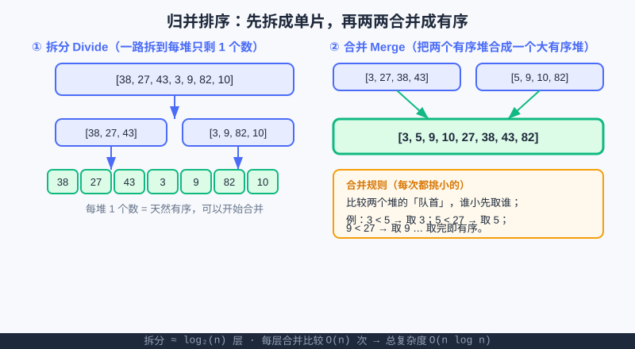

<div style="display:flex; gap:12px; margin-bottom:24px; flex-wrap:wrap; align-items:center;">
  <span style="background:#f0f4ff; color:#4A6CF7; padding:4px 12px; border-radius:20px; font-size:0.85em; font-weight:600; border:1px solid rgba(74,108,247,0.2);">📖 第20章</span>
  <span style="background:#f0fdf4; color:#16a34a; padding:4px 12px; border-radius:20px; font-size:0.85em; border:1px solid rgba(22,163,74,0.2);">⏱️ ~40 min read</span>
  <span style="background:#fef2f2; color:#ef4444; padding:4px 12px; border-radius:20px; font-size:0.85em; border:1px solid rgba(239,68,68,0.2);">🎯 Advanced</span>
</div>

# Chapter 20: 递归与分治（汉诺塔 / 归并 / 记忆化）

> 📝 **Before You Continue:** 先读完函数篇的 [作用域与递归初步](../functions/scope-recursion.md)（已经知道"函数自己调用自己"是什么），以及算法篇的 [排序算法](sorting.md)（知道冒泡/选择/插入是 O(n²)）。本章在它们基础上，把"递归"升级成"分治"武器，并给你一个 O(n log n) 的排序王牌。

想象你要把一堆积木按大小排好。你已经会"冒泡排序"那种一个个比、一遍遍扫的笨办法（[排序算法](sorting.md) 里讲过，要数约 n² 次操作）。但如果你有帮手呢？——把积木**对半劈成两堆**，各自排好，再拼起来。这就是 **分治（Divide and Conquer）** 的精髓：**把难问题砍成能下手的小块，分别解决，再合并结果**。本章就带你用递归把这套思想落地，并顺手解决排序的"性能天花板"问题。

<div class="story-scene">
<strong>🎬 开场小剧场：分治军团集合</strong>
<p>算法游乐场来了一个巨型任务：整理 10 万块积木。小派准备用冒泡排序硬扫，时间裁判摇头：“这样要扫到天黑。”</p>
<p>分治军团 divide-and-conquer 把大堆积木一刀切成两半：“别硬刚。先拆小，分别解决，再合回来。递归不是魔法，是把大怪兽切成小怪兽。”</p>
</div>

<div class="quest-card">
<strong>🎯 本章任务卡</strong>
<ul>
<li>复习递归的基线条件和递归步。</li>
<li>用“拆、解、合”理解分治。</li>
<li>看懂归并排序为什么是 O(n log n)。</li>
<li>理解汉诺塔怎样把大问题交给小一号问题。</li>
<li>用记忆化避免重复计算。</li>
</ul>
</div>

<div class="boss-bug">
<strong>👾 本章 Boss Bug：重复计算影分身</strong>
<p>它会让递归反复解决同一个小问题，像派出一堆分身做重复劳动。打败它的武器是记忆化：算过的答案存起来，下次直接查。</p>
</div>

---

## 🧮 算法小课堂（接第17章首发）

> **分治 = 把难问题砍成能下手的小块。**
>
> 第17章我们学会了用 Big-O 给算法"称重"。这一章开始，我们要**主动设计**更快的算法。分治是第一个大招：一个问题如果**能拆成结构相同的小问题**，就非常适合用递归来做。后面第21、22章的栈/队列、贪心，本质上也都是"把大问题换一种角度拆"的思路。

---

## 20.1 递归回顾：函数自己叫自己

<div class="try-it">
<strong>🧩 练一练 20.1</strong>
<p>题目：递归是“函数调用自己”，它必须有一个什么，否则会无限循环？</p>
<details><summary>💡 看看答案</summary>
<p>答案：必须有<b>基线条件（base case）</b>——一个不再调用自己、直接返回的最小情形。</p>
</details>
</div>

先温习一下。递归函数有两样东西不能少：

1. **基线条件（base case）**：最小、不用再拆就能直接给答案的情况——它是递归的"刹车"。
2. **递归条件（recursive case）**：把问题缩小一点、再调用自己。

```python
def countdown(n):
    if n <= 0:                 # ① 基线条件：到 0 就停
        print("发射！🚀")
        return
    print(n)
    countdown(n - 1)           # ② 递归：把 n 减 1 再叫自己

countdown(3)
```

输出：
```
3
2
1
发射！🚀
```

> 🤔 **Why 一定要基线条件？** 没有它，函数会"自己叫自己"永远不停，直到电脑报错 `RecursionError`（递归太深）。**基线条件就是告诉程序：到这里别再拆了，该往回走了。**

### 🧠 Mental Model: 递归像俄罗斯套娃

<div style="text-align:center; margin:20px 0;">
<svg width="560" height="200" viewBox="0 0 560 200" xmlns="http://www.w3.org/2000/svg" style="max-width:100%;">
  <defs>
    <marker id="ar20" markerWidth="10" markerHeight="10" refX="8" refY="3" orient="auto"><path d="M0,0 L8,3 L0,6 Z" fill="#4A6CF7"/></marker>
  </defs>
  <rect x="20" y="40" width="160" height="120" rx="8" fill="#e8ecff" stroke="#4A6CF7" stroke-width="2"/>
  <text x="100" y="108" text-anchor="middle" font-size="15" font-weight="bold" fill="#1e293b">大问题</text>
  <line x1="180" y1="100" x2="248" y2="100" stroke="#4A6CF7" stroke-width="2" marker-end="url(#ar20)"/>
  <rect x="250" y="55" width="130" height="90" rx="8" fill="#e8ecff" stroke="#4A6CF7" stroke-width="2"/>
  <text x="315" y="105" text-anchor="middle" font-size="14" fill="#1e293b">小一点</text>
  <line x1="380" y1="100" x2="428" y2="100" stroke="#4A6CF7" stroke-width="2" marker-end="url(#ar20)"/>
  <rect x="430" y="70" width="110" height="60" rx="8" fill="#dcfce7" stroke="#10b981" stroke-width="2"/>
  <text x="485" y="105" text-anchor="middle" font-size="13" fill="#1e293b">基线</text>
  <text x="280" y="170" text-anchor="middle" font-size="13" fill="#64748b">一路拆到「最小块」才能直接回答</text>
</svg>
</div>

<p style="color:#888; font-size:0.9em; margin-top:6px;">大问题一层层套小问题，最里面那个最小块能直接答，再一层层把答案"包"回去。</p>

---

## 20.2 分治思想：拆 → 解 → 合

<div class="try-it">
<strong>🧩 练一练 20.2</strong>
<p>题目：“分而治之（分治）”一般分哪三步？</p>
<details><summary>💡 看看答案</summary>
<p>答案：① <b>拆</b>：把大问题拆成小问题；② <b>解</b>：分别解决小问题；③ <b>合</b>：把小答案合并成最终答案。</p>
</details>
</div>

分治三步走，记牢这六个字就够：

| 步骤 | 英文 | 在干嘛 |
|------|------|--------|
| **拆** | Divide | 把大问题分成几个结构相同的子问题 |
| **解** | Conquer | 子问题足够小就直接解（基线）；否则继续拆 |
| **合** | Combine | 把子问题的答案合并成原问题的答案 |

> 💡 **Key Insight:** 分治的"合"往往是最巧妙的一步。比如排序，拆开容易，难的是**怎么把两个已经排好序的堆，快速并成一个大有序堆**。下一节归并排序就是这个问题的完整答案。

🔍 **计算思维聚焦（分解 Decomposition）：** 分治是"分解"这一计算思维的典型体现——你不是硬刚整个问题，而是把它切成**彼此独立、结构相同**的小块，分而治之。这种思路在算法竞赛里随处可见。

---

## 20.3 归并排序：O(n log n) 的排序王牌

<div class="try-it">
<strong>🧩 练一练 20.3</strong>
<p>题目：归并排序的时间复杂度是多少？为什么比 O(n²) 快？</p>
<details><summary>💡 看看答案</summary>
<p>答案：<code>O(n log n)</code>。它每次把数组对半拆（log n 层），每层合并共扫 n 个（n 倍），相乘即 n·log n。</p>
</details>
</div>

[排序算法](sorting.md) 里学的冒泡/选择/插入，都要数约 n² 次比较——数据翻一倍，时间翻四倍，太大就扛不住。归并排序（Merge Sort）用分治把复杂度压到 **O(n log n)**：数据翻一倍，时间只多一点点。

### 思路

1. **拆**：把数组从中间切成两半，一直切到每堆只剩 1 个数（1 个数天然有序）。
2. **合**：把两个**已经有序**的堆，用"每次都比队首、取小的"的方式合并成一个大有序堆。



上图左边是"一路拆到单片"，右边是"两个有序堆合并成一个"。注意：合并时两个堆**已经有序**，所以只要从头比、谁小取谁，整体就一定有序——这就是快的关键。

### 代码

```python
def merge_sort(arr):
    # 基线条件：长度 <= 1 已经有序，直接返回
    if len(arr) <= 1:
        return arr
    mid = len(arr) // 2
    left = merge_sort(arr[:mid])    # 递归排左半
    right = merge_sort(arr[mid:])   # 递归排右半
    return merge(left, right)       # 合并两个有序部分

def merge(left, right):
    result = []
    i = j = 0
    # 两个堆都还有数时，谁小取谁
    while i < len(left) and j < len(right):
        if left[i] <= right[j]:
            result.append(left[i])
            i += 1
        else:
            result.append(right[j])
            j += 1
    # 哪边还有剩的，直接接在后面（剩的那边本来就有序）
    result.extend(left[i:])
    result.extend(right[j:])
    return result

data = [38, 27, 43, 3, 9, 82, 10]
print(merge_sort(data))   # [3, 9, 10, 27, 38, 43, 82]
```

> 🐛 **Common Bug:** 写 `merge` 时漏了最后两行 `result.extend(...)`。一旦某一边先取完，另一边剩下的数就丢了，结果会"缺斤少两"。**两边取完才算合并完。**

### 复杂度（用"数操作次数"直觉）

- **拆的层数**：每次对半切，7 个数切到单片大约要 log₂(7) ≈ 3 层；n 个数约 log₂(n) 层。
- **每层的合并工作量**：每一层把所有数都比较多一遍，约 n 次操作。
- **总操作数 ≈ n × log₂(n)** → 记作 **O(n log n)**。

和 O(n²) 比：n = 1000 时，n² = 1,000,000，而 n·log₂n ≈ 10,000——快了 **100 倍**。数据越大，差距越夸张。

> ⚡ **Pro Tip:** `merge_sort` 返回的是**新列表**，原列表没被改动。如果你写 `data = merge_sort(data)` 才拿到排好序的结果；直接 `merge_sort(data)` 不赋值，原 `data` 还是乱的。

---

## 20.4 汉诺塔：递归的"招牌魔术"

<div class="try-it">
<strong>🧩 练一练 20.4</strong>
<p>题目：n 个盘子的汉诺塔，最少需要几步？</p>
<details><summary>💡 看看答案</summary>
<p>答案：<code>2^n - 1</code> 步。3 盘需 7 步，4 盘需 15 步，指数增长。</p>
</details>
</div>

汉诺塔是理解递归最经典的玩具：三根柱子 A、B、C，A 上从下到上叠着 n 个从小到大（底大顶小）的圆盘，要把整摞移到 C，规则是**一次只能搬一个，且大盘不能压小盘**。

### 递归怎么想

要搬 n 个盘到 C，可以想成：
1. 先把**上面 n−1 个**从 A 借道 C 搬到 B（腾出底下的盘）；
2. 把**最大的第 n 个**从 A 直接搬到 C；
3. 再把那 n−1 个从 B 借道 A 搬到 C。

注意第 1、3 步和"搬 n 个"是**同一类问题，只是规模小 1**——完美递归。

```python
def hanoi(n, source, target, helper):
    if n == 1:
        # 基线：只剩 1 个盘，直接搬
        print(f"把圆盘 1 从 {source} 移到 {target}")
        return
    hanoi(n - 1, source, helper, target)   # 上面 n-1 个：A→B（借 C）
    print(f"把圆盘 {n} 从 {source} 移到 {target}")  # 最大的那个：A→C
    hanoi(n - 1, helper, target, source)   # 上面 n-1 个：B→C（借 A）

hanoi(3, "A", "C", "B")
```

输出：
```
把圆盘 1 从 A 移到 C
把圆盘 2 从 A 移到 B
把圆盘 1 从 C 移到 B
把圆盘 3 从 A 移到 C
把圆盘 1 从 B 移到 A
把圆盘 2 从 B 移到 C
把圆盘 1 从 A 移到 C
```

> 🤔 **Why 不直接写个循环？** 汉诺塔的步数随 n 指数增长（2ⁿ−1 步），而且步骤高度依赖"当前哪一摞在哪根柱"。递归把"搬 n 个"自然归约到"搬 n−1 个"，比人肉模拟所有步骤清爽太多。**有些问题，递归不是偷懒，是唯一的清醒写法。**

> 📝 **Note:** 如果你只关心"最少要几步"而不关心具体怎么搬，答案是 `2**n - 1` 步。3 个盘 7 步，4 个盘 15 步，8 个盘就要 255 步——这就是为什么电脑擅长它、人脑会晕。

---

## 20.5 记忆化：别让电脑做重复功

<div class="try-it">
<strong>🧩 练一练 20.5</strong>
<p>题目：记忆化（Memoization）主要解决什么问题？</p>
<details><summary>💡 看看答案</summary>
<p>答案：解决<b>重复子问题被重复计算</b>。比如斐波那契不改写会算很多遍，用字典缓存中间结果就快了。</p>
</details>
</div>

算斐波那契数列 `1, 1, 2, 3, 5, 8, 13, ...`（每个数 = 前两个之和），最直观的递归写法是：

```python
def fib_slow(n):
    if n <= 1:
        return n
    return fib_slow(n - 1) + fib_slow(n - 2)

print(fib_slow(10))   # 55
```

写出来很美，但**慢得离谱**。算 `fib(10)` 时，`fib(8)` 被算了好多次，`fib(6)` 更多次……同一个值反复重算。用第17章的"数操作次数"看：`fib_slow(n)` 的调用次数约 **2ⁿ** 量级——`fib(40)` 就要算上万亿次，卡死。

### 记忆化（Memoization）来救场

**记忆化 = 算过的值存进字典，下次直接取，不重算。** 这就是"用空间换时间"。

```python
def fib(n, memo=None):
    if memo is None:
        memo = {}            # 缓存字典：键是 n，值是 fib(n)
    if n in memo:           # 算过就直接返回，省得重算
        return memo[n]
    if n <= 1:
        return n
    memo[n] = fib(n - 1, memo) + fib(n - 2, memo)   # 存好再返回
    return memo[n]

print(fib(50))   # 12586269025，瞬间出结果
```

> 💡 **Key Insight:** `fib_slow(50)` 几乎跑不动，而 `fib(50)` 加了记忆化后**瞬间**出结果。差别在哪？记忆化让每个 `fib(k)` 只算一次，总操作数从 2ⁿ 降到 **O(n)**——指数爆炸被一招按死。

> ⚠️ **Warning:** 记忆化的 `memo` 字典一定要在**最外层**创建并一路传下去（像上面用默认参数 `memo=None` 再初始化）。如果每次递归都新建空字典，缓存就失效了，又变回慢版本。

### 🧠 Mental Model: 记忆化像"抄作业本"

<div style="text-align:center; margin:20px 0;">
<svg width="520" height="150" viewBox="0 0 520 150" xmlns="http://www.w3.org/2000/svg" style="max-width:100%;">
  <rect x="30" y="30" width="200" height="90" rx="8" fill="#e8ecff" stroke="#4A6CF7" stroke-width="2"/>
  <text x="130" y="62" text-anchor="middle" font-size="14" fill="#1e293b">第一次算 fib(8)</text>
  <text x="130" y="86" text-anchor="middle" font-size="13" fill="#64748b">认真算，写进本子</text>
  <rect x="290" y="30" width="200" height="90" rx="8" fill="#dcfce7" stroke="#10b981" stroke-width="2"/>
  <text x="390" y="62" text-anchor="middle" font-size="14" fill="#1e293b">下次再要 fib(8)</text>
  <text x="390" y="86" text-anchor="middle" font-size="13" fill="#64748b">翻本子，直接抄 ✅</text>
</svg>
</div>

<p style="color:#888; font-size:0.9em; margin-top:6px;">算过一次就记下来，再问同样的问题，不用重算——这就是记忆化的全部秘密。</p>

---

## ⚔️ 挑战擂台

**擂台题 20（递归威力）**：用递归写一个 `power(base, exp)`，计算 `base ** exp`，要求用"分治"思想——偶数指数时 `base^exp = (base^(exp/2))²`，奇数时再乘一个 `base`。这样只需 log(exp) 次乘法，比一个个乘快得多。

<details>
<summary>💡 思路提示（点开）</summary>

拆：`power(b, e)`，若 `e == 0` 返回 1（基线）；若 `e` 是偶数，先算一半 `half = power(b, e//2)` 返回 `half * half`；若 `e` 奇数，返回 `b * power(b, e-1)`。这叫"快速幂"，复杂度 O(log exp)。

</details>

---

## 🛠️ 项目工坊：算法游乐场 · 递归套娃装饰 + 身高排序

> 贯穿项目"算法游乐场"([项目三：算法挑战擂台](../projects/algorithm-arena.md)) 继续加算法模块。本章给它加两样：**递归套娃装饰**（用 turtle 画层层嵌套的"礼物盒"）和**归并排序给游客按身高排队**。

**模块 A — 递归套娃装饰（turtle）**：一层套一层画方框，正是递归"拆到最小再往回包"的视觉版。

```python
import turtle

t = turtle.Turtle()
t.speed(0)
t.penup()

def nested_box(size, depth):
    if depth == 0:                 # 基线：最里层画个小点就停
        t.dot(4, "#10b981")
        return
    t.setheading(0)
    t.forward(size / 2)
    t.right(90)
    t.forward(size / 2)
    t.setheading(180)              # 回到左上角
    t.pendown()
    for _ in range(4):             # 画一圈方框
        t.forward(size)
        t.right(90)
    t.penup()
    nested_box(size * 0.7, depth - 1)   # 往里套一层更小的

nested_box(160, 4)
turtle.done()
```

**模块 B — 归并排序给游客身高排队（纯终端）**：把模块 A 的 `merge_sort` 拿来用即可。

```python
heights = [172, 155, 168, 180, 161, 159, 175]
sorted_heights = merge_sort(heights)   # 复用本章 20.3 的函数
print("游客按身高从矮到高：", sorted_heights)
```

> 💡 **记住这一句：** 现在游乐场多了 **递归套娃装饰**和**按身高归并排序的游客队列**——分治让"装饰"和"排队"都优雅又飞快。

---

## 🏅 本章通关徽章：分治军团指挥官

<div class="badge-card">
<strong>如果你能做到下面 4 件事，就获得“分治军团指挥官”徽章：</strong>
<ul>
<li>能用“拆、解、合”解释分治。</li>
<li>能说清归并排序为什么比 O(n²) 排序更快。</li>
<li>能看懂汉诺塔的大问题如何变成小一号问题。</li>
<li>能用记忆化减少递归里的重复计算。</li>
</ul>
</div>

---

## ⚠️ Common Mistakes in Chapter 20

| # | 误区 | 示例 | 为什么错 | 修正 |
|---|------|------|---------|------|
| 1 | 递归忘了基线条件 | `def f(n): return f(n-1)` | 无限调用直到栈溢出 | 先写 `if 基线: return ...` |
| 2 | 归并 `merge` 漏接剩余元素 | 少写 `result.extend(left[i:])` | 某边先取完，数字丢失 | 合并完务必把两边剩的 `extend` 上 |
| 3 | 记忆化 `memo` 每次重建 | 递归里写 `memo = {}` | 缓存失效，又变慢 | 用默认参数 `memo=None` 在外层建 |
| 4 | 汉诺塔柱子角色搞混 | 把 `helper` 和 `target` 写反 | 步骤全错、搬不到目标柱 | 牢记：搬 n-1 时"目标"和"辅助"互换 |
| 5 | 以为 `merge_sort` 改原列表 | 只调不赋值 | 原列表还是乱的 | 写成 `data = merge_sort(data)` |

---

## Chapter Summary

### 📌 Key Takeaways

| 概念 | 要点 | 为什么重要 |
|------|------|------------|
| 递归回顾 | 基线条件 + 递归条件，缺一不可 | 所有分治算法的骨架 |
| 分治三步 | 拆（Divide）→ 解（Conquer）→ 合（Combine） | 把难问题砍成能下手的小块 |
| 归并排序 | 拆到单片再合并，O(n log n) | 比冒泡快百倍，大数据救星 |
| 汉诺塔 | 搬 n = 先搬 n-1，再搬最大，再搬 n-1 | 递归"归约"思想的招牌例 |
| 记忆化 | 算过的值存字典，不重算 | 把指数级 2ⁿ 压成 O(n) |

### ❓ FAQ

**Q1: 归并排序比冒泡快那么多，为什么书里还讲冒泡？**
> A: 冒泡好懂、好写，适合入门建立"排序在干嘛"的直觉；归并是进阶武器。竞赛和真实工程里几乎都用 O(n log n) 级别的算法，冒泡只是台阶。

**Q2: 记忆化一定要用字典吗？**
> A: 不一定，但字典最直观。Python 还提供 `@functools.lru_cache` 装饰器一行就能给函数加缓存——本质和我们手写的 `memo` 一样，只是帮你写好了。

**Q3: 递归会不会很慢、很费内存？**
> A: 每次递归调用都要占用一点"调用栈"内存，太深会 `RecursionError`；而且函数调用本身比循环稍慢。但该用递归的问题（如汉诺塔、树）用循环反而更难写。**选对场景**才是关键。

### 🔗 Connections to Later Chapters

- **[第21章 基础数据结构](basic-structures.md)** 会讲"栈"——而递归在实现上，正是靠系统用栈记录每一次调用的。理解了递归，再看栈会豁然开朗。
- **[第22章 贪心与模拟](greedy-simulation.md)** 里的"模拟"思路，和本章"把过程拆成一步步"一脉相承。
- **[项目三：算法挑战擂台](../projects/algorithm-arena.md)** 里归并排序和记忆化都会成为你解题的工具箱成员；为 [下一步去哪？](../projects/next-steps.md) 的竞赛路线打底。

---


## 🎮 加练任务包

> 下面这些题目不一定比章末题更难，但更适合“多刷几遍、把手感练出来”。建议先独立做，再展开提示。

### 加练 20.A · 递归刹车 🟢

递归函数最不能少的“刹车”是什么？

<details>
<summary>💡 提示 / 答案要点</summary>

基线条件（base case）。没有它，函数会一直调用自己，直到 RecursionError。

</details>

---

### 加练 20.B · 合并两个有序列表 🟢

把 `[1,4,7]` 和 `[2,3,8]` 合并成一个有序列表，结果是什么？

<details>
<summary>💡 提示 / 答案要点</summary>

结果是 `[1,2,3,4,7,8]`。归并排序的关键就是高效完成这个“合”。

</details>

---

### 加练 20.C · 记忆化用途 🟡

斐波那契递归为什么适合记忆化？

<details>
<summary>💡 提示 / 答案要点</summary>

因为会重复计算同样的 `fib(k)`。把算过的结果存进字典，下次直接查，能省大量时间。

</details>

---


---

## Practice Problems

---

**Problem 20.1 — 手写归并排序排序一个名字列表** 🟢 Easy

用本章的 `merge_sort` 给下面这组分数从低到高排序，并说出它比冒泡快在哪。

**Sample Input:**
```python
scores = [88, 62, 95, 71, 54, 90, 77]
```
**Sample Output:** `[54, 62, 71, 77, 88, 90, 95]`

<details>
<summary>💡 Solution (click to reveal)</summary>

**Approach:** 直接复用 `merge_sort`，它对任意可比较的元素（整数、浮点、甚至字符串）都能排。

```python
def merge_sort(arr):
    if len(arr) <= 1:
        return arr
    mid = len(arr) // 2
    left = merge_sort(arr[:mid])
    right = merge_sort(arr[mid:])
    return merge(left, right)

def merge(left, right):
    result, i, j = [], 0, 0
    while i < len(left) and j < len(right):
        if left[i] <= right[j]:
            result.append(left[i]); i += 1
        else:
            result.append(right[j]); j += 1
    result.extend(left[i:]); result.extend(right[j:])
    return result

scores = [88, 62, 95, 71, 54, 90, 77]
print(merge_sort(scores))
```

**Key points:** 输出 `[54, 62, 71, 77, 88, 90, 95]`。快在复杂度 O(n log n)，而冒泡是 O(n²)——数据越多差距越大。

</details>

---

**Problem 20.2 — 用记忆化算第 20 个斐波那契数** 🟡 Medium

对比"裸递归"和"记忆化"算 `fib(20)` 的速度差异（你可计时，或只说明为什么记忆化快）。

**Sample Input:** `fib(20)`
**Sample Output:** `6765`

<details>
<summary>💡 Solution (click to reveal)</summary>

**Approach:** 用本章 20.5 的记忆化版本。裸递归 `fib_slow(20)` 要重复算海量次，记忆化版每个 `fib(k)` 只算一次。

```python
def fib(n, memo=None):
    if memo is None:
        memo = {}
    if n in memo:
        return memo[n]
    if n <= 1:
        return n
    memo[n] = fib(n - 1, memo) + fib(n - 2, memo)
    return memo[n]

print(fib(20))   # 6765
```

**Key points:** 输出 `6765`。记忆化把调用次数从约 2²⁰（百万级）降到 21 次左右——指数爆炸被一招按死。

</details>

---

**Problem 20.3 — 汉诺塔步数规律** 🟡 Medium

写出 `hanoi(4, "A", "C", "B")` 的**总步数**，并用公式解释为什么是这个数量。

**Sample Input:** `hanoi(4, "A", "C", "B")`
**Sample Output:** `15` 步

<details>
<summary>💡 Solution (click to reveal)</summary>

**Approach:** 汉诺塔搬 n 个盘的最少步数满足 `T(n) = 2*T(n-1) + 1`，解为 `T(n) = 2ⁿ - 1`。

- `T(1) = 1 = 2¹ - 1`
- `T(2) = 3 = 2² - 1`
- `T(3) = 7 = 2³ - 1`
- `T(4) = 15 = 2⁴ - 1`

所以 4 个盘要 **15 步**。规律就是 `2ⁿ - 1`——指数增长，这就是电脑擅长、人脑会晕的原因。

</details>

---

**Problem 20.4 — 🏆 Challenge：递归实现快速幂（竞赛风格）** 🔴 Hard

实现 `power(base, exp)`，用分治法把乘法次数降到 O(log exp)。要求：`exp` 为非负整数；不要用 Python 内置的 `**` 在递归里"作弊"，但允许在基线用。给出思路与可运行代码。

**Sample Input:** `power(2, 10)`
**Sample Output:** `1024`

<details>
<summary>💡 Solution (click to reveal)</summary>

**思路（分治）：** 计算 `base^exp`：
- 基线：`exp == 0` 返回 `1`。
- `exp` 偶数：先算一半 `half = power(base, exp // 2)`，返回 `half * half`（只乘 1 次）。
- `exp` 奇数：返回 `base * power(base, exp - 1)`。

每次指数减半，所以乘法次数约 `log₂(exp)`，即 O(log exp)——比一个个乘（O(exp)）快极多。

**参考解：**
```python
def power(base, exp):
    if exp == 0:
        return 1
    if exp % 2 == 0:
        half = power(base, exp // 2)
        return half * half
    else:
        return base * power(base, exp - 1)

print(power(2, 10))   # 1024
print(power(3, 5))    # 243
```

**Key points:** `power(2,10)` 只做约 4 次乘法（10→5→2→1→0），而朴素循环要做 10 次。n 越大优势越夸张。这正是分治"把指数问题砍半"的威力，也是竞赛里"快速幂"模版的原型。
