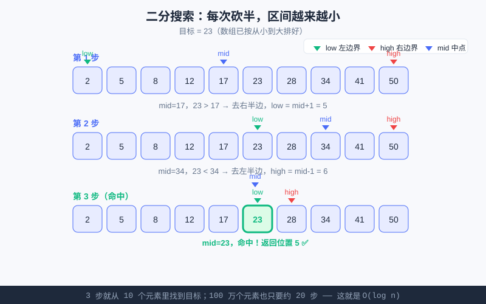

<div style="display:flex; gap:12px; margin-bottom:24px; flex-wrap:wrap; align-items:center;">
  <span style="background:#f0fdf4; color:#16a34a; padding:4px 12px; border-radius:20px; font-size:0.85em; font-weight:600; border:1px solid rgba(22,163,74,0.2);">📖 第18章</span>
  <span style="background:#f0fdf4; color:#16a34a; padding:4px 12px; border-radius:20px; font-size:0.85em; border:1px solid rgba(22,163,74,0.2);">⏱️ ~40 min read</span>
  <span style="background:#fef9ec; color:#d97706; padding:4px 12px; border-radius:20px; font-size:0.85em; border:1px solid rgba(217,119,6,0.2);">🎯 Intermediate</span>
</div>

# Chapter 18: 搜索算法 —— 线性查找与二分查找

> 📝 **Before You Continue:** 先读 [第17章 算法与效率入门](../algorithms/big-o.md)，你已经知道 O(n)（挨个问）和 O(log n)（每次砍半）的差别。本章把这两个概念变成**真正能跑的代码**。用 `while` 循环实现二分前，建议你也复习一下 [第7章 循环：while](../control-flow/while-loops.md)——二分查找就是 `while` 的绝佳舞台。

你玩过"猜数字"游戏吗？朋友心里想一个 1~100 的数，你每次猜一个，他只回答"大了 / 小了 / 对了"。**怎么猜最省次数？** 傻瓜式从 1 猜到 100 最坏要 100 次；聪明人每次猜中间，几次就中——这背后的算法，就是本章主角之一：**二分查找**。

<div class="story-scene">
<strong>🎬 开场小剧场：寻宝雷达启动</strong>
<p>算法游乐场藏了一枚金色徽章，小派拿着地图从第一格开始翻，翻到第 60 格还没找到。时间裁判皱眉：“这样找，地图越大越慢。”</p>
<p>寻宝雷达 search 亮了起来：“如果地图没有顺序，只能挨个扫；如果线索已经排好，我每次看中间，直接排除一半。”搜索算法，就是找东西的聪明路线。</p>
</div>

<div class="quest-card">
<strong>🎯 本章任务卡</strong>
<ul>
<li>写出最朴素的线性查找。</li>
<li>判断什么时候必须挨个找。</li>
<li>理解二分查找为什么每次能砍掉一半。</li>
<li>用 <code>while</code> 实现二分查找。</li>
<li>识别二分查找的前提：数据必须有序。</li>
</ul>
</div>

<div class="boss-bug">
<strong>👾 本章 Boss Bug：无序二分陷阱</strong>
<p>它最会伪装：代码看起来像二分，数据却根本没排序。打败它的第一问永远是：<b>这个列表有序吗？</b>没有有序性，就不能放心砍半。</p>
</div>

---

## 18.1 线性查找（Linear Search）：最朴素的"挨个问"

<div class="try-it">
<strong>🧩 练一练 18.1</strong>
<p>题目：线性查找最坏情况下，要比较多少次？</p>
<details><summary>💡 看看答案</summary>
<p>答案：最多 <b>n 次</b>（目标在最后，或根本不在）。数据无序时只能挨个问。</p>
</details>
</div>

如果数据**没有顺序**，你没法偷懒，只能从头到尾一个个看——这就是线性查找，也叫顺序查找。

```python
def linear_search(arr, target):
    """在 arr 里找 target，找到返回下标，找不到返回 -1。"""
    for i in range(len(arr)):
        if arr[i] == target:
            return i
    return -1

nums = [7, 2, 9, 4, 1, 8]
print(linear_search(nums, 4))   # 3（4 在下标 3）
print(linear_search(nums, 5))   # -1（没有 5）
```

### 🧠 Mental Model: 点名查人

想象老师拿着花名册，从第一个名字念到最后一个。念到"小明"就停。花名册**乱不乱序都无所谓**，反正挨个念就完了。

> 💡 **Key Insight:** 线性查找的精髓是"不挑数据"——**无论排没排序都能用**，代价是慢：最坏要看遍所有人，操作次数 = n，即 **O(n)**（[第17章](../algorithms/big-o.md) 学过）。

> 📝 **Note:** 返回 `-1` 是个常见约定，表示"没找到"。因为合法下标都是 ≥ 0 的，`-1` 不会和有效位置撞车，调用方好判断。

---

## 18.2 二分查找（Binary Search）：每次砍半的"聪明猜"

<div class="try-it">
<strong>🧩 练一练 18.2</strong>
<p>题目：二分查找能“每次砍半”的前提是什么？</p>
<details><summary>💡 看看答案</summary>
<p>答案：数据必须<b>有序</b>。无序就没法判断目标在左半还是右半，二分失效。</p>
</details>
</div>

如果数据**已经按从小到大排好**，我们就可以像猜数字一样，**每次都看中间那个，然后扔掉不可能的一半**。

核心三步循环：
1. 看区间 **[low, high]** 的**中点 mid**；
2. 如果 `arr[mid] == target` → 找到了！
3. 如果 `arr[mid] < target` → 目标在右半边，把 `low` 移到 `mid+1`；
4. 如果 `arr[mid] > target` → 目标在左半边，把 `high` 移到 `mid-1`；
5. 当 `low > high`，区间空了，说明**没有**这个目标。

### 为什么快？（接第17章）

每次循环都让"还要找的区间"**缩小一半**。10 个元素 → 5 → 2 → 1，约 4 步；100 万个 → 约 20 步。这正是 [第17章](../algorithms/big-o.md) 讲的 **O(log n)**：n 暴涨，步数只缓慢爬升。



上图演示了在 `[2,5,8,12,17,23,28,34,41,50]` 里找 `23` 的全过程：三步走完，区间从 10 个缩到"命中"。

### 前提："有序"比金子还重要

> ⚠️ **Warning:** 二分查找**绝对要求数组有序**！如果数组是乱的，中点左边可能比右边还大，"扔掉一半"的逻辑就不成立了，结果会出错。二分之前，要么数据本就有序，要么先排序（[第19章](../algorithms/sorting.md) 教你）。

> 🤔 **Why 一定要有序？** 因为二分靠的是"中点左边都比它小、右边都比它大"这个 guarantee。乱序时这个保证破产，砍半就砍错了方向。

---

## 18.3 代码实现（while 版）：二分查找

<div class="try-it">
<strong>🧩 练一练 18.3</strong>
<p>题目：写线性查找，在 [3, 1, 4, 2] 中找 4，返回它的索引。</p>
<details><summary>💡 看看答案</summary>
<p>答案：<code>for i,x in enumerate([3,1,4,2]): if x==4: print(i)</code> 输出 <code>2</code>。</p>
</details>
</div>

我们用 `while` 循环把上面的逻辑写下来——这正好呼应 [第7章](../control-flow/while-loops.md) 的 `while`：**"只要区间还非空，就继续猜"**。

```python
def binary_search(arr, target):
    low = 0
    high = len(arr) - 1         # 闭区间 [low, high]
    while low <= high:           # 区间还有元素就继续
        mid = (low + high) // 2  # 中点（整除，向下取整）
        if arr[mid] == target:
            return mid           # 命中！
        elif arr[mid] < target:
            low = mid + 1        # 去右半边
        else:
            high = mid - 1       # 去左半边
    return -1                    # 区间空了 → 没有

sorted_nums = [2, 5, 8, 12, 17, 23, 28, 34, 41, 50]
print(binary_search(sorted_nums, 23))   # 5
print(binary_search(sorted_nums, 9))    # -1
```

### 关键细节拆解

- **`mid = (low + high) // 2`**：整除取中点。用 `//` 而不是 `/`，因为下标必须是整数。
- **循环条件 `low <= high`**：区间是"闭区间"，当 `low == high` 时那个元素还得查；一旦 `low > high`，区间空了才停。写成 `low < high` 会漏掉最后一个元素，是经典 bug。
- **`low = mid + 1` / `high = mid - 1`**：中点已经比较过了，下次从它**旁边**开始，避免死循环。

> 🐛 **Common Bug:** 如果写成 `low = mid`（漏了 `+1`），当 `target` 不在数组里时，`mid` 可能一直卡在同一个值，区间不缩小，`while` 永远不退出——**死循环**！永远让边界"跨过"已经检查过的 `mid`。

---

## 18.4 数一数：二分到底省了多少？

<div class="try-it">
<strong>🧩 练一练 18.4</strong>
<p>题目：二分每轮把范围砍成一半，n = 1000 大约几轮能找到？</p>
<details><summary>💡 看看答案</summary>
<p>答案：约 <b>10 轮</b>。因为 2^10 = 1024 ≥ 1000，每次砍半，10 次就够。</p>
</details>
</div>

我们把线性查找和二分查找的"比较次数"都数出来，直观感受差距：

```python
def linear_search_count(arr, target):
    cmp = 0
    for x in arr:
        cmp += 1
        if x == target:
            break
    return cmp

def binary_search_count(arr, target):
    low, high = 0, len(arr) - 1
    cmp = 0
    while low <= high:
        mid = (low + high) // 2
        cmp += 1
        if arr[mid] == target:
            break
        elif arr[mid] < target:
            low = mid + 1
        else:
            high = mid - 1
    return cmp

import random
data = sorted(random.randint(0, 10**6) for _ in range(1_000_000))
print("线性查找比较次数：", linear_search_count(data, 123456))   # 接近 1,000,000
print("二分查找比较次数：", binary_search_count(data, 123456))   # 约 20
```

> ⚡ **Pro Tip:** 同样的 100 万数据，线性查找要比较近百万次，二分只要约 20 次。**差距约 5 万倍**——这就是"先排序再二分"在大规模数据下值得的原因。

---

## 18.5 线性 vs 二分：什么时候用哪个？

<div class="try-it">
<strong>🧩 练一练 18.5</strong>
<p>题目：什么时候该用线性查找，而不是二分？</p>
<details><summary>💡 看看答案</summary>
<p>答案：数据<b>无序</b>或<b>很小</b>时。无序没法二分；很小则二分省下的次数不值当。</p>
</details>
</div>

| 场景 | 用线性查找 | 用二分查找 |
|------|-----------|-----------|
| 数组是否有序 | 有序无序都行 | **必须有序** |
| 数据量小（几十个） | ✅ 简单直接 | 没必要，排序反而亏 |
| 数据量大且频繁查找 | ❌ 太慢 | ✅ 神器 |
| 只需找一次 | 直接线性更省（省去排序开销） | 若要先排序，单次不划算 |

> 💡 **Key Insight:** 如果**只找一次**且数据没排序，先花 O(n log n) 排序再 O(log n) 查找，不如直接 O(n) 线性扫一遍。二分真正发光的地方是：**排好一次序，之后反复查很多次**。

---

## 🧮 算法小课堂：二分是"分而治之"的雏形

**分而治之（Divide and Conquer）** 是算法里一座大山级别的思想，名字就两个字：**分**（把大问题拆成小问题）和 **治**（把小问题解决了，合起来就是大问题的解）。

二分为什么是它的雏形？因为二分做的正是：
- **分**：每次把查找区间**对半劈开**，只保留可能有答案的那一半；
- **治**：在更小的区间里继续同样的操作，直到区间缩小到"找到 / 找不到"。

它每次只处理"一半"，所以复杂度是对数级 O(log n)。[第20章 递归与分治](../algorithms/recursion-divide.md) 里，你会看到归并排序、快速排序，都是把"分而治之"玩到极致——那时你会恍然大悟：**哦，原来二分就是它最简单、最好懂的样子**。

> 🧠 **计算思维聚焦（模式识别 Pattern Recognition）：** 二分教会我们一件事——**当数据"有序"时，藏着可以大幅加速的模式**。模式识别，就是敏锐地发现"这个问题里有没有我可以利用的结构（比如有序、比如重复子问题）"。发现它，就能从 O(n) 跳到 O(log n)。

---

## ⚔️ 挑战擂台

**擂台题：** 一个旋转过的有序数组，例如 `[4,5,6,7,0,1,2]`（原本升序，从中间某处断开、前后两段交换）。它"整体"无序，但"每一段内部"有序。还能用普通二分吗？如果可以，难点在哪？

<details>
<summary>💡 擂台思路（点击展开）</summary>

普通二分要求"整体有序"，这种数组整体不有序，所以**不能直接套**标准二分。但因为它由"两段各自有序"拼成，可以改造二分：每次看 `mid` 落在哪一段、目标可能在哪一段，据此移动 `low/high`。这需要多判断"中段属于前半段还是后半段"。

这正是竞赛（USACO / LeetCode）里"在旋转数组中搜索"的经典题——它考验你对二分 `low/high/mid` 逻辑的理解是否真的灵活，而不是只会背模板。先理解标准二分（本章），再挑战它。

</details>

---

## 🛠️ 项目工坊：给游乐场加"排行榜快速找人"

回到我们的 [算法游乐场](../projects/algorithm-arena.md)。园长建了个"今日游客身高排行榜"，按身高从矮到高排好。现在他想：**报出一个身高，立刻知道有没有这位游客、在第几名。**

因为排行榜**已经有序**，这正是二分查找的主场。我们给游乐场加上这个功能：

```python
def find_rank(height_board, h):
    """在已按身高升序排好的排行榜里找身高 h，返回名次（从 1 开始），找不到返回 -1。"""
    low, high = 0, len(height_board) - 1
    while low <= high:
        mid = (low + high) // 2
        if height_board[mid] == h:
            return mid + 1          # 名次从 1 计
        elif height_board[mid] < h:
            low = mid + 1
        else:
            high = mid - 1
    return -1

# 排行榜（已升序）：单位 cm
board = [110, 118, 125, 130, 137, 142, 150, 158]
print("身高 130 的游客名次：", find_rank(board, 130))   # 4
print("身高 145 的游客名次：", find_rank(board, 145))   # -1（没有）
```

> 💡 **项目笔记：** 现在游乐场多了 **"在排行榜里快速找人"** 模块——只要排行榜保持有序（这就是第19章排序要帮我们做的事），哪怕有 100 万游客，找一个人也只要约 20 步。从 O(n) 线性查找升级到了 O(log n)。

> ⚠️ **Warning:** 这段代码**假设 `height_board` 已经升序**。如果哪天有人往排行榜里乱插数据破坏了顺序，二分就会查错——所以"保持有序"是这个功能的前置契约。

---

## 🏅 本章通关徽章：寻宝雷达操作员

<div class="badge-card">
<strong>如果你能做到下面 4 件事，就获得“寻宝雷达操作员”徽章：</strong>
<ul>
<li>能写出返回下标或 <code>-1</code> 的线性查找。</li>
<li>能解释为什么无序数据只能挨个找。</li>
<li>能手动画出二分查找的区间收缩过程。</li>
<li>能检查二分代码里的 <code>low</code>、<code>high</code>、<code>mid</code> 更新是否正确。</li>
</ul>
</div>

---

## ⚠️ Common Mistakes in Chapter 18

| # | 误区 | 示例 | 为什么错 | 修正 |
|---|------|------|---------|------|
| 1 | 对乱序数组用二分 | `binary_search([3,1,2], 2)` 返回怪值 | 二分要求有序，乱序砍错方向 | 先排序，或保证数据有序 |
| 2 | 循环条件写成 `low < high` | 漏查最后一个元素 | 闭区间 `low==high` 时那个还得查 | 用 `low <= high` |
| 3 | `low = mid` 漏了 `+1` | `target` 不在时死循环 | 区间不缩小，永远退不出 | 越过已查的 mid：`mid±1` |
| 4 | 中点用 `/` 而非 `//` | `mid` 变浮点数当下标报错 | 下标必须整数 | 用整除 `//` |
| 5 | 二分前忘确认有序 | 查出来下标对不上 | 有序是二分前提 | 调用前确保已排序 |
| 6 | 小数据硬上二分 | 10 个数先排序再二分 | 排序开销比直接扫还大 | 小数据/只查一次用线性 |

---

## Chapter Summary

### 📌 Key Takeaways

| 概念 | 要点 | 为什么重要 |
|------|------|------------|
| 线性查找 | 挨个问，有序无序都行 | 最稳的兜底方案，O(n) |
| 二分查找 | 每次砍半，必须有序 | O(log n)，大数据神器 |
| 三指针 low/high/mid | 维护查找区间 | 二分的核心状态 |
| `while low <= high` | 闭区间循环条件 | 写错会漏查或死循环 |
| 有序是前提 | 二分靠"有序"保证 | 乱序二分会出错 |

### ❓ FAQ

**Q1: 二分一定要用 `while` 吗？可以用递归吗？**
> A: 可以。递归版把"在 [low,high] 里找"写成函数，每次调用自己处理一半。但 `while` 版没有递归的函数调用开销，更常用，也正好练 [第7章](../control-flow/while-loops.md) 的循环。

**Q2: 为什么 `(low + high) // 2` 不直接 `(low+high)/2`？**
> A: 下标必须是整数，`/` 在 Python 里得到浮点数（如 4.5），不能当下标，会报错；`//` 整除得到整数。

**Q3: 如果数组里有重复元素，二分找到的是哪一个？**
> A: 不保证是第一个或最后一个，找到"等于 target 的某一个"就返回。若要找最左/最右那个，需要微调边界逻辑（竞赛进阶技巧）。

**Q4: 二分比线性快这么多，为什么不全用二分？**
> A: 因为二分要求有序。维护有序本身有成本：如果数据一直在变（频繁插入删除），保持有序很贵。只有"排好一次、反复查找"时才最划算。

### 🔗 Connections to Later Chapters

- **[第19章 排序算法](../algorithms/sorting.md)** 教你把"乱序"变成"有序"——这是二分能用的前提，也给游乐场排行榜做好排序准备。
- **[第20章 递归与分治](../algorithms/recursion-divide.md)** 把二分的"分而治之"思想正式化，引出归并排序、快速排序等 O(n log n) 算法。
- **[贯穿项目 算法游乐场](../projects/algorithm-arena.md)** 下一章会让游乐场"按身高排序"，和本章的"排行榜快速找人"正好衔接成完整功能。

---


## 🎮 加练任务包

> 下面这些题目不一定比章末题更难，但更适合“多刷几遍、把手感练出来”。建议先独立做，再展开提示。

### 加练 18.A · 线性查找位置 🟢

在 `[4, 8, 1, 9]` 里找 1，线性查找会返回哪个下标？

<details>
<summary>💡 提示 / 答案要点</summary>

返回 2。线性查找从左到右挨个看，找到就返回当前位置。

</details>

---

### 加练 18.B · 二分第一刀 🟢

在 `[2,4,6,8,10,12,14]` 找 12，第一次中点是多少？接下来去哪边？

<details>
<summary>💡 提示 / 答案要点</summary>

中点下标 3，值 8。12 > 8，所以去右半边。

</details>

---

### 加练 18.C · 二分前提检查 🟡

为什么 `[10,2,8,4]` 不能直接二分查找？

<details>
<summary>💡 提示 / 答案要点</summary>

因为无序。二分依赖“左边更小、右边更大”的保证；无序时砍半方向可能错。

</details>

---


---

## Practice Problems

---

**Problem 18.1 — 线性查找改造：返回所有下标** 🟢 Easy

修改线性查找，让它返回数组里**所有**等于 target 的下标（可能有多个）。例如 `[1,2,2,3,2]` 找 `2` 应返回 `[1,2,4]`。

```python
def linear_search_all(arr, target):
    # 返回所有匹配的下标列表
    pass
```

<details>
<summary>💡 Solution (click to reveal)</summary>

**Approach:** 遍历时把每个匹配的下标追加到结果列表。

```python
def linear_search_all(arr, target):
    result = []
    for i in range(len(arr)):
        if arr[i] == target:
            result.append(i)
    return result

print(linear_search_all([1, 2, 2, 3, 2], 2))   # [1, 2, 4]
```

**Key points:** 线性查找对"多个匹配"天然友好——无需有序，一路扫到底全收集。这正是它比二分灵活的地方。

</details>

---

**Problem 18.2 — 手写二分：判断是否"存在"即可** 🟡 Medium

只要求判断 target 是否在**有序**数组里（存在返回 `True`，否则 `False`），用 `while` 写二分。并用一个长度 8 的数组手动走一遍，写出每步的 `low/high/mid`。

```python
def exists(arr, target):
    # 返回 True / False
    pass

print(exists([1, 3, 5, 7, 9, 11, 13, 15], 7))   # True
print(exists([1, 3, 5, 7, 9, 11, 13, 15], 8))   # False
```

<details>
<summary>💡 Solution (click to reveal)</summary>

```python
def exists(arr, target):
    low, high = 0, len(arr) - 1
    while low <= high:
        mid = (low + high) // 2
        if arr[mid] == target:
            return True
        elif arr[mid] < target:
            low = mid + 1
        else:
            high = mid - 1
    return False

print(exists([1, 3, 5, 7, 9, 11, 13, 15], 7))   # True
print(exists([1, 3, 5, 7, 9, 11, 13, 15], 8))   # False
```

**手动走一遍（找 7）：**
- 初值 low=0, high=7, mid=3 → arr[3]=7 == 7 → 直接 `True`。

**手动走一遍（找 8）：**
- low=0, high=7, mid=3 → arr[3]=7 < 8 → low=4
- low=4, high=7, mid=5 → arr[5]=11 > 8 → high=4
- low=4, high=4, mid=4 → arr[4]=9 > 8 → high=3
- 此时 low=4 > high=3，循环结束 → `False`。

**Key points:** 把每步的 `low/high/mid` 写下来，是调试二分最管用的办法。务必确认循环结束时区间确实空了。

</details>

---

**Problem 18.3 — 二分 vs 线性：谁先累垮？** 🟡 Medium

构造一个长度 100 万的**有序**数组，分别用线性查找和二分查找去查一个"不存在"的大数（比如 `10**9`），打印两者比较次数，验证二分约 20 次而线性约 100 万次。

<details>
<summary>💡 Solution (click to reveal)</summary>

```python
import random

def linear_count(arr, target):
    c = 0
    for x in arr:
        c += 1
        if x == target:
            break
    return c

def binary_count(arr, target):
    low, high = 0, len(arr) - 1
    c = 0
    while low <= high:
        mid = (low + high) // 2
        c += 1
        if arr[mid] == target:
            break
        elif arr[mid] < target:
            low = mid + 1
        else:
            high = mid - 1
    return c

data = list(range(1_000_000))     # 有序 0..999999
print("线性比较次数：", linear_count(data, 10**9))   # 1,000,000
print("二分比较次数：", binary_count(data, 10**9))   # 约 20
```

**Key points:** 数据量越大，O(log n) 和 O(n) 的差距越夸张。这就是"先想效率再写"的回报——在竞赛大数据下，线性查找会直接超时，二分稳稳过关。

</details>

---

**Problem 18.4 — 🏆 Challenge：在"有序但含重复"的数组里找最左位置** 🔴 Hard

给定**升序且可能含重复**的数组，比如 `[1,2,2,2,3,4,4,5]`，要求用二分返回 target **第一次出现**的下标（找 `2` 应返回 `1`，而不是任意一个 `2`）。如果不存在返回 `-1`。

提示：当 `arr[mid] == target` 时，**不要立刻返回**，而是把 `high` 往左挪（`high = mid - 1`），继续往左探，并记录"最近一次命中的位置"。

```python
def first_occurrence(arr, target):
    # 返回 target 第一次出现的下标，不存在返回 -1
    pass

print(first_occurrence([1,2,2,2,3,4,4,5], 2))   # 1
print(first_occurrence([1,2,2,2,3,4,4,5], 4))   # 5
print(first_occurrence([1,2,2,2,3,4,4,5], 6))   # -1
```

<details>
<summary>💡 Solution (click to reveal)</summary>

**Approach:** 标准二分基础上，命中时不急着返回，而是收缩右边界继续往左找，同时用一个变量 `ans` 记住"最近一次等于 target 的位置"。循环结束时，`ans` 就是最左的那个。

```python
def first_occurrence(arr, target):
    low, high = 0, len(arr) - 1
    ans = -1
    while low <= high:
        mid = (low + high) // 2
        if arr[mid] == target:
            ans = mid            # 记下来，但继续往左找更靠前的
            high = mid - 1
        elif arr[mid] < target:
            low = mid + 1
        else:
            high = mid - 1
    return ans

print(first_occurrence([1,2,2,2,3,4,4,5], 2))   # 1
print(first_occurrence([1,2,2,2,3,4,4,5], 4))   # 5
print(first_occurrence([1,2,2,2,3,4,4,5], 6))   # -1
```

**复杂度：** 仍是 **O(log n)**——二分骨架不变，只是命中时多往左探一步，总步数还是对数级。

**讲解：** 这是竞赛里极常见的"二分答案 / 二分下界"模板的雏形。核心思想就一句：**把二分从"找一个等于的"升级成"找满足条件的最左/最右边界"**。掌握它，你就能用二分解决一大类"求最小满足条件的值"的问题（USACO Bronze 里很常见）。

</details>

---

> 💡 **记住这一句：** 二分查找不是"更难的循环"，而是"利用有序、每次砍半"的智慧——同样 100 万数据，别人查 100 万次，你只查 20 次。
