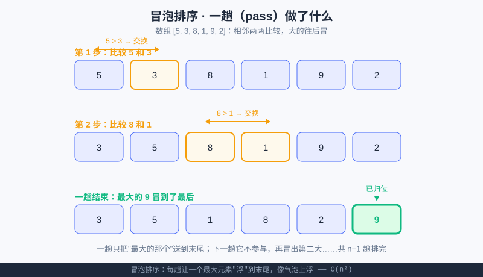

<div style="display:flex; gap:12px; margin-bottom:24px; flex-wrap:wrap; align-items:center;">
  <span style="background:#f0fdf4; color:#16a34a; padding:4px 12px; border-radius:20px; font-size:0.85em; font-weight:600; border:1px solid rgba(22,163,74,0.2);">📖 第19章</span>
  <span style="background:#f0fdf4; color:#16a34a; padding:4px 12px; border-radius:20px; font-size:0.85em; border:1px solid rgba(22,163,74,0.2);">⏱️ ~40 min read</span>
  <span style="background:#fef9ec; color:#d97706; padding:4px 12px; border-radius:20px; font-size:0.85em; border:1px solid rgba(217,119,6,0.2);">🎯 Intermediate</span>
</div>

# Chapter 19: 排序算法 —— 冒泡、选择、插入

> 📝 **Before You Continue:** 先读 [第18章 搜索算法](../algorithms/searching.md)，你已经知道：**"有序"是二分查找的前提**。本章就教你如何把"乱序"变成"有序"——而且一口气学三种经典思路。复习一下列表的交换语法可看 [列表章节](../data-structures/lists.md)。

你整理过一副乱掉的扑克牌吗？有的人从左到右把小的往前挪，有的人先找出最小的放最左，有的人像理牌一样一张张插到正确位置——**不同的整理手法，就是不同的排序算法**。本章我们学最经典、也最好懂的三种：冒泡、选择、插入。它们是算法世界的"abc"，读懂它们，你才算真正踏进算法大门。

<div class="story-scene">
<strong>🎬 开场小剧场：扑克牌整理员上岗</strong>
<p>算法游乐场的排行榜乱成一团：95 分夹在 60 分后面，第一名站到了队尾。小派想直接找冠军，却发现每次都要把全队扫一遍。</p>
<p>扑克牌整理员 sort 把牌桌一拍：“先排好队，后面的查找、排名、去重都会轻松很多。排序不是为了好看，是为了让后续动作更快。”</p>
</div>

<div class="quest-card">
<strong>🎯 本章任务卡</strong>
<ul>
<li>说清排序为什么是很多算法的前置工序。</li>
<li>用相邻比较理解冒泡排序。</li>
<li>用“每轮挑最小”理解选择排序。</li>
<li>用“理扑克牌”理解插入排序。</li>
<li>比较三种排序的共同点和差别。</li>
</ul>
</div>

<div class="boss-bug">
<strong>👾 本章 Boss Bug：交换越界怪</strong>
<p>它躲在 <code>j + 1</code> 后面：循环多跑一步，就会访问不存在的位置。打败它的口诀是：相邻比较时，最后一个能当左边的位置是 <code>n - 2</code>。</p>
</div>

---

## 19.1 为什么排序这么重要？

<div class="try-it">
<strong>🧩 练一练 19.1</strong>
<p>题目：排序为什么这么重要？</p>
<details><summary>💡 看看答案</summary>
<p>答案：二分查找、去重、做排行榜都<b>依赖数据有序</b>。排序是很多算法的“前置动作”。</p>
</details>
</div>

排序不只是"让数字从小到大"这么无聊。它的真正威力在于：**很多操作在"有序"后变得飞快**。

- **二分查找**（[第18章](../algorithms/searching.md)）要求有序，否则用不了；
- 找中位数、去重、合并两个列表，有序后都能大幅简化；
- 就连 AI 里的一些数据处理，也常先排序再算。

> 💡 **Key Insight:** 排序是许多高级算法的"前置工序"。学会了排序，你手里的工具箱才完整。

---

## 19.2 冒泡排序（Bubble）：相邻比大小，大的往后冒

<div class="try-it">
<strong>🧩 练一练 19.2</strong>
<p>题目：冒泡排序每一轮主要做什么？</p>
<details><summary>💡 看看答案</summary>
<p>答案：<b>相邻两个比大小</b>，大的往后“冒”。一轮下来，最大的数就沉到最右了。</p>
</details>
</div>

**思路**：从左边开始，相邻的两个数比一比，前面比后面大就交换。这样走完一遍，最大的数就像气泡一样"冒"到了最右边。然后再冒第二大的……重复 n−1 趟，全部排好。



上图把"一趟"画了出来：5 和 3 比→交换；8 和 1 比→交换；最后 9 冒到了末尾被圈起来"已归位"。

### 代码

```python
def bubble_sort(a):
    a = a[:]                       # 复制一份，不改原数组
    n = len(a)
    for i in range(n):             # 共 n 趟
        for j in range(0, n - 1 - i):   # 每趟末尾 i 个已归位，不用比
            if a[j] > a[j + 1]:
                a[j], a[j + 1] = a[j + 1], a[j]   # 交换（元组解包）
    return a

print(bubble_sort([5, 3, 8, 1, 9, 2]))   # [1, 2, 3, 5, 8, 9]
```

> 📝 **Note:** `a[j], a[j + 1] = a[j + 1], a[j]` 是 Python 优雅的"同时交换"，不用临时变量。想了解列表更多玩法见 [列表章节](../data-structures/lists.md)。

### turtle 动画演示"一趟"

下面这段用海龟画一排"柱子"，高度代表数值，并**高亮正在比较的两个**，一步步演示一趟冒泡。本地运行能看到动画（在线环境可能弹不出窗口，可只看代码逻辑）：

```python
import turtle

t = turtle.Turtle()
t.hideturtle(); t.speed(0)
turtle.tracer(0)                    # 关自动刷新，手动 update 更顺滑

def draw_bars(heights, compare=(-1, -2)):
    t.clear()
    start_x = -240
    for i, h in enumerate(heights):
        t.penup(); t.goto(start_x + i * 50, -100); t.pendown()
        t.fillcolor("#f59e0b" if i in compare else "#4A6CF7")
        t.begin_fill()
        for _ in range(2):
            t.forward(40); t.left(90); t.forward(h * 8); t.left(90)
        t.end_fill()
    turtle.update()

def bubble_pass(heights):
    n = len(heights)
    for i in range(n - 1):
        draw_bars(heights, (i, i + 1))            # 高亮比较中的两个
        if heights[i] > heights[i + 1]:
            heights[i], heights[i + 1] = heights[i + 1], heights[i]
            draw_bars(heights, (i, i + 1))         # 交换后重画
    draw_bars(heights)

data = [5, 3, 8, 1, 9, 2]
bubble_pass(data)
turtle.done()
```

> 🐛 **Common Bug:** 内层循环写成 `range(n)` 而不是 `range(n - 1 - i)`，会让 `j + 1` 越界（下标到 `n`），或重复比较已经归位的元素、白做工。每趟末尾已"冒"好的不用再比。

---

## 19.3 选择排序（Selection）：每轮挑最小的放最前

<div class="try-it">
<strong>🧩 练一练 19.3</strong>
<p>题目：手动走一遍给 [3, 1, 2] 做选择排序，第一趟结束后数组变成？</p>
<details><summary>💡 看看答案</summary>
<p>答案：第一趟找最小的 1 换到最前，变成 <code>[1, 3, 2]</code>。再两趟得到 [1,2,3]。</p>
</details>
</div>

**思路**：像"挑草莓"——先扫一遍找最小的，和第一个换；再从剩下的扫一遍找次小的，和第二个换……每轮确定一个位置。

```python
def selection_sort(a):
    a = a[:]
    n = len(a)
    for i in range(n):
        min_idx = i                     # 假设当前位置最小
        for j in range(i + 1, n):       # 在剩余部分里找真正最小的
            if a[j] < a[min_idx]:
                min_idx = j
        a[i], a[min_idx] = a[min_idx], a[i]   # 放到位置 i
    return a

print(selection_sort([5, 3, 8, 1, 9, 2]))   # [1, 2, 3, 5, 8, 9]
```

### 🧠 Mental Model: 领奖台

想象给 6 个人排领奖台：先在所有人间找出最矮的站第 1 名位置，再在剩下的人里找最矮的站第 2 名……每轮锁定一个人，绝不反悔。

> 💡 **Key Insight:** 选择排序的交换次数**很少**（最多 n 次），但比较次数始终是约 n²/2——因为它每轮都要把剩余的全部扫一遍。

---

## 19.4 插入排序（Insertion）：像理扑克牌一样一张张插

<div class="try-it">
<strong>🧩 练一练 19.4</strong>
<p>题目：插入排序像生活里整理什么的动作？</p>
<details><summary>💡 看看答案</summary>
<p>答案：像<b>理扑克牌</b>——每张新牌，从右往左插到已排好序的那叠里合适的位置。</p>
</details>
</div>

**思路**：手里已经理好一小撮牌，新抓一张，从右往左比，找到它该在的位置插进去。数组就当成"左手的牌"，逐个把元素插到前面已排好部分的正确位置。

```python
def insertion_sort(a):
    a = a[:]
    for i in range(1, len(a)):
        key = a[i]               # 当前要插入的"新牌"
        j = i - 1
        while j >= 0 and a[j] > key:   # 前面比 key 大的，统统右移一位
            a[j + 1] = a[j]
            j -= 1
        a[j + 1] = key           # 插到正确空位
    return a

print(insertion_sort([5, 3, 8, 1, 9, 2]))   # [1, 2, 3, 5, 8, 9]
```

### 🧠 Mental Model: 插空

把已排好部分想象成**有序的格架**，新元素从右往左"挤"，遇到比自己大的就让它往后挪，直到腾出刚好容下自己的空位。

> 🤔 **Why 插入排序常常最快？** 它有个别人没有的优点：**数据越接近有序，它越快**。如果数组本来就有序，每个元素只需比较一次就停，只要 O(n)。冒泡和选择没这福气。

---

## 19.5 三种排序对比 & 该怎么选

<div class="try-it">
<strong>🧩 练一练 19.5</strong>
<p>题目：冒泡、选择、插入这三种排序，时间复杂度都是？</p>
<details><summary>💡 看看答案</summary>
<p>答案：都是 <code>O(n²)</code>。数据量一大就慢，但<b>思路直观</b>，是理解排序的好起点。</p>
</details>
</div>

| 算法 | 时间复杂度（最坏） | 交换次数 | 稳定吗 | 数据接近有序时 |
|------|-------------------|----------|--------|----------------|
| 冒泡 Bubble | O(n²) | 最多 ~n²/2 | ✅ 稳定 | 可优化到 O(n) |
| 选择 Selection | O(n²) | 最多 n 次 | ❌ 不稳定 | 仍然 O(n²) |
| 插入 Insertion | O(n²) | 最多 ~n²/2 | ✅ 稳定 | **O(n)，最快** |

> ⚠️ **Warning:** 别被"都是 O(n²)"骗了——**Big-O 只看了最高阶，没看常数**。三种的"实际快慢"差很多：插入排序在几乎有序的数据上能甩开另外两者几条街；选择排序交换少，适合"交换代价很高"的场景（比如每条记录很大、搬动很贵）。**它们复杂度同阶，但常数和脾气不同。**

### 那到底什么时候用哪个？

- **数据量小（几十个）或几乎有序** → 用**插入排序**，简单又常最快。
- **交换操作特别贵**（每条数据很大）→ 考虑**选择排序**（交换少）。
- **教学 / 演示 / 入门** → **冒泡排序**最直观，但真实项目里最少用。
- **数据量上万** → 这三种都**会超时**！得用下一章的 O(n log n) 算法。

---

## 19.6 埋个伏笔：O(n²) 撑不住时怎么办？

如果 n = 100,000，那么 n² = 10,000,000,000（100 亿次操作）——电脑直接卡死。三种排序在这量级全部歇菜。

那竞赛里是怎么扛住大数据的？答案是 **O(n log n)** 级别的算法，比如**归并排序（Merge Sort）**和**快速排序（Quick Sort）**。它们的秘诀，正是我们 [第18章](../algorithms/searching.md) 算法小课堂提过的 **"分而治之"**：

- 把数组**对半拆**成两半，分别排好；
- 再把两个**已排好**的有序半边**合并**成一个（还记得 [第17章挑战题](../algorithms/big-o.md) 里那个 O(n+m) 的 `merge_two_sorted` 吗？它就是归并排序的"合并"步骤！）；
- 拆到最小（1 个元素天然有序）再往上合并。

这样复杂度从 O(n²) 降到 **O(n log n)**——n=100,000 时只要约 1,700,000 次，比 100 亿少了 **近 6 万倍**。

> ⚡ **Pro Tip:** 这个伏笔留到 **[第20章 递归与分治](../algorithms/recursion-divide.md)** 正式揭晓。现在你只要记住：**O(n²) 是"暴力"，O(n log n) 是"分而治之的聪明"**——而你已经在这一章摸到了所有零件。

---

## 🧮 算法小课堂：排序是算法世界的"Hello World"

如果说写 `print("Hello World")` 是学编程的第一课，那么**亲手实现一种排序**，就是学算法的第一课。为什么？

1. **它足够小**：几十行就能写完，但五脏俱全——循环、比较、交换、边界，全有。
2. **它足够深**：看似简单，却能引出"复杂度""稳定性""分而治之""递归"一整条知识链。
3. **它足够实用**：排序是无数算法的前置工序（二分、去重、中位数……）。

所以别小看冒泡排序——你今天写的每一行，都是在给未来的"归并排序""快速排序"甚至"AI 数据处理"打地基。

> 🧠 **计算思维聚焦（算法设计 Algorithm Design）：** 三种排序是同一件事的**三种设计思路**：冒泡"冒泡式"、选择"选最小"、插入"插空式"。算法设计的核心，就是**换一个组织步骤的角度，就能换来不一样的效率**。多问自己："还有没有更聪明的步骤安排？"

---

## ⚔️ 挑战擂台

**擂台题：** 给你一个"几乎已经排好"的数组，比如 `[1, 2, 3, 5, 4, 6, 7]`（只有 5 和 4 颠倒）。三种排序里，谁用最少的操作就能修好它？为什么？

<details>
<summary>💡 擂台揭晓（点击展开）</summary>

**插入排序**会赢。因为数据几乎有序，插入排序在大部分位置上只需比较一次就停（内层 `while` 不进入），总操作接近 O(n)。冒泡排序如果**没做"某趟无交换就提前结束"的优化**，仍会傻傻跑满 n 趟；选择排序则无论如何都要扫完每轮的剩余部分，仍是 O(n²)。

**结论**：面对"基本有序"的真实数据（比如每秒新增一条、大体有序的日志），插入排序是隐藏的性价比之王。这也解释了为什么很多语言标准库的排序，在小数组/近乎有序时会切换到插入排序思路。

</details>

---

## 🛠️ 项目工坊：给游乐场游客"按身高排序"

回到 [算法游乐场](../projects/algorithm-arena.md)。园长要把今天来的游客**按身高从矮到高排好**，这样既能直接打印"身高排行榜"，又能作为 [第18章](../algorithms/searching.md) 里"快速找人"的输入（二分要求有序）。我们用冒泡排序实现这一步：

```python
def sort_by_height(visitors):
    """visitors 是 (姓名, 身高cm) 的列表，按身高升序排。"""
    a = visitors[:]
    n = len(a)
    for i in range(n):
        for j in range(0, n - 1 - i):
            if a[j][1] > a[j + 1][1]:        # 比较身高（元组的第 2 项）
                a[j], a[j + 1] = a[j + 1], a[j]
    return a

today = [("小红", 130), ("小刚", 118), ("小明", 142), ("阿强", 125)]
print(sort_by_height(today))
# [('小刚', 118), ('阿强', 125), ('小红', 130), ('小明', 142)]
```

> 💡 **项目笔记：** 现在游乐场多了 **"给游客按身高排序"** 模块——排好序后，排行榜可以直接展示，而且这份有序名单正好喂给第18章的"快速找人"。排序 + 二分，在游乐场里组成了一套完整功能。等 [第20章](../algorithms/recursion-divide.md) 学了归并排序，我们还能把它升级成处理几十万游客也不卡顿的版本。

---

## 🏅 本章通关徽章：扑克牌整理员

<div class="badge-card">
<strong>如果你能做到下面 4 件事，就获得“扑克牌整理员”徽章：</strong>
<ul>
<li>能说出排序为什么能帮二分查找。</li>
<li>能手动走一趟冒泡排序。</li>
<li>能解释选择排序每轮为什么能确定一个位置。</li>
<li>能用“理扑克牌”理解插入排序。</li>
</ul>
</div>

---

## ⚠️ Common Mistakes in Chapter 19

| # | 误区 | 示例 | 为什么错 | 修正 |
|---|------|------|---------|------|
| 1 | 冒泡内层写成 `range(n)` | `j+1` 越界或重复比 | 已归位的没必要再比 | `range(0, n-1-i)` |
| 2 | 选择排序忘更新 `min_idx` | 总把 i 和 i 交换 | 没记录真正最小的位置 | 比较时更新 `min_idx` |
| 3 | 插入排序 `while` 条件漏 `j >= 0` | 负下标报错 | 移到头还要继续比 | 加 `j >= 0` 守卫 |
| 4 | 直接改原数组没复制 | 调用方数组被改乱 | 函数副作用难调试 | 开头 `a = a[:]` 复制 |
| 5 | 以为"都是 O(n²) 就一样快" | 大数据下选错算法 | 常数与数据特征差很多 | 看稳定性/有序度来选 |
| 6 | 大数据硬用这三种 | n=10⁵ 超时 | O(n²) 撑不住 | 等第20章 O(n log n) |

---

## Chapter Summary

### 📌 Key Takeaways

| 概念 | 要点 | 为什么重要 |
|------|------|------------|
| 冒泡排序 | 相邻比较交换，大的冒末尾 | 最直观，教学首选 |
| 选择排序 | 每轮挑最小放最前 | 交换少，最多 n 次 |
| 插入排序 | 像理牌一张张插空 | 近有序时最快 O(n) |
| 都是 O(n²) | 复杂度同阶，常数不同 | 选算法要看数据特征 |
| 伏笔 O(n log n) | 归并/快排用分而治之 | 大数据才扛得住 |

### ❓ FAQ

**Q1: Python 自带 `sorted()`，为什么还要学手写排序？**
> A: `sorted()` 当然好用，但**学算法**的目的不是重复造轮子，而是理解"计算机怎么把事做快"。竞赛题常禁止用现成排序、或要求在排序过程中做特殊处理——懂原理才写得出来。

**Q2: 三种里我该先记住哪个？**
> A: 先吃透**插入排序**——它思路最贴近生活（理牌），且是后续很多优化排序的基石。冒泡用于建立直觉，选择用于理解"最小化交换"。

**Q3: "稳定排序"是什么意思？为什么重要？**
> A: 稳定 = 两个相等的元素，排完序后**相对先后顺序不变**。比如按身高排序时，两个身高相同的游客谁先谁后保持原样。有些场景（先按成绩排、再按姓名排）需要稳定性。

**Q4: 插入排序也是 O(n²)，凭什么说它快？**
> A: 说它"快"是指**实际常数小、且在近有序数据上退化到 O(n)**。Big-O 是最坏上界，不代表真实表现；真实数据常有结构可利用。

### 🔗 Connections to Later Chapters

- **[第20章 递归与分治](../algorithms/recursion-divide.md)** 揭晓伏笔：归并排序、快速排序如何用"分而治之"把复杂度从 O(n²) 降到 O(n log n)。
- **[贯穿项目 算法游乐场](../projects/algorithm-arena.md)** 可把本章"按身高排序"与第18章"快速找人"串起来，构成完整排行榜功能；第20章再升级成大数据版本。
- **USACO Bronze** 入门题中，排序 + 二分（本章 + 第18章）是出现频率最高的组合拳。

---


## 🎮 加练任务包

> 下面这些题目不一定比章末题更难，但更适合“多刷几遍、把手感练出来”。建议先独立做，再展开提示。

### 加练 19.A · 冒泡一趟 🟢

对 `[3,1,2]` 做一趟冒泡后，列表变成什么？

<details>
<summary>💡 提示 / 答案要点</summary>

3 和 1 交换得 `[1,3,2]`；3 和 2 交换得 `[1,2,3]`。一趟后最大值 3 到末尾。

</details>

---

### 加练 19.B · 选择第一轮 🟢

对 `[5,2,4,1]` 做选择排序，第一轮结束后是什么？

<details>
<summary>💡 提示 / 答案要点</summary>

找到最小值 1，和第一个元素 5 交换，变成 `[1,2,4,5]`。

</details>

---

### 加练 19.C · 插入排序场景 🟡

为什么插入排序像整理扑克牌？

<details>
<summary>💡 提示 / 答案要点</summary>

因为它把新来的牌插入左边已经排好的部分，始终维护“左边有序”。

</details>

---


---

## Practice Problems

---

**Problem 19.1 — 跑通三种排序** 🟢 Easy

用本章三个函数分别对 `[64, 34, 25, 12, 22, 11, 90]` 排序，确认输出都是 `[11, 12, 22, 25, 34, 64, 90]`。

<details>
<summary>💡 Solution (click to reveal)</summary>

直接把三个函数抄下来调用即可：

```python
data = [64, 34, 25, 12, 22, 11, 90]
print(bubble_sort(data))       # [11, 12, 22, 25, 34, 64, 90]
print(selection_sort(data))    # [11, 12, 22, 25, 34, 64, 90]
print(insertion_sort(data))    # [11, 12, 22, 25, 34, 64, 90]
```

**Key points:** 三种不同思路，结果一致——这正说明"算法可以有很多种，正确答案只有一个"。把 `data` 换成别的列表也能跑。

</details>

---

**Problem 19.2 — 给身高排序（游乐场实战）** 🟡 Medium

用插入排序改写"按身高排序"：输入 `(姓名, 身高)` 列表，输出按身高升序排好的列表。提示：比较时用元组的第 2 项 `person[1]`。

```python
visitors = [("小红", 130), ("小刚", 118), ("小明", 142), ("阿强", 125)]

def sort_by_height(visitors):
    # 用插入排序实现
    pass
```

<details>
<summary>💡 Solution (click to reveal)</summary>

```python
visitors = [("小红", 130), ("小刚", 118), ("小明", 142), ("阿强", 125)]

def sort_by_height(visitors):
    a = visitors[:]
    for i in range(1, len(a)):
        key = a[i]
        j = i - 1
        while j >= 0 and a[j][1] > key[1]:   # 比身高
            a[j + 1] = a[j]
            j -= 1
        a[j + 1] = key
    return a

print(sort_by_height(visitors))
# [('小刚', 118), ('阿强', 125), ('小红', 130), ('小明', 142)]
```

**Key points:** 插入排序的 `key` 现在是整个元组，比较键是 `key[1]`（身高）。这种"按某一项排序"的思路，和 Python 内置 `sorted(..., key=...)` 的 `key` 参数一脉相承。

</details>

---

**Problem 19.3 — 分析：哪种在你这的数据上最快？** 🟡 Medium

给定一个**几乎已经升序**的数组 `[1, 2, 3, 5, 4, 6, 7, 8]`（只颠倒了 5 和 4）。凭你对本章的理解，判断三种排序里谁的操作总数最少，并解释原因。

<details>
<summary>💡 Solution (click to reveal)</summary>

**答案：插入排序操作最少。**

**解释：**
- **插入排序**：前 4 个元素（1,2,3,5）已有序，每个只需比较 1 次；处理 `4` 时往前比到 `3` 就停；后面（6,7,8）又只需各 1 次。总比较接近 n 次 → 退化到 **O(n)**。
- **选择排序**：每轮仍要把"剩余部分"全部扫一遍找最小值，比较次数始终是 ~n²/2，**仍是 O(n²)**。
- **冒泡排序（未优化版）**：会跑满 n 趟，每趟都比较相邻对，**仍是 O(n²)**；只有加了"某趟无交换就提前 break"的优化，才会在这类数据上退化到 O(n)。

**Key points:** 这题考的是"复杂度相同 ≠ 实际一样快"。看数据特征选算法，是高手的直觉。

</details>

---

**Problem 19.4 — 🏆 Challenge：给冒泡排序加"提前结束"优化** 🔴 Hard

普通冒泡排序不管数组是否已排好，都傻傻跑满 n 趟。请给 `bubble_sort` 加一个优化：**如果某一趟从头到尾一次交换都没发生，说明数组已经有序，直接结束**。然后：
1. 用它对 `[1, 2, 3, 4, 5]`（已有序）排序，并统计它实际跑了几趟、比较了多少次；
2. 说明为什么这个优化让冒泡排序的**最好情况**变成了 O(n)。

```python
def bubble_sort_optimized(a):
    # 实现：加 swapped 标志，某趟无交换就 break
    # 同时返回 (排好序的列表, 趟数, 比较次数)
    pass
```

<details>
<summary>💡 Solution (click to reveal)</summary>

**Approach:** 每趟开始前设 `swapped = False`；只要发生交换就置 `True`。一趟结束若 `swapped` 仍为 `False`，说明全程没动过 → 已经有序 → `break`。

```python
def bubble_sort_optimized(a):
    a = a[:]
    n = len(a)
    passes = 0
    comparisons = 0
    for i in range(n):
        swapped = False
        for j in range(0, n - 1 - i):
            comparisons += 1
            if a[j] > a[j + 1]:
                a[j], a[j + 1] = a[j + 1], a[j]
                swapped = True
        passes += 1
        if not swapped:          # 这一趟没交换 → 已经有序
            break
    return a, passes, comparisons

sorted_arr = list(range(1, 6))          # [1,2,3,4,5] 已有序
result, passes, cmp = bubble_sort_optimized(sorted_arr)
print(result, "趟数:", passes, "比较:", cmp)
# 输出: [1, 2, 3, 4, 5] 趟数: 1 比较: 4
```

**分析（为什么最好情况是 O(n)）：**
- 对**已经有序**的数组，第 1 趟走完发现 `swapped=False`，立刻 `break`。
- 这一趟只做了 `n-1` 次比较，没有进入任何后续趟。
- 所以总操作 = O(n)（线性），而不是未优化的 O(n²)。

**讲解：** 这个小小的 `swapped` 标志，就是算法里典型的"利用已知结构提前收工"思想——和 [第18章](../algorithms/searching.md) 二分"利用有序"、[第20章](../algorithms/recursion-divide.md) 分治"利用可拆分性"是同一类智慧。竞赛里这种"能否提前终止"的细节，常常就是 AC 和 TLE 的分界线。

</details>

---

> 💡 **记住这一句：** 冒泡、选择、插入——三种 O(n²) 的排序，练的不是"记住代码"，而是"换一种安排步骤的角度，效率就会不同"的算法直觉；真正的大数据，留给第20章的 O(n log n)。
