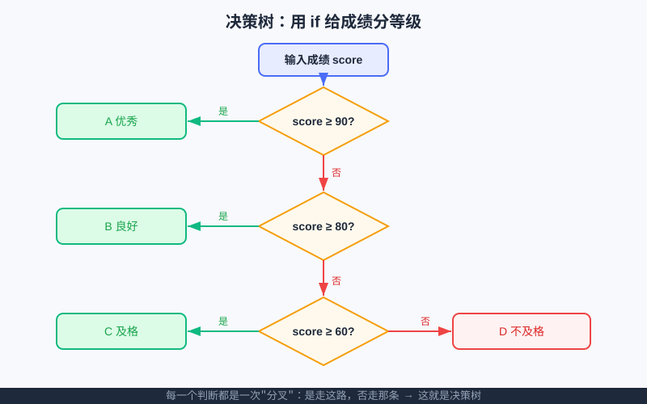

<div style="display:flex; gap:12px; margin-bottom:24px; flex-wrap:wrap; align-items:center;">
  <span style="background:#f0f4ff; color:#4A6CF7; padding:4px 12px; border-radius:20px; font-size:0.85em; font-weight:600; border:1px solid rgba(74,108,247,0.2);">📖 第6章</span>
  <span style="background:#f0fdf4; color:#16a34a; padding:4px 12px; border-radius:20px; font-size:0.85em; border:1px solid rgba(22,163,74,0.2);">⏱️ ~35 min read</span>
  <span style="background:#f0fdf4; color:#16a34a; padding:4px 12px; border-radius:20px; font-size:0.85em; border:1px solid rgba(22,163,74,0.2);">🎯 Beginner</span>
</div>

# Chapter 6: 条件判断 if —— 让程序学会"做选择"

> 📝 **Before You Continue:** 这一章要拿"变量"当原料（[第2章 变量](../foundations/variables.md)）、用"比较"下判断（[第4章 运算符](../foundations/operators.md)）、还可能要"问用户要一个数"（[第5章 输入与输出](../foundations/input-output.md)）。如果这几样还没熟，先回去扫一眼；都准备好了，我们就让程序第一次**自己做决定**。

你有没有这种经历：进电梯前想"如果到 3 楼就按 3，否则按别的"；考试完了想"如果分数 ≥ 90 就是 A，否则再看 ≥ 80……"。**做选择**，是人每天都干的事。这一章，我们教 Python 也学会这件大事——用 `if` 让它**根据情况走不同的路**。会做选择的程序，才像一个"能动脑子"的助手，而不是只会死板复述的录音机。

> 💡 **Key Insight:** 程序里一旦有了"如果……就……否则……"，它就从"计算器"升级成了"会决策的小机器人"。这也是**决策树**、**游戏 AI** 最底层的积木。

<div class="story-scene">
<strong>🎬 开场小剧场：入口门卫开始判断</strong>
<p>算法游乐场入口排起长队。小派原本想让所有游客都直接进场，结果儿童区、过山车、鬼屋全乱套了：身高不够的游客也跑进了高空项目。</p>
<p>入口门卫 if 拿起规则牌：“如果身高够，就放行；否则去适合的区域。程序想变聪明，第一步就是学会看条件、走分岔路。”</p>
</div>

<div class="quest-card">
<strong>🎯 本章任务卡</strong>
<ul>
<li>用 <code>if</code> 写出最简单的判断。</li>
<li>用 <code>else</code> 处理条件不成立的情况。</li>
<li>用 <code>elif</code> 搭出多岔路口。</li>
<li>用逻辑运算组合多个条件。</li>
<li>把判断画成一棵决策树。</li>
</ul>
</div>

<div class="boss-bug">
<strong>👾 本章 Boss Bug：单等号伪装怪</strong>
<p>它会把 <code>==</code> 偷换成 <code>=</code>，让“判断是否相等”变成“赋值”。打败它的口诀是：<b>赋值用单等，判断用双等</b>。</p>
</div>

---

## 6.0 为什么需要"判断"

<div class="try-it">
<strong>🧩 练一练 6.1</strong>
<p>题目：在生活里举一个需要"判断"的例子，写成"如果…就…否则…"的形式。</p>
<details><summary>💡 看看答案</summary>
<p>答案：例如"如果下雨，就带伞；否则戴帽子"。编程里的 <code>if / else</code> 就是这种分叉。</p>
</details>
</div>

想象一个自动售货机：投入硬币后，它要决定"钱够不够？够了就出货，不够就退币"。如果售货机不会判断，它要么永远出货（亏死），要么永远不出（没人用）。**判断，让程序能应对不同情况。**

<div style="text-align:center; margin:20px 0;">
<svg width="600" height="180" viewBox="0 0 600 180" xmlns="http://www.w3.org/2000/svg" style="max-width:100%;">
  <defs>
    <marker id="c6a" markerWidth="10" markerHeight="10" refX="8" refY="3" orient="auto" markerUnits="strokeWidth"><path d="M0,0 L8,3 L0,6 Z" fill="#4A6CF7"/></marker>
  </defs>
  <rect x="20" y="60" width="120" height="60" rx="8" fill="#e8ecff" stroke="#4A6CF7" stroke-width="2"/>
  <text x="80" y="96" text-anchor="middle" font-size="14" fill="#1e293b">投币</text>
  <polygon points="220,90 290,55 290,125 220,90" fill="#fef9ec" stroke="#f59e0b" stroke-width="2"/>
  <text x="255" y="94" text-anchor="middle" font-size="12" fill="#1e293b">够?</text>
  <rect x="330" y="30" width="120" height="50" rx="8" fill="#dcfce7" stroke="#10b981" stroke-width="2"/>
  <text x="390" y="60" text-anchor="middle" font-size="13" fill="#16a34a">出货</text>
  <rect x="330" y="130" width="120" height="50" rx="8" fill="#fef2f2" stroke="#ef4444" stroke-width="2"/>
  <text x="390" y="160" text-anchor="middle" font-size="13" fill="#dc2626">退币</text>
  <line x1="140" y1="90" x2="218" y2="90" stroke="#4A6CF7" stroke-width="2" marker-end="url(#c6a)"/>
  <line x1="290" y1="72" x2="328" y2="55" stroke="#10b981" stroke-width="2" marker-end="url(#c6a)"/>
  <line x1="290" y1="108" x2="328" y2="155" stroke="#ef4444" stroke-width="2" marker-end="url(#c6a)"/>
</svg>
<p style="color:#888; font-size:0.9em; margin-top:6px;">一个判断，分出两条路——这就是 if / else 的直觉。</p>
</div>

---

## 🔍 计算思维聚焦：决策树（Decision Tree）

**决策树**是计算思维里一个超好用的概念：把"一连串判断"画成一棵树，每个判断点都是一次**分叉**——"是"走左边，"否"走右边，直到走到一个叶子（结论）。

这一整章，你写的每一个 `if / elif / else`，本质上都是在**长一棵决策树**。比如成绩分等级：



> 🧠 **Mental Model:** 把 `if` 想成"岔路口的路牌"。程序跑到路口，看一眼条件：成立就走左边，不成立就走右边。多个路口连起来，就是一张决策地图。

---

## 6.1 最简单的判断：if 与 else

<div class="try-it">
<strong>🧩 练一练 6.2</strong>
<p>题目：写 if 判断变量 x 是否大于 10，是则打印"大"。</p>
<details><summary>💡 看看答案</summary>
<p>答案：<code>if x &gt; 10: print("大")</code>。注意冒号 <code>:</code> 和下一行缩进。</p>
</details>
</div>

最基础的句型只有两棵树杈：

```python
age = 18
if age >= 18:
    print("可以入场 🎬")
else:
    print("未成年，请家长陪同 👪")
```

**要点：**
- `if 条件:` 后面必须跟**英文冒号 `:`**，下一行要**缩进**（通常 4 个空格）。
- 条件成立，就执行 `if` 下面缩进的那段；不成立，就跳去执行 `else` 下面那段。
- 缩进告诉 Python："这几行属于这个 if"。**缩进错了，逻辑就乱了。**

> 🤔 **Why 要缩进？** 别的语言用大括号 `{ }` 圈出代码块，Python 偏用**缩进**当大括号。好处是：代码看起来多整齐，层次一眼就懂。代价是：你得老老实实缩进，否则 Python 会"读不懂你的分组"。

来个生活版：

```python
weather = "下雨"
if weather == "下雨":
    print("带伞 ☂️")
else:
    print("戴墨镜 🕶️")
```

> ⚠️ **Warning:** `=` 是"赋值"（把右边塞给左边），`==` 才是"判断是否相等"。`if x = 5:` 会直接报错——这是新手最常见的坑。记住口诀：**判断用双等 `==`**。

---

## 6.2 多岔路口：elif 链

<div class="try-it">
<strong>🧩 练一练 6.3</strong>
<p>题目：用 elif 把 0~100 的分数分成 优（≥90）、良（≥80）、中（≥60）、差 四档。</p>
<details><summary>💡 看看答案</summary>
<p>答案：<code>if s&gt;=90: print('优')</code>  elif <code>s&gt;=80</code> 良，<code>elif s&gt;=60</code> 中，<code>else</code> 差。</p>
</details>
</div>

生活里常常不止两个选项：成绩分 A/B/C/D、菜单分好几种。这时用 `elif`（else if 的缩写）：

```python
score = 85

if score >= 90:
    print("A 优秀 🌟")
elif score >= 80:
    print("B 良好 👍")
elif score >= 60:
    print("C 及格 ✅")
else:
    print("D 不及格 💪 加油")
```

**执行顺序很关键：** Python 从第一个 `if` 开始，**从上往下**逐个检查。一旦某个条件成立，就执行它下面那段，然后**整条链直接结束**（后面的 `elif` 不再看）。所以 `score = 85` 命中 `>= 80`，打印 "B 良好"，不会再往下判断 `>= 60`。

> 💡 **Pro Tip:** 写 `elif` 链时，**把最严格（最难满足）的条件放最上面**。比如先判断 `>= 90` 再判断 `>= 80`。如果反过来先写 `>= 60`，那么 95 分也会先命中它，永远到不了 A——顺序错了，结果就错了。

> 🐛 **Common Bug:** 有人写 `if score >= 60: ... elif score >= 80: ...`，发现 90 分却只打印"C 及格"。原因就是顺序颠倒，90 先满足了 `>= 60` 就走了。改法：把大数条件调到前面。

---

## 6.3 案例一：成绩分等级（完整版）

<div class="try-it">
<strong>🧩 练一练 6.4</strong>
<p>题目：成绩判断：≥90 为 A，≥80 为 B，≥60 为 C，否则 D（写完整 if/elif/else）。</p>
<details><summary>💡 看看答案</summary>
<p>答案：<code>if s&gt;=90: g='A' elif s&gt;=80: g='B' elif s&gt;=60: g='C' else: g='D'</code>。顺序很重要，先判最高的。</p>
</details>
</div>

把刚才的碎片拼成完整的"小评分器"：

```python
score = int(input("请输入你的分数："))

if score >= 90:
    grade = "A"
elif score >= 80:
    grade = "B"
elif score >= 70:
    grade = "C"
elif score >= 60:
    grade = "D"
else:
    grade = "E"

print("你的等级是：", grade)
```

**运行示例：**
```
请输入你的分数：83
你的等级是： B
```

> 📝 **Note:** `input()` 读进来的是**文字**，所以要 `int(...)` 转成数字才能和 90、80 比大小。忘了转，会报 `TypeError`（类型错误），第 9 章我们会专门拆这种报错。

---

## 6.4 嵌套判断：判断里面再判断

<div class="try-it">
<strong>🧩 练一练 6.5</strong>
<p>题目：判断一个数字是"正数 / 负数 / 零"。</p>
<details><summary>💡 看看答案</summary>
<p>答案：<code>if n&gt;0: print('正数') elif n&lt;0: print('负数') else: print('零')</code>。</p>
</details>
</div>

有时候，一个判断还不够，要在"是"的那条路上**再分一次岔**。这就是**嵌套（nested）if**：

```python
is_member = True
age = 16

if is_member:
    if age >= 18:
        print("会员专线，畅玩全部项目 🎢")
    else:
        print("会员少年，部分项目需家长签字 📝")
else:
    print("非会员，请先办卡 🙋")
```

> 🧠 **Mental Model:** 嵌套 if 就像"先过第一道门，进门后再过第二道门"。外层 if 是"大关卡"，内层 if 是"小关卡"。

> ⚠️ **Warning:** 嵌套层数别太多（一般不超过 3 层）。层数比俄罗斯套娃还多时，人脑很容易绕晕，也更容易出 bug。如果发现自己嵌套了四五层，多半该想想：**能不能把条件合并，或者用后面要学的逻辑运算 `and` / `or` 一次判断？**（逻辑运算在运算符那一章会细讲，这里先留个印象。）

---

## 6.5 案例二：石头剪刀布

来点好玩的！写一个小游戏：你出拳，电脑随机出，程序判断谁赢。

```python
import random

options = ["石头", "剪刀", "布"]
player = input("请出（石头/剪刀/布）：")
computer = random.choice(options)

print("你出了：", player)
print("电脑出了：", computer)

if player == computer:
    print("平局 🤝")
elif (player == "石头" and computer == "剪刀") or \
     (player == "剪刀" and computer == "布") or \
     (player == "布" and computer == "石头"):
    print("你赢了！🎉")
else:
    print("你输了，再来一局？😼")
```

**运行示例：**
```
请出（石头/剪刀/布）：布
你出了： 布
电脑出了： 石头
你赢了！🎉
```

> 💡 **Key Insight:** 这里用 `and`（并且）和 `or`（或者）把多个小条件拼成了一个大条件。`(A 且 B) 或 (C 且 D)` 这种"组合拳"，正是决策树里"一个分叉要同时满足好几件事"的写法。

> 📝 **Note:** 那行结尾的 `\` 是"换行继续符"，告诉 Python"这行没完，下一行还是我"。它让长条件读起来更清爽。刚学可以先不写 `\`，把整条条件放一行。

> 🧮 **算法小课堂（前置彩蛋）：** 你刚才写的"判断胜负"本质是在枚举**所有 winning 的组合**。将来算法篇讲"暴力枚举 / 状态判断"时，你会认出它——很多问题都能先列出"哪些情况算赢"，再逐条检查。第 18 章起系统讲算法时，这就是你的老朋友。

---

## 6.6 三元表达式：一行搞定小选择

如果判断只是为了给一个变量挑两个值里的一个，可以用更短的"一行写法"——**三元表达式**：

```python
age = 20
status = "成年" if age >= 18 else "未成年"
print(status)   # 成年
```

读作：**`真值 if 条件 else 假值`**。意思是：条件成立就取前面那个，不成立就取 `else` 后面那个。

> 🤔 **Why 要三元？** 它适合"二选一赋值"这种超简单的场景，写一行比写四行 `if / else` 更利落。但**别滥用**：判断一复杂（超过两个分支、要执行多句），还是老老实实写完整的 `if / elif / else`，可读性更好。

对比一下：

```python
# 完整写法
if age >= 18:
    status = "成年"
else:
    status = "未成年"

# 三元写法（等价，更短）
status = "成年" if age >= 18 else "未成年"
```

---

## 🏅 本章通关徽章：入口门卫助手

<div class="badge-card">
<strong>如果你能做到下面 4 件事，就获得“入口门卫助手”徽章：</strong>
<ul>
<li>能用 <code>if</code> 和 <code>else</code> 写出二选一判断。</li>
<li>能用 <code>elif</code> 处理多个分支。</li>
<li>能分清 <code>=</code> 和 <code>==</code>。</li>
<li>能把一串判断想象成一棵决策树。</li>
</ul>
</div>

---

## ⚠️ Common Mistakes in Chapter 6

| # | 误区 | 示例 | 为什么错 | 修正 |
|---|------|------|---------|------|
| 1 | 判断用单等号 `=` | `if x = 5:` | `=` 是赋值不是判断，语法报错 | 改成 `==` |
| 2 | `if` 后漏冒号 | `if score > 60` | 语法要求必须跟 `:` | 末尾加 `:` |
| 3 | `elif` 顺序颠倒 | 先 `>=60` 再 `>=90` | 大分数先命中宽松条件，到不了高级 | 大数条件放最上面 |
| 4 | 缩进不齐 | if 下两行缩进不一致 | Python 靠缩进分块，错乱就报错或逻辑错 | 统一用 4 空格缩进 |
| 5 | `input` 忘了转数字 | `score = input(...); if score >= 60` | 文字不能和数比较，报 TypeError | 套 `int(input(...))` |
| 6 | 忘记 `else` 也可能不执行 | 多个 `if` 并列而非 `elif` | 每个 `if` 都会独立判断，可能全跑 | 互斥选项用 `elif` 链 |

---

## Chapter Summary

### 📌 Key Takeaways

| 概念 | 要点 | 为什么重要 |
|------|------|------------|
| `if / else` | 二选一的分岔 | 程序第一次"会做选择" |
| `elif` 链 | 多选项从上往下判断 | 成绩分等级、菜单等靠它 |
| 顺序原则 | 最严格条件放最上 | 顺序错，结果就错 |
| 嵌套 if | 判断里再判断 | 处理"大关卡套小关卡" |
| `==` vs `=` | 双等判断、单等赋值 | 混用是头号报错源 |
| 三元表达式 | `a if 条件 else b` | 二选一赋值时更短 |

### ❓ FAQ

**Q1: `if` 后面一定要写 `else` 吗？**
> A: 不一定要。如果"不成立时啥也不做"，可以只写 `if` 不写 `else`。只有"两种情况都要处理"时才加 `else`。

**Q2: 一个 `if` 下面能写很多行吗？**
> A: 能。只要它们**缩进一致**，就属于这个 `if` 的代码块，条件成立时会被一起执行。

**Q3: `elif` 和并列写多个 `if` 有什么差别？**
> A: `elif` 是"互斥链"——命中一个就结束，后面的不看了；多个独立 `if` 则**每个都会检查**。想让选项互斥，用 `elif`。

**Q4: 三元表达式能替代所有 `if` 吗？**
> A: 不能，也不该。它只适合"二选一赋值"这种极简场景。分支多、要做多件事时，完整 `if / elif / else` 更清晰。

### 🔗 Connections to Later Chapters

- **[第7章 循环 while](while-loops.md)** 会教你"反复判断 + 做事"，比如猜数字游戏里不断 `if` 比较大小。
- **[第8章 循环 for 与 range](for-loops.md)** 讲"机械重复"，常和 `if` 搭配：循环里套判断（如"只打印偶数"）。
- **[第9章 调试与调试思维](debugging.md)** 专门拆 `if` 写错时的典型报错（尤其 `==` / `=` 混淆）。
- **算法篇** 的"状态判断 / 枚举"思路，就是这一章石头剪刀布的胜利组合判断的升级版。

---


## 🎮 加练任务包

> 下面这些题目不一定比章末题更难，但更适合“多刷几遍、把手感练出来”。建议先独立做，再展开提示。

### 加练 6.A · 身高门卫 🟢

变量 `height` 表示身高。写判断：身高 ≥ 120 可以玩过山车，否则去儿童区。

<details>
<summary>💡 提示 / 答案要点</summary>

`if height >= 120:` 放行；`else:` 输出去儿童区。注意冒号和缩进。

</details>

---

### 加练 6.B · 成绩四档 🟢

用 `if/elif/else` 把分数分成 A(≥90)、B(≥80)、C(≥60)、D。

<details>
<summary>💡 提示 / 答案要点</summary>

顺序要从高到低判断：先 `score >= 90`，再 `>= 80`，再 `>= 60`，最后 `else`。

</details>

---

### 加练 6.C · 多条件入场 🟡

只有年龄 ≥ 10 且有门票 `has_ticket=True` 时才能入场。写出判断。

<details>
<summary>💡 提示 / 答案要点</summary>

条件是 `age >= 10 and has_ticket`。两个条件都要满足，所以用 `and`。

</details>

---


---

## Practice Problems

做完这几题，确认你真的会"让程序做选择"了。

---

**Problem 6.1 — 判断奇偶数** 🟢 Easy

让用户输入一个整数，如果是偶数打印 `"偶数"`，否则打印 `"奇数"`。

**Sample Input:** `7`
**Sample Output:** `奇数`

<details>
<summary>💡 Solution (click to reveal)</summary>

**Approach:** 偶数能被 2 整除（余数为 0），用取余 `%` 判断。

```python
n = int(input("输入一个整数："))
if n % 2 == 0:
    print("偶数")
else:
    print("奇数")
```

**Key points:**
- `n % 2 == 0` 是"判断是否被 2 整除"的标准写法。
- 别忘了 `int(input(...))` 把输入转成数字。

</details>

---

**Problem 6.2 — 阶梯电价** 🟡 Medium

某游乐场门票：年龄 < 6 免费，6–17 半价（20 元），18–59 全价（40 元），≥ 60 优惠（25 元）。输入年龄，输出应付票价。

**Sample Input:** `15`
**Sample Output:** `半价 20 元`

<details>
<summary>💡 Solution (click to reveal)</summary>

**Approach:** 四个互斥区间，用 `if / elif / else` 链，注意把范围边界写对。

```python
age = int(input("输入年龄："))
if age < 6:
    print("免费")
elif age <= 17:
    print("半价 20 元")
elif age <= 59:
    print("全价 40 元")
else:
    print("优惠 25 元")
```

**Key points:**
- 区间判断要衔接好：上一个是 `< 6`，下一个用 `<= 17`，不会重叠也不会漏。
- 最严格/最小的范围放在最前面更稳妥。

</details>

---

**Problem 6.3 — 闰年判断** 🔴 Hard

年份 `y` 是闰年，当且仅当：(1) 能被 400 整除；或 (2) 能被 4 整除但不能被 100 整除。输入年份，打印 `"闰年"` 或 `"平年"`。

**Sample Input:** `2000` / `1900` / `2024`
**Sample Output:** `闰年` / `平年` / `闰年`

<details>
<summary>💡 Solution (click to reveal)</summary>

**Approach:** 把规则翻译成"或"组合。闰年 = 能被400整除，或者（能被4整除 且 不能被100整除）。

```python
y = int(input("输入年份："))
if y % 400 == 0 or (y % 4 == 0 and y % 100 != 0):
    print("闰年")
else:
    print("平年")
```

**Key points:**
- `and` 的优先级比 `or` 高，但加括号更清楚，也避免歧义。
- 注意 `!=`（不等于）的写法。

</details>

---

**Problem 6.4 — ⚔️ 挑战擂台：石头剪刀布（带比分）** 🏆 Challenge

把 6.5 的石头剪刀布升级成"三局两胜"：连续玩，记录你赢了几场、电脑赢了几场，谁先到 2 就结束并宣布总冠军。（提示：可以用后面才正式学的"循环"先试着写，或先写"只玩三局"的简化版。）

**Sample Output（示意）:**
```
第 1 局：你出了 石头，电脑出了 布 → 你输
第 2 局：你出了 布，电脑出了 石头 → 你赢
第 3 局：你出了 剪刀，电脑出了 布 → 你赢
🏆 你以 2:1 拿下总冠军！
```

<details>
<summary>💡 Solution (click to reveal)</summary>

**Approach:** 用一个 `while` 循环（第 7 章会细讲）不断对局，直到某方赢满 2 场；每局复用 6.5 的胜负判断逻辑。

```python
import random
options = ["石头", "剪刀", "布"]
you_win = 0
cpu_win = 0
round_num = 1

while you_win < 2 and cpu_win < 2:
    player = input(f"第 {round_num} 局，请出（石头/剪刀/布）：")
    computer = random.choice(options)
    print(f"你出了 {player}，电脑出了 {computer}", end=" → ")
    if player == computer:
        print("平局")
    elif (player == "石头" and computer == "剪刀") or \
         (player == "剪刀" and computer == "布") or \
         (player == "布" and computer == "石头"):
        print("你赢")
        you_win += 1
    else:
        print("你输")
        cpu_win += 1
    round_num += 1

print(f"🏆 {'你' if you_win > cpu_win else '电脑'} 以 {you_win}:{cpu_win} 拿下总冠军！")
```

**Key points:**
- `while ... and ...` 让循环在"双方都没到 2 胜"时继续。
- 这里提前用到了 `while` 和 `+=`，看不懂先记住思路，第 7 章回来会豁然开朗。

</details>

---

## 🛠️ 项目工坊：算法游乐场 · 第6章「抽奖转盘」

还记得吗？[第1章](../getting-started/hello-python.md) 我们给游乐场画了招牌，之前的"门票问答机"守在门口。这章我们给它加一个**抽奖转盘**：游客转一下，程序用 `if / elif / else` 决定中什么奖。

下面是一段**自包含**代码（直接复制就能跑，不依赖任何新库）：

```python
import random

# 抽奖转盘：转到 1~100 的数字，依区间发奖
spin = random.randint(1, 100)

if spin <= 5:
    prize = "🥇 一等奖：游乐场年卡"
elif spin <= 20:
    prize = "🥈 二等奖：限量徽章"
elif spin <= 50:
    prize = "🥉 三等奖：冰淇淋券"
else:
    prize = "🎟️ 谢谢参与：小贴纸"

print(f"转盘停在 {spin} → {prize}")
```

**现在游乐场多了「抽奖转盘」**：用一串 `if / elif / else` 把"转到哪个数"映射到"中什么奖"，门槛越低的奖，中奖区间越大。这正是决策树在真实项目里的样子。

> 💡 **Pro Tip:** 想让大奖更稀有？把 `spin <= 5` 改成 `spin <= 2` 就行。改数字不改动结构，这就是"参数化"的小雏形。

---

> 💡 **记住这一句：** `if` 让程序第一次有了"脑子"——**根据情况走不同的路，是世界变聪明的第一步**。

翻到 [第7章 循环 while](while-loops.md)，我们要让程序学会"一件事情反复做"，比如一边累加积分、一边判断有没有达标。
