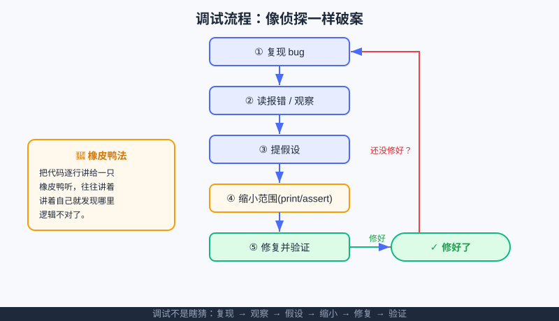

<div style="display:flex; gap:12px; margin-bottom:24px; flex-wrap:wrap; align-items:center;">
  <span style="background:#f0f4ff; color:#4A6CF7; padding:4px 12px; border-radius:20px; font-size:0.85em; font-weight:600; border:1px solid rgba(74,108,247,0.2);">📖 第9章</span>
  <span style="background:#fef9ec; color:#d97706; padding:4px 12px; border-radius:20px; font-size:0.85em; border:1px solid rgba(100,100,100,0.15);">⏱️ ~30 min read</span>
  <span style="background:#fef9ec; color:#d97706; padding:4px 12px; border-radius:20px; font-size:0.85em; border:1px solid rgba(100,100,100,0.15);">🎯 Intermediate</span>
</div>

# Chapter 9: 调试与调试思维 —— 像侦探一样"破案"

> 📝 **Before You Continue:** 本章是前面三章的"体检课"——你要能看懂 [第6章 条件判断](conditionals.md)、[第7章 while](while-loops.md)、[第8章 for](for-loops.md) 写出的代码，才会知道它"哪里病了"。变量与运算符（[第2章](../foundations/variables.md)、[第4章](../foundations/operators.md)）也是读报错的基础。

先说句大实话：**写代码一定会写错，连高手也是。** 区别不在于"会不会出错"，而在于"出错后能不能又快又稳地抓到它"。这一章，我们不当"背语法的学生"，而当"破案侦探"：程序行为不对 → 读线索（报错/输出）→ 提假设 → 缩小范围 → 修复 → 验证。这套**调试思维**，比多记十个语法都值钱。

> 💡 **Key Insight:** 调试不是"瞎改碰运气"，而是一套**可复用的系统方法**。学会了它，你以后学任何新语言、新框架都不怕——因为"定位问题"的能力是通用的。

<div class="story-scene">
<strong>🎬 开场小剧场：调试侦探接案</strong>
<p>游乐场灯光矩阵突然不亮了。小派急得乱改代码，一会儿改变量名，一会儿删循环，结果问题越来越多。红色报错像一张皱巴巴的案发现场照片。</p>
<p>调试侦探 debug 推了推放大镜：“别乱动现场。先读报错，再看变量，再缩小范围。bug 不是怪物，是留下线索的小偷。”</p>
</div>

<div class="quest-card">
<strong>🎯 本章任务卡</strong>
<ul>
<li>读懂报错里“谁、在哪、怎么了”。</li>
<li>用 <code>print</code> 插探针观察中间值。</li>
<li>把大范围问题一步步缩小。</li>
<li>区分语法错误、名字错误、类型错误和缩进错误。</li>
<li>修复后重新运行验证。</li>
</ul>
</div>

<div class="boss-bug">
<strong>👾 本章 Boss Bug：乱改碰运气怪</strong>
<p>它会诱惑你不看报错、直接乱删乱改。打败它的流程是：先读线索，提出假设，只改一处，重新验证。</p>
</div>

---

## 🔍 计算思维聚焦：系统化排查（Systematic Narrowing）

**排查（debugging）** 本身就是计算思维的一环，它最贴近 **"分而治之（Divide & Conquer）"**：当一大段代码出错，你不是逐行死看，而是**不断把"有问题的范围"砍掉一半**——用 `print` 在中间打个点，看"错误在这一点之前还是之后"，范围就缩小了。把大问题拆小、逐步定位，正是贯穿全书的思维底色。

---

## 🩺 错题诊所 · 开张语

从本章起，书里多了一个常驻栏目 **🩺 错题诊所**：我们把"容易写错、一错就懵"的代码摆上诊台，一起读报错、找病根、开药方。今天是第一期，主角是**四种最常撞见的报错**。

---

## 9.1 读得懂报错，就赢了一半

<div class="try-it">
<strong>🧩 练一练 9.1</strong>
<p>题目：SyntaxError 一般是什么类型的错误？</p>
<details><summary>💡 看看答案</summary>
<p>答案：<b>语法写错</b>，比如少冒号、引号没闭合、缩进不对。Python 会在出错行打红叉提示。</p>
</details>
</div>

Python 一出错，会在终端甩一段"红字"。新手常犯的错误是——**看见红字就慌，秒关窗口**。其实那段红字是破案线索，专门告诉我们"谁、在哪、怎么了"。四种最基础的：

### 🩺 错题诊所 ①：SyntaxError（语法错）

```python
print("你好"          # ❌ 少了右括号
```
**报错（节选）：**
```
SyntaxError: '(' was never closed
```
> 📝 **Note:** 语法错是"写错格式"，Python **根本没运行**就先报错。看它指出的位置附近，找缺的括号、冒号、引号。第 6 章的 `if x = 5`（应为 `==`）也属于这类。

### 🩺 错题诊所 ②：NameError（名字没定义）

```python
print(x)              # ❌ x 从没定义过
```
**报错：**
```
NameError: name 'x' is not defined
```
> 💡 **Pro Tip:** 名字错最常见于**拼写不一致**——前面写 `score`、后面用 `scroe`。看到 `NameError`，先 Ctrl+F 搜这个名字，八成是打字手滑。

### 🩺 错题诊所 ③：TypeError（类型不对）

```python
score = 90
print("分数：" + score)   # ❌ 文字不能和数字直接相加
```
**报错：**
```
TypeError: can only concatenate str (not "int") to str
```
> 🤔 **Why 会这样？** `"分数："` 是文字（str），`score` 是数字（int）。Python 不允许"文字 + 数字"硬凑。改法：用逗号 `print("分数：", score)`，或把数字变文字 `print("分数：" + str(score))`。

### 🩺 错题诊所 ④：IndentationError（缩进错）

```python
if True:
print("你好")        # ❌ if 下面没缩进
```
**报错：**
```
IndentationError: expected an indented block after 'if' statement
```
> ⚠️ **Warning:** Python 靠缩进分块，该缩进的没缩进（或缩进忽多忽少）就会报这个。统一用 **4 个空格** 缩进，别把空格和 Tab 混用，能避开 90% 的缩进错。

---

## 9.2 print 调试

<div class="try-it">
<strong>🧩 练一练 9.2</strong>
<p>题目：程序没报错，但答案不对，最朴素怎么查？</p>
<details><summary>💡 看看答案</summary>
<p>答案：在关键位置插 <code>print(变量)</code>，看中间值是不是你以为的那样，逐步缩小怀疑范围。</p>
</details>
</div>：最朴素也最管用

没高级工具时，**在关键位置插一行 `print`**，把"此时的变量值"打出来，你就能看见程序"脑子里到底在想什么"。

```python
total = 0
i = 1
while i <= 5:
    total = total + i
    print("调试：i =", i, "total =", total)   # 👈 临时插的"探针"
    i = i + 1
print("结果：", total)
```

**输出：**
```
调试：i = 1 total = 1
调试：i = 2 total = 3
调试：i = 3 total = 6
调试：i = 4 total = 10
调试：i = 5 total = 15
结果： 15
```

> 🧠 **Mental Model:** `print` 调试就像给程序装"摄像头"——你在流程里架几台，就能回放"每一步变量变成了啥"。定位完 bug，**记得把调试用的 print 删掉或注释掉**，别留一地探针。

---

## 9.3 断言 assert

<div class="try-it">
<strong>🧩 练一练 9.3</strong>
<p>题目：用 assert 给"分数必须在 0~100"加一道警报。</p>
<details><summary>💡 看看答案</summary>
<p>答案：<code>assert 0 &lt;= score &lt;= 100, "分数越界"</code>。条件为假时立刻报错停下来。</p>
</details>
</div>：给程序装"警报器"

`assert 条件, "出错说明"` 的意思是：**"我断言这个条件必须成立；如果不成立，立刻报错停下。"** 它像埋在代码里的警报，专门抓"本不该发生"的情况。

```python
score = int(input("输入分数："))
assert 0 <= score <= 100, "分数必须在 0~100 之间！"   # 守门员
print("你的分数是：", score)
```

**如果输入 150：**
```
AssertionError: 分数必须在 0~100 之间！
```

> 💡 **Pro Tip:** `assert` 适合放在"函数入口 / 关键假设处"，提前暴露错误，比等程序跑飞了再回头找要快得多。正式上线时可以用 `python -O` 关掉断言，但**学习阶段建议常开**，让它帮你抓 bug。

---

## 9.4 缩小范围

<div class="try-it">
<strong>🧩 练一练 9.4</strong>
<p>题目：一段很长的代码出错，用"二分定位法"该先在哪儿插 print？</p>
<details><summary>💡 看看答案</summary>
<p>答案：先在<b>正中间</b>插。看前半段还是后半段出错，再在出错的那半段中间插，像二分查找一样快速锁定。</p>
</details>
</div>：二分定位法

当代码很长、看不出哪行病了，用 **"中间打点"** 把范围砍半：

1. 在代码**正中间**插一个 `print("到达中点，x =", x)`。
2. 运行：
   - 如果中点**打印了** → 错误在中点**之后**。
   - 如果中点**没打印** → 错误在中点**之前**（程序在中点前就挂了）。
3. 在"有问题的那半段"再取中点，重复——几次就能锁定到具体一两行。

> 🧠 **Mental Model:** 这和第 7 章猜数字"每次猜中点、范围减半"是**同一个套路**！调试里的"二分定位"和算法里的"二分查找"本是亲兄弟——都是"用中点把不确定范围砍半"。

---

## 9.5 橡皮鸭法

<div class="try-it">
<strong>🧩 练一练 9.5</strong>
<p>题目：什么是"橡皮鸭法"？</p>
<details><summary>💡 看看答案</summary>
<p>答案：把代码<b>逐行讲给一只橡皮鸭（或任何东西）听</b>。讲着讲着，你常常自己就发现了 bug 在哪。</p>
</details>
</div>：讲着讲着就懂了

真卡住时，试试 **橡皮鸭法（Rubber Duck Debugging）**：找一只玩具鸭（或任意玩偶、甚至对空气），把你的代码**一行行讲给它对**。"这行是让 i 加 1，这行是把 i 加进 total……"——往往讲到某一行，你自己就突然发现："等等，这里逻辑不对！"

> 📝 **Note:** 这法子看着像玄学，实则极有效：讲出口时，你被迫**把模糊的直觉变成精确的语言**，漏洞就暴露了。很多程序员工位上真有一只橡皮鸭。

---

## 9.6 案例：找 bug 小侦探

下面这段"计算 1 到 n 的和"的程序，被偷偷改出了 3 个 bug，你来当侦探，先读报错、再修复：

```python
n = int(input("n = "))
total = 0
i = 1
while i = n:                  # 🔴 Bug A
    total = total + i
    i = i + 1
print("和是", total)
```

**侦探笔记：**
- 🔴 **Bug A**：`while i = n:` —— 这里用了赋值 `=`，但 `while` 后面要的是"判断"，应该是 `==`。而且就算改成 `==`，逻辑也怪（只比一次）。本意应是 `while i <= n:`。**报错：`SyntaxError`**。
- 修完后还有没有隐患？再看：`total` 初值 0、`i` 从 1 起、每轮 `+1`、条件 `<= n` —— 这就对了。

**正确版：**
```python
n = int(input("n = "))
total = 0
i = 1
while i <= n:                 # ✅ 判断用 <=，循环到 n
    total = total + i
    i = i + 1
print("和是", total)
```

> 🩺 **错题诊所：** 注意 `while` 条件里**几乎永远不该写 `=`**（赋值），要写判断就用 `==` 或 `<=` / `>=` 之类。把赋值误当判断，是 `while` 头号语法坑。

---



上图把整套调试流程串成环：①复现 → ②读报错/观察 → ③提假设 → ④缩小范围（print/assert）→ ⑤修复并验证。没修好就回到前面继续查；修好才从右侧"✓ 修好了"离开。左下角那只 🦆，就是橡皮鸭法。

---

## 🧮 算法小课堂（前置彩蛋）

你刚在 9.4 用"二分定位"找 bug——这和第 7 章猜数字、算法篇的 **[二分查找](../algorithms/searching.md)** 同宗：核心都是"每次把不确定范围砍半"。等第 17 章后系统讲算法，你会认出这套思想的名字。

---

## 🏅 本章通关徽章：调试侦探

<div class="badge-card">
<strong>如果你能做到下面 4 件事，就获得“调试侦探”徽章：</strong>
<ul>
<li>能从报错信息里找出错误类型和位置。</li>
<li>能用 <code>print</code> 观察关键变量。</li>
<li>能把大范围问题一步步缩小。</li>
<li>能做到“一次只改一处，然后重新验证”。</li>
</ul>
</div>

---

## ⚠️ Common Mistakes in Chapter 9

| # | 误区 | 示例 | 为什么错 | 修正 |
|---|------|------|---------|------|
| 1 | 看见红字就关窗口 | 报错一闪而过 | 放弃了最关键的线索 | 静下心读最后一行错误类型+位置 |
| 2 | `while` 条件写 `=` | `while i = n:` | `=` 是赋值不是判断 | 改 `==` 或 `<=` 等 |
| 3 | 文字 + 数字 硬加 | `"分：" + score` | 类型不兼容，TypeError | 用逗号，或 `str(score)` |
| 4 | 缩进混用空格和 Tab | 时灵时不灵 | Python 认不出对齐 | 统一 4 个空格 |
| 5 | `print` 调试后忘删 | 上线还打印一堆 | 输出被污染、拖累速度 | 定位完就删/注释探针 |
| 6 | 名字拼写前后不一致 | `score` vs `scroe` | NameError | 复制变量名，别手打 |

---

## Chapter Summary

### 📌 Key Takeaways

| 概念 | 要点 | 为什么重要 |
|------|------|------------|
| 四种报错 | Syntax / Name / Type / Indentation | 读懂它，定位快一半 |
| `print` 调试 | 关键处插"探针"看变量 | 最朴素也最管用 |
| `assert` | 断言条件必成立，否则报错 | 给关键假设装警报 |
| 二分定位 | 中点打点，范围砍半 | 长代码快速锁定病行 |
| 橡皮鸭法 | 讲给鸭听，讲着讲着就懂 | 逼自己把逻辑说精确 |
| 删探针 | 调完清理调试代码 | 保持代码干净 |

### ❓ FAQ

**Q1: 报错信息太长是啥意思，要全看吗？**
> A: 不用全看。抓**最后一行**的错误类型（SyntaxError/NameError…）和**箭头 `^` 指的位置**，那是最准确的"案发地"。上面的堆栈是调用链，初学先忽略。

**Q2: 为什么我改了一处，又冒出新的错？**
> A: 常因为"第一个错让程序提前停了，后面的错本来也在"。先修最靠前的那个，再跑一次看下一个——像剥洋葱，一层层来。

**Q3: `assert` 和 `if` 报错有啥区别？**
> A: `if` 是你自己写"不满足条件就怎么处理"；`assert` 是"不满足就直接崩溃报错"，专用于抓**不该发生**的情况。它更短、语义更清晰（"我断言这里必对"）。

**Q4: 有没有比 print 更高级的调试法？**
> A: 有，叫"断点调试"（debugger，如 VS Code 的调试器），能让程序**暂停在某行**、查看所有变量。但 `print` 调试够用到初学结束；想进阶时再学断点也不迟。

### 🔗 Connections to Later Chapters

- **[第10章 列表](../data-structures/lists.md) 起的数据结构**：数据结构一复杂，bug 也更隐蔽，`print` 和 `assert` 更是日常。
- **[函数篇 · 作用域与递归](../functions/scope-recursion.md)**：递归出错时，"二分定位 + 断言"能救你于水火。
- **算法篇 · [搜索](../algorithms/searching.md) / [排序](../algorithms/sorting.md)**：写算法最易 off-by-one（差一步），本章的"读报错 + 缩小范围"是直接生产力。
- **[第14章 函数重构](../functions/functions-intro.md)**：把"游乐场"代码收进函数时，断言能帮你守住输入输出不串味。

---


## 🎮 加练任务包

> 下面这些题目不一定比章末题更难，但更适合“多刷几遍、把手感练出来”。建议先独立做，再展开提示。

### 加练 9.A · 报错分类 🟢

`print(score)` 报 `NameError: name 'score' is not defined`。这说明什么？

<details>
<summary>💡 提示 / 答案要点</summary>

说明名字 `score` 从未定义，或拼写前后不一致。先检查有没有 `score = ...`，再查拼写。

</details>

---

### 加练 9.B · 插探针 🟢

循环结果不对时，你会在哪些位置插入 `print()`？

<details>
<summary>💡 提示 / 答案要点</summary>

在循环开始、关键变量更新后、条件判断前后插入。目标是看中间值是否符合预期。

</details>

---

### 加练 9.C · 一次只改一处 🟡

为什么调试时不建议一次改五六处？

<details>
<summary>💡 提示 / 答案要点</summary>

因为结果变化后你不知道是哪一处起作用。正确做法：提出一个假设，只改一处，重新运行验证。

</details>

---


---

## Practice Problems

> 🩺 **错题诊所 · 本期作业：** 下面每题都带"病"，先当侦探读报错/看行为，再开药方。

---

**Problem 9.1 — 诊断 SyntaxError** 🟢 Easy

下面代码报错，请说出**错误类型**和**怎么改**：

```python
if score > 60
    print("及格")
```

<details>
<summary>💡 Solution (click to reveal)</summary>

**诊断：** `SyntaxError`（语法错）——`if` 行末尾**少了冒号 `:`**。Python 在解析阶段就报错，根本没运行。

**药方：**
```python
if score > 60:        # ✅ 补冒号
    print("及格")
```

**Key points:**
- 看到 `SyntaxError` 先检查括号、冒号、引号是否配对。
- `if / elif / else / while / for` 后面都必须有 `:`。

</details>

---

**Problem 9.2 — 诊断 TypeError** 🟡 Medium

下面代码想打印"分数：90"，却报错，请说出**错误类型**和**两种改法**：

```python
score = 90
print("分数：" + score)
```

<details>
<summary>💡 Solution (click to reveal)</summary>

**诊断：** `TypeError`——`"分数："` 是文字（str），`score` 是数字（int），不能 `+` 硬拼。

**药方 A（用逗号，Python 自动拼接不同类型）：**
```python
print("分数：", score)
```
**药方 B（先把数字变文字）：**
```python
print("分数：" + str(score))
```

**Key points:**
- 文字和数字相加必报 TypeError。
- 用逗号最省心；要拼成单一字符串就用 `str()` 转换。

</details>

---

**Problem 9.3 — 用二分定位找"差一步"** 🔴 Hard

下面想打印 1 到 5，却只打出 `1 2 3 4`，少了 5。请先用"二分定位"思路说明**怎么缩小范围找到病根**，再给出修复。

```python
i = 1
while i < 5:
    print(i, end=" ")
    i = i + 1
```

<details>
<summary>💡 Solution (click to reveal)</summary>

**诊断思路（二分定位）：** 在循环前后各插探针：`print("进循环前 i=", i)` 和循环后 `print("出循环 i=", i)`。会发现出循环时 `i == 5`，而条件是 `i < 5`——所以 `i == 5` 那一轮**没进去**，5 被漏掉。病根：条件 `< 5` 不含 5。

**药方（左闭右开要对齐）：**
```python
i = 1
while i <= 5:        # ✅ 用 <= 才包含 5
    print(i, end=" ")
    i = i + 1
```
输出：`1 2 3 4 5`

**Key points:**
- "差一步 / 多一步"（off-by-one）是循环最常见的病，根子常在边界条件。
- 探针看"进/出循环那一刻的变量值"，一眼锁定。

</details>

---

**Problem 9.4 — ⚔️ 挑战擂台：连环 bug 急诊室** 🏆 Challenge

下面这段"算 1~n 偶数之和"的程序被埋了 **3 个 bug**（含一个会直接让程序跑不起来的语法错）。请全部找出、说明类型、并给出修复后的完整可运行代码。

```python
n = int(input("n = "))
sum = 0
i = 1
while i <= n
    if i % 2 = 0:
        sum = sum + i
    i = i + 1
print("偶数和 =", sum)
```

<details>
<summary>💡 Solution (click to reveal)</summary>

**三个 bug 诊断：**
1. 🔴 **语法错**：`while i <= n` 少了冒号 → `SyntaxError`。补 `:`。
2. 🔴 **语法错**：`if i % 2 = 0:` 把判断写成了赋值 `=`，应为 `==` → `SyntaxError`。
3. 🟡 **逻辑错（隐患）**：`i = i + 1` 缩进在 `if` 内，只有偶数那轮才 `i` 自增，奇数轮 `i` 不变 → 死循环。应和 `if` 同级缩进。

**修复后完整代码：**
```python
n = int(input("n = "))
total = 0                 # ✅ 顺手避坑：别用 sum 当变量名（它是内置函数）
i = 1
while i <= n:              # ✅ 补冒号
    if i % 2 == 0:        # ✅ 判断用 ==
        total = total + i
    i = i + 1             # ✅ 与 if 同级，每轮都自增
print("偶数和 =", total)
```

**Key points:**
- 先修"让程序跑不起来"的语法错，再修运行/逻辑错。
- 额外提醒：`sum` 是 Python 内置函数名，用它当变量会"遮蔽"内置功能，养成避开内置名的习惯。

</details>

---

## 🛠️ 项目工坊：算法游乐场 · 第9章「给游乐场捉虫」

前几章我们攒下了**抽奖转盘**（第 6 章）、**积分系统**（第 7 章）、**灯光矩阵**（第 8 章）。今天，我们扮演"游乐场运维"，给那段**积分系统**代码做个体检——它被人偷偷改出了 3 个 bug，你来抓。

> 🩺 **错题诊所 · 本期特供：** 下面是一份**故意带错**的积分系统。请先别急着运行，试着**肉眼读**出三个 bug；再运行验证你的判断；最后给出修复版。

```python
# 游乐场积分系统（带 bug 版，请修复）
points = 0
while points < 100    # 🐛 Bug 1：？
    gain = int(input("本轮得分："))
    points = points + earn   # 🐛 Bug 2：？
    print("当前积分：", point)  # 🐛 Bug 3：？
print("恭喜，积分达标！")
```

**侦探提示：**
- 🐛 **Bug 1**：`while` 行末尾**少了冒号** → `SyntaxError`，程序直接跑不起来。
- 🐛 **Bug 2**：累加时写的是 `earn`，但上面定义的是 `gain` → `NameError`（名字对不上）。
- 🐛 **Bug 3**：打印时写的是 `point`，但变量叫 `points` → `NameError`。

**修复版（可直接运行）：**
```python
# 游乐场积分系统（已修复）
points = 0
print("🎡 积分系统：累计到 100 分解锁大奖！（输入 0 退出）\n")
while points < 100:                 # ✅ 补冒号
    gain = int(input("本轮得分："))
    if gain == 0:
        print("👋 已退出，当前积分：", points)
        break
    points = points + gain          # ✅ 用定义好的 gain
    print("当前积分：", points)      # ✅ 变量名 points
if points >= 100:
    print("🏆 解锁「超级玩家」徽章！")
```

**现在游乐场做了一次"体检升级"**：我们用本章的读报错 + 名字排查 + 缩进检查，把三个 bug 全揪了出来。从下章起，等学到 [列表](../data-structures/lists.md)，我们还能用"列表"把游客和排行榜管起来——到时候 `print` 和 `assert` 会派上更大用场。

> 💡 **Pro Tip:** 维护旧代码时，先用 `assert` 把"输入输出该长啥样"钉死，再动手改——改坏了断言会立刻报警，比事后才发现安全得多。

---

> 💡 **记住这一句：** 调试不是"运气活"，而是**读线索 → 提假设 → 缩范围 → 验证**的侦探流程——会修 bug，才算真正会写代码。

翻过这一章，我们的"控制流"三件套（判断、while、for）就齐了。接下来进入 **[数据结构篇 · 列表](../data-structures/lists.md)**，你将拥有装载成百上千数据的"集装箱"，算法游乐场也要迎来游客与排行榜管理的新阶段 🎢。
