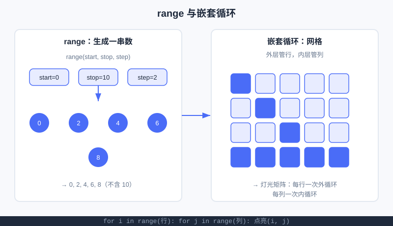

<div style="display:flex; gap:12px; margin-bottom:24px; flex-wrap:wrap; align-items:center;">
  <span style="background:#f0f4ff; color:#4A6CF7; padding:4px 12px; border-radius:20px; font-size:0.85em; font-weight:600; border:1px solid rgba(74,108,247,0.2);">📖 第8章</span>
  <span style="background:#f0fdf4; color:#16a34a; padding:4px 12px; border-radius:20px; font-size:0.85em; border:1px solid rgba(22,163,74,0.2);">⏱️ ~35 min read</span>
  <span style="background:#f0fdf4; color:#16a34a; padding:4px 12px; border-radius:20px; font-size:0.85em; border:1px solid rgba(22,163,74,0.2);">🎯 Beginner</span>
</div>

# Chapter 8: 循环 for 与 range —— 用"迭代"画出整个世界

> 📝 **Before You Continue:** 这一章是 [第7章 循环 while](while-loops.md) 的"好兄弟"，也用到 [第2章 变量](../foundations/variables.md) 和 [第3章 字符串](../foundations/strings.md)（遍历字符串时会用上）。如果 `while` 还没熟，先回去扫一眼。

第 7 章的 `while` 适合"次数不确定"的重复。但很多时候，你想干的其实是——"把这一串东西**一个个**过一遍"：从 1 数到 10、把名字里每个字打出来、把九九乘法表一行行印出来。`for` 就是为这种"**已知要遍历什么**"的场景而生的。这章你会学到：怎么用 `range` 造一串数、怎么用 `for` 把它"迭代"完，以及最酷的——**嵌套循环**怎么画出图形和矩阵。

> 💡 **Key Insight:** `for` 的精髓是**迭代（iteration）**：一件事重复做，每做一次就"往前推进一点点"。你不用管"停没停"，`for` 自己知道数数到头就收工。

<div class="story-scene">
<strong>🎬 开场小剧场：传送带工人开工</strong>
<p>游乐场纪念品店来了 50 个包裹。小派本想写 50 次“检查包裹”，刚写到第 6 次就受不了了。传送带工人 for 推来一条自动传送带。</p>
<p>他说：“把包裹放上来，我一次送一个给你。你只写一遍检查动作，剩下的交给我。”当你知道要处理的是“一串东西”，for 就是最稳的传送带。</p>
</div>

<div class="quest-card">
<strong>🎯 本章任务卡</strong>
<ul>
<li>用 <code>for ... in ...</code> 遍历一串东西。</li>
<li>用 <code>range</code> 造出指定范围的数字。</li>
<li>遍历字符串里的每个字符。</li>
<li>用嵌套循环画图形和矩阵。</li>
<li>理解列表推导式是 <code>for + append</code> 的简写。</li>
</ul>
</div>

<div class="boss-bug">
<strong>👾 本章 Boss Bug：少一次多一次怪</strong>
<p>它最喜欢钻 <code>range</code> 的空子：你想要 1 到 5，却写成 <code>range(1, 5)</code>。打败它的口诀是：<b>range 左闭右开，想含终点就 +1</b>。</p>
</div>

---

## 8.0 生活里的"for 思维"

<div class="try-it">
<strong>🧩 练一练 8.1</strong>
<p>题目：在生活里举一个"对每一样东西都做一遍"的例子。</p>
<details><summary>💡 看看答案</summary>
<p>答案：例如"对每一本书都盖个章"；或"对每一个同学都点一次名"。这就是 for 思维。</p>
</details>
</div>

想想"发作业本"：老师手里一沓本子，从第一本到最后一本，**一本本**发下去，发完就停。这就是 `for` 的脑内模型——

```
对于（每一本作业本）:
    发给对应的同学
# 发完最后一本题，自动结束
```

> 🧠 **Mental Model:** `for` 像一条"自动传送带"：你把一串东西放上去，它**自动一个一个**送过来，每次送一个给你处理；东西送完了，传送带自己停。你不用像 `while` 那样手动数"第几个了、该停没停"。

---

## 🔍 计算思维聚焦：迭代思维（Iteration）

**迭代**是计算思维的核心动作之一：把"解决大问题"变成"重复一个小小的步骤，每步都把问题推进一点"。比如"打印 1 到 100"——你不是一下子解决，而是"打印 1，再打印 2……"一步步迭代，直到覆盖全部。迭代思维让你**用简单动作解决大任务**，也是后面所有算法（排序、搜索、递归）的共同底色。

---

## 🧮 算法小课堂（前置彩蛋）：嵌套循环的复杂度

先埋个伏笔：本章会写"外层循环 × 内层循环"的**嵌套循环**来画矩阵。如果你外层跑 `n` 次、内层每次也跑 `n` 次，总共就跑了 `n × n = n²` 次。这个"随规模平方增长"的概念，正是算法篇 [大 O 表示法](../algorithms/big-o.md) 里 **O(n²)** 的直觉来源——第 17 章起我们会正式量化"程序有多快/多慢"。

---

## 8.1 for … in：遍历一串东西

<div class="try-it">
<strong>🧩 练一练 8.2</strong>
<p>题目：用 for 遍历列表 [1, 2, 3]，把每个元素打印出来。</p>
<details><summary>💡 看看答案</summary>
<p>答案：<code>for x in [1,2,3]: print(x)</code>。每次循环 x 依次取 1、2、3。</p>
</details>
</div>

最朴素的 `for`：把一串东西"逐个"取出来交给一个变量。

```python
for fruit in ["苹果", "香蕉", "橙子"]:
    print("我喜欢吃", fruit)
```

**输出：**
```
我喜欢吃 苹果
我喜欢吃 香蕉
喜欢吃 橙子
```

> 🤔 **Why 叫 `for ... in`？** 读起来就像人话："对于（for）列表里**每一个（in）** 水果，做……"。Python 的语法就是故意写成这样好懂。

---

## 8.2 range：造出一串数

<div class="try-it">
<strong>🧩 练一练 8.3</strong>
<p>题目：用 range 分别打印：0~4、1~5、0~9 的偶数。</p>
<details><summary>💡 看看答案</summary>
<p>答案：<code>range(5)</code> → 0,1,2,3,4；<code>range(1,6)</code> → 1..5；<code>range(0,10,2)</code> → 0,2,4,6,8。</p>
</details>
</div>

`for` 最常配合 `range()` 使用——它负责"造一串整数"给你遍历。

```python
for i in range(5):        # 0,1,2,3,4（从 0 到 4，不含 5）
    print(i)
```

**三个常见写法：**

| 写法 | 产生的数 | 说明 |
|------|---------|------|
| `range(5)` | 0,1,2,3,4 | 只有"终点"，从 0 开始，不含终点 |
| `range(1, 6)` | 1,2,3,4,5 | "起点, 终点"，含起点不含终点 |
| `range(0, 10, 2)` | 0,2,4,6,8 | "起点, 终点, 步长"，每次跳 2 |

```python
for i in range(1, 6):
    print(i)              # 1 2 3 4 5

for i in range(0, 10, 2):
    print(i, end=" ")    # 0 2 4 6 8
```

> ⚠️ **Warning:** `range` **永远不含终点**！`range(1, 5)` 是 1,2,3,4，没有 5。记住口诀：**"左闭右开"**——左边算上，右边不算。这是新手最容易多一次/少一次的地方。

> 💡 **Pro Tip:** 想"从 1 数到 n"，写 `range(1, n + 1)`——因为终点要 +1 才包含 n。

---

## 8.3 遍历字符串（列表以后再说）

<div class="try-it">
<strong>🧩 练一练 8.4</strong>
<p>题目：用 for 遍历字符串 "hello"，把每个字符打印出来。</p>
<details><summary>💡 看看答案</summary>
<p>答案：<code>for ch in "hello": print(ch)</code> 依次输出 h e l l o。</p>
</details>
</div>

字符串就是一串字符，`for` 可以**一个字一个字**地走过它（列表 list 我们第 10 章才正式学，这里先用字符串热热身）：

```python
word = "Python"
for ch in word:
    print(ch)
```

**输出：**
```
P
y
t
h
o
n
```

配合 `if`（第 6 章），还能做小事，比如"数一数有几个元音"：

```python
word = "algorithm"
count = 0
for ch in word:
    if ch in "aeiou":
        count = count + 1
print("元音个数：", count)    # 元音个数： 3
```

> 📝 **Note:** 第 10 章你会学到**列表（list）**——它和字符串一样能被 `for` 遍历，而且能装任意东西。到时候 `for item in my_list:` 就是日常操作了。现在先拿字符串练手，原理一模一样。

---

## 8.4 案例一：打印三角形

<div class="try-it">
<strong>🧩 练一练 8.5</strong>
<p>题目：用嵌套 for 打印 3 行、每行 5 个星号 * 的矩形。</p>
<details><summary>💡 看看答案</summary>
<p>答案：外层 <code>for r in range(3):</code>，内层 <code>for c in range(5): print('*', end='')</code>，每行结束 <code>print()</code> 换行。</p>
</details>
</div>

用 `for` + 字符串乘法 `*`，能轻松画出靠右/递增的图形。

**右三角形（每行多一颗星）：**
```python
for i in range(1, 6):
    print("*" * i)
```
**输出：**
```
*
**
***
****
*****
```

**居中三角形（空格 + 星）：**
```python
n = 5
for i in range(1, n + 1):
    spaces = " " * (n - i)
    stars = "*" * (2 * i - 1)
    print(spaces + stars)
```
**输出：**
```
    *
   ***
  *****
 *******
*********
```

> 🧠 **Mental Model:** 每一行都是"先算空格数、再算星数、拼起来打印"。`for` 负责"一行行推进"，每行内部用 `*` 复制字符——**迭代 + 规律 = 图形**。

---

## 8.5 嵌套循环：外层管行，内层管列

当一件事里"套着另一件重复的事"，就用**嵌套 `for`**。最经典的：外层控制"第几行"，内层控制"这一行的第几列"。

**九九乘法表：**
```python
for i in range(1, 10):           # 外层：行（被乘数）
    for j in range(1, i + 1):    # 内层：列（乘数，只到 i 避免重复）
        print(f"{j}×{i}={i*j}", end="\t")
    print()                        # 一行结束，换行
```

**输出（节选）：**
```
1×1=1
1×2=2    2×2=4
1×3=3    2×3=6    3×3=9
...
1×9=9    2×9=18   ... 9×9=81
```

> 💡 **Key Insight:** 九九表之所以用"内层到 `i` 就停"，是为了**避免重复**（1×2 和 2×1 是一回事）。这种"用已有信息砍掉无用工作"的意识，正是算法优化的最早萌芽。

> ⚠️ **Warning:** 嵌套循环里**缩进要分两层**：内层 `for` 比外层 `for` 多缩进 4 格。缩进错了，内层可能跑到外层外面，图形/表格就乱套了。

---

## 8.6 案例二：打印菱形（综合）

把居中三角形"正着来一遍、反着来一遍"，就拼成菱形：

```python
n = 4
# 上半（含最宽一行）
for i in range(1, n + 1):
    print(" " * (n - i) + "*" * (2 * i - 1))
# 下半（倒着收窄）
for i in range(n - 1, 0, -1):
    print(" " * (n - i) + "*" * (2 * i - 1))
```

**输出：**
```
   *
  ***
 *****
*******
 *****
  ***
   *
```

> 🐛 **Common Bug:** 下半部分写 `range(n, 0, -1)` 会把最宽那行再打印一次（重复一行）。正确是 `range(n - 1, 0, -1)`——从"次宽"开始往下收窄。画图形时，**边界那一行要不要重复**最容易算错。

---



上图左边把 `range(0, 10, 2)` 画成"一颗颗被吐出来的数"；右边把嵌套循环画成"网格"——外层走一行、内层走一列，正好对应本项目工坊要做的"灯光矩阵"。

---

---

## 8.7 列表推导式：一行写完"循环 + 造列表"

第 10 章你会大量见到这种写法，现在先认识它——Python 给"遍历一串东西、对每个做处理、收进新列表"准备了一句**语法糖**，叫**列表推导式（list comprehension）**。

先用普通 `for` 写："把 1~5 每个数的平方，收进列表"。

```python
squares = []
for i in range(1, 6):
    squares.append(i * i)
print(squares)    # [1, 4, 9, 16, 25]
```

同样的事，列表推导式**一行**搞定：

```python
squares = [i * i for i in range(1, 6)]
print(squares)    # [1, 4, 9, 16, 25]
```

读法像人话：**"把 `i*i`，对 `range(1,6)` 里的每个 `i`"**。`[]` 表示"我要造一个列表"，里面先写"对每个元素做什么"（`i*i`），再写 `for ... in ...` 说明遍历什么。

<div class="try-it">
<strong>🧩 练一练 8.6</strong>
<p>题目：用列表推导式生成 1~10 每个数的立方（即 i³），结果存到列表 cubes 里并打印。</p>
<details><summary>💡 看看答案</summary>
<p>答案：<code>cubes = [i**3 for i in range(1, 11)]</code>，打印得到 <code>[1, 8, 27, ..., 1000]</code>。<code>i**3</code> 即立方。</p>
</details>
</div>

还能在末尾加 `if` 做**过滤**，比如"只要偶数的平方"：

```python
even_sq = [i * i for i in range(1, 11) if i % 2 == 0]
print(even_sq)    # [4, 16, 36, 64, 100]
```

`if i % 2 == 0` 放在 `for` 之后，意思是"只有满足条件的 `i` 才收进列表"。

> 💡 **Key Insight:** 列表推导式**不是新功能**，只是"for 循环 + append"的**简写**。逻辑完全一样，但写完更短、更"pythonic"（Python 程序员偏爱这种写法）。别被一行吓到——它就是循环。

> ⚠️ **Warning:** 推导式虽爽，但**别塞太复杂的逻辑**。两三层嵌套推导式可读性很差。规则简单时用它；逻辑一复杂，老老实实写 `for` 循环更清楚，也更好调试。

> 🐛 **Common Bug:** 推导式里 `if` 写错位置就变味。`[x for x in nums if x > 0]` 的 `if` 在 `for` **之后**（过滤）；若写成 `[x if x > 0 else 0 for x in nums]`，`if` 在 `x` 的位置，那是"三元表达式"，意思完全不同。先记住：**过滤用末尾的 if**。

---

## 🏅 本章通关徽章：传送带操作员

<div class="badge-card">
<strong>如果你能做到下面 4 件事，就获得“传送带操作员”徽章：</strong>
<ul>
<li>能用 <code>for ... in ...</code> 遍历列表或字符串。</li>
<li>能正确写出 <code>range(起点, 终点, 步长)</code>。</li>
<li>能用嵌套循环控制“行”和“列”。</li>
<li>能看懂简单列表推导式。</li>
</ul>
</div>

---

## ⚠️ Common Mistakes in Chapter 8

| # | 误区 | 示例 | 为什么错 | 修正 |
|---|------|------|---------|------|
| 1 | 忘 `range` 不含终点 | `range(1,5)` 想要 1–5 | 实际只有 1,2,3,4 | 写 `range(1, 6)` |
| 2 | 想从 1 数到 n 写 `range(n)` | 得到 0…n-1 | 起点默认是 0 | 写 `range(1, n+1)` |
| 3 | 嵌套缩进不齐 | 内层没比外层多缩进 | 循环层级错乱 | 内层多缩进 4 格 |
| 4 | `print` 忘换行导致挤一行 | 内层里没 `print()` 收尾 | 所有内容糊一行 | 内层结束后单独 `print()` |
| 5 | 菱形边界重复一行 | 下半用 `range(n,0,-1)` | 最宽行被打两次 | 用 `range(n-1, 0, -1)` |
| 6 | 步长为负却起点<终点 | `range(5,0,1)` 啥也不出 | 正向走不到终点 | 负步长要 `range(5,0,-1)` |

---

## Chapter Summary

### 📌 Key Takeaways

| 概念 | 要点 | 为什么重要 |
|------|------|------------|
| `for x in 序列` | 逐个取出处理 | 遍历的标准姿势 |
| `range(a, b, step)` | 左闭右开，不含 b | 造一串数；终点要 +1 才含 |
| 遍历字符串 | `for ch in "abc"` | 练手；列表第 10 章同理 |
| 嵌套循环 | 外层管行、内层管列 | 画图形、乘法表、矩阵 |
| 图形规律 | 空格数 + 星数随行变 | 迭代 + 规律 = 图形 |
| 列表推导 `[x for ...]` | 一行造列表，可带 `if` 过滤 | `for+append` 的简写，更 pythonic |
| O(n²) 伏笔 | 两层各 n → n² 次 | 算法复杂度直觉 |

### ❓ FAQ

**Q1: 什么时候用 `for`，什么时候用 `while`？**
> A: 知道"要遍历什么 / 跑固定次数"用 `for`（如 `range`、字符串）；只知道"条件满足就继续"、次数不定用 `while`（如猜中才停）。两者能互相改写，但各有所长。

**Q2: `range(5)` 为什么从 0 开始？**
> A: 这是编程界的通用约定（很多语言数组下标也从 0 起）。从 0 开始让"循环次数"和"下标"天然对齐，少出错。习惯就好。

**Q3: 内层循环每次都会完整跑完吗？**
> A: 对。外层每走一轮，内层就**从头到尾**完整跑一遍。所以九九表外层 9 轮、内层加起来共 45 次打印。

**Q4: 能 `for` 遍历"以后学的列表"吗？**
> A: 能，而且一模一样——`for item in my_list:`。第 10 章正式学列表后，这行就是你最高频的代码之一。

### 🔗 Connections to Later Chapters

- **[第9章 调试与调试思维](debugging.md)** 会教你看：嵌套循环"少跑一行 / 多跑一行"时，怎么用 `print` 抓出来。
- **[第10章 列表](../data-structures/lists.md)** 正式解锁 `for item in list`，迭代的真正主战场。
- **算法篇** 的 [大 O 表示法](../algorithms/big-o.md) 会把本章"嵌套 = n²"的直觉量化成 **O(n²)**。
- **[项目工坊](#🛠️-项目工坊算法游乐场--第8章灯光矩阵)** 用嵌套 `for` 给游乐场点亮一面"灯光矩阵"。

---


## 🎮 加练任务包

> 下面这些题目不一定比章末题更难，但更适合“多刷几遍、把手感练出来”。建议先独立做，再展开提示。

### 加练 8.A · 平方清单 🟢

用 `for` 打印 1 到 5 的平方。

<details>
<summary>💡 提示 / 答案要点</summary>

`for i in range(1, 6): print(i * i)`。终点要写 6 才包含 5。

</details>

---

### 加练 8.B · 元音计数 🟢

统计字符串 `algorithm` 中有几个元音字母。

<details>
<summary>💡 提示 / 答案要点</summary>

遍历每个字符，若 `ch in "aeiou"` 就计数加 1。结果是 3。

</details>

---

### 加练 8.C · 乘法矩形 🟡

用嵌套 `for` 打印 4 行 6 列的 `*` 矩形。

<details>
<summary>💡 提示 / 答案要点</summary>

外层控制 4 行，内层控制 6 列。内层打印 `*` 且 `end=""`，每行结束后单独 `print()` 换行。

</details>

---


---

## Practice Problems

---

**Problem 8.1 — 打印 1 到 10 的平方** 🟢 Easy

用 `for` + `range` 打印 1 到 10 每个数的**平方**（即 1, 4, 9, …, 100）。

**Sample Output:**
```
1
4
9
16
...
100
```

<details>
<summary>💡 Solution (click to reveal)</summary>

**Approach:** `range(1, 11)` 给出 1–10，循环里打印 `i * i`。

```python
for i in range(1, 11):
    print(i * i)
```

**Key points:**
- 终点写 `11` 才能含 10（左闭右开）。
- `i * i` 即平方，也可写 `i ** 2`。

</details>

---

**Problem 8.2 — 倒三角形** 🟡 Medium

用嵌套 `for` 打印一个"倒右三角形"（第一行 5 颗星，每往下一行少一颗）：

**Sample Output:**
```
*****
****
***
**
*
```

<details>
<summary>💡 Solution (click to reveal)</summary>

**Approach:** 外层控制行数，每行打印的星数 = `6 - i`（i 从 1 到 5）。

```python
for i in range(1, 6):
    print("*" * (6 - i))
```

**Key points:**
- 星数随行数递减，用 `6 - i` 表达最直观。
- 也可写 `for stars in range(5, 0, -1): print("*" * stars)`。

</details>

---

**Problem 8.3 — 打印 1 到 100 里所有 3 的倍数** 🔴 Hard

用 `for` 遍历 1 到 100，只打印那些"能被 3 整除"的数（每行一个）。

**Sample Output（节选）:**
```
3
6
9
...
99
```

<details>
<summary>💡 Solution (click to reveal)</summary>

**Approach:** 遍历 `range(1, 101)`，用 `if i % 3 == 0` 过滤（配合第 6 章的 `if`）。

```python
for i in range(1, 101):
    if i % 3 == 0:
        print(i)
```

**Key points:**
- `i % 3 == 0` 判断是否被 3 整除（余数为 0）。
- 这是"循环 + 条件过滤"的经典组合，竞赛题里极常见。

</details>

---

**Problem 8.4 — ⚔️ 挑战擂台：乘法表对角线之和** 🏆 Challenge

九九乘法表里，有一条"对角线"是 `1×1, 2×2, …, 9×9`。写一个程序，用嵌套 `for`（或单层 `for`）算出这条对角线上所有乘积的**总和**。

**Sample Output:** `总和 = 285` （因为 1+4+9+…+81 = 285）

<details>
<summary>💡 Solution (click to reveal)</summary>

**Approach:** 对角线满足"行号 = 列号"。用嵌套循环遍历整个表，只在 `i == j` 时累加；或更直接地单层遍历 `i` 累加 `i*i`。

```python
# 方法一：嵌套循环里挑对角线
total = 0
for i in range(1, 10):
    for j in range(1, 10):
        if i == j:
            total = total + i * j
print("总和 =", total)

# 方法二（更聪明）：对角线本就是 i*i
total2 = 0
for i in range(1, 10):
    total2 = total2 + i * i
print("总和 =", total2)
```

**Key points:**
- 方法二省掉了内层循环，只跑 9 次——这正是"识别规律、减少无用工作"的算法思维。
- 两种结果都是 285（1²+2²+…+9²）。

</details>

---

## 🛠️ 项目工坊：算法游乐场 · 第8章「灯光矩阵」

第 6 章有**抽奖转盘**、第 7 章有**积分系统**。这章我们给游乐场大门做一面**灯光矩阵**——用嵌套 `for` 控制"哪盏灯亮、哪盏灯灭"，营造氛围。

给你**两种自包含**写法，挑顺手的跑（都不引入新依赖）：

**写法 A · 纯终端（用 emoji 当灯）：**
```python
# 5×5 灯光矩阵：对角线亮 💡，其余灭 ⬛
for row in range(5):
    line = ""
    for col in range(5):
        if row == col:
            line = line + "💡"
        else:
            line = line + "⬛"
    print(line)
```

**写法 B · turtle 画图（真正画方块网格）：**
```python
import turtle
t = turtle.Turtle()
t.speed(0)                 # 最快
t.hideturtle()
size = 30

for row in range(5):           # 外层：行
    for col in range(5):       # 内层：列
        t.penup()
        t.goto(col * size - 60, 60 - row * size)
        t.pendown()
        # 对角线上的格子填蓝，其余描边
        if row == col:
            t.begin_fill()
            t.fillcolor("#4A6CF7")
        for _ in range(4):
            t.forward(size)
            t.right(90)
        if row == col:
            t.end_fill()
turtle.done()
```

**现在游乐场多了「灯光矩阵」**：外层循环走"行"、内层循环走"列"，两重迭代正好铺满一面网格——这正是 8.5 节九九乘法表背后的同一套"嵌套循环"本领。把 `row == col` 换成别的条件（比如 `(row + col) % 2 == 0`），就能变出不同灯光图案。

> 💡 **Pro Tip:** 想做"跑马灯"动画？在第 14 章学会**函数**后，可以把"画一行灯"封装成函数反复调用，矩阵代码会更短更清晰。这也是我们"算法游乐场"一步步重构升级的节奏。

---

> 💡 **记住这一句：** `for` + `range` 是"迭代思维"的双手——**把大任务拆成一串小步骤，一个一个稳稳推进**。

下一站 [第9章 调试与调试思维](debugging.md)：代码出错了别慌，我们要学像侦探一样**读报错、定位 bug、优雅修复**——本章的"错题诊所"栏目也正式开张。
