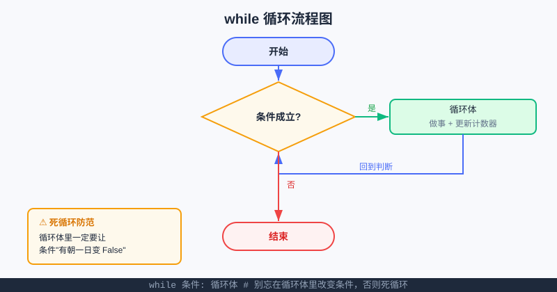

<div style="display:flex; gap:12px; margin-bottom:24px; flex-wrap:wrap; align-items:center;">
  <span style="background:#f0f4ff; color:#4A6CF7; padding:4px 12px; border-radius:20px; font-size:0.85em; font-weight:600; border:1px solid rgba(74,108,247,0.2);">📖 第7章</span>
  <span style="background:#f0fdf4; color:#16a34a; padding:4px 12px; border-radius:20px; font-size:0.85em; border:1px solid rgba(22,163,74,0.2);">⏱️ ~35 min read</span>
  <span style="background:#f0fdf4; color:#16a34a; padding:4px 12px; border-radius:20px; font-size:0.85em; border:1px solid rgba(22,163,74,0.2);">🎯 Beginner</span>
</div>

# Chapter 7: 循环 while —— 让程序"反复做同一件事"

> 📝 **Before You Continue:** 这一章要反复用到[第6章 条件判断](conditionals.md)（while 靠条件决定"要不要继续"），也离不开[变量](../foundations/variables.md)和[输入/输出](../foundations/input-output.md)。如果 `if` 还生疏，先回去翻一下第 6 章。

你有没有帮老师数过"从 1 数到 100"？或者算过"1+2+3+…+100 等于多少"？如果用第 6 章学的 `if`，你得写 100 行 `print`、100 行加法——累死还容易错。好在 Python 有个超能力：**循环（loop）**。这章先讲 `while`：只要条件成立，它就**一遍遍重复同一段代码**，直到条件不成立才停。累加、计数、猜数字游戏……全靠它。

> 💡 **Key Insight:** 循环是"自动化"的心脏。你不用亲手重复 100 次，只要写一次"该做什么" + "什么时候停"，电脑就乖乖替你跑完。

<div class="story-scene">
<strong>🎬 开场小剧场：固执循环怪守门</strong>
<p>游乐场的积分门坏了：只要游客积分还没到 100，门就不停提醒“继续完成任务”。小派一开始觉得它很烦，后来发现这正是自动化的力量。</p>
<p>固执循环怪 while 说：“我不管要重复几次，只看条件。条件还是真的，我就继续；条件变假了，我才放你走。”</p>
</div>

<div class="quest-card">
<strong>🎯 本章任务卡</strong>
<ul>
<li>用“只要……就一直……”理解 while。</li>
<li>写出初始化、条件、循环体、更新四步。</li>
<li>用 while 完成累加和计数。</li>
<li>写一个能反复猜的数字游戏。</li>
<li>发现并修复死循环。</li>
</ul>
</div>

<div class="boss-bug">
<strong>👾 本章 Boss Bug：死循环怪</strong>
<p>它最喜欢偷走“更新”那一步，让条件永远是真的。打败它的检查清单是：循环变量有没有变化？变化后会不会靠近停止条件？</p>
</div>

---

## 7.0 生活里的"while 思维"

<div class="try-it">
<strong>🧩 练一练 7.1</strong>
<p>题目：在生活里举一个"只要…就一直…"的例子。</p>
<details><summary>💡 看看答案</summary>
<p>答案：例如"只要水还没开，就继续等"；或"只要还剩作业，就继续写"。这就是 while 思维。</p>
</details>
</div>

想想"烧水"：*只要水没开，就继续烧*。这就是 `while` 的脑内模型——

```
当（水没开）:
    继续加热
# 水开了，跳出循环，去泡茶
```

> 🧠 **Mental Model:** `while` 像一条"跑步机"：你站上去，只要屏幕上的条件还是"真"，跑步机就一直转（循环体一直跑）；一旦条件变"假"，跑步机停，你走下来继续后面的事。

---

## 🔍 计算思维聚焦：自动化（Automation）

**自动化**是计算思维里最"爽"的一环：把一件"机械、重复、有规律"的事，交给电脑不停地做。人类擅长**定规则**，电脑擅长**不疲倦地执行**。`while` 就是自动化的最小工具——你给"做什么"和"何时停"，重复交给它。后面学的 `for`、乃至算法竞赛里的各种技巧，本质上都是"更聪明的自动化"。

---

## 🧮 算法小课堂（前置彩蛋）：循环不变量（Loop Invariant）

这是个听起来很高大上、其实很朴素的概念，先埋个伏笔，第 17 章起系统讲算法时你会认出它。

**循环不变量**：在 `while` 循环的**每一轮结束后**，总有一些条件"始终成立"。比如下面要写的累加程序，不变量可以是——*"变量 `total` 里，始终装着前 `i-1` 个数的和"*。

> 为什么重要？因为**只要不变量每轮都成立，循环正常结束时的结果就一定正确**。这是数学家和算法工程师**证明算法正确**的利器，也是你将来刷 [USACO](../algorithms/big-o.md) 题时，判断"我的循环到底对没对"的底层逻辑。

---

## 7.1 while 的基本语法

<div class="try-it">
<strong>🧩 练一练 7.2</strong>
<p>题目：用 while 打印 1 到 5。</p>
<details><summary>💡 看看答案</summary>
<p>答案：<code>i=1</code> 然后 <code>while i&lt;=5: print(i); i+=1</code>。循环变量 i 要在循环里更新，否则死循环。</p>
</details>
</div>

```python
i = 1                       # ① 初始化：准备一个"计数器"
while i <= 5:               # ② 条件：成立就进循环体
    print("第", i, "遍")     # ③ 循环体：要重复做的事
    i = i + 1               # ④ 更新：让计数器朝"停"的方向走一步
print("结束 🏁")             # 条件不成立后，才轮到这一行
```

**运行结果：**
```
第 1 遍
第 2 遍
第 3 遍
第 4 遍
第 5 遍
结束 🏁
```

**四步走，缺一不可：**
1. **初始化**：循环前先把计数器（这里是 `i`）设好。
2. **条件判断**：每次进循环前，看 `i <= 5` 成不成立。
3. **循环体**：成立就执行缩进里的代码。
4. **更新**：循环体里**必须让条件有朝一日变假**（这里 `i` 越加越大，终会 `> 5`）。

> ⚠️ **Warning:** 第 ④ 步忘了写（比如漏了 `i = i + 1`），`i` 永远停在 1，`i <= 5` 永远成立 → **死循环**，程序卡死出不来！这是 `while` 的头号陷阱。

---

## 7.2 案例一：累加 1 到 n

<div class="try-it">
<strong>🧩 练一练 7.3</strong>
<p>题目：用 while 计算 1 + 2 + … + 100。</p>
<details><summary>💡 看看答案</summary>
<p>答案：<code>total=0; i=1</code>；<code>while i&lt;=100: total+=i; i+=1</code>，结果 5050。</p>
</details>
</div>

经典题：求 1 + 2 + … + n。用 `while` 一边走一边加：

```python
n = 100
total = 0          # 累加器，从 0 开始
i = 1
while i <= n:
    total = total + i   # 把当前的 i 加进总和
    i = i + 1
print("1 到", n, "的和是：", total)
```

**输出：** `1 到 100 的和是： 5050`

> 💡 **Key Insight:** `total = total + i` 是累加的"标准姿势"——"新的总和 = 旧的总和 + 这一项"。也可以写成更短的 `total += i`（第 4 章运算符会讲，`+=` 就是"加完再赋给自己"）。

> 🧠 **回到循环不变量：** 每跑完一轮，`total` 恰好是 `1+2+…+(i-1)`。循环正常结束时 `i` 变成 `n+1`，于是 `total` 正好等于 `1+2+…+n`。**不变量成立 → 答案必对。** 这就是 7.0 埋的伏笔落地。

---

## 7.3 break 与 continue：循环里的"急刹"和"跳过"

<div class="try-it">
<strong>🧩 练一练 7.4</strong>
<p>题目：用 while 和 break 实现"输入 quit 就退出"。</p>
<details><summary>💡 看看答案</summary>
<p>答案：<code>while True:</code> 内 <code>s=input(); if s=='quit': break</code>。break 立刻跳出循环。</p>
</details>
</div>

有时候你不想等条件自然变假，想**中途强行退出**，或者**这一轮不想干了直接下一轮**：

- `break`：**立刻跳出**整个循环，后面的轮次全不要了。
- `continue`：**跳过本轮剩下代码**，直接开始下一轮判断。

```python
i = 0
while i < 10:
    i = i + 1
    if i == 3:
        continue        # 遇到 3，跳过下面的打印，直接下一轮
    if i == 8:
        break           # 遇到 8，整个循环结束
    print(i)
```

**输出：**
```
1
2
4
5
6
7
```
（没有 3，因为 `continue` 跳过了；到 8 之前 `break` 就让循环彻底停了，所以 8、9、10 都没出现。）

> 🤔 **Why 要它们？** 想象在 100 个文件里找一个是病毒——找到了就该立刻 `break` 停下，没必要翻完剩下的 99 个。`continue` 则像"这个不符合，看下一个"，跳过当前处理下一个。

> ⚠️ **Warning:** `break` / `continue` 用多了会让循环逻辑变绕。**能靠"条件"自然停的，就别硬 `break`**；它们是"例外按钮"，不是主食。

---

## 7.4 防范死循环：三条铁律

<div class="try-it">
<strong>🧩 练一练 7.5</strong>
<p>题目：防范死循环的三条铁律里，循环变量必须在循环体内完成什么动作？</p>
<details><summary>💡 看看答案</summary>
<p>答案：必须<b>更新</b>（让循环条件终会变为假），比如 <code>i += 1</code>，否则条件永远成立。</p>
</details>
</div>

死循环 = 条件永远真，程序永远不退出。三条保命铁律：

1. **循环体里一定更新计数器 / 状态**，让它朝"条件变假"走。
2. **条件要能真的变假**：别写 `while True:` 又忘在里头 `break`。
3. **不确定时，先给"安全阀"**：比如最多跑 1000 次就强制停。

```python
# 带安全阀的写法（猜数字游戏常用）
guess_count = 0
while True:                 # 条件永远真
    guess_count += 1
    # ... 做点什么 ...
    if guess_count >= 1000: # 安全阀
        print("次数太多，强制退出")
        break
```

> 🐛 **Common Bug:** 下面这段会死循环——因为 `i` 在循环体里被设成 1，**每轮又重置回 1**，永远 `< 5`。

```python
i = 1
while i <= 5:
    print(i)
    i = 1          # ❌ 写成了赋值 1，而不是 i = i + 1
```

---

## 7.5 计数与哨兵循环

**计数循环**：数"发生了几件事"。

```python
count = 0
while count < 3:
    print("这是第", count + 1, "次提醒：写作业！📚")
    count = count + 1
```

**哨兵循环（sentinel loop）**：用"一个特殊输入"当停止信号，比如输入 `q` 就结束。

```python
total = 0
s = input("输入一个数字（输入 q 结束）：")
while s != "q":
    total = total + int(s)
    s = input("输入一个数字（输入 q 结束）：")
print("你输入的所有数字之和是：", total)
```

**运行示例：**
```
输入一个数字（输入 q 结束）：10
输入一个数字（输入 q 结束）：25
输入一个数字（输入 q 结束）：q
你输入的所有数字之和是： 35
```

> 💡 **Pro Tip:** 哨兵循环有个小重复——`input(...)` 出现了两次（循环前一次、循环尾一次）。这叫"循环并半"（loop and a half），是为了让"先读数、再判断"成立。先照着写，熟练后可学 `while True: ... if s=='q': break` 的对称写法。

---

## 7.6 案例二：猜数字游戏（埋二分伏笔）

电脑随机想一个 1–100 的数，你猜，它提示"太大/太小"，直到猜中。

```python
import random
secret = random.randint(1, 100)     # 电脑悄悄想好的数
guess = 0
tries = 0

while guess != secret:
    guess = int(input("猜一个 1~100 的数："))
    tries = tries + 1
    if guess < secret:
        print("太小了 📉")
    elif guess > secret:
        print("太大了 📈")
print(f"猜中了！答案是 {secret}，你用了 {tries} 次 🎉")
```

> 🧮 **算法小课堂（前置彩蛋续）：** 上面是"瞎猜"。其实有个**聪明策略**：每次都猜"当前可能范围的正中间"。比如范围 1–100，先猜 50；太大就把范围砍成 1–49，再猜 25……**每一轮都把范围砍掉一半**。这种"每次折半、范围减半"的玩法，就是算法篇 [搜索算法](../algorithms/searching.md) 里**二分查找（Binary Search）** 的雏形！等你学到第 17 章后的算法章节，会正式用循环不变量证明它为什么最多只用约 log₂(n) 次就找到。

---



上图把 7.1 的 `while` 画成了流程图：进入后先问"条件成立？"，成立就做循环体、再回到判断；不成立就走向"结束"。右下角那个黄色框，提醒你**循环体里一定要让条件有朝一日变假**。

---

## 🏅 本章通关徽章：循环驯兽师

<div class="badge-card">
<strong>如果你能做到下面 4 件事，就获得“循环驯兽师”徽章：</strong>
<ul>
<li>能用“只要……就一直……”解释 while。</li>
<li>能写出初始化、条件、循环体、更新四步。</li>
<li>能用 while 完成累加和计数。</li>
<li>能发现一个死循环为什么停不下来。</li>
</ul>
</div>

---

## ⚠️ Common Mistakes in Chapter 7

| # | 误区 | 示例 | 为什么错 | 修正 |
|---|------|------|---------|------|
| 1 | 漏写"更新"致死循环 | `while i<=5: print(i)`（没 `i+=1`） | `i` 不变，条件永远真 | 循环体里加 `i = i + 1` |
| 2 | 把 `i = i+1` 写成 `i = 1` | `i = 1` 在循环体内 | `i` 每轮重置，永远不变 | 改成 `i = i + 1` |
| 3 | 计数器从 1 数却用 `<=` 导致多一次 | `i=1; while i<=5` 想数 5 次但边界错 | 范围算错 | 想清"从几到几、含不含端点" |
| 4 | `while True:` 忘 `break` | 写了 `while True:` 却没有出口 | 永远真，死循环 | 在合适的分支里 `break` |
| 5 | 哨兵循环只 `input` 一次 | 循环尾漏了再 `input` | 第二次起用的还是旧值 | 循环前 + 循环尾各 `input` 一次 |
| 6 | `break`/`continue` 用错层 | 在嵌套里 `break` 只跳出内层 | 以为跳出了外层 | 理清要跳的是哪一层 |

---

## Chapter Summary

### 📌 Key Takeaways

| 概念 | 要点 | 为什么重要 |
|------|------|------------|
| `while 条件:` | 条件真就反复执行循环体 | 自动化重复任务的基础 |
| 四步法 | 初始化 / 判断 / 循环体 / 更新 | 缺一不可，更新防死循环 |
| 累加器 | `total += i` | 求和、统计的核心套路 |
| `break` / `continue` | 强退 / 跳过本轮 | 处理"例外"和"跳过" |
| 哨兵循环 | 特殊输入当停止信号 | 处理"不知道要循环几次" |
| 循环不变量 | 每轮后某些条件恒成立 | 证明算法正确的利器（伏笔） |

### ❓ FAQ

**Q1: `while` 和后面要学的 `for` 有什么区别？**
> A: `while` 看"条件"决定停不停，适合"次数不确定"的场景（如猜中才停、输入 q 才停）；`for` 通常"遍历一串已知的东西"（如下一章的 `range`）。下一章你会看清分工。

**Q2: 程序卡在死循环怎么办？**
> A: 在终端按 `Ctrl + C` 强行中断。然后用本章铁律排查：循环体里有没有真的更新状态？条件能不能变假？

**Q3: `i = i + 1` 为什么不会"自己等于自己"矛盾？**
> A: 这是"先算右边、再赋给左边"：`i + 1` 用 `i` 的旧值算出新数，再存回 `i`。所以 `i` 变成"旧值+1"，完全合理。

**Q4: 累加一定要从 0 开始吗？**
> A: 求和一般从 0 开始（加什么都不影响起点）；如果是"累乘"，要从 1 开始（乘 1 不影响）。起点要匹配"单位元"。

### 🔗 Connections to Later Chapters

- **[第8章 循环 for 与 range](for-loops.md)** 讲"已知次数"的循环，和 `while` 是互补兄弟。
- **[第9章 调试与调试思维](debugging.md)** 会教你：死循环、循环少跑一次，该怎么用 `print` 定位。
- **算法篇 · 搜索** 的[二分查找](../algorithms/searching.md) 就是 7.6 猜数字"折半策略"的严密封装。
- **[项目工坊](#🛠️-项目工坊算法游乐场--第7章积分系统)** 用 `while` 把"积分累计到达标"自动化。

---


## 🎮 加练任务包

> 下面这些题目不一定比章末题更难，但更适合“多刷几遍、把手感练出来”。建议先独立做，再展开提示。

### 加练 7.A · 倒计时发射 🟢

用 `while` 输出 5、4、3、2、1，最后输出“发射！”。

<details>
<summary>💡 提示 / 答案要点</summary>

初始化 `i=5`；条件 `while i>=1`；循环里打印 i 并 `i -= 1`；循环后打印“发射！”。

</details>

---

### 加练 7.B · 积分攒够才停 🟢

从 0 分开始，每轮加 10 分，直到积分 ≥ 50 停。用 while 写。

<details>
<summary>💡 提示 / 答案要点</summary>

`score=0`；`while score < 50: score += 10`。循环条件要朝着 False 靠近。

</details>

---

### 加练 7.C · 密码重试 🟡

用户最多输入 3 次密码。密码等于 `python` 就成功，否则最后输出失败。设计变量和 while 条件。

<details>
<summary>💡 提示 / 答案要点</summary>

需要 `tries` 计数。条件可用 `while tries < 3`，每次输入后判断，错误就 `tries += 1`。

</details>

---


---

## Practice Problems

---

**Problem 7.1 — 倒数计时** 🟢 Easy

用 `while` 从 5 倒数到 1，最后打印 `"发射！🚀"`。

**Sample Output:**
```
5
4
3
2
1
发射！🚀
```

<details>
<summary>💡 Solution (click to reveal)</summary>

**Approach:** 计数器从 5 开始，每轮打印并减 1，直到 `< 1` 停止。

```python
i = 5
while i >= 1:
    print(i)
    i = i - 1
print("发射！🚀")
```

**Key points:**
- 倒数用 `i = i - 1`（也可写 `i -= 1`）。
- 循环结束后再打印"发射"。

</details>

---

**Problem 7.2 — 求 1 到 n 的乘积（阶乘）** 🟡 Medium

输入 `n`，用 `while` 计算 `1 × 2 × … × n`（阶乘，记作 n!）。

**Sample Input:** `5`
**Sample Output:** `120`

<details>
<summary>💡 Solution (click to reveal)</summary>

**Approach:** 把累加改成"累乘"，累加器起点要设为 1（乘 0 会变 0）。

```python
n = int(input("输入 n："))
result = 1          # 乘法单位元是 1
i = 1
while i <= n:
    result = result * i
    i = i + 1
print(n, "! =", result)
```

**Key points:**
- 累乘起点必须是 1，不是 0。
- 循环不变量：每轮后 `result` = `1×2×…×i`。

</details>

---

**Problem 7.3 — 找出第一个大于 1000 的 7 的倍数** 🔴 Hard

用 `while` 从 7 开始不断加 7，找到"第一个大于 1000 的 7 的倍数"并打印。

**Sample Output:** `1001`

<details>
<summary>💡 Solution (click to reveal)</summary>

**Approach:** 用 `while` 搭配"继续条件"，直到超过 1000 才停；循环外保留最后的值。

```python
x = 7
while x <= 1000:
    x = x + 7
print("第一个大于 1000 的 7 的倍数是：", x)
```

**Key points:**
- 循环"当还 ≤ 1000 时就继续加 7"，退出时 `x` 必然刚超过 1000 且仍是 7 的倍数（这里 1001 = 7×143）。
- 想清"停止条件"比"打印条件"更顺。

</details>

---

**Problem 7.4 — ⚔️ 挑战擂台：聪明猜数字（二分策略）** 🏆 Challenge

改写 7.6 的猜数字游戏，让**电脑**来猜你心里想的 1–100 的数：每轮电脑都猜"当前范围的中点"，你只回答"太大/太小/对了"。用 `while` 实现，并统计电脑用了几次猜中。体会"每次把范围砍半"为什么很快。

**Sample Output（示意）:**
```
我心里想好了一个 1~100 的数，电脑来猜。
电脑猜 50，太大还是太小？（输入 > / < / =）: >
电脑猜 25，太大还是太小？（输入 > / < / =）: <
电脑猜 37，太大还是太小？（输入 > / < / =）: =
电脑用 3 次就猜中了！🧠
```

<details>
<summary>💡 Solution (click to reveal)</summary>

**Approach:** 维护 `low` 和 `high` 两个边界，每轮猜中点 `mid = (low+high)//2`；根据你回答调整边界，直到相等。这正是二分查找的人肉版。

```python
low, high = 1, 100
tries = 0
print("我心里想好了一个 1~100 的数，电脑来猜。")
while True:
    mid = (low + high) // 2
    tries += 1
    ans = input(f"电脑猜 {mid}，太大还是太小？（输入 > / < / =）: ")
    if ans == "=":
        print(f"电脑用 {tries} 次就猜中了！🧠")
        break
    elif ans == ">":      # 猜大了，答案在左边
        high = mid - 1
    else:                 # 猜小了，答案在右边
        low = mid + 1
```

**Key points:**
- `mid = (low+high)//2` 是二分的核心一步。
- 每轮范围减半，最多约 7 次（log₂100≈6.6）必中——这就是算法的威力。

</details>

---

## 🛠️ 项目工坊：算法游乐场 · 第7章「积分系统」

前面第 6 章我们给了游乐场一个**抽奖转盘**。这章我们用 `while` 给游客做一个**积分系统**：游客每玩一轮就赚积分，程序**一边累计、一边判断有没有达标**，达标就发奖。

一段**自包含**代码（直接跑，纯终端、零新依赖）：

```python
points = 0
print("🎡 游乐场积分系统：每轮告诉你赚了多少分，累计到 100 分解锁大奖！")
print("（输入 0 可随时退出）\n")

while points < 100:
    gain = int(input("这一轮你赚了几分？"))
    if gain == 0:
        print("👋 已退出，当前积分：", points)
        break
    points = points + gain
    print(f"➕ 加了 {gain} 分，当前积分：{points}")

if points >= 100:
    print(f"🏆 恭喜！积分达标（{points}），解锁「超级玩家」徽章！")
```

**现在游乐场升级了「积分系统」**：用 `while points < 100` 把"累计到达标"自动化，还顺手用了第 6 章的 `if` 判断退出、用 `break` 当安全阀。下章我们还会给它加"灯光矩阵"做氛围。

> 💡 **Pro Tip:** 想让大奖更难拿？把 `while points < 100` 改成 `while points < 500` 即可——又是一个"改数字不改结构"的参数化例子，和第 6 章转盘一脉相承。

---

> 💡 **记住这一句：** `while` 把"重复"交给电脑——**你定规则和终点，它替你一遍遍跑到终点**。

下一站 [第8章 循环 for 与 range](for-loops.md)：当"要跑几次"是清清楚楚一串数时，`for` 比 `while` 写起来更舒服。
