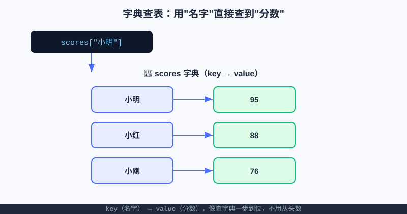

<div style="display:flex; gap:12px; margin-bottom:24px; flex-wrap:wrap; align-items:center;">
  <span style="background:#f0f4ff; color:#4A6CF7; padding:4px 12px; border-radius:20px; font-size:0.85em; font-weight:600; border:1px solid rgba(74,108,247,0.2);">📖 第12章</span>
  <span style="background:#f0fdf4; color:#16a34a; padding:4px 12px; border-radius:20px; font-size:0.85em; font-weight:600; border:1px solid rgba(22,163,74,0.2);">⏱️ ~35 min read</span>
  <span style="background:#fef9ec; color:#d97706; padding:4px 12px; border-radius:20px; font-size:0.85em; font-weight:600; border:1px solid rgba(217,119,6,0.2);">🎯 Intermediate</span>
</div>

# Chapter 12: 字典 dict —— 像查字典一样，用"名字"直接找到"值"

> 📝 **Before You Continue:** 建议先读 [第10章 列表](lists.md)（字典常和列表搭配）和 [第11章 元组与集合](tuples-sets.md)（字典的 **key 必须不可变**，所以元组能当 key、列表不能）。[for 循环](../control-flow/for-loops.md) 这章也要用。

你有没有过这种经历：老师抱来一摞试卷，想查"小明考了多少分"，只能从头一张张翻，翻到小明那张才算完。要是能像查字典——**直接翻到"小"字头，一眼看到"小明 → 95"**——该多快？

**字典（dict）** 就是干这个的。它存的是一对一对的 **`key: value`（键: 值）**：用"名字"（key）直接查到"内容"（value），不用从第一个数到最后一个。通讯录、成绩查表、游戏排行榜、甚至网页上的用户数据，背后全是字典。

<div class="story-scene">
<strong>🎬 开场小剧场：档案室老板开门</strong>
<p>游乐场游客越来越多，排队队长 list 忙坏了。老板要查“小明的积分”，小派只能从队头开始翻，一边翻一边念：“第 0 个不是，第 1 个不是……”</p>
<p>这时，档案室老板 dict 推开门：“别数了。给我一个名字，我直接把档案抽出来。”从今天开始，游乐场多了一间按 <code>key</code> 查 <code>value</code> 的档案室。</p>
</div>

<div class="quest-card">
<strong>🎯 本章任务卡</strong>
<ul>
<li>用 <code>{key: value}</code> 建一间档案室。</li>
<li>用 <code>d[key]</code> 和 <code>get()</code> 查资料。</li>
<li>用赋值完成新增和修改。</li>
<li>用 <code>pop</code> / <code>del</code> 删除资料。</li>
<li>用 <code>keys()</code>、<code>values()</code>、<code>items()</code> 巡查整间档案室。</li>
</ul>
</div>

<div class="boss-bug">
<strong>👾 本章 Boss Bug：KeyError 幽灵</strong>
<p>它藏在不存在的钥匙后面。你写 <code>scores["小美"]</code>，但档案室没有“小美”，程序就会炸。打败它的武器是 <code>get("小美", 默认值)</code>。</p>
</div>

---

## 12.1 创建字典：花括号里写 `键: 值`

<div class="try-it">
<strong>🧩 练一练 12.1</strong>
<p>题目：创建字典存小明的成绩 {"语文":88, "数学":95}，查“数学”的分数。</p>
<details><summary>💡 看看答案</summary>
<p>答案：<code>d = {"语文":88, "数学":95}</code>，<code>print(d["数学"])</code> 输出 <code>95</code>。</p>
</details>
</div>

字典也用花括号 `{ }`，但里面写的是 `键: 值` 对，多对之间用逗号隔开。

```python
scores = {
    "小明": 95,
    "小红": 88,
    "小刚": 76,
    "小美": 100,
}
print(scores["小明"])     # 95  （用名字直接查分，不用数第几个）
```

> 🧠 **Mental Model: 字典像真实的汉语字典。** 左边是"词条/索引"（key），右边是"解释/内容"（value）。你查 `scores["小明"]`，计算机直接"翻"到小明那页，把 95 递给你——**一步到位**。



上图左边蓝框是 key（名字），右边绿框是 value（分数），中间箭头就是"查表"这件事。和列表"数到第几个"相比，字典是"按名字取"，更符合人的直觉。

> 📝 **Note:** 字典的 key 通常是字符串，但也可以是数字、甚至元组（因为不可变）；**列表不能当 key**（因为可变，第11章讲过）。value 则什么都能放，包括列表、字典自己。

---

## 12.2 查：用 `字典[key]` 或 `get()`

<div class="try-it">
<strong>🧩 练一练 12.2</strong>
<p>题目：用 get() 查一个可能不存在的 key，并给默认值 0。</p>
<details><summary>💡 看看答案</summary>
<p>答案：<code>d.get("英语", 0)</code>。若不存在返回 0，而不会像 <code>d["英语"]</code> 那样报错。</p>
</details>
</div>

最常用的是 `字典[key]`：

```python
scores = {"小明": 95, "小红": 88}
print(scores["小红"])     # 88
```

但有个坑：查一个**不存在的 key** 会直接崩溃（`KeyError`）。更安全的做法是 `get(key, 默认值)`——查不到就返回你给的默认值，不报错：

```python
print(scores.get("小美"))           # None（小美不在，返回 None）
print(scores.get("小美", "查无此人")) # 查无此人（给了默认值）
```

> ⚠️ **Warning:** `scores["小美"]` 在 key 不存在时会抛 `KeyError` 让程序崩；`scores.get("小美", 0)` 永远温和。写用户输入查表、或不确定 key 在不在时，**优先用 `get`**。

---

## 12.3 增 / 改：赋值即写入

<div class="try-it">
<strong>🧩 练一练 12.3</strong>
<p>题目：往字典 d 里加一对新的键值 age: 14。</p>
<details><summary>💡 看看答案</summary>
<p>答案：<code>d["age"] = 14</code>。若 key 已存在则是“改”，不存在就是“增”。</p>
</details>
</div>

字典的"增"和"改"是**同一招**：`字典[key] = 值`。key 不存在就新增，存在就覆盖（改）。

```python
scores = {"小明": 95}
scores["小红"] = 88        # key "小红" 不存在 → 新增
scores["小明"] = 99        # key "小明" 已存在 → 改成 99
print(scores)              # {'小明': 99, '小红': 88}
```

> 💡 **Key Insight:** 字典里"同一个 key 只保留一份"。所以你随时可以用 `scores[name] = new_score` 来"更新某人成绩"，不用担心出现两个"小明"。这正是排行榜能实时刷新的原理。

---

## 12.4 删：pop / del

<div class="try-it">
<strong>🧩 练一练 12.4</strong>
<p>题目：用 for 遍历字典的 items()，打印“科目: 分数”。</p>
<details><summary>💡 看看答案</summary>
<p>答案：<code>for k, v in d.items(): print(f"{k}: {v}")</code>。<code>items()</code> 一次拿出键和值。</p>
</details>
</div>

```python
scores = {"小明": 95, "小红": 88, "小刚": 76}
value = scores.pop("小刚")   # 删掉"小刚"，并把他的分数 76 交出来
print(value)                 # 76
print(scores)                # {'小明': 95, '小红': 88}

del scores["小红"]           # del 直接删，不返回值
print(scores)                # {'小明': 95}
```

> 🐛 **Common Bug:** `pop` 一个不存在的 key 会报 `KeyError`。要安全可写 `scores.pop("小美", None)`——查不到就返回 `None` 而不报错，类似 `get` 的脾气。

---

## 12.5 遍历：keys / values / items

<div class="try-it">
<strong>🧩 练一练 12.5</strong>
<p>题目：判断 "数学" 是不是字典 d 里的 key。</p>
<details><summary>💡 看看答案</summary>
<p>答案：<code>"数学" in d</code> 返回 <code>True</code>。用 <code>in</code> 判断键在不在，最快。</p>
</details>
</div>

字典有三种遍历姿势，对应你想看"键""值"还是"键值对"：

```python
scores = {"小明": 95, "小红": 88}

# 只看 key（默认遍历就是 key）
for name in scores:
    print("名字：", name)

# 只看 value
for s in scores.values():
    print("分数：", s)

# key 和 value 一起看（最常用）
for name, s in scores.items():
    print(f"{name} 考了 {s} 分")
```

**输出（items 版）：**
```
小明 考了 95 分
小红 考了 88 分
```

> 🧠 **Mental Model: `items()` 像把字典"拆成一行行 (名字, 分数)"。** `for name, s in scores.items()` 让 `name` 和 `s` 同时接到一对键值，遍历起来最顺手。

---

## 12.6 in：判断 key 在不在

和列表一样，`in` 能判断"某个 key 在不在字典里"（注意：它查的是 **key**，不是 value）。

```python
scores = {"小明": 95, "小红": 88}
print("小明" in scores)     # True
print("小美" in scores)     # False

if "小刚" not in scores:
    print("小刚还没录成绩")
```

> 🤔 **Why `in` 查的是 key？** 因为字典的"索引"就是 key。判断"有没有这个人"= 判断 key 在不在；要判断"有没有这个分数"，得遍历 `values()`。

---

## 12.7 综合案例：通讯录 + 成绩查表

**案例 A — 简易通讯录**：用名字查电话。

```python
phone_book = {
    "小明": "138-0000",
    "小红": "139-1111",
    "小刚": "137-2222",
}

who = "小红"
print(f"{who} 的电话是 {phone_book.get(who, '未登记')}")

# 新增一个联系人
phone_book["小美"] = "136-3333"
print("通讯录现在有", len(phone_book), "人")
```

**案例 B — 成绩查表（输入名字查分）**：把查表和 `input` 结合，做个迷你查询机。

```python
scores = {"小明": 95, "小红": 88, "小刚": 76, "小美": 100}

name = input("查谁的成绩？")
score = scores.get(name, None)
if score is not None:
    print(f"{name} 的成绩是 {score}")
else:
    print(f"没找到 {name} 的成绩")
```

> 📝 **Note:** 用 `input()` 时，用户输入的空格、大小写都可能导致查不到。实际项目里常先 `.strip()` 去空格、统一大小写再查。这里先掌握核心机制。

### 🔍 计算思维聚焦：映射 / 查表（抽象建模——用"名字"直接查到"值"）

**映射（Mapping）** 是计算思维里一种核心的抽象：建立"A → B"的对应关系，给你 A 立刻得到 B，不用从头找。字典就是映射在 Python 里的化身。

为什么映射重要？因为**现实世界充满了"对应"**：
- 名字 → 分数、学号 → 学生、城市 → 邮编、URL → 网页、用户名 → 密码哈希……
- 一旦把这些对应关系建成"字典"，原来要"逐条比对"的事，变成"一步查表"。

这种"用 key 直接定位 value"的思维，正是数据库索引、缓存、哈希表、甚至你每天用的搜索引擎的底层逻辑。**学会把问题抽象成"映射"，你就握住了高效程序的钥匙。**

### 🧮 算法小课堂（前置彩蛋）

> 🥚 字典查 `key` 平均只要 **O(1)**（几乎瞬间），无论里面存了 10 个还是 100 万个。秘密在"哈希表"——它把 key 算成一个"柜子编号"直接定位。这和上一章集合的快是同一个原理，[算法篇：基础数据结构](../algorithms/basic-structures.md) 会拆开讲。先记住：**要"按名字快速查"，字典是首选**。

---

## ⚔️ 挑战擂台

**擂台题：不借助 `max()`，找出排行榜最高分是谁。**
`leaderboard = {"小明": 95, "小红": 88, "小刚": 76, "小美": 100}`。遍历 `items()`，自己"边走边记"当前最高分和对应名字。

```python
leaderboard = {"小明": 95, "小红": 88, "小刚": 76, "小美": 100}
best_name, best_score = None, -1
for name, s in leaderboard.items():
    if s > best_score:
        best_name, best_score = name, s
print(f"冠军：{best_name}，{best_score} 分")   # 冠军：小美，100 分
```

"遍历 + 记录最优"的套路，正是贪心/模拟算法的通用骨架，[算法篇：贪心与模拟](../algorithms/greedy-simulation.md) 会反复用它。

---

## 🛠️ 项目工坊：算法游乐场 · 排行榜

游乐场现在要搞**积分排行榜**了：每位玩家有一个名字和累计分数，玩项目得分就加，随时能查"某人多少分""谁是冠军"。字典的 `名字 → 分数` 映射，天生就是干这个的。

下面**自包含**代码（纯终端）实现：加分、查分、删人、查冠军。

```python
# 算法游乐场 · 积分排行榜（字典版）
leaderboard = {}                    # 空字典：名字 -> 分数

def add_score(name, points):
    leaderboard[name] = leaderboard.get(name, 0) + points  # 没有就从 0 起加
    print(f"💰 {name} +{points} 分，当前 {leaderboard[name]} 分")

def query(name):
    s = leaderboard.get(name, None)
    if s is None:
        print(f"❓ {name} 还没上榜")
    else:
        print(f"🏅 {name}：{s} 分")

def champion():
    if not leaderboard:
        print("榜单空空如也")
        return
    best_name = max(leaderboard, key=leaderboard.get)   # 按 value 找最大 key
    print(f"👑 当前冠军：{best_name}，{leaderboard[best_name]} 分")

# 试一试
add_score("小明", 50)
add_score("小红", 80)
add_score("小明", 30)        # 小明累计 80
query("小刚")                # 还没上榜
champion()
```

**运行输出：**
```
💰 小明 +50 分，当前 50 分
💰 小红 +80 分，当前 80 分
💰 小明 +30 分，当前 80 分
❓ 小刚 还没上榜
👑 当前冠军：小红，80 分
```

> 💡 **记住这一句（项目）：** 现在游乐场多了**"积分排行榜"**——用字典 `名字 → 分数` 随时加分、查分，`get(name,0)` 让新玩家从 0 起算。第 13 章我们把每位游客扩成"一份完整档案"，名单、已玩项目、分数全收进一个 dict。

---

## 🏅 本章通关徽章：档案室管理员

<div class="badge-card">
<strong>如果你能做到下面 4 件事，就获得“档案室管理员”徽章：</strong>
<ul>
<li>能说清 <code>key</code> 和 <code>value</code> 的关系。</li>
<li>能用 <code>d[key]</code> 精准查值，也知道什么时候用 <code>get</code> 更安全。</li>
<li>能完成字典的增、改、删。</li>
<li>能用 <code>items()</code> 同时遍历键和值。</li>
</ul>
</div>

---

## ⚠️ Common Mistakes in Chapter 12

| # | 误区 | 示例 | 为什么错 | 修正 |
|---|------|------|---------|------|
| 1 | 用 `[]` 当字典 | `d = ["a": 1]` | 字典用 `{}`，`[]` 是列表 | 写 `d = {"a": 1}` |
| 2 | 查不存在的 key | `scores["小美"]` 但无此人 | 抛 `KeyError` 崩溃 | 用 `scores.get("小美", 0)` |
| 3 | 以为 `in` 查 value | `"95" in scores` 想查分数 | `in` 只查 **key** | 查值用遍历 `values()` 或列表 |
| 4 | 用列表当 key | `d[["a","b"]] = 1` | key 必须不可变 | 改用元组 `d[("a","b")] = 1` |
| 5 | 忘记 `items()` 拆包 | `for x in d.items(): print(x[0], x[1])` | 能跑但啰嗦 | 写 `for k, v in d.items():` |
| 6 | 遍历时改字典大小 | `for k in d: d.pop(k)` | 遍历中删元素会报错 | 先 `list(d)` 复制 key 再删 |

---

## Chapter Summary

### 📌 Key Takeaways

| 概念 | 要点 | 为什么重要 |
|------|------|------------|
| 创建 | `{键: 值, ...}` | 存"名字→内容"的对应关系 |
| 查 | `d[key]` 快但易崩 / `d.get(key, 默认)` 安全 | 查表核心是"按 key 取 value" |
| 增/改 | `d[key] = 值`（同 key 只留一份） | 实时更新某人数据，如加分 |
| 删 | `pop(key)` 返回值 / `del d[key]` | 移除某条记录 |
| 遍历 | `keys()` / `values()` / `items()` | 按需要看键、值或键值对 |
| `in` | 查的是 **key 在不在** | 判重、防重复写入 |
| key 不可变 | 字符串/数字/元组可，列表不可 | 决定什么能当 key |
| 映射思维 | A→B 一步定位 | 数据库、缓存、查表的底层 |

### ❓ FAQ

**Q1: 字典和列表到底该用哪个？**
> A: 问自己"怎么找数据"。如果"按第几个"找 → 列表；如果"按名字/编号直接查" → 字典。成绩查表按名字查，用字典；一排按座位排的成绩，用列表。两者常配合：列表存顺序，字典存详情。

**Q2: `get` 和直接 `[]` 性能有差吗？**
> A: 几乎没差，都很快。区别在"查不到时"：`[]` 崩溃，`get` 返回默认值。不确定 key 在不在就无条件用 `get`。

**Q3: 字典里的顺序会乱吗？**
> A: Python 3.7+ 的字典**会保持插入顺序**（插入时先写的 key 遍历时先出）。不过别依赖顺序做逻辑判断——字典的强项是"查"，不是"排"。

**Q4: 一个 key 能对应多个值吗？**
> A: 一个 key 只能对应**一个** value，但你可以让这个 value 本身是个**列表**，比如 `{"小明": [95, 88, 76]}` 存小明多次成绩。这正好引出下一章的"嵌套数据"。

### 🔗 Connections to Later Chapters

- **[第13章 嵌套数据](nested-data.md)** 把"value 是列表/字典"玩到极致，做出"每个游客一份完整档案"。
- **[函数篇：作用域与递归](../functions/scope-recursion.md)** 和 **[模块](../functions/modules.md)** 会让你把本章的排行榜封装成可复用的函数/模块。
- **[算法篇：基础数据结构](../algorithms/basic-structures.md)** 讲哈希表（字典底层），解释为什么查 key 这么快；**[贪心与模拟](../algorithms/greedy-simulation.md)** 会大量用字典记状态。

---


## 🎮 加练任务包

> 下面这些题目不一定比章末题更难，但更适合“多刷几遍、把手感练出来”。建议先独立做，再展开提示。

### 加练 12.A · 电话簿 🟢

创建字典保存 `小明 -> 123`、`小红 -> 456`，查小红电话。

<details>
<summary>💡 提示 / 答案要点</summary>

`phone = {"小明": "123", "小红": "456"}`，查 `phone["小红"]`。

</details>

---

### 加练 12.B · 安全查分 🟢

查一个可能不存在的学生成绩，如果没有就返回 0。

<details>
<summary>💡 提示 / 答案要点</summary>

用 `scores.get(name, 0)`，比 `scores[name]` 更安全，不存在不会抛 `KeyError`。

</details>

---

### 加练 12.C · 词频统计 🟡

统计字符串 `banana` 中每个字母出现次数。

<details>
<summary>💡 提示 / 答案要点</summary>

遍历字符，用字典：`count[ch] = count.get(ch, 0) + 1`。结果 b:1, a:3, n:2。

</details>

---


---

## Practice Problems

---

**Problem 12.1 — 通讯录：增、查、防崩** 🟢 Easy

创建字典 `contacts = {"小明":"138", "小红":"139"}`。请：① 查"小红"的电话；② 新增"小刚":"137"；③ 用 `get` 安全地查"小美"（给默认值"未登记"）。

**Sample Output:**
```
小红 的电话：139
小美 的电话：未登记
```

<details>
<summary>💡 Solution (click to reveal)</summary>

**Approach:** `[]` 直接查已知 key；`=` 新增；`get(key, 默认)` 安全查未知 key。

```python
contacts = {"小明": "138", "小红": "139"}
print("小红 的电话：", contacts["小红"])
contacts["小刚"] = "137"
print("小美 的电话：", contacts.get("小美", "未登记"))
```

**Key points:**
- 已知存在的 key 用 `contacts["小红"]` 直接取。
- 未知 key 用 `get` 避免 `KeyError`。

</details>

---

**Problem 12.2 — 成绩查表机** 🟡 Medium

字典 `scores = {"小明":95, "小红":88, "小刚":76}`。请遍历 `items()` 打印每个人的成绩，并算出**平均分**（用 `sum(values)/len`）。

**Sample Output:**
```
小明 考了 95
小红 考了 88
小刚 考了 76
平均分：86.33
```

<details>
<summary>💡 Solution (click to reveal)</summary>

**Approach:** `for name, s in scores.items()` 遍历；`sum(scores.values())` 求总分。

```python
scores = {"小明": 95, "小红": 88, "小刚": 76}
for name, s in scores.items():
    print(f"{name} 考了 {s}")
avg = sum(scores.values()) / len(scores)
print(f"平均分：{avg:.2f}")
```

**Key points:**
- `scores.values()` 直接拿到所有分数，配合 `sum` 求和。
- `len(scores)` 是人数（key 的个数）。

</details>

---

**Problem 12.3 — 投票计数** 🟡 Medium

有一组投票 `votes = ["A","B","A","C","B","A","C","A"]`，请用字典统计每个选项各得几票，并打印结果（提示：`count = {}`，遍历时 `count[opt] = count.get(opt, 0) + 1`）。

**Sample Output:** `{'A': 4, 'B': 2, 'C': 2}`

<details>
<summary>💡 Solution (click to reveal)</summary>

**Approach:** 遍历每个选项，用 `get(opt, 0) + 1` 累加票数，自动处理"第一次出现"。

```python
votes = ["A", "B", "A", "C", "B", "A", "C", "A"]
count = {}
for opt in votes:
    count[opt] = count.get(opt, 0) + 1
print(count)
```

**Key points:**
- `count.get(opt, 0)` 让"还没出现过的选项"从 0 起算，避免 KeyError。
- 这种模式（字典当计数器）极常用：词频、票数、出现次数统计全靠它。

</details>

---

**Problem 12.4 — 🏆 Challenge：两科总分排行榜** 🏆 Challenge

有语文 `chinese = {"小明":95, "小红":88, "小刚":76}` 和数学 `math = {"小明":90, "小红":100, "小刚":82}` 两份成绩单。请合并成"每人两科总分"的字典 `total`，再找出**总分冠军**（不允许直接对 `total` 用 `max(total.values())` 后还得反查名字——请用遍历记录最优，呼应本章擂台题）。

**Sample Output:**
```
总分榜： {'小明': 185, '小红': 188, '小刚': 158}
👑 冠军：小红，188 分
```

<details>
<summary>💡 Solution (click to reveal)</summary>

**Approach:** 先遍历一人，把两科加起来写进 `total`；再遍历 `total.items()`，"边走边记"最高分与名字。

```python
chinese = {"小明": 95, "小红": 88, "小刚": 76}
math    = {"小明": 90, "小红": 100, "小刚": 82}

total = {}
for name in chinese:                       # 假设两人名单一致
    total[name] = chinese[name] + math[name]
print("总分榜：", total)

best_name, best_score = None, -1
for name, s in total.items():
    if s > best_score:
        best_name, best_score = name, s
print(f"👑 冠军：{best_name}，{best_score} 分")
```

**Key points:**
- 合并两份字典用"按名字相加"，`total[name] = chinese[name] + math[name]`。
- 查冠军用遍历记录最优（不用 `max` 反向定位），逻辑清晰也更通用——这种写法在算法题里比 `max` 更灵活（比如要并列第一时也方便扩展）。

</details>

---

> 💡 **记住这一句：** 字典就是"名字 → 值"的映射表——**给它 key，一步拿到 value**，查表、通讯录、排行榜的万能内核。
