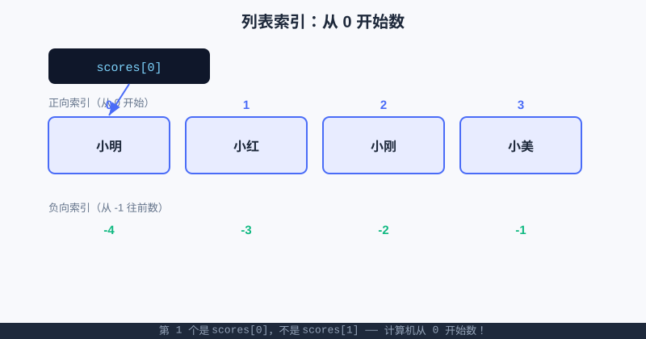

<div style="display:flex; gap:12px; margin-bottom:24px; flex-wrap:wrap; align-items:center;">
  <span style="background:#f0f4ff; color:#4A6CF7; padding:4px 12px; border-radius:20px; font-size:0.85em; font-weight:600; border:1px solid rgba(74,108,247,0.2);">📖 第10章</span>
  <span style="background:#f0fdf4; color:#16a34a; padding:4px 12px; border-radius:20px; font-size:0.85em; font-weight:600; border:1px solid rgba(22,163,74,0.2);">⏱️ ~35 min read</span>
  <span style="background:#fef9ec; color:#d97706; padding:4px 12px; border-radius:20px; font-size:0.85em; font-weight:600; border:1px solid rgba(217,119,6,0.2);">🎯 Intermediate</span>
</div>

# Chapter 10: 列表 list —— 把一堆东西排好队

> 📝 **Before You Continue:** 建议先读完 [变量与数据类型](../foundations/variables.md)（知道怎么存一个数/一句话），以及 [for 循环](../control-flow/for-loops.md)（待会儿我们要"挨个看"列表里的每一项）。如果你还没装环境，[第〇章：安装开发环境](../getting-started/install.md) 能帮你跑起来。

想象你是班长，要收全班 45 个人的作业。你有两个选择：

- **方案 A**：在讲台上摆 45 个散落的纸团，喊谁的名字就去茫茫纸堆里翻；
- **方案 B**：弄一个作业筐，按座位顺序把作业一本本排进去，第 1 本、第 2 本……想找谁，数到第几本就行。

**列表（list）** 就是方案 B——它是 Python 里用来"把一堆东西按顺序排列、统一管理"的容器。从成绩单、班级点名，到你将来写的算法题（比如"给学生分数排序""找最高分"），几乎处处都要用到它。这一章，我们就把列表玩明白。

<div class="story-scene">
<strong>🎬 开场小剧场：排队队长登场</strong>
<p>算法游乐场开门了，第一批游客冲进入口。售票员小派一开始很认真：<code>visitor1</code>、<code>visitor2</code>、<code>visitor3</code>……可第 100 个游客出现时，他彻底崩溃：“难道我要写到 <code>visitor100</code> 吗？”</p>
<p>这时，排队队长 list 走了过来：“别慌。让他们排成一队，我负责编号。你想找第一个，就喊 <code>visitors[0]</code>；想挨个检查，就交给 <code>for</code>。”</p>
</div>

<div class="quest-card">
<strong>🎯 本章任务卡</strong>
<ul>
<li>把一堆散装变量收进一个列表。</li>
<li>用索引找到队伍里的指定位置。</li>
<li>用切片一次取出一段队伍。</li>
<li>用 <code>append</code>、<code>insert</code>、<code>pop</code> 管理队伍变化。</li>
<li>用 <code>for</code> 遍历整支队伍。</li>
</ul>
</div>

<div class="boss-bug">
<strong>👾 本章 Boss Bug：下标越界怪</strong>
<p>它最爱在你写 <code>names[4]</code> 时突然跳出来——明明只有 4 个元素，最大编号却是 3。打败它的口诀是：<b>第 1 个是 0，最后一个是长度减 1</b>。</p>
</div>

---

## 10.1 为什么需要"列表"？——从一堆散装变量说起

<div class="try-it">
<strong>🧩 练一练 10.1</strong>
<p>题目：为什么用列表，而不是定义一堆 a1、a2、a3 散装变量？</p>
<details><summary>💡 看看答案</summary>
<p>答案：列表能<b>统一遍历、统一增删</b>，散装变量做不到“对每一个都做一遍”。</p>
</details>
</div>

如果你只有 3 个同学的成绩，可以这么写：

```python
score1 = 95
score2 = 88
score3 = 76
print("平均分：", (score1 + score2 + score3) / 3)
```

看着还行？那如果有 **45 个人**呢？`score1` 到 `score45` 写下来手都酸了，更别提"求最高分""按分数排序"这种操作——用 45 个独立变量根本没法优雅地做。

> 🤔 **Why 不能用 45 个变量？** 因为循环（for）只能"挨个处理一串数据"，而一串数据必须装在一个容器里。列表就是这个容器：它让"45 个成绩"变成一个**整体**，你可以用一句 `for` 把它们全扫一遍。

列表干的事就一句话：**把多个值收进一个"有序的筐"里，想取就取、想加就加、想改就改。**

---

## 10.2 创建列表：用方括号把东西装进去

<div class="try-it">
<strong>🧩 练一练 10.2</strong>
<p>题目：创建列表 scores = [88, 92, 75]，打印第二个元素（索引 1）。</p>
<details><summary>💡 看看答案</summary>
<p>答案：<code>scores = [88,92,75]</code> 后 <code>print(scores[1])</code> 输出 <code>92</code>。</p>
</details>
</div>

列表用一对方括号 `[ ]` 表示，里面的值用逗号隔开。框里可以装数字、文字，甚至混着装：

```python
scores = [95, 88, 76, 100, 62]          # 一筐整数
names = ["小明", "小红", "小刚", "小美"]   # 一筐字符串
mixed = ["小明", 95, True, 3.14]         # 也可以混装（初学少见，但允许）
empty = []                               # 空列表：先备好筐，待会儿再装
```

> 🧠 **Mental Model: 列表像一列带编号的储物柜。** 整个列表是一个柜子，每个格子按顺序编号（0、1、2……），格子里放一个值。你要拿第几个，报编号就行。

空列表 `[]` 非常有用：比如点名时你还不知道谁来，先准备一个空筐，人到了再往里塞（后面 10.5 会学怎么塞）。

---

## 10.3 索引：用"第几个"精准取出（从 0 开始！）

<div class="try-it">
<strong>🧩 练一练 10.3</strong>
<p>题目：列表 nums = [10, 20, 30]，取出最后两个元素（用切片）。</p>
<details><summary>💡 看看答案</summary>
<p>答案：<code>nums[-2:]</code> 得到 <code>[20, 30]</code>。负数切片从末尾数。</p>
</details>
</div>

要从列表里拿某一项，用 `列表[编号]`。这个"编号"在编程里叫**索引（index）**。

> ⚠️ **Warning:** Python（以及绝大多数编程语言）的索引**从 0 开始**，不是从 1！第一个元素的编号是 `0`，第二个是 `1`……这是新手最容易栽的坑。

```python
names = ["小明", "小红", "小刚", "小美"]
print(names[0])   # 小明  （第一个！不是 names[1]）
print(names[1])   # 小红
print(names[3])   # 小美  （第四个）
```



上图把 `scores[0]` 指向了第一个格子"小明"。记住：**第 1 个是 `[0]`**，这是计算机世界的"数数方式"，习惯就好。

### 🧠 Mental Model: 索引像座位号

电影院座位从 1 开始，但程序员的"座位号"从 0 开始。别跟生活较劲——因为计算机底层就是这么数的，统一从 0 起能让很多算法（后面算法篇会看到）更简洁。

**负向索引**：不想从前往后数？可以从后往前，`-1` 是最后一个，`-2` 是倒数第二个：

```python
names = ["小明", "小红", "小刚", "小美"]
print(names[-1])   # 小美（最后一个）
print(names[-2])   # 小刚（倒数第二）
```

> 💡 **Pro Tip:** 取"最后一个"最稳妥的写法是 `names[-1]`，这样哪怕你不知道列表有多长，也不会写错编号。

> 🐛 **Common Bug:** 索引超出范围会报错 `IndexError`。比如只有 4 个元素，你写 `names[4]`（最大合法是 `names[3]`），程序就崩。取之前先想清楚：编号必须小于"元素个数"。

---

## 10.4 切片：一次切出一整段

<div class="try-it">
<strong>🧩 练一练 10.4</strong>
<p>题目：用 append 往 ["a", "b"] 后面加一个 "c"。</p>
<details><summary>💡 看看答案</summary>
<p>答案：<code>lst = ["a","b"]; lst.append("c")</code>，此时 lst 为 <code>['a','b','c']</code>。</p>
</details>
</div>

有时候你不想只拿一个，而是想拿"第 2 到第 4 个"这种**一段**。用**切片（slice）**：`列表[起点:终点]`，注意 **含起点、不含终点**（左闭右开）。

```python
nums = [10, 20, 30, 40, 50]
print(nums[1:4])    # [20, 30, 40]  —— 取编号 1,2,3，不含 4
print(nums[:3])     # [10, 20, 30]  —— 不写起点，默认从 0 开始
print(nums[2:])     # [30, 40, 50]  —— 不写终点，默认到结尾
print(nums[:])      # 整个复制一份
print(nums[-2:])    # [40, 50]      —— 取最后两个
```

> 🤔 **Why 左闭右开？** 因为这样 `nums[1:4]` 的长度正好等于 `4 - 1 = 3`，"终点减起点 = 个数"，算起来特别干净。这是 Python 设计的一个小心机，初体会别扭，用几次就顺了。

切片**不会改动原列表**，它返回一个新的小列表。

---

## 10.5 增：append 与 insert

<div class="try-it">
<strong>🧩 练一练 10.5</strong>
<p>题目：用 for 遍历列表 ["小明","小红","小刚"]，逐个打印名字。</p>
<details><summary>💡 看看答案</summary>
<p>答案：<code>for name in ["小明","小红","小刚"]: print(name)</code>。</p>
</details>
</div>

列表是"可变"的——可以随时往里加东西。

- `append(x)`：在**末尾**加一个 `x`（最常用）。
- `insert(位置, x)`：在指定**编号**处插入 `x`，后面的整体往后挪。

```python
names = ["小明", "小红"]
names.append("小刚")        # 末尾加
print(names)                # ['小明', '小红', '小刚']

names.insert(1, "阿强")     # 在编号 1 处插入，原来的"小红"往后挪
print(names)                # ['小明', '阿强', '小红', '小刚']
```

> 💡 **Key Insight:** `append` 是"排队进站，排到队尾"；`insert` 是"插队到指定位置"。绝大多数时候你只需要 `append`，因为顺序不重要时往末尾加最快。

---

## 10.6 删：pop 与 remove

- `pop()`：删掉**最后一个**，并把它"交出来"（返回被删的值）。`pop(编号)` 可删指定位置。
- `remove(值)`：按**内容**删掉第一个等于该值的元素。

```python
names = ["小明", "小红", "小刚", "小美"]
last = names.pop()          # 删最后一个，last = "小美"
print(names)                # ['小明', '小红', '小刚']
print(last)                 # 小美

names.pop(0)                # 删编号 0（"小明"）
print(names)                # ['小红', '小刚']

names.remove("小刚")        # 按内容删
print(names)                # ['小红']
```

> ⚠️ **Warning:** `remove(值)` 只会删**第一个**匹配的；如果要删的值根本不在列表里，会报 `ValueError`。删之前可以先用 10.9 的 `in` 判断一下在不在。

---

## 10.7 改：直接赋值

列表里的某项可以直接"换掉"，像给变量重新赋值一样，用 `列表[编号] = 新值`：

```python
scores = [95, 88, 76, 100]
scores[2] = 80              # 把编号 2（原本 76）改成 80
print(scores)               # [95, 88, 80, 100]
```

> 📝 **Note:** "改"和"增"别搞混：`scores[2] = 80` 是**改已有的第 3 个**；`append` 是**新增一个到末尾**。编号已经存在就是改，编号越界（比如列表只有 4 个，你写 `scores[9] = 1`）就会报错——你不能改一个不存在的格子。

---

## 10.8 len 与遍历（for）

`len(列表)` 告诉你列表里有几个元素——这是你最常配合循环用的"尺子"。

**遍历**就是"挨个看一遍"。用 `for 变量 in 列表:` 最优雅：

```python
scores = [95, 88, 76, 100, 62]

print("一共有", len(scores), "个成绩")   # 一共有 5 个成绩

# 逐个打印
for s in scores:
    print("成绩：", s)

# 想要编号？用 enumerate，同时拿到"编号 + 值"
for i, s in enumerate(scores):
    print(f"第 {i} 个成绩是 {s}")
```

> 🧠 **Mental Model: for 遍历像点名。** 老师拿着名单从头念到尾，每念一个名字，你就"处理"一下（打印、加分、判断）。`for s in scores` 就是让 `s` 依次等于列表里每一项。

如果想按编号访问（比如"把每个人的成绩加 5 分"），用 `range(len(...))`：

```python
for i in range(len(scores)):
    scores[i] = scores[i] + 5     # 给第 i 个成绩加 5 分
print(scores)                     # [100, 93, 81, 105, 67]
```

---

## 10.9 in：判断在不在

想知道"小明来没来点名"，不用一个个翻，用 `in`：

```python
names = ["小明", "小红", "小刚"]
print("小明" in names)     # True
print("小美" in names)     # False

# 配合 if 做判断
if "小美" not in names:
    print("小美今天缺席！")
```

> 💡 **Pro Tip:** `in` 也适用于字符串（判断子串），但那是字符串章的事。这里记住：**列表用 `in` 查"有没有这个值"，返回 True/False**。

---

## 10.10 综合案例：成绩单管理 + 班级点名

把上面学的串起来，写一个简易"班级小助手"：

```python
# ---- 成绩单管理 ----
scores = [95, 88, 76, 100, 62]

# 1) 加一个新成绩
scores.append(90)
print("加入后：", scores)

# 2) 改：把不及格的 62 改成补考后的 70
idx = scores.index(62)      # 找到 62 的位置
scores[idx] = 70
print("改分后：", scores)

# 3) 遍历算平均分
total = 0
for s in scores:
    total = total + s
average = total / len(scores)
print(f"平均分：{average:.1f}")

# ---- 班级点名 ----
present = ["小明", "小红", "小刚"]
if "小美" not in present:
    print("点名：小美缺席")
present.append("小美")      # 迟到了，补签
print("签到最后：", present)
```

**运行结果：**
```
加入后： [95, 88, 76, 100, 62, 90]
改分后： [95, 88, 76, 100, 70, 90]
平均分：86.5
点名：小美缺席
签到最后： ['小明', '小红', '小刚', '小美']
```

> 📝 **Note:** `scores.index(值)` 会返回该值**第一次出现**的编号；若值不在列表里会报 `ValueError`，所以生产代码里常先 `if 值 in 列表` 判断。`index` 和 `in` 是一对好搭档。

### 🔍 计算思维聚焦：序列（有序排列的世界）

**序列（Sequence）** 是计算思维里一个超基础又超重要的概念：把一堆东西按**固定顺序**排成一列，每个位置都有编号，于是"第几个"就有了明确意义。列表就是 Python 里最典型的序列。

为什么"有序"这么关键？因为**顺序本身常常携带信息**：
- 成绩单按座位排，第 3 个就是 3 号座位同学；
- 时间线按先后排，第 1 个事件一定最早发生；
- 算法里"排序""找第 k 大""二分查找"，全都建立在"序列有序"的前提上。

一旦你习惯把现实问题抽象成"一个有序的序列"，后面学数组、字符串、甚至算法竞赛里的很多题，都会变成"对序列做操作"。**序列，是数据结构的起点。**

### 🧮 算法小课堂（前置彩蛋）

> 🥚 列表的"查找一个值在哪"如果用 `in` / `index` 是一个一个比对（叫**线性查找**），最多要比对所有 n 个元素；如果列表**排好序**了，有更快的**二分查找**——后面 [算法篇：搜索](../algorithms/searching.md) 会正式讲，届时你会明白"有序"能让速度从 n 降到 log n。先记住：**顺序很重要**。

---

## ⚔️ 挑战擂台

**擂台题：不借助 `max()`，找出最高分。**
给你 `scores = [95, 88, 76, 100, 62]`，写一个循环，自己"记住当前最大"，不准用内置 `max()` 函数。提示：先假设第 0 个是最大，然后挨个比。

```python
scores = [95, 88, 76, 100, 62]
best = scores[0]            # 先假设第一个最大
for s in scores:
    if s > best:
        best = s            # 遇到更大的就更新
print("最高分：", best)     # 最高分： 100
```

这个"边走边记最优"的套路，正是贪心与模拟算法的雏形，[算法篇：贪心与模拟](../algorithms/greedy-simulation.md) 会反复用到。

---

## 🛠️ 项目工坊：算法游乐场 · 游客名单

我们的"算法游乐场"之前有了招牌（第 1 章）、门票问答机（第 5 章）、抽奖转盘和积分（第 6–8 章）。现在轮到**用列表管理"今天来了哪些游客"**——这是游乐场数据化的第一步。

下面这段**自包含**代码（纯终端，无需新依赖）实现了：记录游客、查看名单、按名字移除（临时离开）、点名查勤。

```python
# 算法游乐场 · 游客名单（列表版）
visitors = []                       # 空名单，游客到了就 append

def check_in(name):
    if name in visitors:
        print(f"{name} 已经在场了！")
    else:
        visitors.append(name)
        print(f"✅ {name} 入园，当前 {len(visitors)} 人")

def check_out(name):
    if name in visitors:
        visitors.remove(name)
        print(f"👋 {name} 离场，剩余 {len(visitors)} 人")
    else:
        print(f"{name} 不在名单里")

def roll_call():
    print("—— 当前在场游客 ——")
    for i, v in enumerate(visitors):
        print(f"  {i}. {v}")

# 试一试
check_in("小明")
check_in("小红")
check_in("小明")          # 重复入园会被拦下
roll_call()
check_out("小红")
roll_call()
```

**运行输出：**
```
✅ 小明 入园，当前 1 人
✅ 小红 入园，当前 2 人
小明 已经在场了！
—— 当前在场游客 ——
  0. 小明
  1. 小红
👋 小红 离场，剩余 1 人
—— 当前在场游客 ——
  0. 小明
```

> 💡 **记住这一句（项目）：** 现在游乐场多了**"游客名单"**——用列表 `append/remove` 就能增删查，入园离场一目了然。第 11 章我们会再加"已玩项目清单"，避免重复计次。

---

## 🏅 本章通关徽章：排队队长助手

<div class="badge-card">
<strong>如果你能做到下面 4 件事，就获得“排队队长助手”徽章：</strong>
<ul>
<li>能解释为什么 45 个成绩应该放进一个列表，而不是写 45 个变量。</li>
<li>能用 <code>lst[0]</code>、<code>lst[-1]</code>、<code>lst[1:4]</code> 取元素和片段。</li>
<li>能用 <code>append</code>、<code>insert</code>、<code>pop</code> 管理列表。</li>
<li>能用 <code>for item in lst</code> 遍历整支队伍。</li>
</ul>
</div>

---

## ⚠️ Common Mistakes in Chapter 10

| # | 误区 | 示例 | 为什么错 | 修正 |
|---|------|------|---------|------|
| 1 | 索引从 1 开始 | `names[1]` 想拿第一个 | Python 索引从 **0** 起 | 第一个用 `names[0]`，最后用 `names[-1]` |
| 2 | 编号越界 | 只有 4 个元素却写 `names[4]` | 合法编号是 0~3 | 编号必须 `< len(列表)`；取末尾用 `[-1]` |
| 3 | 切片端点搞混 | `nums[1:4]` 以为含编号 4 | 切片**左闭右开**，不含终点 | 想要到编号 4，写 `nums[1:5]` 或 `nums[1:]` |
| 4 | `remove` 找不到值 | `names.remove("阿强")` 但不在 | 值不存在会 `ValueError` | 先用 `if "阿强" in names` 判断 |
| 5 | 把"改"当"增" | 列表只有 3 个却写 `scores[9]=1` | 不能改不存在的格子 | 新增用 `append`，改只用已存在的编号 |
| 6 | 切片会改原列表 | 以为 `nums[1:3]` 删了原数据 | 切片返回**新列表**，不动原的 | 要改原列表就重新赋值：`nums = nums[1:3]` |

---

## Chapter Summary

### 📌 Key Takeaways

| 概念 | 要点 | 为什么重要 |
|------|------|------------|
| 创建 | `[ ]` 装多个值，可混类型 | 把散装数据收成一个整体，循环才好处理 |
| 索引 | `列表[编号]`，从 **0** 起；`-1` 是最后 | 精准取值的钥匙，竞赛/项目天天用 |
| 切片 | `a:b` 左闭右开，取一段 | 批量取子序列，不改原列表 |
| 增 | `append`（末尾）/ `insert`（指定位置） | 动态收集数据，如游客入园 |
| 删 | `pop`（按位置）/ `remove`（按值） | 动态移除，如游客离场 |
| 改 | `列表[i] = 新值` | 原地更新某项 |
| `len` / 遍历 | `len` 给长度；`for x in 列表` 挨个看 | 统计、求和、点名的基础 |
| `in` | `值 in 列表` 判断在不在 | 查重、查勤、防重复入园 |

### ❓ FAQ

**Q1: 列表里能装不同类型吗？比如数字和文字混着？**
> A: 语法上允许（`mixed = [1, "a", True]`），但**实际项目里建议一个列表只装同类型**，否则遍历时容易出错。成绩单就只装数字，名单就只装名字。

**Q2: `append` 和 `insert` 我该用哪个？**
> A: 99% 情况用 `append`（往末尾加，最快最直观）。只有"必须插到某个指定位置"才用 `insert`，因为 `insert` 会让后面的元素整体往后挪，略慢。

**Q3: 我想复制一份列表，直接 `b = a` 行吗？**
> A: 不行！`b = a` 只是让 `b` 和 `a` 指向**同一个筐**，改 `b` 会连 `a` 一起改。要复制用 `b = a[:]` 或 `b = a.copy()`。

**Q4: 怎么清空一个列表？**
> A: `visitors.clear()` 或重新赋值 `visitors = []`。`clear()` 会清空原筐里的内容。

### 🔗 Connections to Later Chapters

- **[第11章 元组与集合](tuples-sets.md)** 会讲"不能改的列表"（元组）和"自动去重的集合"，正好补上游客名单的"已玩项目去重"需求。
- **[第12章 字典](dictionaries.md)** 让你从"按编号取"升级到"按名字直接查"，游乐场的排行榜就靠它。
- **[第13章 嵌套数据](nested-data.md)** 把列表和字典套起来，做出"每个游客一份完整档案"。
- **[算法篇：搜索](../algorithms/searching.md)** 正式讲列表上的查找与排序，本章的"擂台题"就是它的热身。

---


## 🎮 加练任务包

> 下面这些题目不一定比章末题更难，但更适合“多刷几遍、把手感练出来”。建议先独立做，再展开提示。

### 加练 10.A · 待办清单 🟢

创建列表 `todos=["写作业","练琴"]`，末尾添加 `"阅读"`，再删除最后一项。

<details>
<summary>💡 提示 / 答案要点</summary>

添加用 `append("阅读")`；删除最后一项用 `pop()`。列表适合管理会变化的队伍。

</details>

---

### 加练 10.B · 最高分 🟢

给定 `scores=[88,95,72,100]`，不用 `max()`，用循环找最高分。

<details>
<summary>💡 提示 / 答案要点</summary>

先令 `best = scores[0]`，遍历每个分数，如果 `s > best` 就更新 best。最后 best 是 100。

</details>

---

### 加练 10.C · 分队切片 🟡

列表有 10 名游客，怎样取前 3 名、后 3 名？

<details>
<summary>💡 提示 / 答案要点</summary>

前 3 名用 `visitors[:3]`，后 3 名用 `visitors[-3:]`。切片不改原列表。

</details>

---


---

## Practice Problems

---

**Problem 10.1 — 创建并访问你的歌单** 🟢 Easy

创建一个列表 `playlist`，放进 3 首你喜欢的歌名（字符串），然后打印出第 1 首和最后 1 首。

**Sample Input:**
```python
playlist = ["晴天", "稻香", "七里香"]
```
**Sample Output:**
```
第 1 首：晴天
最后 1 首：七里香
```

<details>
<summary>💡 Solution (click to reveal)</summary>

**Approach:** 用 `playlist[0]` 取第一首，`playlist[-1]` 取最后。

```python
playlist = ["晴天", "稻香", "七里香"]
print("第 1 首：", playlist[0])
print("最后 1 首：", playlist[-1])
```

**Key points:**
- 索引从 0 开始，所以"第 1 首"是 `[0]`。
- `-1` 永远指向最后一个，不依赖列表长度。

</details>

---

**Problem 10.2 — 记录打卡，算出勤率** 🟡 Medium

有一个出勤列表 `attended = ["小明", "小红", "小刚", "小美"]`，全班共 6 人。请：
1) 用 `len` 算实际出勤人数；
2) 用 `for` 遍历打印"今天出勤：XXX"；
3) 计算并打印出勤率（出勤人数 / 全班人数，用百分比，保留 1 位小数）。

**Sample Output:**
```
今天出勤：小明
今天出勤：小红
今天出勤：小刚
今天出勤：小美
出勤 4 人，出勤率 66.7%
```

<details>
<summary>💡 Solution (click to reveal)</summary>

**Approach:** `len(attended)` 得人数，`for` 遍历打印，出勤率 = 人数/6*100。

```python
attended = ["小明", "小红", "小刚", "小美"]
total_class = 6

print("实际出勤：", len(attended), "人")
for name in attended:
    print("今天出勤：" + name)

rate = len(attended) / total_class * 100
print(f"出勤 {len(attended)} 人，出勤率 {rate:.1f}%")
```

**Key points:**
- 遍历用 `for name in attended`，每个 `name` 依次取到元素。
- `f"{rate:.1f}%"` 控制保留 1 位小数。

</details>

---

**Problem 10.3 — 给成绩"加平时分"** 🟡 Medium

列表 `scores = [80, 72, 95, 60]` 是四位同学的期中成绩。老师给每人加 5 分平时分（但封顶 100，不能超过）。请原地修改列表，并打印修改后结果。

**Sample Output:** `[85, 77, 100, 65]`

<details>
<summary>💡 Solution (click to reveal)</summary>

**Approach:** 用 `range(len(scores))` 拿到每个编号，原地加 5 后用 `min(..., 100)` 封顶。

```python
scores = [80, 72, 95, 60]
for i in range(len(scores)):
    scores[i] = min(scores[i] + 5, 100)   # 加 5 分，但最多 100
print(scores)
```

**Key points:**
- 要"改"列表里的元素，必须按编号 `scores[i] = ...` 赋值。
- `min(x, 100)` 是"不超过 100"的简洁写法：两数取较小者。

</details>

---

**Problem 10.4 — 🏆 Challenge：去重后的真实打卡名单** 🏆 Challenge

游乐场一天下来，闸机记录了游客刷脸的顺序 `raw = ["小明","小红","小明","小刚","小红","小美","小明"]`（同一人可能多次刷脸）。请**不借助第 11 章才学的集合**，仅用列表操作，输出"去重后、且保持首次出现顺序"的名单。提示：新建一个空列表 `result`，遍历 `raw`，只有当名字 `not in result` 时才 `append`。

**Sample Output:** `['小明', '小红', '小刚', '小美']`

<details>
<summary>💡 Solution (click to reveal)</summary>

**Approach:** 维护一个 `result` 列表，遍历原始记录，只把"还没出现过"的名字加进去，天然保序且去重。

```python
raw = ["小明", "小红", "小明", "小刚", "小红", "小美", "小明"]
result = []
for name in raw:
    if name not in result:      # 已经在了就跳过
        result.append(name)
print(result)
```

**Key points:**
- `name not in result` 是这题的核心判断，时间复杂度 O(n²)（每个名字都要扫一遍 result），后面学集合能把这步变快——这正引出了第 11 章。
- 这种"边走边建新列表、遇重复跳过"的套路，是很多模拟题的标配。

</details>

---

> 💡 **记住这一句：** 列表就是"带编号的储物柜"——**从 0 数起，想取就取、想加就加**，它是你处理一切"一串数据"的万能起手式。
