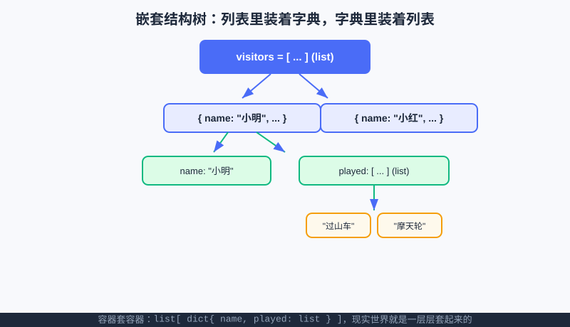

<div style="display:flex; gap:12px; margin-bottom:24px; flex-wrap:wrap; align-items:center;">
  <span style="background:#f0f4ff; color:#4A6CF7; padding:4px 12px; border-radius:20px; font-size:0.85em; font-weight:600; border:1px solid rgba(74,108,247,0.2);">📖 第13章</span>
  <span style="background:#f0fdf4; color:#16a34a; padding:4px 12px; border-radius:20px; font-size:0.85em; font-weight:600; border:1px solid rgba(22,163,74,0.2);">⏱️ ~35 min read</span>
  <span style="background:#fef9ec; color:#d97706; padding:4px 12px; border-radius:20px; font-size:0.85em; font-weight:600; border:1px solid rgba(217,119,6,0.2);">🎯 Intermediate</span>
</div>

# Chapter 13: 嵌套与结构化数据 —— 把混乱的现实，装进"容器里的容器"

> 📝 **Before You Continue:** 这一章是 [列表](lists.md)、[元组与集合](tuples-sets.md)、[字典](dictionaries.md) 三章的"合体"。请先确认你认识 `[ ]` 列表、`{ }` 字典、`( )` 元组，以及它们的增删查改。本章把它们**层层套起来**，建模真实世界。

前几章的容器都很"单纯"：列表装一堆分数，字典存名字→分数。但真实世界哪有这么简单？一个游客，既有名字、又有积分、还玩过一串项目；一个班级，既有花名册、每人的成绩又是一串数。

如果只用一个扁平列表，你会被混乱淹没。**嵌套数据（nested data）** 就是解法：让"容器里再装容器"——列表套字典、字典套列表、字典套字典……像俄罗斯套娃，一层层把现实世界规整地装进去。这一章，我们练就"结构化建模"的眼光。

<div class="story-scene">
<strong>🎬 开场小剧场：数据城堡开工</strong>
<p>游乐场终于有了游客名单、积分表、项目记录。小派把所有东西都塞进一个大列表里，结果想查“小明玩过什么”时，像在杂物间翻钥匙。</p>
<p>数据建筑师 nested data 摊开蓝图：“现实世界不是一排数字，而是一座城堡。外层是游客列表，里面是档案卡，档案卡里还能放项目列表。”</p>
</div>

<div class="quest-card">
<strong>🎯 本章任务卡</strong>
<ul>
<li>用列表套字典表示一群对象。</li>
<li>用字典套列表完成分组。</li>
<li>用字典套字典做多级查表。</li>
<li>遍历嵌套结构并取出目标信息。</li>
<li>把现实问题设计成清晰的数据结构。</li>
</ul>
</div>

<div class="boss-bug">
<strong>👾 本章 Boss Bug：钥匙路径迷路怪</strong>
<p>它会让你把 <code>visitors[0]["played"][1]</code> 写成乱七八糟的路径。打败它的方法是：每取一层先问自己，当前拿到的是列表还是字典？</p>
</div>

---

## 13.1 列表套字典：一群"有结构的对象"

<div class="try-it">
<strong>🧩 练一练 13.1</strong>
<p>题目：怎么用“列表套字典”表示多个学生？</p>
<details><summary>💡 看看答案</summary>
<p>答案：<code>[{"name":"小明","age":14}, {"name":"小红","age":13}]</code>。列表管“一群”，字典管“每个人的属性”。</p>
</details>
</div>

最经典的嵌套：一个列表，里面每一项是一个字典（代表一个对象）。比如一群游客：

```python
visitors = [
    {"name": "小明", "score": 80, "played": ["过山车", "摩天轮"]},
    {"name": "小红", "score": 95, "played": ["碰碰车"]},
    {"name": "小刚", "score": 60, "played": ["过山车", "碰碰车", "摩天轮"]},
]
```

怎么用？先按列表索引取"第几个游客"，再按字典 key 取他的某个属性：

```python
print(visitors[0]["name"])              # 小明（第1个游客的 name）
print(visitors[1]["played"])            # ['碰碰车']（小红玩过的项目）
print(visitors[2]["score"])             # 60（小刚的分数）
```

> 🧠 **Mental Model: 外层列表是"排队的人"，内层字典是"每个人的档案卡"。** 先找到哪个人（列表索引或遍历），再翻他的档案卡（字典 key）。两步定位，干净利落。



上图把"游客列表 → 每个游客字典 → 字典里的 played 列表"一层层画了出来。**容器套容器，就是这么直观。**

---

## 13.2 遍历嵌套结构

<div class="try-it">
<strong>🧩 练一练 13.2</strong>
<p>题目：遍历上面的嵌套列表，把每个学生的名字打印出来。</p>
<details><summary>💡 看看答案</summary>
<p>答案：<code>for stu in students: print(stu["name"])</code>。先取出每个学生字典，再按 key 取值。</p>
</details>
</div>

想"打印所有人的名字和分数"？外层 `for` 遍历列表，内层直接用字典：

```python
for v in visitors:
    print(f"{v['name']}：{v['score']} 分，玩过 {len(v['played'])} 个项目")
```

**输出：**
```
小明：80 分，玩过 2 个项目
小红：95 分，玩过 1 个项目
小刚：60 分，玩过 3 个项目
```

> 💡 **Pro Tip:** 访问嵌套值可以连写 `v["played"][0]` —— 先取字典的 `played`（是个列表），再取列表第 0 个。要"小刚玩的第一个项目"就写 `visitors[2]["played"][0]`，结果是 `"过山车"`。

---

## 13.3 字典套列表：按"类别"分组

<div class="try-it">
<strong>🧩 练一练 13.3</strong>
<p>题目：字典套列表：{"一班":["小明","小红"]}，打印“一班”所有人。</p>
<details><summary>💡 看看答案</summary>
<p>答案：<code>for name in classes["一班"]: print(name)</code>。外层字典取值得到列表，再遍历列表。</p>
</details>
</div>

反过来，也可以用字典当"外壳"，每个 value 是个列表，表示"这一类下有哪些成员"。比如班级花名册按小组分：

```python
roster = {
    "一组": ["小明", "小红"],
    "二组": ["小刚", "小美", "阿强"],
    "三组": ["小兰"],
}
print(roster["二组"])          # ['小刚', '小美', '阿强']
print(len(roster["三组"]))     # 1
```

遍历它，要两层 `for`：外层取组名和成员列表，内层取每个成员。

```python
for group, members in roster.items():
    print(f"【{group}】共 {len(members)} 人：")
    for m in members:
        print("  -", m)
```

> 📝 **Note:** 这种"字典套列表"适合**按某个 key 归类**的场景，比如"按城市分组用户""按科目分组成绩"。分类汇总、分组统计都靠它。

---

## 13.4 字典套字典：多级查表

<div class="try-it">
<strong>🧩 练一练 13.4</strong>
<p>题目：字典套字典：{"小明":{"age":14}}，查小明的年龄。</p>
<details><summary>💡 看看答案</summary>
<p>答案：<code>students["小明"]["age"]</code> 得到 <code>14</code>。像查两层抽屉。</p>
</details>
</div>

再套一层：字典的 value 本身还是字典，形成"二级映射"。比如每个学生的多科成绩：

```python
grades = {
    "小明": {"语文": 95, "数学": 90},
    "小红": {"语文": 88, "数学": 100},
}
print(grades["小明"]["数学"])    # 90（先找小明，再找他的数学）
```

> 🤔 **Why 用嵌套字典而不是扁平？** 扁平写 `"小明_数学": 90` 也能存，但嵌套让"先选人、再选科"更自然，也方便"遍历某人的所有科目"。结构清晰，代码才好维护。

---

## 13.5 改嵌套数据：定位到"最里层"再赋值

<div class="try-it">
<strong>🧩 练一练 13.5</strong>
<p>题目：把嵌套数据里“小红”的年龄从 13 改成 14。</p>
<details><summary>💡 看看答案</summary>
<p>答案：<code>students["小红"]["age"] = 14</code>。定位到最里层再赋值即可。</p>
</details>
</div>

嵌套数据的"改"，就是一路精确定位到最里层，再做赋值。比如给小明加 5 分：

```python
visitors[0]["score"] = visitors[0]["score"] + 5
print(visitors[0]["score"])     # 85
```

给小红"加玩一个项目"（列表用 `append`）：

```python
visitors[1]["played"].append("摩天轮")
print(visitors[1]["played"])    # ['碰碰车', '摩天轮']
```

> ⚠️ **Warning:** 嵌套越深，越容易"定位错层"。写 `visitors[0]["played"][0] = "新项目"` 之前，先确认 `played` 确实是个列表、且至少有 1 个元素，否则会 `IndexError` 或 `KeyError`。改之前用 `print` 看一眼结构，能省很多调试时间。

---

## 13.6 JSON 直觉：嵌套数据就是互联网的语言

你可能在网页、游戏、App 里听过 **JSON**。好消息：**JSON 几乎就是 Python 嵌套字典/列表的"文本版"**。

```python
import json

data = {
    "park": "算法游乐场",
    "visitors": [
        {"name": "小明", "score": 80},
        {"name": "小红", "score": 95},
    ],
}

text = json.dumps(data, ensure_ascii=False, indent=2)   # 转成 JSON 文本
print(text)

back = json.loads(text)        # 从 JSON 文本读回 Python 对象
print(back["visitors"][0]["name"])     # 小明
```

> 💡 **Key Insight:** 为什么这很重要？因为**网络上传输数据，本质就是传这种嵌套结构**：前端 ↔ 后端、爬虫抓到的网页、AI 模型的返回结果……全是 JSON。你今天写的 `dict` 套 `list`，和工程师每天处理的数据是**同一种东西**。`json.dumps` / `json.loads` 就是 Python 和 JSON 互转的桥。

> 📝 **Note:** `ensure_ascii=False` 让中文正常显示（不然中文会变成 `\u...`）；`indent=2` 只是让打印更好看，不影响数据本身。初学先照抄这两参数即可。

---

## 13.7 综合案例：班级花名册 + 商品库存

**案例 A — 班级花名册（字典套列表）**：记录每组学员，并统计总人数。

```python
roster = {
    "一组": ["小明", "小红"],
    "二组": ["小刚", "小美", "阿强"],
}
total = 0
for group, members in roster.items():
    total += len(members)
print("全班共", total, "人")     # 全班共 5 人
```

**案例 B — 商品库存（列表套字典）**：管理商品名、价格、余量，并找出"缺货商品"。

```python
products = [
    {"name": "可乐", "price": 3, "stock": 10},
    {"name": "薯片", "price": 5, "stock": 0},
    {"name": "巧克力", "price": 8, "stock": 4},
]

for p in products:
    tag = "（缺货！）" if p["stock"] == 0 else ""
    print(f"{p['name']}：￥{p['price']}，余 {p['stock']}{tag}")

out_of_stock = [p["name"] for p in products if p["stock"] == 0]
print("缺货商品：", out_of_stock)     # ['薯片']
```

> 💡 **Pro Tip:** 最后那行 `[p["name"] for p in products if p["stock"] == 0]` 是**列表推导式**——一行生成新列表。它等价于"遍历 products，挑出 stock==0 的，收集它们的 name"。这是 Python 很常用的简洁写法，初见可能晕，多看几遍就顺。

### 🔍 计算思维聚焦：结构化建模（把混乱现实拆成"容器里的容器"）

**结构化建模（Structured Modeling）** 是这章的灵魂：面对一团乱麻的真实信息，先问"它由哪些**对象**组成？每个对象有哪些**属性**？属性之间如何**归类**？"——然后把答案翻译成"列表 / 字典 / 元组"的嵌套组合。

- 一群游客 → 列表；每个游客 → 字典（name/score/played）；played → 列表。
- 这种"自顶向下拆解、再自底向上组装"的过程，正是**抽象**与**分解**两大计算思维的综合运用。

掌握它，你就具备了"把现实问题变成程序能处理的数据"的核心能力——这是写任何真实项目（游戏、网站、数据分析、AI 应用）的必备地基。

### 🧮 算法小课堂（前置彩蛋）

> 🥚 嵌套数据常用"**两层循环 / 递归**"来遍历：外层走列表、内层走每个对象的字段。当嵌套层级不固定（比如文件夹套文件夹），就需要**递归**——这正是 [算法篇：递归与分治](../algorithms/recursion-divide.md) 的主角。先体会"一层层进去"的手感，后面递归会水到渠成。

---

## ⚔️ 挑战擂台

**擂台题：找出"玩得最多项目"的游客。**
用 13.1 的 `visitors` 列表，遍历找出 `played` 列表最长的人，并打印他玩了几个项目（呼应"边走边记最优"套路）。

```python
visitors = [
    {"name": "小明", "score": 80, "played": ["过山车", "摩天轮"]},
    {"name": "小红", "score": 95, "played": ["碰碰车"]},
    {"name": "小刚", "score": 60, "played": ["过山车", "碰碰车", "摩天轮"]},
]
best, best_n = None, -1
for v in visitors:
    n = len(v["played"])
    if n > best_n:
        best, best_n = v["name"], n
print(f"玩得最多：{best}，{best_n} 个项目")   # 玩得最多：小刚，3 个项目
```

这种"在结构体列表里找极值"的模式，在数据处理、算法模拟题里几乎天天见。

---

## 🛠️ 项目工坊：算法游乐场 · 完整游客档案

把第 10 章的"游客名单"、第 11 章的"已玩项目"、第 12 章的"积分"**全部合并**——每位游客是一份完整档案（字典），所有游客收进一个列表。游乐场的数据化，到此成型！

下面**自包含**代码（纯终端）实现：入园建档案、玩项目计分去重、查某人档案、查冠军。

```python
# 算法游乐场 · 完整游客档案（嵌套数据版）
visitors = []                        # 列表：每个元素是一个游客 dict

def check_in(name):
    visitors.append({
        "name": name,
        "score": 0,
        "played": [],               # 已玩项目（保持不重复）
    })
    print(f"✅ {name} 入园，已建档案")

def ride(name, project, points):
    for v in visitors:
        if v["name"] == name:
            if project not in v["played"]:
                v["played"].append(project)   # 去重计次
            v["score"] += points
            print(f"🎢 {name} 玩了 {project}，+{points} 分，共 {v['score']} 分")
            return
    print(f"❓ 查无 {name}，请先入园")

def profile(name):
    for v in visitors:
        if v["name"] == name:
            print(f"📋 {name}：{v['score']} 分，玩过 {v['played']}")
            return

def champion():
    if not visitors:
        print("暂无游客")
        return
    best = max(visitors, key=lambda v: v["score"])   # 按 score 找最大
    print(f"👑 冠军：{best['name']}，{best['score']} 分")

# 试一试
check_in("小明")
check_in("小红")
ride("小明", "过山车", 50)
ride("小明", "过山车", 50)        # 重复项目，不计次但...见下方说明
ride("小明", "摩天轮", 30)
ride("小红", "碰碰车", 40)
profile("小明")
champion()
```

**运行输出：**
```
✅ 小明 入园，已建档案
✅ 小红 入园，已建档案
🎢 小明 玩了 过山车，+50 分，共 50 分
🎢 小明 玩了 过山车，+50 分，共 100 分
🎢 小明 玩了 摩天轮，+30 分，共 130 分
🎢 小红 玩了 碰碰车，+40 分，共 40 分
📋 小明：130 分，玩过 ['过山车', '摩天轮']
🎢 冠军：小明，130 分
```

> 📝 **Note（诚实说明）：** 上面 `ride` 对"重复项目"做了 `played` 去重（列表不重复记），但分数仍每次都加——这是为了演示"嵌套里同时管列表和分数"。真实游乐场若想"同一项目只计一次分"，把 `v["score"] += points` 也挪进 `if project not in v["played"]` 块里即可。你可以在本地改一行试试，体会"改最里层字段"的手感。

> 💡 **记住这一句（项目）：** 现在游乐场升级出**"完整游客档案"**——每位游客是一个 dict（name/score/played），全部收进列表 `visitors`。名单、去重、积分、排行榜，一个嵌套结构全搞定！第 14 章我们会把这些操作重构成干净的函数。

---

## 🏅 本章通关徽章：数据建筑师

<div class="badge-card">
<strong>如果你能做到下面 4 件事，就获得“数据建筑师”徽章：</strong>
<ul>
<li>能用列表套字典表示多个对象。</li>
<li>能用字典套列表做分类分组。</li>
<li>能写出多层访问路径并说清每一层是什么。</li>
<li>能把现实里的游客/成绩/项目设计成结构化数据。</li>
</ul>
</div>

---

## ⚠️ Common Mistakes in Chapter 13

| # | 误区 | 示例 | 为什么错 | 修正 |
|---|------|------|---------|------|
| 1 | 套错层就取值 | `visitors["name"]` | visitors 是列表，要先取元素 | 写 `visitors[0]["name"]` |
| 2 | 忘了内层是可变对象 | `v["played"].append(x)` 报 AttributeError | 可能 `played` 没初始化成列表 | 建档案时 `played: []` 先备好 |
| 3 | 嵌套里直接改报错 | `visitors[0]["played"][5] = x` | 列表没那么长 | 先确认长度，或改用 `append` |
| 4 | JSON 中文变乱码 | `json.dumps(data)` 出 `\u...` | 默认 `ensure_ascii=True` | 加 `ensure_ascii=False` |
| 5 | 两层循环变量名混 | 内外都用 `i` | 覆盖、逻辑错 | 内层换名，如 `for p in v["played"]` |
| 6 | 误以为嵌套自动去重 | 列表里出现重复项 | 列表不自动去重 | 去重用第11章集合或 `not in` 判断 |

---

## Chapter Summary

### 📌 Key Takeaways

| 结构 | 写法 | 适用 |
|------|------|------|
| 列表套字典 | `[{...}, {...}]` | 一群对象（游客/商品/学生） |
| 字典套列表 | `{"组":[...]}` | 按类别分组（花名册/分类汇总） |
| 字典套字典 | `{"人":{"科":分}}` | 二级查表（多科成绩） |
| 访问嵌套 | `a[i]["k"][j]` 连写 | 一层层精确定位 |
| 修改嵌套 | 定位到最里层再赋值 | 改分、加项目用 `append` |
| JSON | `json.dumps/loads` | 嵌套数据 ⇄ 网络文本 |
| 列表推导 | `[x for ... if ...]` | 一行生成/筛选列表 |
| 结构化建模 | 对象→属性→归类 | 把现实装进容器 |

### ❓ FAQ

**Q1: 嵌套最多能套几层？**
> A: 语法上几乎不限，但**层数越深越难读难维护**。实际项目里 2~3 层最常见，超过就考虑拆成更小结构或建类（class）。本书后面函数/项目篇会讲如何整理得清爽。

**Q2: 遍历嵌套一定要两层 for 吗？**
> A: 列表套字典这类"固定两层"用两层 `for` 最清楚。"层数不固定"（如文件夹套文件夹）才需要递归，那是算法篇的内容。先把手写两层练熟。

**Q3: JSON 和 Python 字典完全一样吗？**
> A: 几乎一样，但有小差别：JSON 的 key 必须是双引号字符串，布尔写 `true/false`、空写 `null`；Python 是 `True/False/None`。`json` 模块会自动转换，所以你只管写 Python，互转交给 `dumps/loads`。

**Q4: 列表推导式看不懂怎么办？**
> A: 完全正常！把它当成"压缩版的 for 循环"：先写普通 `for` 循环生成列表，熟练后再用推导式简写。两者结果一样，推导式只是更 Pythonic。

### 🔗 Connections to Later Chapters

- **[函数篇：函数入门](../functions/functions-intro.md)** 和 **[作用域与递归](../functions/scope-recursion.md)** 会把本章"游乐场操作"重构成参数化函数，并用递归遍历不定层嵌套。
- **[算法篇：递归与分治](../algorithms/recursion-divide.md)** 正式讲"层层进入"的递归，正好处理深度不定的嵌套。
- **[项目篇：数据分析](../projects/data-analysis.md)** 与 **[算法竞技场](../projects/algorithm-arena.md)** 会直接操作真实嵌套数据（JSON），本章就是它们的地基。

---


## 🎮 加练任务包

> 下面这些题目不一定比章末题更难，但更适合“多刷几遍、把手感练出来”。建议先独立做，再展开提示。

### 加练 13.A · 游客档案 🟢

用列表套字典表示两名游客：姓名、积分、玩过项目列表。

<details>
<summary>💡 提示 / 答案要点</summary>

形如 `[{"name":"小明","score":80,"played":["过山车"]}, ...]`。列表管多人，字典管一人属性。

</details>

---

### 加练 13.B · 取深层数据 🟢

给定 `visitors[0]["played"]` 是项目列表，怎样取第一个项目？

<details>
<summary>💡 提示 / 答案要点</summary>

继续接索引：`visitors[0]["played"][0]`。每一层都要确认当前是列表还是字典。

</details>

---

### 加练 13.C · 平均积分 🟡

游客列表中每个字典都有 `score`，用循环计算平均积分。

<details>
<summary>💡 提示 / 答案要点</summary>

遍历 visitors，累加 `v["score"]`，最后除以 `len(visitors)`。

</details>

---


---

## Practice Problems

---

**Problem 13.1 — 读取嵌套里的字段** 🟢 Easy

给定 `students = [{"name":"小明","score":80}, {"name":"小红","score":95}]`。请打印第 2 个学生的名字，以及第 1 个学生的分数。

**Sample Output:**
```
第二个学生：小红
小明的分数：80
```

<details>
<summary>💡 Solution (click to reveal)</summary>

**Approach:** 先按列表索引取字典，再按 key 取字段。注意索引从 0 起。

```python
students = [{"name": "小明", "score": 80}, {"name": "小红", "score": 95}]
print("第二个学生：", students[1]["name"])
print("小明的分数：", students[0]["score"])
```

**Key points:**
- 列表 `[1]` 取第 2 个学生（索引从 0）；字典 `["name"]` 取名字。
- 连写 `students[1]["name"]` 就是"先定位人、再翻档案"。

</details>

---

**Problem 13.2 — 字典套列表：统计每组人数** 🟡 Medium

`roster = {"一组":["小明","小红"], "二组":["小刚","小美","阿强"], "三组":["小兰"]}`。请遍历打印每组人数，并算出全班总人数。

**Sample Output:**
```
一组：2 人
二组：3 人
三组：1 人
全班共 6 人
```

<details>
<summary>💡 Solution (click to reveal)</summary>

**Approach:** 外层 `items()` 拿组名和成员列表，内层 `len` 得人数，累加得总数。

```python
roster = {"一组": ["小明", "小红"], "二组": ["小刚", "小美", "阿强"], "三组": ["小兰"]}
total = 0
for group, members in roster.items():
    print(f"{group}：{len(members)} 人")
    total += len(members)
print("全班共", total, "人")
```

**Key points:**
- `roster.items()` 同时拿到 key（组名）和 value（列表）。
- 人数 = 列表长度 `len(members)`。

</details>

---

**Problem 13.3 — 找出分数最高且玩项目最多的人** 🟡 Medium

`visitors` 如 13.1：`[{"name":"小明","score":80,"played":["过山车","摩天轮"]}, {"name":"小红","score":95,"played":["碰碰车"]}, {"name":"小刚","score":60,"played":["过山车","碰碰车","摩天轮"]}]`。请分别找出"分数最高"和"玩项目最多"的游客名字。

**Sample Output:**
```
分数最高：小红
玩得最多：小刚
```

<details>
<summary>💡 Solution (click to reveal)</summary>

**Approach:** 两次"边走边记最优"遍历，分别比较 `score` 和 `len(played)`。

```python
visitors = [
    {"name": "小明", "score": 80, "played": ["过山车", "摩天轮"]},
    {"name": "小红", "score": 95, "played": ["碰碰车"]},
    {"name": "小刚", "score": 60, "played": ["过山车", "碰碰车", "摩天轮"]},
]

best_score, best_s = None, -1
best_play, best_n = None, -1
for v in visitors:
    if v["score"] > best_s:
        best_s, best_score = v["score"], v["name"]
    n = len(v["played"])
    if n > best_n:
        best_n, best_play = n, v["name"]

print("分数最高：", best_score)
print("玩得最多：", best_play)
```

**Key points:**
- 同一遍遍历可以同时统计多个指标，效率更高（这里为清晰分开写也行）。
- `len(v["played"])` 拿到"玩了几个项目"，正是嵌套访问的典型用法。

</details>

---

**Problem 13.4 — 🏆 Challenge：把游乐场档案导出成 JSON** 🏆 Challenge

用本章"项目工坊"的 `visitors` 结构（或自建一个小例子），用 `json.dumps` 把它转成带中文、带缩进的 JSON 文本并打印；再用 `json.loads` 读回，验证能正确取回某个游客的分数。体会"程序里的嵌套数据 ⇄ 网络上的 JSON"这条桥。

**Sample Output（节选）:**
```
{
  "visitors": [
    {
      "name": "小明",
      "score": 130,
      "played": ["过山车", "摩天轮"]
    }
  ]
}
读回验证：小明 = 130 分
```

<details>
<summary>💡 Solution (click to reveal)</summary>

**Approach:** 把数据装进一个顶层字典，用 `json.dumps(..., ensure_ascii=False, indent=2)` 转文本；`json.loads` 读回后按嵌套路径取值。

```python
import json

visitors = [
    {"name": "小明", "score": 130, "played": ["过山车", "摩天轮"]},
    {"name": "小红", "score": 40,  "played": ["碰碰车"]},
]
data = {"visitors": visitors}

text = json.dumps(data, ensure_ascii=False, indent=2)
print(text)

back = json.loads(text)
print("读回验证：", back["visitors"][0]["name"], "=", back["visitors"][0]["score"], "分")
```

**Key points:**
- `ensure_ascii=False` 让中文正常显示；`indent=2` 让结构可读。
- `json.loads` 后得到的 `back` 就是普通的 Python 嵌套字典/列表，访问方式完全一样——这条"桥"就是真实前后端数据交换的缩影。

</details>

---

> 💡 **记住这一句：** 嵌套数据就是"容器里的容器"——**列表装对象、字典存属性、层层定位**，再借 JSON 通往整个互联网世界。
