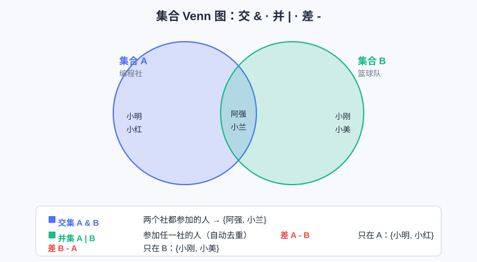

<div style="display:flex; gap:12px; margin-bottom:24px; flex-wrap:wrap; align-items:center;">
  <span style="background:#f0f4ff; color:#4A6CF7; padding:4px 12px; border-radius:20px; font-size:0.85em; font-weight:600; border:1px solid rgba(74,108,247,0.2);">📖 第11章</span>
  <span style="background:#f0fdf4; color:#16a34a; padding:4px 12px; border-radius:20px; font-size:0.85em; font-weight:600; border:1px solid rgba(22,163,74,0.2);">⏱️ ~30 min read</span>
  <span style="background:#fef9ec; color:#d97706; padding:4px 12px; border-radius:20px; font-size:0.85em; font-weight:600; border:1px solid rgba(217,119,6,0.2);">🎯 Intermediate</span>
</div>

# Chapter 11: 元组与集合 —— 有些东西定下就别改，有些事重在"不重复"

> 📝 **Before You Continue:** 先看 [第10章 列表](lists.md)——元组和集合都是"列表的亲戚"：元组像"不能改的列表"，集合像"会自动去重的列表"。懂了列表，这章事半功倍。建议也顺手回顾 [for 循环](../control-flow/for-loops.md)。

上一章你学会了列表：能增、能删、能改，特别自由。但自由有时是麻烦的来源——

- 你存了"一个点的坐标 `(3, 5)`"，结果代码某处不小心把它改成了 `(3, 999)`，程序逻辑全乱，你还找不到哪改的；
- 你统计"今天游乐场哪些项目被玩过"，游客每玩一次你就记一次，结果同一项目被重复记了 8 遍，榜单水分爆表。

这章的两位主角正好解决这两个痛点：**元组（tuple）定下就别改**，**集合（set）天生去重**。理解"可变 vs 不可变"，是写稳程序的关键一步。

<div class="story-scene">
<strong>🎬 开场小剧场：塑封员和去重保安</strong>
<p>游乐场地图上的坐标本该固定，却被小派不小心改坏了；热门项目榜单也被重复记录刷屏，碰碰车一天出现了十几次。</p>
<p>塑封员 tuple 说：“重要坐标交给我，封好就别乱改。”去重保安 set 接着拦住重复门票：“同样的项目来多少次，我只记一次。”</p>
</div>

<div class="quest-card">
<strong>🎯 本章任务卡</strong>
<ul>
<li>用元组保存不该改变的数据。</li>
<li>理解不可变为什么能防手滑。</li>
<li>用集合自动去掉重复元素。</li>
<li>用集合做交集、并集、差集。</li>
<li>分清列表、元组、集合各自适合的场景。</li>
</ul>
</div>

<div class="boss-bug">
<strong>👾 本章 Boss Bug：单元素元组伪装怪</strong>
<p>它会把 <code>(5)</code> 伪装成元组，其实那只是整数 5。打败它的关键是逗号：<code>(5,)</code> 才是真正的单元素元组。</p>
</div>

---

## 11.1 元组 tuple：圆括号里的"定死"数据

<div class="try-it">
<strong>🧩 练一练 11.1</strong>
<p>题目：元组 (1, 2, 3) 创建之后，能修改其中的元素吗？</p>
<details><summary>💡 看看答案</summary>
<p>答案：<b>不能</b>。元组（tuple）是不可变的，这是它和列表最大的区别。</p>
</details>
</div>

元组用**圆括号** `( )` 创建（列表用方括号 `[ ]`）。最关键的差别：**元组一旦创建，里面的元素不能增、不能删、不能改**。

```python
point = (3, 5)          # 一个二维坐标 (x, y)
print(point[0])         # 3
print(point[1])         # 5

# point[0] = 10        # ❌ 报错！元组不能改
```

> ⚠️ **Warning:** 试图修改元组会直接抛 `TypeError: 'tuple' object does not support item assignment`。这不是 bug，是元组**故意**不让改。

### 🧠 Mental Model: 元组像"塑封好的文件"

列表是活页夹，随时能抽换纸；元组是塑封好的证书——内容固定、谁也改不了。凡是"定了就不该变"的东西（坐标、日期、RGB 颜色、数据库里的一行记录），用元组更省心，也更能防止手滑写错。

---

## 11.2 为什么"不可变"反而有用？

<div class="try-it">
<strong>🧩 练一练 11.2</strong>
<p>题目：什么时候用元组比用列表更好？</p>
<details><summary>💡 看看答案</summary>
<p>答案：当这串数据<b>不该被改动</b>时（如坐标、配置），用元组更安全，还能当作字典的键。</p>
</details>
</div>

你可能会想："不能改，那要它干嘛？"——**不能改恰恰是一种保护**：

1. **防手滑**：把不该变的数据锁住，任何意外修改都会在运行瞬间报错，而不是悄悄埋下 bug。
2. **能当"字典的键"**：第 12 章你会学到，字典的 key 必须是"不可变"的。列表不能当 key，但**元组可以**——这就让 `(x, y)` 坐标能直接当查表键。
3. **函数返回多个值**：Python 函数 `return a, b` 实际返回的是一个元组，调用方才能写成 `x, y = get_point()`。

```python
def get_point():
    return 3, 5            # 实际返回元组 (3, 5)

x, y = get_point()         # 元组拆包：把两个值分别赋给 x, y
print(x, y)                # 3 5
```

> 💡 **Key Insight:** "不可变"不是功能残缺，而是**一种承诺**——"这个值我保证不变"。读代码的人看到元组，立刻知道"这里动不得"，理解和维护都更轻松。

### 📝 Note：单元素元组要加逗号

```python
t1 = (5)        # 这不是元组！这是整数 5（括号只是分组）
t2 = (5,)       # 这才是含一个元素的元组，逗号不能省
print(type(t1)) # <class 'int'>
print(type(t2)) # <class 'tuple'>
```

---

## 11.3 元组也能遍历、能切片

<div class="try-it">
<strong>🧩 练一练 11.3</strong>
<p>题目：遍历元组 t = (1, 2, 3)，把每个元素打印出来。</p>
<details><summary>💡 看看答案</summary>
<p>答案：<code>for x in (1,2,3): print(x)</code>。元组同样支持遍历和切片。</p>
</details>
</div>

虽然不能改，但"读"的操作元组都有：索引、切片、`len`、`for` 遍历、`in` 判断，跟列表一样好用。

```python
rgb = (255, 128, 0)        # 橙色的 RGB
print(rgb[0])              # 255
print(rgb[:2])             # (255, 128)  切片也返回元组
print(len(rgb))            # 3

for c in rgb:
    print("通道值：", c)
```

> 🤔 **Why 元组比列表省内存？** 因为"不可变"意味着 Python 可以提前定好它的固定大小，内部存得更紧凑。数据量巨大、又确定不改时，用元组比列表更省空间、略快。初学不必纠结，知道有这回事即可。

---

## 11.4 集合 set：自动去重的"神奇筐"

<div class="try-it">
<strong>🧩 练一练 11.4</strong>
<p>题目：集合 set([1, 1, 2, 2, 3]) 去重之后是？</p>
<details><summary>💡 看看答案</summary>
<p>答案：<code>{1, 2, 3}</code>。集合自动丢弃重复元素，顺序不保证。</p>
</details>
</div>

**集合（set）** 用花括号 `{ }` 创建（注意：空集合不能写 `{}`，那会被当成空字典，要写 `set()`）。它最大的超能力是：**自动去重 + 无视顺序**。

```python
# 游乐场一天的项目记录（同一项目被刷了多次）
raw = {"过山车", "摩天轮", "过山车", "碰碰车", "摩天轮", "过山车"}
print(raw)                 # {'过山车', '摩天轮', '碰碰车'}  —— 重复的全没了！
print(len(raw))            # 3  （只剩 3 个不同项目）
```

> 💡 **Pro Tip:** 想给一个列表去重？`set(列表)` 一行搞定，再 `list(...)` 转回列表（顺序会丢，见下）：

```python
names = ["小明", "小红", "小明", "小刚"]
unique = list(set(names))
print(unique)              # 顺序不定，例如 ['小刚', '小明', '小红']
```

> ⚠️ **Warning:** 集合**不保证顺序**！上面的 `unique` 每次打印顺序可能不同。如果你既要去重又要保住"第一次出现的顺序"，回看 [第10章 挑战题 10.4](lists.md) 的列表法。集合适合"只关心有哪些、不关心先后"的场景。

---

## 11.5 集合的运算：交 &、并 |、差 -

<div class="try-it">
<strong>🧩 练一练 11.5</strong>
<p>题目：用集合求两个班的“共同学生”（交集）。</p>
<details><summary>💡 看看答案</summary>
<p>答案：<code>set(a) & set(b)</code> 得到同时属于两班的人。并集用 <code>|</code>，差集用 <code>-</code>。</p>
</details>
</div>

集合真正厉害的地方，是它的**数学运算**——这正是韦恩图（Venn diagram）在编程里的对应。来看图：



图里"编程社"和"篮球队"两个圈子，重叠部分就是"两个都参加的人"。代码里这对应三种运算：

```python
coders = {"小明", "小红", "阿强", "小兰"}     # 编程社
ballers = {"小刚", "小美", "阿强", "小兰"}    # 篮球队

# 交集 & ：两个社都参加
print(coders & ballers)     # {'阿强', '小兰'}

# 并集 | ：参加任一社（自动去重）
print(coders | ballers)     # {'小明', '小红', '阿强', '小兰', '小刚', '小美'}

# 差集 - ：只在左边、不在右边
print(coders - ballers)     # {'小明', '小红'}   （只编程不篮球）
print(ballers - coders)     # {'小刚', '小美'}   （只篮球不编程）
```

> 🧠 **Mental Model: 集合像" membership 名单"。** 它不在乎顺序、不在乎你来了几次，只在乎"你**在不在**这个圈子里"。交集=两圈都进的人，并集=进过任一圈的人，差集=只在 A 圈不在 B 圈的人。

---

## 11.6 集合也能增删、能判断"在不在"

```python
played = {"过山车", "摩天轮"}
played.add("碰碰车")        # 加一个
print(played)               # 含三个

played.discard("摩天轮")     # 删一个（没有也不报错）
# played.remove("摩天轮")    # remove 删不存在的会报错，discard 更温柔

print("过山车" in played)   # True
```

> 🐛 **Common Bug:** 分不清 `remove` 和 `discard`——`remove` 删一个不存在的元素会抛 `KeyError`，`discard` 则"没有就当没发生"。不确定在不在时，一律用 `discard` 更稳。

---

## 11.7 综合案例：坐标对 + 统计不重复单词

**案例 A — 坐标对（用元组）**：平面上多个点，每个点用 `(x, y)` 存，既清晰又防改。

```python
points = [(0, 0), (3, 4), (1, 1)]     # 列表里装着元组
for p in points:
    dist = (p[0]**2 + p[1]**2) ** 0.5  # 到原点的距离
    print(f"点 {p} 到原点距离：{dist:.2f}")
```

**案例 B — 统计不重复单词（用集合 + 列表）**：

```python
sentence = "猫 狗 猫 鸟 狗 鱼 猫"
words = sentence.split()              # 按空格拆成列表
unique_words = set(words)             # 集合去重
print("不重复的词：", unique_words)
print("一共", len(unique_words), "种动物")
```

**输出：**
```
不重复的词： {'猫', '狗', '鸟', '鱼'}
一共 4 种动物
```

> 📝 **Note:** `sentence.split()` 默认按空白字符切分，返回列表。配合 `set` 去重，是做"词频/种类统计"最省事的起手式——后面 [第13章 嵌套数据](nested-data.md) 会用字典把"每种出现几次"也数出来。

### 🔍 计算思维聚焦：不可变 vs 可变（有些东西定下就别改）

这是编程里一对极其重要的对立概念：

- **可变（mutable）**：创建后能改内容，如列表、集合、字典。灵活，但有"被意外改掉"的风险。
- **不可变（immutable）**：创建后内容锁死，如整数、字符串、**元组**。安全，能当"固定契约"使用。

计算思维教你的，是**根据数据的"本性"选容器**：
- 游客名单会随时增减 → 可变（列表）；
- 一个点的坐标、一条记录、配置项 → 不可变（元组）更稳；
- "有哪些项目被玩过"只关心种类 → 集合（去重）。

**选对"可变性"，代码就少一半 bug。** 这不是语法细节，而是"如何建模世界"的思维习惯。

### 🧮 算法小课堂（前置彩蛋）

> 🥚 集合的"判断在不在"`x in s` 平均是 **O(1)**（几乎瞬间），而列表的 `x in lst` 是 **O(n)**（要一个个比）。差别来自集合底层用了"哈希表"——这个结构在 [算法篇：基础数据结构](../algorithms/basic-structures.md) 会正式揭秘。先记住：**要去重 / 要快速查"在不在"，集合比列表快得多**。

---

## ⚔️ 挑战擂台

**擂台题：找出"两门课都满分"的人。**
语文满分名单 `chinese = {"小明","阿强","小兰"}`，数学满分名单 `math = {"小红","阿强","小兰","小刚"}`。用集合交集找出两门都满分的同学。

```python
chinese = {"小明", "阿强", "小兰"}
math = {"小红", "阿强", "小兰", "小刚"}
both = chinese & math
print("两门都满分：", both)     # {'阿强', '小兰'}
```

这种"求共同元素"的集合思维，在去重、判重、权限交集等场景极常见，也是很多模拟题的隐藏技巧。

---

## 🛠️ 项目工坊：算法游乐场 · 已玩项目清单

接着第 10 章的"游客名单"，游乐场现在要记录**每位游客玩过哪些项目**。问题来了：游客可能把"过山车"刷了 5 次，但排行榜只该计 **1 次**"玩过"。——集合去重，正好派上用场！

下面**自包含**代码用集合管理"已玩项目"，避免重复计次：

```python
# 算法游乐场 · 已玩项目清单（集合版）
played = set()                     # 空集合，记录玩过的项目种类

def ride(name):
    before = len(played)
    played.add(name)               # 重复 add 也不会变多
    if len(played) > before:
        print(f"🎢 新解锁项目：{name}（已玩 {len(played)} 种）")
    else:
        print(f"🔁 {name} 你刷过啦，不重复计次")

def show_played():
    print("已玩项目：", played)

# 试一试：小明狂刷过山车
ride("过山车")
ride("摩天轮")
ride("过山车")          # 重复，不计次
ride("碰碰车")
ride("过山车")          # 又重复
show_played()
```

**运行输出：**
```
🎢 新解锁项目：过山车（已玩 1 种）
🎢 新解锁项目：摩天轮（已玩 2 种）
🔁 过山车 你刷过啦，不重复计次
🎢 新解锁项目：碰碰车（已玩 3 种）
🔁 过山车 你刷过啦，不重复计次
已玩项目： {'过山车', '摩天轮', '碰碰车'}
```

> 💡 **记住这一句（项目）：** 现在游乐场升级了**"已玩项目清单"**——用集合 `add` 自动去重，同一项目刷再多遍也只算一种。第 12 章我们会再加"排行榜"，按玩家名字查分数。

---

## 🏅 本章通关徽章：塑封与去重双人组

<div class="badge-card">
<strong>如果你能做到下面 4 件事，就获得“塑封与去重双人组”徽章：</strong>
<ul>
<li>能解释元组为什么不能改。</li>
<li>能写出正确的单元素元组 <code>(x,)</code>。</li>
<li>能用集合去掉重复元素。</li>
<li>能根据需求选择列表、元组或集合。</li>
</ul>
</div>

---

## ⚠️ Common Mistakes in Chapter 11

| # | 误区 | 示例 | 为什么错 | 修正 |
|---|------|------|---------|------|
| 1 | 想改元组 | `point[0] = 10` | 元组不可变 | 需要改就用列表 `[ ]`；元组只存定值 |
| 2 | 单元素元组漏逗号 | `t = (5)` 其实是 int | 没逗号就是普通括号分组 | 写成 `t = (5,)` |
| 3 | 用 `{}` 建空集合 | `s = {}` 得到空**字典** | `{}` 是字典专属 | 空集合写 `set()` |
| 4 | 指望集合保序 | `list(set(lst))` 顺序乱了 | 集合本身无序 | 要去重又保序，用第10章列表法 |
| 5 | `remove` 删不存在元素 | `s.remove("x")` 但 x 不在 | 抛 `KeyError` | 用 `s.discard("x")` 更稳 |
| 6 | 把列表当集合键 | `d[[1,2]] = 3` | 列表可变，不能做 key | 改用元组 `d[(1,2)] = 3` |

---

## Chapter Summary

### 📌 Key Takeaways

| 概念 | 要点 | 为什么重要 |
|------|------|------------|
| 元组 `()` | 圆括号，创建后**不可改** | 锁死定值（坐标/记录/配置），防手滑 |
| 元组拆包 | `x, y = get_point()` | 函数返回多值的底层机制 |
| 单元素元组 | `(5,)` 逗号不能省 | 否则变成普通整数 |
| 集合 `{}` | 花括号，自动**去重**、无序 | 统计种类、快速判重 |
| 空集合 | 用 `set()`，别用 `{}` | `{}` 是空字典 |
| 交并差 | `&` 交集 / `|` 并集 / `-` 差集 | 求共同、合并、剔除，韦恩图对应 |
| `add`/`discard` | 增 / 温和删 | `discard` 删不存在不报错 |
| 可变 vs 不可变 | 列表可改、元组不可改 | 按数据本性选容器，少 bug |

### ❓ FAQ

**Q1: 元组完全不能改吗？如果里面套了列表呢？**
> A: 元组本身不能"换元素"，但如果某个元素是**列表**（可变），那个列表内部可以改。比如 `t = (1, [2, 3])`，`t[1].append(4)` 是允许的——元组"壳"没变，只是里面那个可变对象自己变了。初学先记住"元组不能整体替换元素"即可。

**Q2: 集合为什么不能存列表？**
> A: 集合要求元素"可哈希（hashable）"，而可哈希的前提是不可变。列表可变，所以 `{"a", [1,2]}` 会报错；元组不可变，可以放进集合。

**Q3: 我想保留顺序地去重，除了第10章的列表法还有别的吗？**
> A: 有更简洁的写法（利用字典保序特性 `list(dict.fromkeys(lst))`），但那用到第12章的字典。现阶段掌握"遍历 + `not in` 新建列表"就够，思路也更清晰。

**Q4: 交集除了 `&` 还能怎么写？**
> A: 也可以 `coders.intersection(ballers)`，`并集 coders.union(ballers)`，`差集 coders.difference(ballers)`。符号写法更短，方法写法在链式调用时更顺手。

### 🔗 Connections to Later Chapters

- **[第12章 字典](dictionaries.md)** 会讲"键值对"，而且**字典的 key 必须不可变**——这正是元组能当 key 的原因，两章就此接通。
- **[第13章 嵌套数据](nested-data.md)** 里"每个游客一份档案"会用到 `(x,y)` 坐标、列表、字典层层嵌套，本章的元组/集合是重要零件。
- **[算法篇：基础数据结构](../algorithms/basic-structures.md)** 正式讲哈希表（集合/字典的底层），解释为什么集合查"在不在"那么快。

---


## 🎮 加练任务包

> 下面这些题目不一定比章末题更难，但更适合“多刷几遍、把手感练出来”。建议先独立做，再展开提示。

### 加练 11.A · 固定坐标 🟢

用元组保存坐标 `(3, 5)`，分别取出 x 和 y。

<details>
<summary>💡 提示 / 答案要点</summary>

`point = (3, 5)`，`x = point[0]`，`y = point[1]`；也可以 `x, y = point` 拆包。

</details>

---

### 加练 11.B · 项目去重 🟢

列表 `played=["过山车","碰碰车","过山车"]`，怎样得到不重复项目？

<details>
<summary>💡 提示 / 答案要点</summary>

`set(played)` 得到集合，重复的“过山车”只保留一份。集合不保证顺序。

</details>

---

### 加练 11.C · 共同爱好 🟡

A 喜欢 `{"AI","游戏","音乐"}`，B 喜欢 `{"游戏","数学"}`。求共同喜欢什么。

<details>
<summary>💡 提示 / 答案要点</summary>

用交集 `A & B`，结果是 `{"游戏"}`。并集用 `|`，差集用 `-`。

</details>

---


---

## Practice Problems

---

**Problem 11.1 — 用元组存坐标并求距离** 🟢 Easy

创建元组 `p = (3, 4)`，打印它的 x、y，并算出它到原点 `(0,0)` 的距离（公式：√(x²+y²)）。

**Sample Output:**
```
x = 3, y = 4
到原点距离 = 5.0
```

<details>
<summary>💡 Solution (click to reveal)</summary>

**Approach:** 元组索引取 x、y；距离用勾股定理，`**0.5` 即开平方。

```python
p = (3, 4)
x, y = p                     # 拆包也行：x = p[0]; y = p[1]
print(f"x = {x}, y = {y}")
dist = (x**2 + y**2) ** 0.5
print(f"到原点距离 = {dist}")
```

**Key points:**
- 距离公式 `√(x²+y²)`，用 `(x**2 + y**2) ** 0.5` 实现。
- 本题结果恰好是整数 5，但 `**0.5` 返回浮点 `5.0`，正常。

</details>

---

**Problem 11.2 — 集合去重统计不重复访客** 🟡 Medium

游乐场一天刷脸记录 `raw = ["小明","小红","小明","小刚","小红","小美","小明"]`。请用**集合**统计"今天共有多少**不同**的人来过"，并打印去重后的名单（顺序不限）。

**Sample Output:**
```
不同访客数： 4
名单： {'小明', '小红', '小刚', '小美'}
```

<details>
<summary>💡 Solution (click to reveal)</summary>

**Approach:** `set(raw)` 一行去重，再 `len` 得种类数。

```python
raw = ["小明", "小红", "小明", "小刚", "小红", "小美", "小明"]
unique = set(raw)
print("不同访客数：", len(unique))
print("名单：", unique)
```

**Key points:**
- 列表 → 集合自动去重，这是集合最常用场景。
- 顺序不定属正常，本题不要求保序。若要保序，回看第10章挑战题。

</details>

---

**Problem 11.3 — 找出两班都选修的同学** 🟡 Medium

班 A 选修了编程：`a = {"小明","阿强","小兰","小刚"}`；班 B 选修了美术：`b = {"小红","阿强","小兰"}`。请用集合运算找出"两门都选"和"只选了编程没选美术"的同学。

**Sample Output:**
```
两门都选： {'阿强', '小兰'}
只选编程： {'小明', '小刚'}
```

<details>
<summary>💡 Solution (click to reveal)</summary>

**Approach:** 交集 `&` 得两者共有；差集 `-` 得"在 a 不在 b"。

```python
a = {"小明", "阿强", "小兰", "小刚"}
b = {"小红", "阿强", "小兰"}
print("两门都选：", a & b)
print("只选编程：", a - b)
```

**Key points:**
- `a & b` 是交集（两圈重叠）。
- `a - b` 是差集（只在 a 不在 b）。
- 顺序无关，`a & b == b & a`，但 `a - b != b - a`。

</details>

---

**Problem 11.4 — 🏆 Challenge：用集合做"共同好友"推荐** 🏆 Challenge

社交 App 想推荐"你可能认识的人"：给你和好友的集合，推荐逻辑是"好友的好友里、且不是你自己、且还不是你好友的人"。设 `me = "我"`，`my_friends = {"A","B","C"}`，`friends_of_A = {"B","D","E"}`，`friends_of_B = {"C","D","F"}`。请算出"二度人脉候选"=`(friends_of_A | friends_of_B)` 减去 `{me}` 再减去 `my_friends`。

**Sample Output:** `{'D', 'E', 'F'}`

<details>
<summary>💡 Solution (click to reveal)</summary>

**Approach:** 先把两个好友列表**并集**起来，再剔除"自己"和"已经是好友的人"，剩下的就是候选。

```python
me = "我"
my_friends = {"A", "B", "C"}
friends_of_A = {"B", "D", "E"}
friends_of_B = {"C", "D", "F"}

candidates = (friends_of_A | friends_of_B) - my_friends - {me}
print(candidates)              # {'D', 'E', 'F'}
```

**Key points:**
- `|` 并集把所有"二度联系人"合并去重。
- 连续 `-` 依次剔除已存在关系：`(S) - my_friends - {me}`。
- 这正是真实社交推荐的极简版：用集合差集表达"排除已知"，是图遍历/推荐系统的雏形。

</details>

---

> 💡 **记住这一句：** 元组锁死"定值"防手滑，集合自动"去重"查种类——**可变与不可变、有序与无序，按数据的本性选容器，bug 就少一半。**
