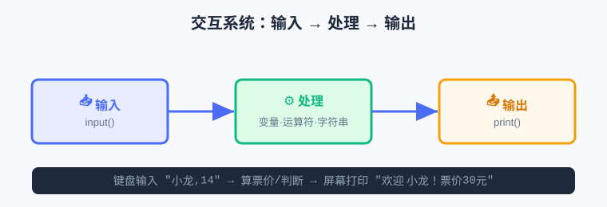

<div style="display:flex; gap:12px; margin-bottom:24px; flex-wrap:wrap; align-items:center;">
  <span style="background:#f0f4ff; color:#4A6CF7; padding:4px 12px; border-radius:20px; font-size:0.85em; font-weight:600; border:1px solid rgba(74,108,247,0.2);">📖 第5章</span>
  <span style="background:#f0fdf4; color:#16a34a; padding:4px 12px; border-radius:20px; font-size:0.85em; font-weight:600; border:1px solid rgba(22,163,74,0.2);">⏱️ ~30 min read</span>
  <span style="background:#f0fdf4; color:#16a34a; padding:4px 12px; border-radius:20px; font-size:0.85em; font-weight:600; border:1px solid rgba(22,163,74,0.2);">🎯 Beginner</span>
</div>

# Chapter 5: 输入与输出

> 📝 **Before You Continue:** 先读完 [Chapter 4: 运算符与表达式](operators.md)，知道怎么用比较/逻辑算出一个"对错"。本章让程序**听你说话**——把写死的数据变成你实时输入的，闭环成真正的"交互系统"。

前四章里，名字、年龄、分数都是我们**提前写死**在代码里的。可真实程序——点奶茶小程序、问答机器人——是**你输什么，它回什么**。这就需要 **输入（input）** 和 **输出（output）** 两头接通。

为什么这章是分水岭？因为从此程序从"自言自语"变成"能对话"。输入 → 处理 → 输出，这条流水线是所有软件的原型：计算器、聊天机器人、游戏，全跑不出这个圈。学完这章，你前面攒的变量、字符串、运算符，终于能"活"起来为人服务。

<div class="story-scene">
<strong>🎬 开场小剧场：售票问答机上线</strong>
<p>游乐场售票口不能只自言自语：“欢迎光临”。它必须问游客叫什么、几岁、买几张票，再算出结果。小派第一次让程序等人输入，感觉电脑终于会听话了。</p>
<p>售票问答机 input-output 说：“真正的软件都有三步：听你说什么，自己处理一下，再把结果回答给你。”从这一章开始，程序变成能交流的小助手。</p>
</div>

<div class="quest-card">
<strong>🎯 本章任务卡</strong>
<ul>
<li>用 <code>input()</code> 读取用户输入。</li>
<li>把输入的字符串转成整数或小数。</li>
<li>用 f-string 输出自然的回答。</li>
<li>用 <code>split()</code> 处理一行多个输入。</li>
<li>做出一个完整的门票问答机。</li>
</ul>
</div>

<div class="boss-bug">
<strong>👾 本章 Boss Bug：输入全是字符串怪</strong>
<p>它会让你以为输入的 <code>14</code> 是数字，其实拿到的是字符串 <code>"14"</code>。打败它的武器是 <code>int(input())</code> 或 <code>float(input())</code>。</p>
</div>

---

## 5.1 input()：让电脑听你说话

<div class="try-it">
<strong>🧩 练一练 5.1</strong>
<p>题目：用 input() 问用户名字，并打印"你好，XX"。</p>
<details><summary>💡 看看答案</summary>
<p>答案：<code>name = input("你叫什么？")</code> 后 <code>print("你好，" + name)</code>。</p>
</details>
</div>

`input(提示语)` 会**暂停程序**，等你从键盘打字、按回车，然后把你说的内容作为**字符串**返回。

```python
name = input("你叫什么名字？ ")
print("你好，" + name + "！")
```

运行后：
```
你叫什么名字？ 小龙
你好，小龙！
```

> 💡 **Key Insight:** `input()` 永远返回**字符串**，哪怕你输的是数字。这点和第 2 章的类型息息相关——想当数字用，必须自己转。

> ⚠️ **Warning:** `input()` 里的文字只是"提示"，会显示给你看，但**不会**被当成数据。真正拿到的是你后面敲的内容。别把提示语误当成输入值。

---

## 5.2 类型转换：int(input())

<div class="try-it">
<strong>🧩 练一练 5.2</strong>
<p>题目：让用户输入两个数（用 int(input())），打印它们的和。</p>
<details><summary>💡 看看答案</summary>
<p>答案：<code>a=int(input()); b=int(input()); print(a+b)</code>。注意 input 得到的是字符串，必须转 int 才能相加。</p>
</details>
</div>

因为 `input()` 返回字符串，要算数就得转类型：

```python
age = int(input("你几岁？ "))     # 先把输入转成整数
print("明年你就", age + 1, "岁啦")
```

运行：
```
你几岁？ 14
明年你就 15 岁啦
```

```python
# 小数也一样：用 float()
height = float(input("身高(米)："))
print("身高是", height, "米")
```

> 🐛 **Common Bug:** 直接 `age = input("几岁？"); print(age + 1)` 会报错——`age` 是字符串 `"14"`，字符串加数字非法。务必 `int(input(...))` 或 `float(input(...))`。

> 🤔 **Why 要现场转？** 因为用户每次输的都不一样，程序没法提前写死类型。运行时把"文字输入"转成"数值"，是交互程序的标配动作。

---

## 5.3 f-string 输出

<div class="try-it">
<strong>🧩 练一练 5.3</strong>
<p>题目：用 f-string 打印"我叫 X，今年 Y 岁"（变量 name、age）。</p>
<details><summary>💡 看看答案</summary>
<p>答案：<code>print(f"我叫 {name}，今年 {age} 岁")</code>。花括号里直接写变量名。</p>
</details>
</div>

输入和前面学的 f-string 一结合，就能做出自然的对话感：

```python
name = input("名字：")
age = int(input("年龄："))
print(f"欢迎 {name}，{age} 岁的你正适合来算法游乐场！")
```

> 💡 **Pro Tip:** 把 `input` 直接嵌进 f-string 也行：`print(f"欢迎 {input('名字：')}")`，但分开写更易读、易调试。初学推荐先存变量。

---

## 5.4 多值输入：split()

<div class="try-it">
<strong>🧩 练一练 5.4</strong>
<p>题目：用户输入一行"3 5 7"，用 split 取出三个数并求和。</p>
<details><summary>💡 看看答案</summary>
<p>答案：<code>nums = input().split()</code> 得到 <code>['3','5','7']</code>，再 <code>sum(int(x) for x in nums)</code> = 15。</p>
</details>
</div>

一次要输多个数（比如两个坐标、长和宽），用 `split()` 按空格切开，再分别转换：

```python
x, y = input("输入两个数，用空格隔开：").split()
x = int(x)
y = int(y)
print("和是", x + y)
```

运行：
```
输入两个数，用空格隔开：3 5
和是 8
```

> 📝 **Note:** `split()` 默认按"空白（空格/制表符）"切，返回一串字符串组成的列表（"列表"第 10 章正式学）。这里先照用：`a, b = "3 5".split()` 会把 `"3"` 给 `a`、`"5"` 给 `b`。

> 💡 **Pro Tip:** 想要别的分隔符，比如逗号：`input().split(",")`。做"批量输入"题（算法竞赛常见）时极好用。

---

## 5.5 案例：互动问答机器人

<div class="try-it">
<strong>🧩 练一练 5.5</strong>
<p>题目：写一个互动问答：问对方最喜欢的语言，打印一句带答案的话。</p>
<details><summary>💡 看看答案</summary>
<p>答案：<code>lang = input("你最喜欢的语言？")</code> 然后 <code>print(f"原来你喜欢 {lang}！")</code>。</p>
</details>
</div>

让程序根据你说的话回应，最简单的"聊天机器人"雏形：

```python
hobby = input("你平时最喜欢做什么？ ")
print(f"哇，{hobby} 听起来超有意思！我也是这么觉得～")
food = input("那最爱吃什么？ ")
print(f"{food} 我也爱！下次一起去吃 🍜")
```

运行：
```
你平时最喜欢做什么？ 打篮球
哇，打篮球 听起来超有意思！我也是这么觉得～
那最爱吃什么？ 拉面
拉面 我也爱！下次一起去吃 🍜
```

---

## 5.6 案例：BMI 计算器（接第2章）

把第 2 章写死的 BMI 程序，升级成"你输数据、它算结果"的交互版：

```python
name = input("名字：")
height = float(input("身高(米)："))
weight = float(input("体重(公斤)："))

bmi = weight / (height ** 2)
print(f"{name}，你的 BMI 是 {bmi:.1f}")

# 顺手加一句健康提示（比较运算来自第4章）
if bmi < 18.5:
    print("偏瘦，注意营养 🍚")
elif bmi <= 24:
    print("标准，保持得很好 💪")
else:
    print("偏重，多运动哦 🏃")
```

运行示例：
```
名字：小龙
身高(米)：1.75
体重(公斤)：68
小龙，你的 BMI 是 22.2
标准，保持得很好 💪
```

> 💡 **Key Insight:** 看！第 2 章的变量 + 第 4 章的比较 + 本章的 `input`，三章知识**串成一条流水线**：输入 → 计算 → 判断 → 输出。这就是"交互系统"的真身。

---

## 🔍 计算思维聚焦：交互系统（Input → Process → Output）

本章 CT 概念是 **交互系统**——把程序看成一台"加工机"：**输入原材料，内部处理，输出成品**。

- **输入（Input）**：从用户/文件/网络获取数据（这里用 `input()`）。
- **处理（Process）**：用变量、运算符、字符串方法加工（算 BMI、判断区间）。
- **输出（Output）**：把结果交回用户（`print`）。

漫画式类比：你走进奶茶店（输入"要珍珠奶茶少糖"）→ 店员按配方做（处理）→ 递给你杯子（输出）。任何 App 都是这个循环放大版。学会画"输入→处理→输出"的流程图，你就能把模糊需求拆成可实现的三段。



上图把"互动问答机器人"画成流水线：键盘输入喂进处理器，处理器用前面学的知识算出结果，再从屏幕输出。每一步职责单一、清晰。

---

## 🛠️ 项目工坊：算法游乐场 · 门票问答机

游乐场大升级！把第 2 章写死的"游客名牌"变成**会对话的门票问答机**：游客自己输入名字和年龄，游乐场算出票价并欢迎他。

```python
# 算法游乐场 · 门票问答机（第5章新增）
print("🎡 欢迎来到算法游乐场！")
name = input("请告诉我你的名字：")
age = int(input("今年几岁啦？ "))

# 票价规则：12 岁以下儿童票 15 元，其余标准票 30 元
if age < 12:
    price = 15
else:
    price = 30

print("=" * 30)
print(f"你好，{name}！欢迎光临 🎡")
print(f"你的票价是 {price} 元，请尽情玩耍！")
print("=" * 30)
```

运行示例：
```
🎡 欢迎来到算法游乐场！
请告诉我你的名字：小龙
今年几岁啦？ 14
==============================
你好，小龙！欢迎光临 🎡
你的票价是 30 元，请尽情玩耍！
==============================
```

现在游乐场升级了 **「门票问答机」**：从"写死名牌"进化到"实时对话售票"——游客输入驱动整个流程。第 6 章学完 `if` 后，你可以给票价加更多规则（如老人优惠、会员折扣）。

---

## 🏅 本章通关徽章：售票问答机工程师

<div class="badge-card">
<strong>如果你能做到下面 4 件事，就获得“售票问答机工程师”徽章：</strong>
<ul>
<li>能用 <code>input()</code> 接收用户输入。</li>
<li>能把输入转换成需要的数字类型。</li>
<li>能用 f-string 输出带变量的自然句子。</li>
<li>能写出一个“输入 → 处理 → 输出”的完整小程序。</li>
</ul>
</div>

---

## ⚠️ Common Mistakes in Chapter 5

| # | 误区 | 示例 | 为什么错 | 修正 |
|---|------|------|---------|------|
| 1 | 忘了 `input` 返回字符串 | `age = input(); age + 1` 报错 | 字符串不能加数字 | `int(input(...))` |
| 2 | 把提示语当数据 | `input("14")` 以为输入是 14 | 提示只是显示，真值靠你敲 | 真值来自回车后的输入 |
| 3 | `split` 转类型漏做的 | `a, b = input().split()` 后直接 `a+b` | 切开仍是字符串 | 各自 `int(a)`/`int(b)` |
| 4 | 中文引号写 input 提示 | `input("名字：")` | 报错或乱码 | 用英文引号 |
| 5 | 输非数字给 `int()` | 输 `"abc"` 给 `int(input())` | 转换失败崩溃 | 确保输数字，或加异常处理（后面学） |
| 6 | 多值个数对不上 | `x, y = input().split()` 只输一个数 | 解包数量不匹配报错 | 输入个数要和解包一致 |

---

## Chapter Summary

### 📌 Key Takeaways

| 概念 | 要点 | 为什么重要 |
|------|------|------------|
| `input()` | 暂停等输入，返回字符串 | 程序"听人说话"的入口 |
| 类型转换 | `int(input())`/`float(input())` | 把文字输入变数值 |
| f-string 输出 | 把输入值拼回对话 | 自然的交互体验 |
| `split()` | 一次切多个值 | 批量/坐标输入 |
| 输入→处理→输出 | 交互系统三步走 | 所有软件的原型 |
| 串联前章 | 变量+运算符+字符串活用 | 知识第一次"跑成流水线" |

### ❓ FAQ

**Q1: `input()` 一定要带提示语吗？**
> A: 不必。`input()` 也能空着调用，只是没提示用户不知道该输什么。带提示更友好，建议养成习惯。

**Q2: 用户输错（比如该输数字却输字母）程序会怎样？**
> A: `int("abc")` 会抛 `ValueError` 直接崩溃。严谨做法要"异常处理"（后面章节学 `try/except`）。初学先保证自己输入正确格式。

**Q3: `split()` 不写参数默认按什么切？**
> A: 默认按任意空白（空格、Tab、换行）切。写 `split(",")` 就按逗号切。多个空格也会被当成"一个分隔"，很省心。

### 🔗 Connections to Later Chapters

- **[Chapter 6: 条件判断 if](../control-flow/conditionals.md)** 正式讲 `if / elif / else`，把本章票价判断写得更完整、加老人/会员规则。
- **[Chapter 7: 循环 while](../control-flow/while-loops.md)** 让问答机"反复问"而不退出，做持续对话。
- **[Chapter 10: 列表 list](../data-structures/lists.md)** `split()` 返回的就是列表，学完你会真正懂多值输入的底层。
- **[Chapter 14: 函数入门](../functions/functions-intro.md)** 把"门票问答机"包成函数，主程序一句调用。

---


## 🎮 加练任务包

> 下面这些题目不一定比章末题更难，但更适合“多刷几遍、把手感练出来”。建议先独立做，再展开提示。

### 加练 5.A · 欢迎语生成器 🟢

用 `input()` 询问名字，然后输出 `欢迎你，名字！`。

<details>
<summary>💡 提示 / 答案要点</summary>

`name = input("名字：")`，再 `print(f"欢迎你，{name}！")`。

</details>

---

### 加练 5.B · 两数相加 🟢

用户一行输入 `3 5`，请用 `split()` 读出两个数并输出和。

<details>
<summary>💡 提示 / 答案要点</summary>

`a, b = input().split()`，再 `a = int(a); b = int(b); print(a + b)`。输入默认是字符串，必须转整数。

</details>

---

### 加练 5.C · 门票计算器 🟡

输入票价和人数，输出总价。例如输入 `30 4`，输出 `总价：120`。

<details>
<summary>💡 提示 / 答案要点</summary>

拆成两个数：`price, count = input().split()`，都转 `int`，总价是 `price * count`。

</details>

---


---

## Practice Problems

---

**Problem 5.1 — 回声机器人** 🟢 Easy

用 `input()` 读入一句话，再用 f-string 原样回显，前面加个"你说："。

**Sample Input:**（运行后键盘输入）
```
你好呀
```
**Sample Output:** `你说：你好呀`

<details>
<summary>💡 Solution (click to reveal)</summary>

**Approach:** `input()` 存变量，f-string 拼接前缀打印。

```python
text = input()
print(f"你说：{text}")
```

**Key points:**
- `input()` 不带提示也行，但这里为清晰可写 `input("说点什么：")`。
- 回显就是"输入即输出"的最小交互。

</details>

---

**Problem 5.2 — 年龄计算器** 🟢 Easy

让用户输入出生年份（整数），打印"你今年 X 岁"（假设今年 2025）。

**Sample Input:**（运行后输入）
```
2011
```
**Sample Output:** `你今年 14 岁`

<details>
<summary>💡 Solution (click to reveal)</summary>

**Approach:** `int(input())` 转整数，用今年减去出生年。

```python
birth = int(input("出生年份："))
age = 2025 - birth
print(f"你今年 {age} 岁")
```

**Key points:**
- 必须 `int(...)` 转换，否则是字符串相减报错。
- 年份差即年龄（忽略具体生日，简化版）。

</details>

---

**Problem 5.3 — 两数求和器** 🟡 Medium

用户输入用空格隔开的两个整数，程序输出它们的和。用 `split()` 实现。

**Sample Input:**（运行后输入）
```
12 30
```
**Sample Output:** `和是 42`

<details>
<summary>💡 Solution (click to reveal)</summary>

**Approach:** `split()` 切开成两个字符串，分别转 `int` 再相加。

```python
a, b = input("输入两个整数（空格隔开）：").split()
a = int(a)
b = int(b)
print("和是", a + b)
```

**Key points:**
- `split()` 默认按空格切，返回两个字符串。
- 解包 `a, b = ...` 要求正好两个值，输入个数要匹配。
- 转 `int` 后才能做加法。

</details>

---

**Problem 5.4 — 智能票价台（挑战）** 🏆 Challenge

扩展本章门票问答机：除"12 岁以下 15 元、其余 30 元"外，再加规则——**60 岁及以上老人票 20 元**。用 `if / elif / else`（第 6 章正式讲，这里先照结构写）根据输入的 `age` 算出 `price` 并打印欢迎语。测试 `age = 65` 应输出票价 20。

**Sample Input:**（运行后输入）
```
65
```
**Sample Output:** `你的票价是 20 元，请尽情玩耍！`

<details>
<summary>💡 Solution (click to reveal)</summary>

**Approach:** 用 `if / elif / else` 按年龄三段分票价，把结果存进 `price` 再打印。

```python
age = int(input("今年几岁啦？ "))
if age < 12:
    price = 15          # 儿童
elif age >= 60:
    price = 20          # 老人
else:
    price = 30          # 标准
print(f"你的票价是 {price} 元，请尽情玩耍！")
```

**Key points:**
- 分支顺序有讲究：`age < 12` 先判儿童；`elif age >= 60` 判老人；其余（12~59）走 `else` 标准票。
- 把分支结果存进 `price` 变量，最后统一打印，逻辑清爽。
- 第 6 章会讲清 `elif` 是"否则如果"，以及分支只走第一条命中的规则。

</details>

---

> 💡 **记住这一句：** 输入 → 处理 → 输出，是每台软件都在跑的流水线——`input()` 接通用户，前面学的变量、字符串、运算符在中间加工，`print` 把成果交还，程序从此会"对话"。
