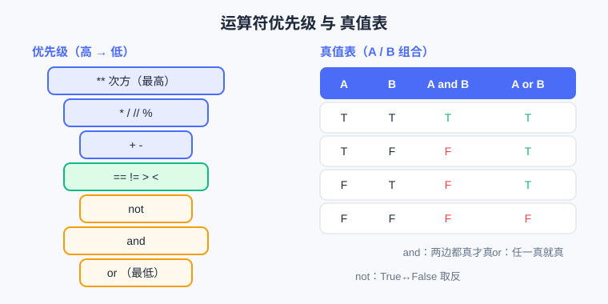

<div style="display:flex; gap:12px; margin-bottom:24px; flex-wrap:wrap; align-items:center;">
  <span style="background:#f0f4ff; color:#4A6CF7; padding:4px 12px; border-radius:20px; font-size:0.85em; font-weight:600; border:1px solid rgba(74,108,247,0.2);">📖 第4章</span>
  <span style="background:#f0fdf4; color:#16a34a; padding:4px 12px; border-radius:20px; font-size:0.85em; font-weight:600; border:1px solid rgba(22,163,74,0.2);">⏱️ ~30 min read</span>
  <span style="background:#f0fdf4; color:#16a34a; padding:4px 12px; border-radius:20px; font-size:0.85em; font-weight:600; border:1px solid rgba(22,163,74,0.2);">🎯 Beginner</span>
</div>

# Chapter 4: 运算符与表达式

> 📝 **Before You Continue:** 先读完 [Chapter 3: 字符串与文本处理](strings.md)，知道怎么用 `in` 判断"是否包含"。本章讲**运算符**——让 Python 做算术、做比较、做逻辑判断的工具，是"让程序会思考"的关键一步。

点奶茶时你会算"大杯加珍珠贵多少"（算术）、看"满 30 减 5 是不是划算"（比较）、想"要热的**而且**不加糖"（逻辑）。程序也一样：它靠**运算符**把数据变成"结果"或"对错"。

为什么这章重要？因为**所有"智能判断"都建立在表达式上**。闰年怎么算、成绩过没过线、游客是不是儿童——本质都是一行带运算符的表达式。学会它，你才真正让电脑"动脑子"，而不只是"存东西、打印东西"。

<div class="story-scene">
<strong>🎬 开场小剧场：积分计算器开机</strong>
<p>游乐场积分兑换处挤满游客。有人要算总价，有人问积分够不够，有人说“我要热饮而且不加糖”。小派发现，光有变量还不够，必须会计算、比较和组合条件。</p>
<p>积分计算器 operator 亮起屏幕：“加减乘除交给我，够不够交给比较，多个条件交给逻辑运算。表达式，就是程序思考时打的算盘。”</p>
</div>

<div class="quest-card">
<strong>🎯 本章任务卡</strong>
<ul>
<li>用算术运算符完成加减乘除、整除、取余和次方。</li>
<li>用比较运算符得到 <code>True</code> 或 <code>False</code>。</li>
<li>用 <code>and</code>、<code>or</code>、<code>not</code> 组合条件。</li>
<li>理解运算符优先级，必要时加括号。</li>
<li>把生活规则写成 Python 表达式。</li>
</ul>
</div>

<div class="boss-bug">
<strong>👾 本章 Boss Bug：除法双胞胎怪</strong>
<p>它会让你混淆 <code>/</code> 和 <code>//</code>：一个得到小数，一个只留整数商。打败它的口诀是：要精确除法用 <code>/</code>，要整除商用 <code>//</code>。</p>
</div>

---

## 4.1 算术运算符：+ - * / // % **

<div class="try-it">
<strong>🧩 练一练 4.1</strong>
<p>题目：17 // 5 和 17 % 5 各是多少？</p>
<details><summary>💡 看看答案</summary>
<p>答案：<code>17 // 5 = 3</code>（整除，商 3），<code>17 % 5 = 2</code>（取余，剩 2）。</p>
</details>
</div>

这些和数学里差不多，但有两个要特别注意：`//` 整除、`%` 取余、`**` 次方。

| 运算符 | 含义 | 例子 | 结果 |
|--------|------|------|------|
| `+` | 加 | `3 + 4` | `7` |
| `-` | 减 | `10 - 3` | `7` |
| `*` | 乘 | `3 * 4` | `12` |
| `/` | 除（得小数） | `10 / 4` | `2.5` |
| `//` | 整除（砍小数） | `10 // 4` | `2` |
| `%` | 取余（余数） | `10 % 4` | `2` |
| `**` | 次方 | `2 ** 3` | `8` |

```python
print(10 / 4)    # 2.5  普通除法
print(10 // 4)   # 2    整除，只留整数部分
print(10 % 4)    # 2    余数：10 = 4*2 + 2
print(2 ** 3)    # 8    2 的 3 次方
```

> 💡 **Key Insight:** `%`（取余）超级有用——判断奇偶（`x % 2 == 0` 是偶数）、判断整除、做循环里的"每隔几个"。后面算法篇的很多技巧都靠它。

> 🐛 **Common Bug:** 把 `/` 和 `//` 混了。`10 / 4` 得 `2.5`（float），`10 // 4` 得 `2`（int）。要"除完取整"才用 `//`，否则用 `/`。

---

## 4.2 比较运算符：== != > < >= <=

<div class="try-it">
<strong>🧩 练一练 4.2</strong>
<p>题目：写表达式判断年份 y 是闰年（被 4 整除且不被 100 整除，或被 400 整除）。</p>
<details><summary>💡 看看答案</summary>
<p>答案：<code>(y % 4 == 0 and y % 100 != 0) or (y % 400 == 0)</code>。整百年必须被 400 整除才算闰年。</p>
</details>
</div>

比较运算符问"两个值什么关系？"，答案永远是 `True` 或 `False`（布尔值）。

| 运算符 | 含义 | 例子 | 结果 |
|--------|------|------|------|
| `==` | 等于 | `3 == 3` | `True` |
| `!=` | 不等于 | `3 != 4` | `True` |
| `>` | 大于 | `5 > 3` | `True` |
| `<` | 小于 | `2 < 1` | `False` |
| `>=` | 大于等于 | `5 >= 5` | `True` |
| `<=` | 小于等于 | `3 <= 2` | `False` |

```python
print(3 == 3)    # True
print(3 != 4)    # True
print(10 >= 60)  # False
```

> ⚠️ **Warning:** `=` 是"赋值"，`==` 才是"等于比较"。写成 `if x = 5:` 会报错——这是新手最高频错误之一。第 2 章提过，这里再强调：比较用双等 `==`。

---

## 4.3 逻辑运算符：and / or / not

<div class="try-it">
<strong>🧩 练一练 4.3</strong>
<p>题目：表达式 True and False or True 的结果是？</p>
<details><summary>💡 看看答案</summary>
<p>答案：<code>True</code>。先算 <code>and</code>：<code>True and False = False</code>，再算 <code>or</code>：<code>False or True = True</code>。</p>
</details>
</div>

逻辑运算符把多个"对错"组合成更复杂的判断。

| 运算符 | 含义 | 规则 |
|--------|------|------|
| `and` | 而且 | 两边都为 True 才 True |
| `or` | 或者 | 任一边为 True 就 True |
| `not` | 取反 | True 变 False，False 变 True |

```python
age = 14
print(age >= 6 and age <= 12)   # False（14 不在 6~12）
print(age < 6 or age > 12)      # True（14 > 12）
print(not (age > 12))           # False（取反）
```

> 🧠 Mental Model: 逻辑运算像红绿灯安检
> - `and` = "两道闸都得开"才放行（严格）。
> - `or` = "任意一道开"就放行（宽松）。
> - `not` = "把放行变拦下、拦下变放行"（反转）。

---

## 4.4 运算符优先级

<div class="try-it">
<strong>🧩 练一练 4.4</strong>
<p>题目：3 + 2 * 4 等于几？为什么不是 20？</p>
<details><summary>💡 看看答案</summary>
<p>答案：<code>11</code>。<b>乘法优先于加法</b>，先算 2*4=8，再加 3。要想先加就加括号：(3+2)*4=20。</p>
</details>
</div>

一堆运算符写一起，谁先算？和数学一样：**先乘除后加减**，Python 还有自己的次序。记不住就用**括号 `()`**——括号永远最优先，且让代码更清晰。

优先级从高到低（节选常用）：

```
**  (次方)
* / // %
+ -
比较 == != > < >= <=
not
and
or
```

```python
print(2 + 3 * 4)        # 14（先乘后加）
print((2 + 3) * 4)      # 20（括号先算）
print(10 % 3 == 1)      # True（先 % 得 1，再比较）
```

> 💡 **Pro Tip:** 宁可多写括号，也不要赌自己记得住优先级。 `(age >= 6 and age <= 12)` 比 `age >= 6 and age <= 12` 更不容易读错——虽然这里 and 本来就后算，但括号帮人脑不帮电脑。

---

## 4.5 真值表

<div class="try-it">
<strong>🧩 练一练 4.5</strong>
<p>题目：用真值表判断：not (True and False) 是？</p>
<details><summary>💡 看看答案</summary>
<p>答案：<code>not False = True</code>。先括号里 <code>True and False = False</code>，再取反得到 True。</p>
</details>
</div>

把 `and` / `or` / `not` 的所有输入组合和结果列成表，就是**真值表（truth table）**。它是逻辑思维的"乘法口诀"，必须背熟。

| A | B | A and B | A or B | not A |
|---|---|---------|--------|-------|
| True | True | True | True | False |
| True | False | False | True | False |
| False | True | False | True | True |
| False | False | False | False | True |

```python
# 自己验证一下
print(True and False)   # False
print(True or False)    # True
print(not True)         # False
```



上图左半边是优先级金字塔（越上面越先算），右半边是真值表速查。写复杂判断前扫一眼，少踩坑。

---

## 4.6 案例：闰年判断

闰年规则（公历）：**能被 4 整除但不能被 100 整除，或者能被 400 整除**。直接翻译成表达式：

```python
year = 2024
is_leap = (year % 4 == 0 and year % 100 != 0) or (year % 400 == 0)
print(is_leap)     # True（2024 是闰年）
```

逐段拆开：
- `year % 4 == 0`：能被 4 整除。
- `year % 100 != 0`：不能被 100 整除。
- 前两者用 `and` 连：普通闰年。
- `year % 400 == 0`：世纪闰年（如 2000）。
- 两组用 `or` 连：满足任一即为闰年。

> 🤔 **Why 这么绕？** 因为历法要补"地球绕太阳"的误差。规则看似复杂，但用 `and`/`or`/`%` 一翻译就清清楚楚——这就是"把生活规则变成代码"的典范。

---

## 4.7 案例：成绩门槛

判断分数落在哪个区间：优秀（≥90）、及格（≥60）、不及格（<60）。

```python
score = 85
print(score >= 90)              # False（不是优秀）
print(score >= 60 and score < 90)  # True（良好/及格区间）
print(score < 60)               # False
```

> 📝 **Note:** 真正的"分段输出"要用 `if`（第 6 章）。这里先用表达式得到 True/False，体会"门槛"是怎么用比较+逻辑搭出来的。

---

## 🧮 算法小课堂（前置彩蛋）

> 💡 **Key Insight:** 这一章的真值表，是**布尔代数（Boolean algebra）** 的基石——计算机底层所有的"是/否""开/关""1/0"判断，都建立在这套逻辑上。记住：在谈"算法快不快"（第 17 章的 Big-O）**之前**，你得先有"对/错"的思维。很多算法题的第一步，就是把条件用 `and`/`or`/`not` 写对——逻辑错了，跑得再快也白搭。

（这个重复结构 / 逻辑判断的"代价"概念，第 17 章会告诉你它叫 **O(n)**——那时你会回看本章：原来"判断一个条件"就是一次最小的计算单元。）

---

## 🛠️ 项目工坊：算法游乐场 · 智能判断题

游乐场再升级！做一个"智能判断题"：游客输入分数，游乐场立刻判断"及格 / 优秀"，顺便用逻辑运算埋好第 6 章 `if` 的伏笔。

```python
# 算法游乐场 · 智能判断题（第4章新增）
score = int(input("请输入你的分数（0~100）："))

is_pass = score >= 60
is_excellent = score >= 90

print(f"及格了吗？{is_pass}")
print(f"优秀吗？{is_excellent}")

# 浅用 if 预告第6章：根据布尔值选不同欢迎语
if is_excellent:
    print("🌟 优秀！游乐场给你发 VIP 徽章")
elif is_pass:
    print("🎟️ 及格，欢迎畅玩")
else:
    print("💪 再加把劲，下次见！")
```

**输出示例（输入 95）：**
```
请输入你的分数（0~100）：95
及格了吗？True
优秀吗？True
🌟 优秀！游乐场给你发 VIP 徽章
```

现在游乐场多了 **「智能判断题」**：用比较 + 逻辑算出布尔结果，再决定给游客什么反馈。第 6 章会正式把 `if` 讲透，到时候这段代码你能写得更优雅。

---

## 🏅 本章通关徽章：积分计算师

<div class="badge-card">
<strong>如果你能做到下面 4 件事，就获得“积分计算师”徽章：</strong>
<ul>
<li>能正确使用 <code>+</code>、<code>-</code>、<code>*</code>、<code>/</code>、<code>//</code>、<code>%</code>、<code>**</code>。</li>
<li>能写出返回 <code>True</code> 或 <code>False</code> 的比较表达式。</li>
<li>能用 <code>and</code>、<code>or</code>、<code>not</code> 组合条件。</li>
<li>能用括号让复杂表达式更清楚。</li>
</ul>
</div>

---

## ⚠️ Common Mistakes in Chapter 4

| # | 误区 | 示例 | 为什么错 | 修正 |
|---|------|------|---------|------|
| 1 | `=` 当 `==` 用 | `if x = 5:` | `=` 是赋值，不能做判断 | 比较用 `==` |
| 2 | 整除与除法混 | `10 / 4` 以为得 `2` | `/` 得 `2.5`，`//` 才得 `2` | 要取整用 `//` |
| 3 | 取余理解错 | `10 % 4` 以为得 `2.5` | `%` 是余数不是商 | `10 % 4 = 2`（余） |
| 4 | `and`/`or` 用反 | 该用 `or` 写成 `and` | 语义反了，判断恒错 | 理清"都要"还是"任一" |
| 5 | 优先级漏括号 | `age >= 6 and age <= 12` 想加别的忘括号 | 复杂表达式易读错 | 关键处加 `()` 显式分组 |
| 6 | 闰年漏世纪年 | `year%4==0` 当成全部 | 漏了 `%100`/`%400` 特例 | 用完整 `(...) or (...)` 公式 |

---

## Chapter Summary

### 📌 Key Takeaways

| 概念 | 要点 | 为什么重要 |
|------|------|------------|
| 算术 `// % **` | 整除、取余、次方 | 奇偶/周期/幂运算基础 |
| 比较 `== != > <` | 返回 True/False | 一切判断的起点 |
| 逻辑 `and or not` | 组合多个对错 | 复杂条件由简到繁 |
| 优先级 | 先乘除后加减，括号最优先 | 写对"先算谁" |
| 真值表 | and/or/not 全组合结果 | 逻辑思维的乘法口诀 |
| 布尔值 | 表达式的"对错"结论 | 程序"会思考"的最小单元 |

### ❓ FAQ

**Q1: `==` 和 `is` 一样吗？**
> A: 初学阶段先只用 `==`（判断"值相等"）。`is` 判断"是不是同一个对象"，语义不同，容易踩坑。本书前段统一用 `==`。

**Q2: `not` 只能接布尔值吗？**
> A: `not` 也能接其他值，但会先按"真假规则"转换（如 `not 0` 是 `True`，`not ""` 是 `True`）。初学建议只接布尔表达式，最清晰。

**Q3: 优先级记不住怎么办？**
> A: 一律加括号。代码是写给人看的，括号让意图一目了然，电脑也绝不会算错顺序。

### 🔗 Connections to Later Chapters

- **[Chapter 5: 输入与输出](input-output.md)** 让 `score = int(input(...))` 变成游客实时输入，智能判断题变交互式。
- **[Chapter 6: 条件判断 if](../control-flow/conditionals.md)** 正式讲 `if / elif / else`，把本章的布尔结果变成"选不同分支执行"。
- **[Chapter 17: 算法与效率入门 Big-O](../algorithms/big-o.md)** 回看本章彩蛋：每个条件判断是一次最小计算，效率从这数起。
- **[Chapter 18: 搜索算法](../algorithms/searching.md)** 大量用到比较运算（`==`、`<`）做查找与边界判断。

---


## 🎮 加练任务包

> 下面这些题目不一定比章末题更难，但更适合“多刷几遍、把手感练出来”。建议先独立做，再展开提示。

### 加练 4.A · 奇偶检票 🟢

写一个表达式判断 `x` 是否为偶数。

<details>
<summary>💡 提示 / 答案要点</summary>

`x % 2 == 0`。`%` 是取余，能被 2 整除就说明余数是 0。

</details>

---

### 加练 4.B · 满减判断 🟢

订单金额 `price` 满 50 且用户是会员 `is_member` 时打折。写出布尔表达式。

<details>
<summary>💡 提示 / 答案要点</summary>

`price >= 50 and is_member`。两个条件都成立才打折，所以用 `and`。

</details>

---

### 加练 4.C · 优先级加括号 🟡

表达式 `3 + 2 * 4 > 10 and not False` 的结果是什么？建议加括号说明计算顺序。

<details>
<summary>💡 提示 / 答案要点</summary>

先乘法：`3 + 8 = 11`；`11 > 10` 为 True；`not False` 为 True；最后 `True and True` 为 True。

</details>

---


---

## Practice Problems

---

**Problem 4.1 — 奇偶判断器** 🟢 Easy

用 `%` 写一个表达式，判断变量 `n` 是偶数还是奇数，打印 `True`（偶）或 `False`（奇）。测试 `n = 7`。

**Sample Input:**
```python
n = 7
```
**Sample Output:** `False`（7 是奇数）

<details>
<summary>💡 Solution (click to reveal)</summary>

**Approach:** 偶数能被 2 整除，即余数为 0；所以 `n % 2 == 0` 为真表示偶数。

```python
n = 7
print(n % 2 == 0)    # 7 % 2 = 1 ≠ 0 → False（奇数）
```

**Key points:**
- `%` 取余是奇偶判断的万能钥匙。
- 比较运算直接返回布尔值，可打印。

</details>

---

**Problem 4.2 — 成绩区间判断** 🟢 Easy

变量 `score = 78`，用比较运算打印：是否"及格"（≥60）且"未达优秀"（<90）。

**Sample Input:**
```python
score = 78
```
**Sample Output:** `True`（既不不及格，也还没到优秀）

<details>
<summary>💡 Solution (click to reveal)</summary>

**Approach:** 用 `and` 把两个比较连起来：及格 且 未达优秀。

```python
score = 78
print(score >= 60 and score < 90)   # True and True → True
```

**Key points:**
- 区间判断常用 `下界 <= x < 上界` 形式。
- `and` 两边都为 True 才整体 True。

</details>

---

**Problem 4.3 — 闰年探测器** 🟡 Medium

写一个表达式判断 `year` 是否为闰年（用本章完整公式）。测试 `year = 1900`（应为 False）和 `year = 2000`（应为 True）。

**Sample Input:**
```python
year = 1900
```
**Sample Output:** `False`

<details>
<summary>💡 Solution (click to reveal)</summary>

**Approach:** 套用 `(能被4整除且不能被100整除) 或 能被400整除`。

```python
year = 1900
is_leap = (year % 4 == 0 and year % 100 != 0) or (year % 400 == 0)
print(is_leap)    # 1900%400 != 0 → False

year = 2000
is_leap = (year % 4 == 0 and year % 100 != 0) or (year % 400 == 0)
print(is_leap)    # 2000%400 == 0 → True
```

**Key points:**
- 世纪年（整百）必须能被 400 整除才是闰年，1900 不是、2000 是。
- 括号把"普通闰年"和"世纪闰年"两组清晰分开。

</details>

---

**Problem 4.4 — 门禁逻辑（挑战）** 🏆 Challenge

游乐场门禁规则：游客须满足 **（年龄 ≥ 12 且 已购票）** 或 **（是工作人员）** 才能进。设 `age=15`、`has_ticket=True`、`is_staff=False`，用 `and`/`or`/`not` 写出表达式并打印能否进入。再思考：若某人 `age=10, has_ticket=True, is_staff=False`，结果应是什么？为什么？

**Sample Input:**
```python
age = 15
has_ticket = True
is_staff = False
```
**Sample Output:** `True`（年龄够且购票 → 可进）

<details>
<summary>💡 Solution (click to reveal)</summary>

**Approach:** 把规则逐字翻译：`(年龄≥12 且 已购票) 或 是工作人员`。

```python
age = 15
has_ticket = True
is_staff = False
can_enter = (age >= 12 and has_ticket) or is_staff
print(can_enter)    # (True and True) or False → True

# 换一组：age=10, has_ticket=True, is_staff=False
age, has_ticket, is_staff = 10, True, False
can_enter = (age >= 12 and has_ticket) or is_staff
print(can_enter)    # (False and True) or False → False（儿童且无员工身份 → 不能进）
```

**Key points:**
- `and` 把"年龄+购票"绑成一组条件；`or` 让"工作人员"成为另一条放行通道。
- `age=10` 时 `age >= 12` 为 False，整组 `(False and ...)` 为 False，又不是 staff，所以进不去——逻辑完全符合规则。
- 这类"多条件组合"正是第 6 章 `if` 分支和第 17 章"条件代价"的高频场景。

</details>

---

> 💡 **记住这一句：** 运算符是程序的"思考零件"——算术算数值、比较分出对错、逻辑把对错拼成判断，所有智能决策都是一行表达式搭起来的。
