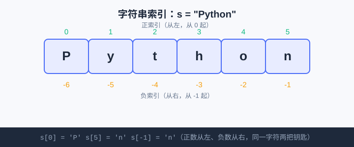

<div style="display:flex; gap:12px; margin-bottom:24px; flex-wrap:wrap; align-items:center;">
  <span style="background:#f0f4ff; color:#4A6CF7; padding:4px 12px; border-radius:20px; font-size:0.85em; font-weight:600; border:1px solid rgba(74,108,247,0.2);">📖 第3章</span>
  <span style="background:#f0fdf4; color:#16a34a; padding:4px 12px; border-radius:20px; font-size:0.85em; font-weight:600; border:1px solid rgba(22,163,74,0.2);">⏱️ ~35 min read</span>
  <span style="background:#f0fdf4; color:#16a34a; padding:4px 12px; border-radius:20px; font-size:0.85em; font-weight:600; border:1px solid rgba(22,163,74,0.2);">🎯 Beginner</span>
</div>

# Chapter 3: 字符串与文本处理

> 📝 **Before You Continue:** 先读完 [Chapter 2: 变量与数据类型](variables.md)，知道字符串（`str`）是什么、怎么用 `f-string` 把文字拼进句子。本章专攻"文字"本身——索引、切片、替换，让字符串变成你能随意雕刻的材料。

你发微信、写日记、做火星文签名……全都是"文字的游戏"。程序也一样：用户名、密码、聊天内容、成绩单，背后都是**字符串（string）**。如果只会把文字整段打印，那太浪费了——真正好玩的是：取出第几个字、截一段、把某些字替换掉、判断"这句话里有没有某个词"。

为什么中学生特别该学好字符串？因为**文本是你和电脑最自然的接口**：你输入一句话，程序读懂、改写、再回你一句话。聊天机器人、作业查重、甚至简单加密，底层全是字符串操作。

<div class="story-scene">
<strong>🎬 开场小剧场：暗号师接管留言板</strong>
<p>游乐场留言板上写满游客的话：有人写名字，有人写暗号，还有人把“猫”全写成“喵”。小派想一个字一个字手动改，越改越乱。</p>
<p>暗号师 string 拿出剪刀和胶水：“文字不是一整块石头，而是一串排好队的字符。能取第几个，能切一段，能替换，也能拆开再拼回去。”</p>
</div>

<div class="quest-card">
<strong>🎯 本章任务卡</strong>
<ul>
<li>用索引和切片取出字符串的一部分。</li>
<li>用 <code>len()</code> 数字符个数。</li>
<li>用 <code>upper</code>、<code>lower</code>、<code>replace</code> 改写文本。</li>
<li>用 <code>split</code> 和 <code>join</code> 拆分、拼接文字。</li>
<li>用 f-string 格式符排版输出。</li>
</ul>
</div>

<div class="boss-bug">
<strong>👾 本章 Boss Bug：字符串数字伪装怪</strong>
<p>它会把 <code>"14"</code> 伪装成数字 14。看起来一样，算起来完全不同。打败它的武器是 <code>int()</code>、<code>float()</code> 和先用 <code>type()</code> 看清身份。</p>
</div>

---

## 3.1 字符串是什么：一串排好队的字符

<div class="try-it">
<strong>🧩 练一练 3.1</strong>
<p>题目：创建字符串 s = "Python"，打印它的长度。</p>
<details><summary>💡 看看答案</summary>
<p>答案：<code>s = "Python"</code> 后 <code>print(len(s))</code> 输出 <code>6</code>。</p>
</details>
</div>

字符串就是**用英文引号包住的一串字符**，字符一个挨一个排好队，从左边数第 0 个开始。

```python
s = "Python"
print(s)          # Python
```

> 💡 **Key Insight:** 引号可以用 `" "` 或 `' '`，效果一样。当文字里本身带引号时，两种混用能省去转义麻烦，比如 `"他说'你好'"`。

---

## 3.2 拼接：用 + 把文字接起来

<div class="try-it">
<strong>🧩 练一练 3.2</strong>
<p>题目：把 "Hello" 和 "World" 拼成 "HelloWorld"（中间不留空格）。</p>
<details><summary>💡 看看答案</summary>
<p>答案：<code>print("Hello" + "World")</code> 输出 <code>HelloWorld</code>。要加空格就写 <code>"Hello " + "World"</code>。</p>
</details>
</div>

字符串之间用 `+` 拼接，像把两段胶布粘一起：

```python
first = "算法"
second = "游乐场"
print(first + second)        # 算法游乐场
print(first + " " + second)  # 算法 游乐场（中间加个空格）
```

> ⚠️ **Warning:** `+` 只能串字符串。想和数字拼，得先把数字 `str()` 转成文字，否则报错。回忆第 2 章的 `str(14)`。

---

## 3.3 索引：s[0] 取出第几个字符

<div class="try-it">
<strong>🧩 练一练 3.3</strong>
<p>题目：s = "Python"，取出第 1 个字符（索引 0）和最后一个（负数索引）。</p>
<details><summary>💡 看看答案</summary>
<p>答案：<code>s[0]</code> 是 <code>'P'</code>，<code>s[-1]</code> 是 <code>'n'</code>。负数从右往左数。</p>
</details>
</div>

每个字符都有"位置编号"，叫**索引（index）**，从 `0` 开始数（不是 1！）。用 `s[编号]` 取出对应字符。

```python
s = "Python"
print(s[0])   # P   ← 第 0 个
print(s[1])   # y
print(s[5])   # n   ← 最后一个
print(s[-1])  # n   ← 负数从右边数：-1 是倒数第 1 个
```

### 🧠 Mental Model: 字符串是带编号的储物柜



> 🤔 **Why 从 0 开始？** 这是计算机科学的老传统（源自 C 语言的内存偏移）。刚开始别扭，写几次就顺了。记住口诀：**"第 0 个是第一字符"**。

上图把 `"Python"` 每个字符的位置标出来：正数从左到右 `0~5`，负数从右到左 `-1~-6`。`s[0]` 是 `P`，`s[-1]` 也是 `n`。

> 🐛 **Common Bug:** 索引超出范围会报 `IndexError`。`"Python"` 只有 6 个字符（索引 0~5），写 `s[6]` 就炸。越界前先想想"到底有几个字符"。

---

## 3.4 切片：s[1:4] 取出一段

<div class="try-it">
<strong>🧩 练一练 3.4</strong>
<p>题目：s = "Python"，取出中间的 "yth"（索引 1 到 3）。</p>
<details><summary>💡 看看答案</summary>
<p>答案：<code>s[1:4]</code> 输出 <code>'yth'</code>。切片 <code>[a:b]</code> 取从 a 到 b-1。</p>
</details>
</div>

**切片（slice）** 取出"从第 a 个到第 b 个之前"的一段，写法 `s[a:b]`，**含头不含尾**（b 那个位置不取）。

```python
s = "Python"
print(s[1:4])    # yth  ← 取索引 1,2,3，不含 4
print(s[:3])     # Pyt  ← 从头取到索引 3 之前
print(s[3:])     # hon  ← 从索引 3 取到末尾
print(s[::2])    # Pto  ← 每隔一个取一个（步长 2）
```

> 💡 **Pro Tip:** 切片"越界不报错"——`s[3:99]` 不会崩，只会取到末尾。这比索引温柔，适合"我不确定有多长，取到尾就行"的场景。

> 🧠 **计算思维聚焦预告：** 最后那个 `s[::2]`（每隔一个取）就是**找规律**——后面"模式"一节你会看到，很多文本处理本质是"按某种规律挑字符"。

---

## 3.5 长度：len()

<div class="try-it">
<strong>🧩 练一练 3.5</strong>
<p>题目：字符串 "banana"，数一数里面有几个字母 'a'？</p>
<details><summary>💡 看看答案</summary>
<p>答案：3 个。可用 <code>"banana".count('a')</code> 得到 <code>3</code>。</p>
</details>
</div>

`len(字符串)` 返回字符个数：

```python
s = "Python"
print(len(s))        # 6
print(len(""))       # 0  ← 空字符串也有长度
```

> 📝 **Note:** 空格、标点都算一个字符。`len("a b")` 是 `3`（含中间的空格）。

---

## 3.6 大小写：upper() / lower()

`.upper()` 全变大写，`.lower()` 全变小写。注意：它们**返回新字符串**，原字符串不变（字符串不可改）。

```python
s = "Hello"
print(s.upper())     # HELLO
print(s.lower())     # hello
print(s)             # Hello  ← 原串没变
```

> 💡 **Key Insight:** 字符串是**不可变（immutable）**的——任何"修改"操作都返回一个新串，不会改掉原来的。别写 `s.upper()` 指望 `s` 自己变，要把结果存回 `s = s.upper()`。

---

## 3.7 替换：replace()

`原串.replace(旧, 新)` 把出现的"旧"全换成"新"，返回新串：

```python
text = "我喜欢猫"
text = text.replace("猫", "狗")
print(text)          # 我喜欢狗
```

---

## 3.8 成员判断：in

`子串 in 原串` 返回 `True`/`False`，判断"前者是不是后者的其中一部分"：

```python
print("Py" in "Python")     # True
print("xy" in "Python")     # False
```

这在"密码含数字""文本含敏感词"等判断里极常用。

---

## 3.9 f-string 完整写法

第 2 章初见 f-string，这里补全：它不只能塞变量，还能塞**表达式**和**方法调用**。

```python
name = "小龙"
print(f"你好，{name.upper()}！")         # 你好，小龙！ → 你好，小龙！(upper)
print(f"名字长度：{len(name)}")          # 名字长度：2
print(f"倒序：{name[::-1]}")             # 倒序：龙小
```

> 💡 **Pro Tip:** `{name[::-1]}` 是"整个反着取"（步长 -1），轻松实现字符串反转，做回文判断超方便。

---

## 3.10 案例：火星文翻译（替换字符）

把普通句子里的某些字，替换成"火星文"风格的字。核心就是 `replace()` 连击：

```python
sentence = "我今天好开心"
sentence = sentence.replace("我", "涐").replace("你", "伱").replace("好", "茽")
print(sentence)     # 涐今天茽开心
```

> 📝 **Note:** `replace` 可以连着写，因为每个都返回新串、再接下一个 `replace`。这就是"方法链"。

---

## 3.11 案例：密码强度初判（长度 + 含数字）

一个合格密码至少要"够长"且"含数字"。长度用 `len()`，含数字用 `in` 配合一个循环扫一遍（循环我们第 7、8 章才正式讲，这里先照抄感受"逐个检查"的思路）：

```python
password = "abc12345"        # 8 位且含数字，符合规则
length_ok = len(password) >= 8          # 至少 8 位

digits = "0123456789"
has_digit = False
for ch in password:                     # 逐个字符检查（循环细节后面讲）
    if ch in digits:
        has_digit = True

if length_ok and has_digit:
    print("密码强度：合格 ✅")
else:
    print("密码太弱：需至少8位且含数字 ❌")
```

**输出：**
```
密码强度：合格 ✅
```

> 🤔 **Why 要循环检查数字？** 因为 `in` 一次只能比一个具体字符。`"1" in password` 能查有没有 1，但查不出"有没有任意数字"。所以把 `0~9` 挨个试一遍——这正是"模式"思维：把"含数字"分解成"逐个比对"。

---

---

## 3.12 拆分与拼接：split() / join()

处理真实文本时，最常做的事是"把一句话拆开看看"和"把几个词拼回去"。`split()` 和 `join()` 正好是一对反操作。

- `split(分隔符)`：按分隔符把字符串**拆成列表**。不传参数时，默认按"任意空白"（空格、换行、制表符）拆分。
- `join(列表)`：反过来，用"我"作为胶水，把列表里的字符串**粘回一个字符串**。

```python
sentence = "苹果,香蕉,橙子"
fruits = sentence.split(",")        # ['苹果', '香蕉', '橙子']
print(fruits)

words = ["我", "爱", "Python"]
text = "".join(words)              # 我爱Python
csv  = ",".join(words)            # 我,爱,Python
```

<div class="try-it">
<strong>🧩 练一练 3.12</strong>
<p>题目：把字符串 <code>"1 2 3 4 5"</code>（空格分隔）用 <code>split()</code> 拆成列表，再用 <code>"-"</code> 作为分隔符 <code>join</code> 拼回去，最终得到 <code>"1-2-3-4-5"</code>。</p>
<details><summary>💡 看看答案</summary>
<p>答案：<code>parts = "1 2 3 4 5".split()</code> 得到 <code>['1','2','3','4','5']</code>；<code>"-".join(parts)</code> 得到 <code>'1-2-3-4-5'</code>。<code>split()</code> 不带参数按空白拆。</p>
</details>
</div>

> 💡 **Key Insight:** `split` 是"字符串 → 列表"，`join` 是"列表 → 字符串"，方向相反、常配合用：先 `split` 拆开处理每个片段，再 `join` 拼回去。做单词统计、CSV 解析、日志分析都靠它。

---

## 3.13 去空白：strip() / lstrip() / rstrip()

`input()` 拿到的字符串，常常带着手滑多敲的空格、或末尾的换行符 `\n`。`strip()` 家族专门清理它们：

```python
name = "  小明  "
print(name.strip())     # "小明"   去掉两端空白
print(name.lstrip())    # "小明  "  只去左边
print(name.rstrip())    # "  小明"  只去右边
```

- `strip()`：去**两端**
- `lstrip()`：只去**左边**（left）
- `rstrip()`：只去**右边**（right）

<div class="try-it">
<strong>🧩 练一练 3.13</strong>
<p>题目：用户用 <code>input()</code> 得到字符串 <code>"  hello  "</code>（两端各 2 个空格），用 <code>strip()</code> 去掉两端空格后，它的长度 <code>len()</code> 是多少？</p>
<details><summary>💡 看看答案</summary>
<p>答案：<code>len("  hello  ".strip())</code> 先得到 <code>"hello"</code>，长度为 <code>5</code>。清理空白后再取长度才准确。</p>
</details>
</div>

> ⚠️ **Warning:** 不清理就直接比较，会出莫名其妙的 bug——<code>"小明 "</code> 和 <code>"小明"</code> 会被当成两个不同的人。密码、用户名比对前先 <code>.strip()</code> 是标准动作。

---

## 3.14 f-string 格式符：对齐、小数、千分位

第 2、3 章见过 f-string 能把变量塞进字符串。它还能在冒号后加**格式符**，控制"怎么显示"——做成绩单、金额、排行榜排版时极有用。

```python
pi = 3.14159
print(f"{pi:.2f}")        # 3.14      保留 2 位小数
print(f"{pi:.4f}")        # 3.1416    保留 4 位小数

n = 1234567
print(f"{n:,}")           # 1,234,567   千分位加逗号

name = "小明"
print(f"{name:>5}")       # "   小明"   右对齐，总宽 5
print(f"{name:<5}")       # "小明   "   左对齐
print(f"{name:^5}")       # " 小明  "   居中
print(f"{123:0>6}")       # "000123"   左侧补 0 到 6 位
```

<div class="try-it">
<strong>🧩 练一练 3.14</strong>
<p>题目：用 f-string 把 <code>0.12345</code> 保留 3 位小数输出；再把 <code>98765</code> 用千分位格式输出。</p>
<details><summary>💡 看看答案</summary>
<p>答案：<code>f"{0.12345:.3f}"</code> → <code>"0.123"</code>；<code>f"{98765:,}"</code> → <code>"98,765"</code>。格式符写在冒号后：<code>.3f</code> 是三位小数，<code>,</code> 是千分位。</p>
</details>
</div>

> 💡 **Key Insight:** 格式符写在 `{变量:格式}` 的冒号后面。`.2f` = 浮点保留两位小数，`,` = 千分位，`< > ^` = 左/右/居中对齐，`0>` = 左侧补零。记这组组合，排版从此不求人。

---

## 🔍 计算思维聚焦：模式（Pattern）

本章的 CT 概念是 **模式**——在杂乱信息里**找规律、套规律**。

- 切片 `s[::2]`（每隔一个取）就是发现并套用"间隔规律"。
- 密码检查里"把 0~9 逐个比对"是发现"含数字 = 命中任一数字"这个模式。
- 火星文翻译是"一对一替换"的批量模式。

漫画式类比：你整理书架时发现"漫画放左边、课本放右边"的规律，以后每本新书都按这模式归位，不用每次重新想。程序里的"模式"，就是你能用一条规则处理的整类情况——**发现模式，就能用短代码解决一大片问题**。

---

## 🛠️ 项目工坊：算法游乐场 · 简易加密器

游乐场升级！给游客做个"凯撒加密器"玩具版——把一句话里每个字符往后挪几位（凯撒密码的雏形）。用上本章的**字符串遍历**和 `ord()`/`chr()`：

- `ord(字符)`：拿到字符的"编号"（如 `ord('A')` = 65）。
- `chr(编号)`：把编号变回字符（如 `chr(68)` = `'D'`）。

```python
# 算法游乐场 · 简易加密器（第3章新增）
def caesar(text, shift):
    result = ""
    for ch in text:                  # 遍历每个字符
        result += chr(ord(ch) + shift)   # 编号 + shift，再变回字符
    return result

msg = "ABC"
secret = caesar(msg, 3)
print("原文：", msg)          # ABC
print("密文：", secret)       # DEF（每个字母后移3位）
```

**输出：**
```
原文： ABC
密文： DEF
```

现在游乐场多了 **「简易加密器」**：游客输一句话，游乐场把它"移位"成密文，像特工发暗号。第 5 章我们会让它**接收游客自己输入**的文字，变成真正的交互加密机。

> 📝 **Note:** 这是"玩具版"——它连空格、标点也一起移位了（如空格会变成别的怪符号）。真正的凯撒密码只对字母做循环移位，那要等学了更多字符串技巧再升级。先体会"遍历每个字符 + 改写"这个核心模式。

---

## 🏅 本章通关徽章：暗号师

<div class="badge-card">
<strong>如果你能做到下面 4 件事，就获得“暗号师”徽章：</strong>
<ul>
<li>能用索引和切片取出字符串片段。</li>
<li>能用常见字符串方法清洗和改写文本。</li>
<li>能用 <code>split</code> / <code>join</code> 在字符串和列表之间转换。</li>
<li>能用 f-string 格式符控制小数、对齐和千分位。</li>
</ul>
</div>

---

## ⚠️ Common Mistakes in Chapter 3

| # | 误区 | 示例 | 为什么错 | 修正 |
|---|------|------|---------|------|
| 1 | 索引从 1 开始数 | `s = "abc"; s[1]` 以为是 `a` | 实际 `s[1]` 是 `b`，索引从 0 起 | 记住第一个是 `s[0]` |
| 2 | 以为 `.upper()` 改原串 | `s.upper()` 后 `s` 还是小写 | 字符串不可变，返回新串 | `s = s.upper()` 存回 |
| 3 | 切片写成含尾 | `s[1:4]` 以为取到索引 4 | 切片"含头不含尾" | 想取到 4 就写 `s[1:5]` |
| 4 | 数字直接拼字符串 | `"分" + 90` 报错 | 类型不匹配 | `str(90)` 转文字再拼 |
| 5 | 索引越界 | `s="ab"; s[5]` | 超出长度报 `IndexError` | 先用 `len()` 确认范围 |
| 6 | `in` 误当包含关系反了 | `写成 "Python" in "Py"` | 应是"小串 in 大串" | `"Py" in "Python"` |

---

## Chapter Summary

### 📌 Key Takeaways

| 概念 | 要点 | 为什么重要 |
|------|------|------------|
| 字符串 | 引号包住的字符序列 | 文本是人与程序最自然的接口 |
| 索引 `s[i]` | 从 0 起；负数从右数 | 精确定位单个字符 |
| 切片 `s[a:b]` | 含头不含尾；可省略首尾 | 截取任意段落 |
| 长度 `len()` | 返回字符数 | 密码强度、边界判断基础 |
| `upper/lower/replace` | 返回新串，不改原串 | 清洗、转换文本 |
| `split()/join()` | 拆成列表 / 拼回字符串 | 文本解析、CSV、单词统计 |
| `strip()` | 去两端空白 | 清洗 `input()` 输入 |
| 成员 `in` | 判断是否包含子串 | 关键词、敏感词检测 |
| `ord/chr` | 字符↔编号互转 | 加密、编码底层工具 |
| f-string 格式符 | `{:.2f}` `{:>5}` `{:,}` | 对齐、小数、千分位排版 |

### ❓ FAQ

**Q1: 字符串为什么不能改？比如 `s[0] = "x"` 报错？**
> A: 字符串被设计成"不可变"——安全且高效。想改就生成新串：`s = "x" + s[1:]`。这不是缺陷，是特性。

**Q2: 切片 `s[1:4]` 和索引 `s[4]` 到底取到取不到 4？**
> A: `s[1:4]` 取到索引 1、2、3，**取不到 4**（含头不含尾）。`s[4]` 单独取到第 5 个字符。两者规则不同，别混。

**Q3: `ord()` 和 `chr()` 有什么用，平时用得上吗？**
> A: 它们是"字符 ↔ 数字编号"的桥梁。加密、字母表平移、按 ASCII 排序都靠它。本章加密器就是最小示范；算法篇做字母统计时还会用到。

### 🔗 Connections to Later Chapters

- **[Chapter 4: 运算符与表达式](operators.md)** 的 `in`/`not in` 与比较运算，会让你把"文本判断"升级成"逻辑判断"。
- **[Chapter 5: 输入与输出](input-output.md)** 让加密器接收游客自己输入的文字，变交互式。
- **[Chapter 10: 列表 list](../data-structures/lists.md)** 字符串本质和列表很像——都是"排好队的序列"，学了列表你会更懂字符串。
- **[Chapter 18: 搜索算法](../algorithms/searching.md)** 字符串里的 `in` 背后，就是最基础的"查找"思想。

---


## 🎮 加练任务包

> 下面这些题目不一定比章末题更难，但更适合“多刷几遍、把手感练出来”。建议先独立做，再展开提示。

### 加练 3.A · 用户名清洗 🟢

给定 `name = "  XiaoMing  "`，得到小写且无两端空格的 `xiaoming`。

<details>
<summary>💡 提示 / 答案要点</summary>

先 `strip()` 去两端空格，再 `lower()` 转小写：`name.strip().lower()`。

</details>

---

### 加练 3.B · 标签拼接 🟢

把字符串 `"Python,AI,Game"` 拆开，再用 ` / ` 拼成 `Python / AI / Game`。

<details>
<summary>💡 提示 / 答案要点</summary>

`parts = text.split(",")`，再 `" / ".join(parts)`。`split` 拆，`join` 拼。

</details>

---

### 加练 3.C · 排行榜格式 🟡

用 f-string 把 `name="小明"`、`score=95.678` 输出成 `小明：95.7分`。

<details>
<summary>💡 提示 / 答案要点</summary>

用一位小数格式符：`f"{name}：{score:.1f}分"`。`.1f` 表示保留 1 位小数。

</details>

---


---

## Practice Problems

---

**Problem 3.1 — 取首尾字符** 🟢 Easy

给定 `word = "Algorithm"`，用索引打印它的第一个字符和最后一个字符（用负数索引取最后一个）。

**Sample Input:**
```python
word = "Algorithm"
```
**Sample Output:**
```
首：A
尾：m
```

<details>
<summary>💡 Solution (click to reveal)</summary>

**Approach:** 第一个字符是 `word[0]`，最后一个用 `word[-1]`（负数从右数）。

```python
word = "Algorithm"
print("首：" + word[0])
print("尾：" + word[-1])
```

**Key points:**
- `word[0]` = `'A'`，`word[-1]` = `'m'`。
- 字符串能和字符串 `+` 拼接。

</details>

---

**Problem 3.2 — 截出用户名** 🟢 Easy

邮箱 `email = "xiaolong@example.com"`，请用切片取出 `@` 之前的部分（提示：`email[:位置]`）。

**Sample Input:**
```python
email = "xiaolong@example.com"
```
**Sample Output:** `xiaolong`

<details>
<summary>💡 Solution (click to reveal)</summary>

**Approach:** 找 `@` 的位置用 `email.index("@")`，再从开头切到那个位置之前。

```python
email = "xiaolong@example.com"
at = email.index("@")          # 得到 8
print(email[:at])              # 取到索引 8 之前 → xiaolong
```

**Key points:**
- `index("@")` 返回 `@` 第一次出现的索引。
- 切片 `[:at]` 从头取到 `at` 之前，正好不含 `@`。

</details>

---

**Problem 3.3 — 敏感词检测** 🟡 Medium

给定一句话 `text`，判断里面是否同时包含 `"作业"` 和 `"抄"`（都用 `in`）。包含则打印"⚠️ 检测到可疑内容"，否则打印"✅ 内容正常"。

**Sample Input:**
```python
text = "我不能抄作业"
```
**Sample Output:** `⚠️ 检测到可疑内容`

<details>
<summary>💡 Solution (click to reveal)</summary>

**Approach:** 用两个 `in` 判断，再用 `and` 组合（逻辑运算符第 4 章正式学，这里先照用）。

```python
text = "我不能抄作业"
if "作业" in text and "抄" in text:
    print("⚠️ 检测到可疑内容")
else:
    print("✅ 内容正常")
```

**Key points:**
- `"作业" in text` 和 `"抄" in text` 各自返回布尔值。
- `and` 要求两者都真才走警告分支。
- 完整逻辑判断在第 4、6 章展开。

</details>

---

**Problem 3.4 — 反转暗号（挑战）** 🏆 Challenge

写一个函数 `reverse_text(s)`，返回字符串的**反序**（用切片一步完成）。测试 `reverse_text("游乐场")` 应输出 `"场乐游"`。再想一想：如果输入是 `"上海自来水来自海上"`，反序后和它自己一样吗？这种字符串叫什么？（提示：回文）

**Sample Input:**
```python
reverse_text("游乐场")
```
**Sample Output:** `场乐游`

<details>
<summary>💡 Solution (click to reveal)</summary>

**Approach:** 切片 `[::-1]` 表示"从头到尾、步长 -1"，即整体反转。

```python
def reverse_text(s):
    return s[::-1]

print(reverse_text("游乐场"))        # 场乐游
print(reverse_text("上海自来水来自海上"))  # 上海自来水来自海上（和自己一样！）
```

**Key points:**
- `s[::-1]` 是字符串反转的"一行魔法"，底层就是按步长 -1 倒着取。
- 正反读都一样（如"上海自来水来自海上"）的字符串叫**回文（palindrome）**。回文判断以后做算法题（如第 18 章搜索、第 20 章递归）会反复出现，记住这个词。

</details>

---

> 💡 **记住这一句：** 字符串是一排带编号的字符——用索引取单个、用切片取一段、用 `replace`/`in` 改写与判断，你就能像雕刻一样处理任何文字。
