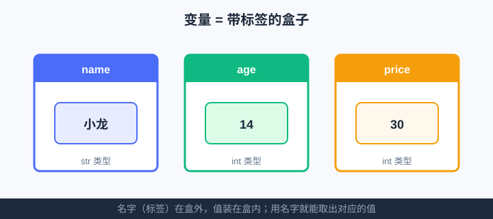

<div style="display:flex; gap:12px; margin-bottom:24px; flex-wrap:wrap; align-items:center;">
  <span style="background:#f0f4ff; color:#4A6CF7; padding:4px 12px; border-radius:20px; font-size:0.85em; font-weight:600; border:1px solid rgba(74,108,247,0.2);">📖 第2章</span>
  <span style="background:#f0fdf4; color:#16a34a; padding:4px 12px; border-radius:20px; font-size:0.85em; font-weight:600; border:1px solid rgba(22,163,74,0.2);">⏱️ ~35 min read</span>
  <span style="background:#f0fdf4; color:#16a34a; padding:4px 12px; border-radius:20px; font-size:0.85em; font-weight:600; border:1px solid rgba(22,163,74,0.2);">🎯 Beginner</span>
</div>

# Chapter 2: 变量与数据类型

> 📝 **Before You Continue:** 先读完 [Chapter 1: 你好，Python！](../getting-started/hello-python.md)，知道怎么用 `print()` 让电脑说话、怎么用 `turtle` 画第一幅画。本章开始，我们要把"值"装进"带名字的盒子"里——这是后面所有计算的基石。

想象你收拾书包：铅笔放进标着"铅笔"的格子，课本放进标着"课本"的格子。下次要用，你不用翻遍整个书包，只要说"把铅笔格子的东西给我"就行。**变量（variable）** 就是编程语言里的"带标签的格子"——你给一个值贴个名字，以后用名字就能随时取用它。

为什么不直接写死数字？因为真实程序里，名字、年龄、分数……每次运行都不一样。把"会变的东西"存进变量，你的代码就能**套用无数次**，而不是每换一个人就重写一遍。这正是编程"省事"的开关。

<div class="story-scene">
<strong>🎬 开场小剧场：贴标签盒子管理员</strong>
<p>游乐场仓库里堆满门票价格、游客姓名、积分数字。小派一开始把所有值都写在地上，结果一改票价，整张地板都要重写。</p>
<p>贴标签盒子管理员 variable 推来一排小盒子：“把 30 放进 <code>ticket_price</code>，把名字放进 <code>name</code>。以后要改，只改盒子里的值，不用满世界找数字。”</p>
</div>

<div class="quest-card">
<strong>🎯 本章任务卡</strong>
<ul>
<li>用变量给一个值贴名字。</li>
<li>认识 <code>int</code>、<code>float</code>、<code>str</code>、<code>bool</code> 四种基础类型。</li>
<li>给变量起清楚、合法的名字。</li>
<li>用 <code>type()</code> 看清值的类型。</li>
<li>用类型转换修正“文字数字”和真正数字的区别。</li>
</ul>
</div>

<div class="boss-bug">
<strong>👾 本章 Boss Bug：赋值等于号误会怪</strong>
<p>它会让你把 <code>=</code> 当成数学里的“相等”。在 Python 里，<code>age = 14</code> 的意思是“把 14 放进 age 盒子”。判断相等要等第 4 章学 <code>==</code>。</p>
</div>

---

## 2.1 变量是什么：带标签的盒子

<div class="try-it">
<strong>🧩 练一练 2.1</strong>
<p>题目：用变量存你的年龄，再打印"我今年 X 岁"。</p>
<details><summary>💡 看看答案</summary>
<p>答案：<code>age = 14</code>，再用 f-string：<code>print(f"我今年 {age} 岁")</code> 输出 <code>我今年 14 岁</code>。</p>
</details>
</div>

变量 = 一个**有名字的盒子**，盒子里装着一个值。你用一个等号 `=` 把值"放进"盒子里：

```python
age = 14          # 把 14 放进叫 age 的盒子
name = "小龙"      # 把 "小龙" 放进叫 name 的盒子
```

此后写 `age`，Python 就会去找那个盒子、取出 `14` 来用。

### 🧠 Mental Model: 变量是贴了标签的格子



> 💡 **Key Insight:** `=` 不是数学里的"等于"，而是 **"赋值"**——把右边的值，塞进左边名字代表的盒子。`age = age + 1` 在代码里完全合法：意思是"取出 age 里的值，加 1，再放回去"。

上图把三个变量画成三个贴标签的盒子：名字（`name`）、年龄（`age`）、票价（`price`）在盒外，真正的值装在盒内。你用名字取用值，盒子负责替你记着。

---

## 2.2 四种基础数据类型：int / float / str / bool

<div class="try-it">
<strong>🧩 练一练 2.2</strong>
<p>题目：判断 3.14 是 int 还是 float？</p>
<details><summary>💡 看看答案</summary>
<p>答案：<code>float</code>（带小数点）。整数 3 才是 <code>int</code>。可用 <code>type(3.14)</code> 验证。</p>
</details>
</div>

盒子里的"值"分好几种类型，Python 管它们叫**数据类型（data type）**。初学者先认识四个最常用的：

| 类型 | 名称 | 装什么 | 例子 |
|------|------|--------|------|
| `int` | 整数 | 没有小数点的数字 | `14`、`-3`、`100` |
| `float` | 浮点数 | 带小数点的数字 | `1.75`、`98.6`、`-0.5` |
| `str` | 字符串 | 文字（必须英文引号包住） | `"小龙"`、`"hello"` |
| `bool` | 布尔值 | 只有两个：`True` / `False` | `True`、`False` |

> 🤔 **Why 要分类型？** 因为"能干什么"取决于类型。数字能加减，文字不能；文字能拼接，数字不能。类型就像"盒子上的使用说明"，Python 靠它决定允许哪些操作。写错类型，就会闹笑话（比如把 `"14"` 当数字加）。

```python
age = 14              # int（整数）
height = 1.75         # float（小数）
name = "小龙"          # str（文字）
is_student = True     # bool（是否）
print(age, height, name, is_student)
```

**输出：**
```
14 1.75 小龙 True
```

---

## 2.3 给变量起名：规则与好习惯

<div class="try-it">
<strong>🧩 练一练 2.3</strong>
<p>题目：下面哪个变量名不合法：my_name / 2cool / total_score / class？</p>
<details><summary>💡 看看答案</summary>
<p>答案：<code>2cool</code>（不能以数字开头）、<code>class</code>（是 Python 关键字）。合法：my_name、total_score。</p>
</details>
</div>

起名字有"硬规则"和"好习惯"两套。

**硬规则（违反会报错）：**
- 只能含 **字母、数字、下划线**（`a`~`z`、`A`~`Z`、`0`~`9`、`_`）。
- 不能以数字开头：`1name` ❌，`name1` ✅。
- **不能用关键字**：像 `if`、`for`、`True` 这种 Python 保留字不能当变量名。

**好习惯（不报错，但很重要）：**
- **见名知意**：用 `student_age` 而不是 `a`；三个月后你（和别人）才看得懂。
- 多个单词用下划线连接：`ticket_price`，不要 `ticketprice` 也不要空格。
- 区分大小写：`Age` 和 `age` 是两个不同的盒子。

> ⚠️ **Warning:** 别用 `l`（小写 L）、`O`（大写 o）、`I`（大写 i）当变量名——它们和数字的 `1`、`0` 长得几乎一样，调试时能让你怀疑人生。

```python
# 好名字
student_name = "小龙"
ticket_price = 30

# 坏名字（能跑，但别学）
a = "小龙"      # 看不出是什么
x1 = 30         # 同样含糊
```

---

## 2.4 看清类型：type()

<div class="try-it">
<strong>🧩 练一练 2.4</strong>
<p>题目：用 type() 看看字符串 "hello" 的类型。</p>
<details><summary>💡 看看答案</summary>
<p>答案：<code>type("hello")</code> 输出 <code>&lt;class 'str'&gt;</code>。</p>
</details>
</div>

记不清盒子里装的是啥类型？用内置函数 `type()` 看一眼：

```python
print(type(14))          # <class 'int'>
print(type(1.75))        # <class 'float'>
print(type("小龙"))       # <class 'str'>
print(type(True))        # <class 'bool'>
```

> 📝 **Note:** 输出里的 `class 'int'` 意思就是"类型是 int"。刚开始你只要能对应上 `int/float/str/bool` 四个词就行，不用纠结 `class` 是什么——后面学"面向对象"会揭晓。

---

## 2.5 类型转换：int() / float() / str()

<div class="try-it">
<strong>🧩 练一练 2.5</strong>
<p>题目：把字符串 "42" 变成整数 42，再加 8，打印结果。</p>
<details><summary>💡 看看答案</summary>
<p>答案：<code>n = int("42") + 8</code>，<code>print(n)</code> 输出 <code>50</code>。</p>
</details>
</div>

有时候盒子里的类型不对，需要"换装"。三个常用转换函数：

| 函数 | 作用 | 例子 | 结果 |
|------|------|------|------|
| `int(x)` | 转成整数 | `int(3.9)` | `3`（**直接砍掉小数，不四舍五入**） |
| `float(x)` | 转成小数 | `float(3)` | `3.0` |
| `str(x)` | 转成文字 | `str(14)` | `"14"` |

```python
n = int(3.9)        # 3  —— 注意：直接截断，不是 4
price = float(30)   # 30.0
text = str(14)      # "14"，这样就能和别的文字拼起来
print(n, price, text)
```

> 🐛 **Common Bug:** 以为 `int(3.9)` 会四舍五入得 `4`。不会！`int()` 永远**朝零截断**。`round(3.9)` 才是四舍五入——但那是另一个函数，别混。

> ⚠️ **Warning:** `int("3.9")` 会**报错**！`int()` 只认整数样子的文字（`"3"` 可以，`"3.9"` 不行）。要转带小数点的文字，先 `float("3.9")` 再 `int(...)`。

---

## 2.6 f-string 初步：把值拼进句子

想打印"小龙 今年 14 岁"，最舒服的写法是 **f-string**（在字符串前加 `f`，用 `{ }` 把变量嵌进去）：

```python
name = "小龙"
age = 14
print(f"{name} 今年 {age} 岁")   # 小龙 今年 14 岁
```

`{name}` 会被替换成盒子里的值。比用逗号拼接干净太多：

```python
# 不如 f-string 的写法（对比用，别学）
print(name, "今年", age, "岁")   # 也能跑，但格式不好控
```

> 💡 **Pro Tip:** f-string 里还能直接算算式或控制小数位：`f"{age + 1}"` 得 `15`；`f"{1.23456:.2f}"` 得 `"1.23"`（保留两位）。第 5 章的 BMI 计算器就用得上。

---

## 2.7 案例：个人信息卡

把学到的拼起来，做一张"个人信息卡"——这正是游乐场给游客发名牌的雏形。

```python
name = "小龙"
age = 14
height = 1.75
is_student = True

print("====== 个人信息卡 ======")
print(f"姓名：{name}")
print(f"年龄：{age}")
print(f"身高：{height} 米")
print(f"学生身份：{is_student}")
print("========================")
```

**输出：**
```
====== 个人信息卡 ======
姓名：小龙
年龄：14
身高：1.75 米
学生身份：True
========================
```

---

## 2.8 案例：BMI 计算

BMI（身体质量指数）= 体重(kg) ÷ 身高(m) 的平方。把数值存进变量，一行公式就出结果：

```python
name = "小龙"
height = 1.75          # 米
weight = 68            # 公斤
bmi = weight / (height ** 2)   # ** 是"次方"，height**2 = 身高平方
print(f"{name} 的 BMI 是 {bmi:.1f}")   # :.1f 保留 1 位小数
```

**输出：**
```
小龙 的 BMI 是 22.2
```

> 💡 **Key Insight:** 这里 `bmi` 是个**新变量**，它的值来自别的变量计算。变量之间能互相"喂数据"——这正是搭大程序的砖块：一块的输出，是下一块的输入。

---

## 🔍 计算思维聚焦：抽象（Abstraction）

本章的 CT 概念是 **抽象**——抓住关键、忽略细节。

- 你不用关心 `age` 在电脑内存里到底是哪串 0 和 1；你只管叫它 `age`，用名字取用。
- 变量就是"抽象"的最小单元：**用一个名字代表一个值**，把复杂细节藏到盒子背后。

漫画式类比：遥控器上的"电源键"就是抽象——你按"电源"就能开机，不需要懂电路板怎么通电。变量也是：你写 `age`，不需要懂电脑怎么存数字。

> 💡 **记住抽象的价值：** 越高层的名字（如 `ticket_price`），越接近人的思考方式；越低层的 0/1，越接近电脑。编程就是不断在两层之间架桥。

---

## 🛠️ 项目工坊：算法游乐场 · 游客名牌

贯穿全书的"算法游乐场"正式动工！本章我们给每位游客做一张**名牌**——用变量存下名字、年龄、票价，再打印成一张小卡片。

```python
# 算法游乐场 · 游客名牌（第2章新增）
visitor_name = "小龙"
visitor_age = 14
ticket_price = 30

print("🎡 算法游乐场 · 游客名牌")
print("=" * 28)
print(f"姓名：{visitor_name}")
print(f"年龄：{visitor_age}")
print(f"票价：{ticket_price} 元")
print("=" * 28)
print("欢迎光临，玩得开心！")
```

**输出：**
```
🎡 算法游乐场 · 游客名牌
============================
姓名：小龙
年龄：14
票价：30 元
============================
欢迎光临，玩得开心！
```

现在游乐场多了 **「游客名牌」**：一张用变量拼出来的欢迎卡。第 5 章我们会升级成"门票问答机"，由游客自己输入名字和年龄，而不是写死在代码里。

---

## 🏅 本章通关徽章：贴标签盒子管理员

<div class="badge-card">
<strong>如果你能做到下面 4 件事，就获得“贴标签盒子管理员”徽章：</strong>
<ul>
<li>能用变量保存一个值并再次取出。</li>
<li>能分清 <code>int</code>、<code>float</code>、<code>str</code>、<code>bool</code>。</li>
<li>能给变量起合法、清楚的名字。</li>
<li>能用 <code>type()</code> 和类型转换排查类型问题。</li>
</ul>
</div>

---

## ⚠️ Common Mistakes in Chapter 2

| # | 误区 | 示例 | 为什么错 | 修正 |
|---|------|------|---------|------|
| 1 | 把 `=` 当"等于" | `if age = 14:` | `=` 是赋值不是比较，语法报错 | 比较用 `==`，赋值才用 `=` |
| 2 | 变量名用数字开头 | `1st_name = "龙"` | 命名规则不允许 | 改成 `first_name` |
| 3 | 用中文引号做字符串 | `name = "小龙"` | Python 只认英文引号 | 切英文输入法，用 `" "` |
| 4 | 忘转类型就相加 | `"14" + 1` | 文字和数字不能加，报错 | 先 `int("14")` 再算 |
| 5 | 以为 `int()` 会四舍五入 | `int(3.9)` 得 `3` 却以为是 `4` | `int` 直接截断小数 | 需要四舍五入用 `round()` |
| 6 | 用关键字当变量名 | `str = "hi"` | `str` 是内置函数名，覆盖后失灵 | 改成 `text` 等自定义名 |

---

## Chapter Summary

### 📌 Key Takeaways

| 概念 | 要点 | 为什么重要 |
|------|------|------------|
| 变量 | `名字 = 值` 是赋值，把值存进盒子 | 让代码能套用不同数据，不用重写 |
| 四类型 | `int`/`float`/`str`/`bool` | 类型决定能做什么运算 |
| 命名 | 字母数字下划线、见名知意、避关键字 | 可读、可维护、不报错 |
| `type()` | 查看盒子里值的类型 | 调试时快速定位类型问题 |
| 类型转换 | `int()`/`float()`/`str()` | 把"错装的类型"换成对的 |
| f-string | `f"{变量}"` 把值嵌进句子 | 输出最干净、最可控 |

### ❓ FAQ

**Q1: 变量和常量有什么区别？Python 里有常量吗？**
> A: 常量就是"不该被改的值"。Python 没有强制的常量语法，约定上把全大写的名字当常量（如 `PI = 3.14159`），靠自觉不改。初学先理解变量即可。

**Q2: 为什么 `int("3.9")` 会报错，但 `int(3.9)` 不会？**
> A: `int(3.9)` 的输入本来就是数字，直接截断成 `3`；`int("3.9")` 的输入是"文字"，`int()` 只认整数样子的文字，`"3.9"` 带小数点所以拒收。要转就先 `float("3.9")` 得 `3.9`，再 `int(...)`。

**Q3: f-string 里的 `{ }` 能放任意表达式吗？**
> A: 能。可以放变量、算式（如 `{age + 1}`）、甚至调用（如 `{len(name)}`）。只要结果能打印就行。这就是 f-string 比逗号拼接强大的原因。

### 🔗 Connections to Later Chapters

- **[Chapter 3: 字符串与文本处理](strings.md)** 会深入文字：索引、切片、替换——变量 `name` 里的字符串能玩出更多花样。
- **[Chapter 4: 运算符与表达式](operators.md)** 教你用比较/逻辑运算符判断"这个游客是不是儿童"，为票价规则打底。
- **[Chapter 5: 输入与输出](input-output.md)** 让游客**自己输入**名字年龄，把本章写死的 `visitor_name` 变成活的。
- **[Chapter 14: 函数入门](../functions/functions-intro.md)** 你会把"打印名牌"包成函数，多处调用——这是"抽象"的下一层。

---


## 🎮 加练任务包

> 下面这些题目不一定比章末题更难，但更适合“多刷几遍、把手感练出来”。建议先独立做，再展开提示。

### 加练 2.A · 门票价格盒子 🟢

创建变量 `ticket_price = 30`，再把它改成 35，最后打印“新票价：35”。

<details>
<summary>💡 提示 / 答案要点</summary>

先赋值 `ticket_price = 30`，再重新赋值 `ticket_price = 35`。变量盒子里的旧值会被新值替换。

</details>

---

### 加练 2.B · 类型侦探 🟢

判断下面值的类型：`100`、`3.5`、`"100"`、`True`。

<details>
<summary>💡 提示 / 答案要点</summary>

依次是 `int`、`float`、`str`、`bool`。注意 `"100"` 有引号，是字符串，不是整数。

</details>

---

### 加练 2.C · 年龄加一岁 🟡

用户输入年龄得到字符串 `age = "12"`。怎样算出明年年龄 13？

<details>
<summary>💡 提示 / 答案要点</summary>

先转换：`age = int(age)`，再 `age + 1`。如果直接 `"12" + 1` 会类型错误。

</details>

---


---

## Practice Problems

---

**Problem 2.1 — 给书包贴标签** 🟢 Easy

创建三个变量：`book`（书名，字符串）、`pages`（页数，整数）、`finished`（是否读完，布尔值），然后用 f-string 打印一句："《{book}》共 {pages} 页，读完了吗？{finished}"。

**Sample Input:**
```python
book = "小王子"
pages = 96
finished = False
```
**Sample Output:** `《小王子》共 96 页，读完了吗？False`

<details>
<summary>💡 Solution (click to reveal)</summary>

**Approach:** 按类型选值，再用 f-string 把三个变量拼进一句话。

```python
book = "小王子"
pages = 96
finished = False
print(f"《{book}》共 {pages} 页，读完了吗？{finished}")
```

**Key points:**
- 字符串用引号、整数/布尔不用。
- `{finished}` 直接打印 `False`/`True`。

</details>

---

**Problem 2.2 — 单位换算小助手** 🟢 Easy

用变量存"公里数"，算出对应的"米"和"厘米"并打印（1 公里 = 1000 米 = 100000 厘米）。

**Sample Input:**
```python
km = 3
```
**Sample Output:**
```
3 公里 = 3000 米
3 公里 = 300000 厘米
```

<details>
<summary>💡 Solution (click to reveal)</summary>

**Approach:** 把原始值存进 `km`，用算术算出衍生值，f-string 输出。

```python
km = 3
meters = km * 1000
centimeters = km * 100000
print(f"{km} 公里 = {meters} 米")
print(f"{km} 公里 = {centimeters} 厘米")
```

**Key points:**
- 新变量 `meters`/`centimeters` 的值来自 `km` 计算，体现"变量喂变量"。
- 全程用 `int`，没有小数。

</details>

---

**Problem 2.3 — 修复类型错误** 🟡 Medium

下面代码会报错，请找出问题并改正，让它正确打印 `年龄之和：27`。

```python
a = "13"
b = 14
print("年龄之和：" + a + b)
```

**Sample Output:** `年龄之和：27`

<details>
<summary>💡 Solution (click to reveal)</summary>

**Approach:** `"13"` 是字符串，`14` 是数字，字符串和数字不能用 `+` 直接加（会报 `TypeError`）。需要先把 `a` 转成数字再相加；或者都用字符串拼。两种改法：

```python
# 改法一：转数字后相加（推荐，得到数学和 27）
a = "13"
b = 14
print("年龄之和：" + str(int(a) + b))   # int(a)=13，13+14=27，再转回 str 拼接

# 改法二：都当字符串拼（得到 "1314"，不是 27，不符合预期）
# print("年龄之和：" + a + str(b))
```

**Key points:**
- `"13" + 14` 会报错，类型不匹配。
- 要"数学加"就先 `int(a)`；要"文字拼"就 `str(b)`。题意要 27，选改法一。

</details>

---

**Problem 2.4 — 游乐场年龄分段（挑战）** 🏆 Challenge

变量 `age` 存游客年龄。请用变量和 f-string 打印一句话：若 `age < 12` 显示"儿童票"，否则显示"标准票"。提示：这里会用到 `if` 判断（正式讲在第 6 章），但你可以先照下面样子写，体会"根据变量值选不同输出"的思路。

**Sample Input:**
```python
age = 10
```
**Sample Output:** `年龄 10 → 儿童票`

<details>
<summary>💡 Solution (click to reveal)</summary>

**Approach:** 用 `if ... else ...` 比较 `age` 与 `12`，把结果存进变量 `ticket`，再打印。这是"条件判断"的雏形，第 6 章会正式拆开。

```python
age = 10
if age < 12:
    ticket = "儿童票"
else:
    ticket = "标准票"
print(f"年龄 {age} → {ticket}")
```

**Key points:**
- `if age < 12:` 成立就走第一行分支，否则走 `else`。
- 把分支结果存进 `ticket` 变量，最后统一打印——输出逻辑更干净。
- 第 6 章你会学到更多判断写法，这里先建立"变量值决定行为"的直觉。

</details>

---

> 💡 **记住这一句：** 变量就是"贴了名字的盒子"——你用名字存值、取值，把会变的东西装进去，代码就能反复套用，不必每次重写。
