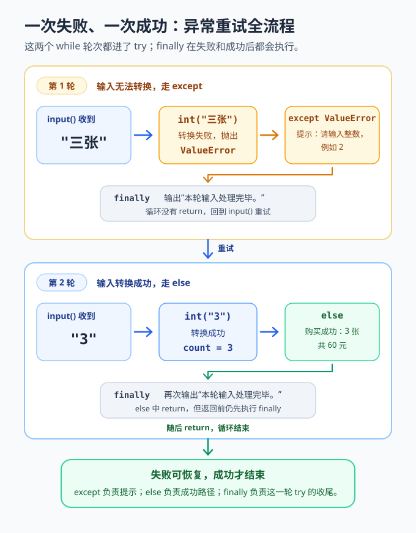

<div style="display:flex; gap:12px; margin-bottom:24px; flex-wrap:wrap; align-items:center;">
  <span style="background:#f0f4ff; color:#4A6CF7; padding:4px 12px; border-radius:20px; font-size:0.85em; font-weight:600; border:1px solid rgba(74,108,247,0.2);">Chapter 16A</span>
  <span style="background:#f0fdf4; color:#16a34a; padding:4px 12px; border-radius:20px; font-size:0.85em; border:1px solid rgba(22,163,74,0.2);">约 35 分钟</span>
  <span style="background:#fef9ec; color:#d97706; padding:4px 12px; border-radius:20px; font-size:0.85em; border:1px solid rgba(100,100,100,0.15);">零基础必修</span>
</div>
# Chapter 16A: 错误与异常处理

> **承接前章：** 你已经会把函数放进模块，也会调用标准库。现在要让程序在遇到坏输入、缺少文件或计算失败时，能够说明问题并安全收尾。

游乐场售票机问小派：“你要买几张票？”如果小派输入 `三张`，`int("三张")` 就无法完成转换。程序不是故意闹脾气，而是在报告一个**异常（exception）**：运行过程中发生了无法按原计划处理的情况。

异常处理不是把错误藏起来。它像安全员：先识别出了什么问题，再决定是请游客重新输入、给出清楚提示，还是停止当前操作。

本章完成后，你能够：
- 用 `try`、`except`、`else`、`finally` 安排处理流程；
- 捕获具体异常，而不是把所有问题混在一起；
- 用 `raise` 主动拒绝不合理的数据；
- 校验外部输入，并说明为什么不能靠 `assert` 校验它。

---

## 16A.1 从一台会“摔倒”的售票机开始

先看一段最小代码：
```python
text = "三张"
count = int(text)
print("购买", count, "张票")
```
代码语法正确，却会在运行时产生 `ValueError`。`int()` 能转换 `"3"`，却不能把 `"三张"` 自动变成整数。错误信息最后一行会说明异常类型和原因：
```text
ValueError: invalid literal for int() with base 10: '三张'
```
常见异常可以先认识这几位：

| 异常 | 常见场景 | 例子 |
|------|----------|------|
| `ValueError` | 值的内容不合要求 | `int("三张")` |
| `TypeError` | 数据类型不合要求 | `"3" + 2` |
| `ZeroDivisionError` | 除数是零 | `10 / 0` |
| `KeyError` | 字典中没有这个键 | `scores["小云"]` |
| `IndexError` | 列表下标越界 | `names[10]` |
| `FileNotFoundError` | 要打开的文件不存在 | 打开错误路径 |

异常发生后，如果没有处理，当前程序会停止。我们先给售票机加一张“安全网”。

---

## 16A.2 用 try 和 except 接住具体异常

`try` 表示“尝试运行这段可能失败的代码”，`except` 表示“如果出现指定异常，就这样处理”。
```python
text = "三张"
try:
    count = int(text)
except ValueError:
    print("请输入阿拉伯数字，例如 3。")
```
执行过程分四步：
1. Python 进入 `try`，执行 `int(text)`；
2. 转换失败，产生 `ValueError`；
3. Python 找到处理 `ValueError` 的 `except`；
4. 程序显示友好提示，而不是突然结束。

如果 `text` 是 `"3"`，就不会执行 `except`。有一条重要原则：**只把可能抛出目标异常的少量代码放进 `try`。** 范围越小，失败位置越清楚。
```python
text = "3"
try:
    count = int(text)
except ValueError:
    print("数量必须是整数。")
else:
    total = count * 20
    print("总价：", total, "元")
```
转换是可能失败的动作，所以放进 `try`；计算总价只应在转换成功后进行，所以放进 `else`。

---

## 16A.3 else 与 finally 各做什么

完整异常结构有四块：
```python
try:
    number = int("4")
except ValueError:
    print("转换失败")
else:
    print("转换成功：", number)
finally:
    print("本次处理结束")
```
| 部分 | 什么时候执行 | 适合放什么 |
|------|--------------|------------|
| `try` | 总是先尝试 | 可能产生异常的少量代码 |
| `except` | 匹配的异常发生时 | 提示、恢复办法 |
| `else` | 没有异常时 | 成功后才做的事情 |
| `finally` | 无论成功或失败 | 必须完成的收尾动作 |

把 `"4"` 改成 `"四"`，输出会变成：
```text
转换失败
本次处理结束
```
`finally` 常用于释放必须归还的资源，例如关闭设备连接。文件通常直接使用下一章的 `with open(...)`，它能自动关闭文件，比手动在 `finally` 中关闭更稳妥。

不是每个 `try` 都要写齐四块。最常见的是 `try` + `except`；需要区分成功路径时加 `else`；确有必须执行的收尾工作时再加 `finally`。

---

## 16A.4 捕获具体异常，不要一网打尽

售票机既可能收到非数字，也可能在计算平均价时除以零。不同问题应给出不同提示：
```python
def average_price(total_text, count_text):
    """把文本转换为数字并计算平均票价。"""
    try:
        total = float(total_text)
        count = int(count_text)
        result = total / count
    except ValueError:
        return "金额和张数必须是数字。"
    except ZeroDivisionError:
        return "张数不能是 0。"
    else:
        return f"平均每张 {result:.2f} 元"


print(average_price("60", "3"))
print(average_price("六十", "3"))
print(average_price("60", "0"))
```
输出：
```text
平均每张 20.00 元
金额和张数必须是数字。
张数不能是 0。
```
两个 `except` 像两位分工不同的安全员。不推荐写空的 `except:`，因为它捕获范围过宽，可能把没有预料到的程序缺陷也藏起来。

更可靠的规则是：
- 能预料到哪种异常，就写出它的名字；
- 能给出恢复办法才捕获；
- 不知道怎么处理时，让异常继续传递，保留线索。

几种异常处理办法相同时，可以写成元组：
```python
def safe_ratio(left, right):
    """尝试计算两个文本数字的比值。"""
    try:
        return float(left) / float(right)
    except (ValueError, ZeroDivisionError):
        return None


print(safe_ratio("12", "3"))
print(safe_ratio("十二", "3"))
```
`None` 表示“没有得到结果”。在真正的交互程序中，调用者仍应告诉用户失败原因。

---

## 16A.5 用 raise 主动拒绝不合理数据

票数 `-2` 能成功转成整数，但现实中不能购买负数张票。数据类型正确、内容却不合理时，可以用 `raise` 主动抛出异常：
```python
def ticket_cost(count):
    """计算票价，并拒绝不合理的票数。"""
    if not 1 <= count <= 10:
        raise ValueError("票数必须在 1 到 10 之间")
    return count * 20


print(ticket_cost(3))
```
执行 `raise ValueError(...)` 时，函数会立刻停止，并把问题交给调用它的代码。调用者可以接住它：
```python
def ticket_cost(count):
    """计算票价，并拒绝不合理的票数。"""
    if not 1 <= count <= 10:
        raise ValueError("票数必须在 1 到 10 之间")
    return count * 20


try:
    print(ticket_cost(12))
except ValueError as error:
    print("无法购票：", error)
```
`as error` 把异常对象保存到变量中。函数负责说明“什么数据不合法”，靠近用户的代码负责说明“下一步怎么办”。这样的函数也更容易被别的程序和测试代码复用。

---

## 16A.6 输入校验：先转换，再检查范围

外部输入可能包含空格、拼写错误或超出范围的数字。稳妥的流程通常分三步：
1. 用 `strip()` 等方法清理文本；
2. 尝试转换类型；
3. 检查业务范围。
```python
def parse_ticket_count(text):
    """把用户文本转换为 1 到 10 之间的票数。"""
    cleaned = text.strip()
    try:
        count = int(cleaned)
    except ValueError:
        raise ValueError("请输入整数")

    if not 1 <= count <= 10:
        raise ValueError("票数必须在 1 到 10 之间")
    return count


print(parse_ticket_count(" 3 "))
```
逐步解释：
1. `strip()` 让 `" 3 "` 变成 `"3"`；
2. `int(cleaned)` 判断文本能否成为整数；
3. `1 <= count <= 10` 检查售票规则；
4. 两种失败消息不同，调用者能给出准确提示。

---

## 16A.7 完整可运行示例：耐心的售票机

下面把输入、转换、范围校验和重试组合起来。输入 `q` 可以主动退出，输入正确数字才能完成购票。
```python
def parse_ticket_count(text):
    """把文本转换为 1 到 10 之间的票数。"""
    try:
        count = int(text.strip())
    except ValueError:
        raise ValueError("请输入整数，例如 2")

    if not 1 <= count <= 10:
        raise ValueError("一次可以买 1 到 10 张票")
    return count


def run_ticket_machine():
    """反复询问，直到购票成功或用户主动退出。"""
    while True:
        text = input("购买几张票？输入 q 退出：")
        if text.strip().lower() == "q":
            print("已退出售票机。")
            return

        try:
            count = parse_ticket_count(text)
        except ValueError as error:
            print("输入有问题：", error)
        else:
            print(f"购买成功：{count} 张，共 {count * 20} 元。")
            return
        finally:
            print("本轮输入处理完毕。")


if __name__ == "__main__":
    run_ticket_machine()
```
一次可能的运行过程：
```text
购买几张票？输入 q 退出：三张
输入有问题： 请输入整数，例如 2
本轮输入处理完毕。
购买几张票？输入 q 退出：3
购买成功：3 张，共 60 元。
本轮输入处理完毕。
```



*这张图强调：`except` 让失败可以重试，`else` 只处理成功结果，而 `finally` 在每一轮都会执行。*

关键流程如下：
1. `run_ticket_machine()` 管理与用户的对话；
2. `parse_ticket_count()` 把文本变成可靠票数；
3. 校验失败时，函数用 `raise` 报告原因；
4. 对话层用 `except ValueError as error` 接住并提示；
5. 成功时进入 `else`，每轮结束时执行 `finally`。

这种分工让代码更容易测试。下一章可以把购票记录写入文件，16C 章还会自动检查这个函数。

---

## 16A.8 Common Mistakes

### 把整个程序都塞进 try
```python
try:
    count = int("3")
    price = count * 20
    message = "总价：" + str(price)
    print(message)
except ValueError:
    print("输入不是整数")
```
代码能运行，但 `try` 包得太大。若以后加入另一个会产生 `ValueError` 的操作，就难以判断失败位置。只包住预期可能失败的转换更清楚。

### 捕获异常后什么也不做
```python
try:
    count = int("三")
except ValueError:
    pass
```
`pass` 会让问题悄悄消失，后面还可能因为 `count` 没有赋值而再次失败。至少应提示、返回明确结果，或让用户重试。

### 用 assert 检查外部输入
```python
age = int("-3")
assert age >= 0, "年龄不能是负数"
```
`assert` 主要用于**测试**和程序内部不变量，不应该承担用户输入、文件内容或网络数据的校验。Python 可以在优化模式下跳过断言。外部数据必须使用普通判断，失败时给提示或 `raise`：
```python
def parse_age(text):
    """把外部文本转换为合理年龄。"""
    try:
        age = int(text)
    except ValueError:
        raise ValueError("年龄必须是整数")
    if age < 0:
        raise ValueError("年龄不能是负数")
    return age
```
记住边界：用户输入、文件内容、接口数据用 `if` 校验；测试预期和内部不变量可以使用 `assert`。

---

## 16A.9 Chapter Summary

- **异常发生在运行时**：语法正确的程序也可能遇到异常。
- **`try` 放风险操作**：范围尽量小。
- **`except` 捕获具体类型**：不同问题给不同处理办法。
- **`else` 处理成功路径**，`finally` 处理必要收尾。
- **`raise` 报告不合理状态**：函数可以主动拒绝无效数据。
- **外部输入必须显式校验**：不要用 `assert` 代替输入检查。

捕获得太少，程序会在可恢复的问题上停止；捕获得太多，又会藏住真正的缺陷。只捕获你能够解释并处理的具体异常。

## 16A.10 Practice Problems

### Problem 16A.1 安全计算年龄 🟢 Easy

编写 `parse_age(text)`：把文本转成整数，只接受 `0` 到 `120`；失败时抛出带清楚消息的 `ValueError`。

<details>
<summary>查看参考答案</summary>

```python
def parse_age(text):
    """把文本转换为 0 到 120 之间的年龄。"""
    try:
        age = int(text.strip())
    except ValueError:
        raise ValueError("年龄必须是整数")
    if not 0 <= age <= 120:
        raise ValueError("年龄必须在 0 到 120 之间")
    return age


print(parse_age(" 12 "))
```
先做类型转换，再做范围判断；两种失败原因使用不同消息。

</details>

### Problem 16A.2 安全除法 🟡 Medium

编写 `divide(left, right)`。转换失败时返回 `"请输入数字"`，除数为零时返回 `"除数不能为 0"`，成功时返回计算结果。

<details>
<summary>查看参考答案</summary>

```python
def divide(left, right):
    """安全地计算两个文本数字的商。"""
    try:
        return float(left) / float(right)
    except ValueError:
        return "请输入数字"
    except ZeroDivisionError:
        return "除数不能为 0"


print(divide("10", "4"))
print(divide("十", "4"))
print(divide("10", "0"))
```
分别捕获两种具体异常，才能给出准确提示。

</details>

### Problem 16A.3 判断执行顺序 🟡 Medium

先写出下面程序的输出顺序，再运行验证。
```python
def demo(text):
    try:
        number = int(text)
    except ValueError:
        print("A")
    else:
        print("B", number)
    finally:
        print("C")


demo("5")
demo("五")
```
<details>
<summary>查看参考答案</summary>

```text
B 5
C
A
C
```
第一次执行 `else` 和 `finally`；第二次执行 `except` 和 `finally`。

</details>

### Problem 16A.4 电影票输入器 🏆 Challenge

编写 `ask_ticket_count()`，反复询问，只接受 `1` 到 `6` 的整数。错误时打印原因并继续，正确时返回票数。不要用 `assert` 校验输入。

<details>
<summary>查看参考答案</summary>

```python
def ask_ticket_count():
    """反复询问，直到得到 1 到 6 之间的票数。"""
    while True:
        text = input("请输入票数（1-6）：")
        try:
            count = int(text)
        except ValueError:
            print("请输入整数。")
            continue
        if not 1 <= count <= 6:
            print("票数必须在 1 到 6 之间。")
            continue
        return count


if __name__ == "__main__":
    tickets = ask_ticket_count()
    print("已选择", tickets, "张票。")
```
转换失败与范围不对是两类问题；`continue` 会回到下一轮。

</details>

---

> **记住这一句：** 异常处理不是假装没有错误，而是让程序知道“出了什么问题，下一步该怎么办”。

*上一章：[Chapter 16：模块与标准库](modules.md) · 下一章：[Chapter 16B：文件、路径与结构化数据](files-data.md)*
