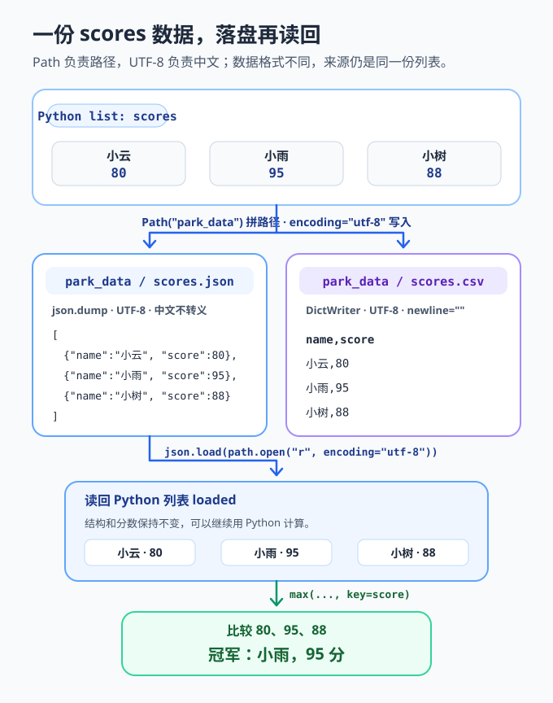

<div style="display:flex; gap:12px; margin-bottom:24px; flex-wrap:wrap; align-items:center;">
  <span style="background:#f0f4ff; color:#4A6CF7; padding:4px 12px; border-radius:20px; font-size:0.85em; font-weight:600; border:1px solid rgba(74,108,247,0.2);">Chapter 16B</span>
  <span style="background:#f0fdf4; color:#16a34a; padding:4px 12px; border-radius:20px; font-size:0.85em; border:1px solid rgba(22,163,74,0.2);">约 40 分钟</span>
  <span style="background:#fef9ec; color:#d97706; padding:4px 12px; border-radius:20px; font-size:0.85em; border:1px solid rgba(100,100,100,0.15);">零基础必修</span>
</div>
# Chapter 16B: 文件、路径与结构化数据

> **承接前章：** 16A 章让程序学会面对错误。这一章把内存里的数据保存到磁盘，并在文件缺失或内容不合要求时给出清楚提示。

小派为游乐场做了一块计分牌。程序运行时，列表里有每位游客的分数；一关闭程序，列表就消失了。要让明天还能看到今天的成绩，必须把数据写进**文件（file）**。

文件像书包里的作业本，路径像写着“作业本放在哪个抽屉”的地址。Python 标准库已经准备好处理文本、JSON 和 CSV 的工具，不需要安装第三方依赖。

本章完成后，你能够：
- 用 `pathlib.Path` 表示和拼接路径；
- 用 UTF-8 编码安全读写中文文本；
- 理解 `with open(...)` 为什么会自动关闭文件；
- 分清相对路径与程序当前工作目录；
- 处理 `FileNotFoundError`；
- 用标准库 `json` 和 `csv` 保存结构化数据。
---
## 16B.1 Path 是文件的“地址卡”

传统代码常用字符串表示路径，例如 `"data/scores.txt"`。现代 Python 可以用 `pathlib.Path`，让路径拼接和检查更清楚。

最小示例：
```python
from pathlib import Path

file_path = Path("data") / "scores.txt"
print(file_path)
print(file_path.name)
print(file_path.suffix)
```
输出中的分隔符可能随操作系统不同而不同，但 `Path` 会负责正确处理。三个表达式分别表示：
1. `Path("data") / "scores.txt"`：在 `data` 文件夹下拼出文件地址；
2. `file_path.name`：得到文件名 `scores.txt`；
3. `file_path.suffix`：得到扩展名 `.txt`。

创建文件夹也不必手写系统命令：
```python
from pathlib import Path

folder = Path("data")
folder.mkdir(exist_ok=True)
print("数据目录：", folder)
```
`exist_ok=True` 表示文件夹已经存在时不要报错。这里只创建当前这一层；如果要一次创建多层目录，可以再加 `parents=True`。

`Path` 只是地址对象。创建 `Path("data/scores.txt")` 不等于磁盘上已经有这个文件，就像在纸上写出地址不等于房子已经建好。
---
## 16B.2 用 UTF-8 写入和读取文本

把一句中文写进文件，只需要几行：
```python
from pathlib import Path

path = Path("welcome.txt")
path.write_text("欢迎来到算法游乐场！\n", encoding="utf-8")
print("写入完成")
```
`write_text()` 会创建文件；若文件已经存在，会覆盖原内容。`encoding="utf-8"` 明确指定文本编码，让中文在不同电脑上更稳定。

再把内容读回来：
```python
from pathlib import Path

path = Path("welcome.txt")
message = path.read_text(encoding="utf-8")
print(message)
```
`read_text()` 会一次读完整个文本文件。小文件这样最方便；很大的文件更适合逐行读取，避免一次把全部内容放进内存。

追加内容时可以使用 `open()` 的追加模式：
```python
from pathlib import Path

path = Path("welcome.txt")
with path.open("a", encoding="utf-8") as file:
    file.write("今日开放项目：摩天轮\n")
```
常见模式如下：

| 模式 | 含义 | 文件已存在时 |
|------|------|--------------|
| `"r"` | 读取 | 保留内容 |
| `"w"` | 写入 | 覆盖原内容 |
| `"a"` | 追加 | 从末尾继续写 |

文本读写时养成写 `encoding="utf-8"` 的习惯，不要依赖不同电脑的默认编码。
---
## 16B.3 with open 为什么重要

文件被打开后会占用系统资源。`with` 代码块结束时，Python 会自动关闭文件，即使读取过程中发生异常也会收尾。
```python
from pathlib import Path

path = Path("notice.txt")
with open(path, "w", encoding="utf-8") as file:
    file.write("明天上午九点开园。\n")

print("文件已经自动关闭：", file.closed)
```
逐步解释：
1. `open(path, "w", encoding="utf-8")` 打开文件；
2. `as file` 把文件对象交给变量 `file`；
3. 缩进范围内可以调用 `file.write()`；
4. 离开 `with` 后文件自动关闭；
5. `file.closed` 会是 `True`。

`Path.open()` 与内置 `open()` 都可以：
```python
from pathlib import Path

path = Path("notice.txt")
with path.open("r", encoding="utf-8") as file:
    for line in file:
        print(line.rstrip())
```
逐行读取时，`line` 通常自带换行符。`rstrip()` 会移除行尾空白；若只想移除换行，也可写 `rstrip("\n")`。
---
## 16B.4 相对路径从哪里出发

`Path("data/scores.txt")` 是**相对路径**。它不是从 Python 文件所在位置自动出发，而是从程序运行时的**当前工作目录**出发。

可以这样查看当前位置：
```python
from pathlib import Path

print("当前工作目录：", Path.cwd())
print("目标完整地址：", (Path("data") / "scores.txt").resolve())
```
假设项目结构是：
```text
park_project/
├── main.py
└── data/
    └── scores.txt
```
如果终端当前位于 `park_project`，再运行 `python main.py`，那么 `Path("data/scores.txt")` 能找到目标。若终端位于别处，相同相对路径就可能指向另一个位置。

当文件必须相对于脚本自身定位时，可以使用 `__file__`：
```python
from pathlib import Path

script_dir = Path(__file__).resolve().parent
data_path = script_dir / "data" / "scores.txt"
print(data_path)
```
在普通 `.py` 文件中，`__file__` 表示当前脚本路径。交互式解释器里不一定有 `__file__`，此时使用 `Path.cwd()` 更合适。
---
## 16B.5 文件不存在时怎么办

读取一个不存在的文件会产生 `FileNotFoundError`。这正是 16A 章所学的具体异常。
```python
from pathlib import Path

path = Path("missing-note.txt")
try:
    text = path.read_text(encoding="utf-8")
except FileNotFoundError:
    print("还没有留言文件。")
else:
    print(text)
```
也可以先检查文件是否存在：
```python
from pathlib import Path

path = Path("missing-note.txt")
if path.exists():
    print(path.read_text(encoding="utf-8"))
else:
    print("还没有留言文件。")
```
两种方式都合理：
- `exists()` 适合“没有文件也是正常状态”，例如第一次启动还没有存档；
- `try` / `except FileNotFoundError` 适合“直接尝试读取，失败再处理”。

即使先调用 `exists()`，文件仍可能在真正读取前被移动。因此关键读取操作仍要准备面对 `FileNotFoundError`，不要假设文件永远不会变化。
---
## 16B.6 JSON：保存列表和字典

纯文本适合留言，**JSON（JavaScript Object Notation）** 更适合保存列表、字典、字符串、数字、布尔值和 `None` 组成的结构化数据。

把游客档案写入 JSON 文件：
```python
import json
from pathlib import Path

visitors = [
    {"name": "小云", "score": 80},
    {"name": "小雨", "score": 95},
]
path = Path("visitors.json")

with path.open("w", encoding="utf-8") as file:
    json.dump(visitors, file, ensure_ascii=False, indent=2)
```
关键参数：
1. `json.dump(data, file)` 把 Python 数据写入文件；
2. `ensure_ascii=False` 让中文直接保存，而不是变成转义序列；
3. `indent=2` 加缩进，让文件便于阅读。

再读回来：
```python
import json
from pathlib import Path

path = Path("visitors.json")
with path.open("r", encoding="utf-8") as file:
    visitors = json.load(file)

print(visitors[0]["name"])
print(visitors[1]["score"])
```
`json.load()` 从文件读取，`json.loads()` 则从字符串读取；`dump()` 写文件，`dumps()` 生成字符串。记住末尾的 `s` 可以联想到 string。

JSON 不是任意 Python 对象的复印机。例如 `set` 不能直接写入 JSON，通常先转成列表。
---
## 16B.7 CSV：保存一行一条的表格

**CSV（Comma-Separated Values）** 常用于行列清楚的表格。Python 标准库 `csv` 能正确处理逗号、引号等细节，不要自己用字符串硬拼。

写入游客成绩表：
```python
import csv
from pathlib import Path

rows = [
    {"name": "小云", "score": 80},
    {"name": "小雨", "score": 95},
]
path = Path("scores.csv")

with path.open("w", encoding="utf-8", newline="") as file:
    writer = csv.DictWriter(file, fieldnames=["name", "score"])
    writer.writeheader()
    writer.writerows(rows)
```
`DictWriter` 让每行用字典表示。`fieldnames` 决定列的顺序，`writeheader()` 写表头，`writerows()` 写所有数据。写 CSV 时使用 `newline=""`，把换行处理交给 `csv` 模块。

读取时，CSV 中的值默认都是字符串：
```python
import csv
from pathlib import Path

path = Path("scores.csv")
with path.open("r", encoding="utf-8", newline="") as file:
    reader = csv.DictReader(file)
    rows = list(reader)

print(rows)
print(int(rows[0]["score"]) + 5)
```
即使文件里写着 `80`，读出后也是字符串 `"80"`。需要计算时应显式转换并校验。

| 格式 | 更适合 | 特点 |
|------|--------|------|
| 文本 | 日记、说明、逐行记录 | 人最容易直接阅读 |
| JSON | 嵌套列表与字典 | 保留结构和常见数据类型 |
| CSV | 行列式表格 | 适合表格软件交换 |
---
## 16B.8 完整可运行示例：保存并读取排行榜

这个程序会创建 `park_data` 目录，把同一份排行榜保存成 JSON 和 CSV，再从 JSON 读回并显示冠军。
```python
import csv
import json
from pathlib import Path


def save_json(path, players):
    """把排行榜保存为 UTF-8 JSON 文件。"""
    with path.open("w", encoding="utf-8") as file:
        json.dump(players, file, ensure_ascii=False, indent=2)


def save_csv(path, players):
    """把排行榜保存为 UTF-8 CSV 文件。"""
    with path.open("w", encoding="utf-8", newline="") as file:
        writer = csv.DictWriter(file, fieldnames=["name", "score"])
        writer.writeheader()
        writer.writerows(players)


def load_json(path):
    """读取排行榜；文件不存在时返回空列表。"""
    try:
        with path.open("r", encoding="utf-8") as file:
            return json.load(file)
    except FileNotFoundError:
        return []


def main():
    """保存两种格式，并读回 JSON 排行榜。"""
    data_dir = Path("park_data")
    data_dir.mkdir(exist_ok=True)
    players = [
        {"name": "小云", "score": 80},
        {"name": "小雨", "score": 95},
        {"name": "小树", "score": 88},
    ]

    json_path = data_dir / "scores.json"
    csv_path = data_dir / "scores.csv"
    save_json(json_path, players)
    save_csv(csv_path, players)

    loaded = load_json(json_path)
    champion = max(loaded, key=lambda player: player["score"])
    print(f"冠军：{champion['name']}，{champion['score']} 分")
    print("数据目录：", data_dir.resolve())


if __name__ == "__main__":
    main()
```



*同一份 `scores` 列表被保存为两种格式，程序从 `scores.json` 读回原结构后比较分数，得到冠军小雨。*

运行后会出现两个文件。关键步骤是：
1. `mkdir(exist_ok=True)` 准备数据目录；
2. `/` 运算符拼出两个文件路径；
3. 两个保存函数都使用 UTF-8 和 `with`；
4. `load_json()` 单独处理 `FileNotFoundError`；
5. `max(..., key=...)` 从读回的数据中找最高分。

示例只用标准库。它把“路径、文件、异常、JSON、CSV”连成了一条完整数据流水线。
---
## 16B.9 Common Mistakes

| 常见错误 | 会发生什么 | 正确做法 |
|----------|------------|----------|
| 忘记 `encoding="utf-8"` | 换电脑后中文可能乱码或读取失败 | 文本读写明确写 UTF-8 |
| 用 `"w"` 追加日志 | 原内容被覆盖 | 需要追加时使用 `"a"` |
| 以为相对路径从脚本出发 | 在不同目录运行时找错文件 | 用 `Path.cwd()` 检查起点，必要时基于 `__file__` |
| 手动拼接 `"data/" + name` | 分隔符和边界难管理 | 使用 `Path("data") / name` |
| 自己用逗号拼 CSV | 内容含逗号或引号时格式损坏 | 使用标准库 `csv` |
| 认为 CSV 数字自动是 `int` | 计算时出现类型问题 | 读出后显式转换并校验 |

还有两个容易混淆的地方：`json.dump()` 面向文件，`json.dumps()` 面向字符串；`Path` 对象表示地址，但不会自动创建文件或目录。
---
## 16B.10 Chapter Summary

- **`Path` 表示路径**：用 `/` 拼接，用 `name`、`suffix` 查看组成。
- **文本统一 UTF-8**：读写时明确指定 `encoding="utf-8"`。
- **`with open` 自动收尾**：离开代码块时关闭文件。
- **相对路径依赖工作目录**：用 `Path.cwd()` 查看程序从哪里出发。
- **缺少文件要具体处理**：捕获 `FileNotFoundError` 或把首次缺少视为正常状态。
- **JSON 保存嵌套结构**，**CSV 保存行列表格**，两者都来自标准库。
文件是外部世界的一部分：它可能不存在、被移动或内容损坏。程序应校验读入的数据，而不是默认文件永远正确。
## 16B.11 Practice Problems
### Problem 16B.1 每日一句 🟢 Easy

创建 `notes` 文件夹，把两句中文以 UTF-8 写入 `today.txt`，再读取并打印。要求使用 `Path` 和 `with`。
<details>
<summary>查看参考答案</summary>

```python
from pathlib import Path

folder = Path("notes")
folder.mkdir(exist_ok=True)
path = folder / "today.txt"

with path.open("w", encoding="utf-8") as file:
    file.write("今天学习了文件读写。\n")
    file.write("路径像文件的地址。\n")

with path.open("r", encoding="utf-8") as file:
    print(file.read())
```
`with` 负责关闭文件，`encoding="utf-8"` 负责稳定保存中文。
</details>
### Problem 16B.2 安全读取留言 🟡 Medium

编写 `read_message(path)`。文件存在时返回内容，不存在时返回 `"暂无留言"`。
<details>
<summary>查看参考答案</summary>

```python
from pathlib import Path


def read_message(path):
    """读取 UTF-8 留言，不存在时返回默认文字。"""
    try:
        return Path(path).read_text(encoding="utf-8")
    except FileNotFoundError:
        return "暂无留言"


print(read_message("message.txt"))
```
只捕获预期的 `FileNotFoundError`，其他异常仍会保留线索。
</details>
### Problem 16B.3 JSON 任务清单 🟡 Medium

把包含 `title` 和 `done` 的三个任务保存到 `tasks.json`，再读回并打印尚未完成的标题。
<details>
<summary>查看参考答案</summary>

```python
import json
from pathlib import Path

tasks = [
    {"title": "整理书包", "done": True},
    {"title": "练习 Python", "done": False},
    {"title": "浇花", "done": False},
]
path = Path("tasks.json")
path.write_text(
    json.dumps(tasks, ensure_ascii=False, indent=2),
    encoding="utf-8",
)
loaded = json.loads(path.read_text(encoding="utf-8"))

for task in loaded:
    if not task["done"]:
        print(task["title"])
```
`dumps()` 生成 JSON 字符串，`loads()` 把字符串还原为 Python 数据。
</details>
### Problem 16B.4 CSV 阅读记录 🏆 Challenge

把书名和阅读页数写入 `reading.csv`，再读回并计算总页数。使用 `csv.DictWriter` 和 `csv.DictReader`。
<details>
<summary>查看参考答案</summary>

```python
import csv
from pathlib import Path

records = [
    {"book": "星空故事", "pages": 12},
    {"book": "昆虫日记", "pages": 18},
]
path = Path("reading.csv")

with path.open("w", encoding="utf-8", newline="") as file:
    writer = csv.DictWriter(file, fieldnames=["book", "pages"])
    writer.writeheader()
    writer.writerows(records)

with path.open("r", encoding="utf-8", newline="") as file:
    loaded = list(csv.DictReader(file))

total = sum(int(row["pages"]) for row in loaded)
print("共阅读", total, "页")
```
CSV 读出的页数是字符串，所以求和前使用 `int()` 转换。
</details>
---
> **记住这一句：** 数据要保存，先找到正确路径；文本要可靠，记得 UTF-8；文件要收尾，交给 `with`。

*上一章：[Chapter 16A：错误与异常处理](exceptions.md) · 下一章：[Chapter 16C：类型提示与自动化测试](testing-types.md)*
