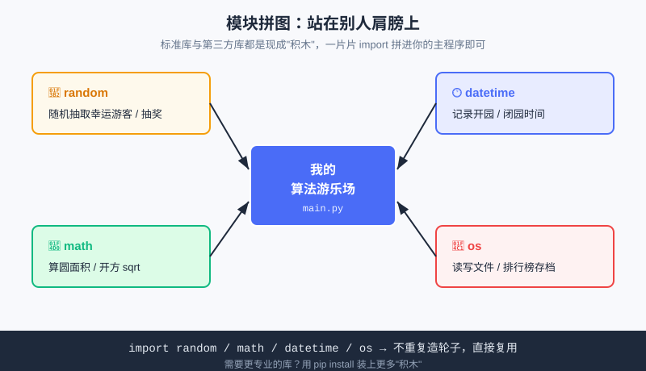

<div style="display:flex; gap:12px; margin-bottom:24px; flex-wrap:wrap; align-items:center;">
  <span style="background:#f0f4ff; color:#4A6CF7; padding:4px 12px; border-radius:20px; font-size:0.85em; font-weight:600; border:1px solid rgba(74,108,247,0.2);">📖 第16章</span>
  <span style="background:#f0fdf4; color:#16a34a; padding:4px 12px; border-radius:20px; font-size:0.85em; border:1px solid rgba(22,163,74,0.2);">⏱️ ~30 min read</span>
  <span style="background:#fef9ec; color:#d97706; padding:4px 12px; border-radius:20px; font-size:0.85em; border:1px solid rgba(100,100,100,0.15);">🎯 Intermediate</span>
</div>

# Chapter 16: 模块与标准库 —— 不重复造轮子

> 📝 **Before You Continue:** 这一章是"函数篇"的收尾，也接上 [第0章 0.4 的包管理彩蛋](../getting-started/install.md)。你已会写函数（[第14章](functions-intro.md)）甚至递归（[第15章](scope-recursion.md)）。现在学怎么**组织函数成模块**，以及**直接借用别人写好的函数**。

想象你要造一辆车。你会从螺丝钉开始自己炼钢吗？当然不——你直接去买现成的轮胎、发动机、电路板，拼起来就行。写程序也一样：**Python 自带一大箱"现成零件"（标准库），网上还有成千上万个别人做好的"零件包"（第三方库）。** 这一章教你如何把这些零件"拼"进自己的程序——这就是 **`import`（导入）**。

<div class="story-scene">
<strong>🎬 开场小剧场：标准库装备箱打开</strong>
<p>算法游乐场要装一个圆形喷泉，小派准备自己写圆周率、自己算平方根、自己造随机数。工具仓库管理员 module 听完差点把扳手掉地上。</p>
<p>他打开一只大箱子：“别重复造轮子。<code>math</code>、<code>random</code>、<code>datetime</code> 都是现成装备。会 <code>import</code>，就等于会借用整个 Python 世界的工具。”</p>
</div>

<div class="quest-card">
<strong>🎯 本章任务卡</strong>
<ul>
<li>掌握三种常见 <code>import</code> 写法。</li>
<li>用 <code>math</code> 完成数学计算。</li>
<li>用 <code>random</code> 做随机抽奖。</li>
<li>认识标准库和第三方库的区别。</li>
<li>学会把自己的代码组织成模块。</li>
</ul>
</div>

<div class="boss-bug">
<strong>👾 本章 Boss Bug：星号导入污染怪</strong>
<p>它会把一大堆名字倒进你的代码里，让变量名互相撞车。打败它的习惯是：少用 <code>from xxx import *</code>，优先写清楚模块名前缀。</p>
</div>

---

## 16.1 三种导入方式
`import` 的本质是“加载一个模块，并使用它提供的名字”。这个模块可以来自标准库、第三方库，也可以是你自己写的文件。常用三种写法：

```python
import math                      # ① 整块导入：用 math.xxx 调用
print(math.sqrt(16))             # 4.0

from math import sqrt, pi        # ② 挑着导入：直接用 sqrt / pi，不用加前缀
print(sqrt(9))                   # 3.0
print(pi)                        # 3.141592653589793

import math as m                 # ③ 起别名：嫌名字长就缩写
print(m.sqrt(25))                # 5.0
```

| 写法 | 调用时 | 适合场景 |
|------|--------|---------|
| `import math` | 必须写 `math.` 前缀 | 用到很多 math 功能，前缀能避免名字冲突 |
| `from math import sqrt` | 直接写 `sqrt` | 只用其中一两个，图省事 |
| `import math as m` | 写 `m.` 前缀 | 模块名长（如 `matplotlib`），缩写更清爽 |

> ⚠️ **Warning:** `from math import *`（星号导入所有）虽然能"不写前缀直接用一切"，但会**把一堆名字倒进你的命名空间**，极易和你自己的变量撞名、还难排查。**初学者尽量避免 `import *`**，用前三种更安全。

### 一个 `.py` 文件就是一个模块

你不只能导入标准库，也能导入自己写的代码。对现在的我们来说，**一个 `.py` 文件就是一个模块**：文件名是模块名，文件里的函数和变量是模块提供的工具。例如，`helpers.py` 对应模块名 `helpers`，导入时写 `import helpers`，不要写 `.py`。

下面做一个真正可以复制运行的双文件示例。先新建一个文件夹，例如 `module_demo`，再在这个文件夹里新建两个文件：

- `helpers.py`
- `main.py`

两个文件必须直接放在**同一个文件夹**里。初学阶段先这样放，Python 才能直接找到 `helpers` 模块。

把下面内容保存到 `helpers.py`：

```python
print("helpers.py：模块顶层代码正在执行")


def greet(name):
    """返回一条欢迎消息。"""
    return f"欢迎，{name}！"


def main():
    """直接运行 helpers.py 时执行的入口函数。"""
    print(greet("工具管理员"))


if __name__ == "__main__":
    main()
```

再把下面内容保存到同一文件夹里的 `main.py`：

```python
import helpers


def main():
    """组织这个程序真正要完成的工作。"""
    message = helpers.greet("小派")
    print(message)


if __name__ == "__main__":
    main()
```

在 VS Code 中打开 `module_demo` 文件夹，再打开终端。确认终端当前就在这个文件夹中，然后运行：

```bash
uv run main.py
```

你会看到：

```text
helpers.py：模块顶层代码正在执行
欢迎，小派！
```

这里发生了三件关键的事：

1. **导入会执行模块的顶层代码。** Python 第一次执行 `import helpers` 时，会从上到下执行 `helpers.py`。因此最上面的 `print(...)` 立刻输出；`def greet(...)` 和 `def main(...)` 会创建函数，但函数体要等调用时才执行。
2. **`main()` 只是普通函数。** Python 不会因为它叫 `main` 就自动调用它。我们把程序入口集中在这个函数里，是为了让代码结构更清楚。
3. **`if __name__ == "__main__":` 决定是否启动入口。** 直接运行某个文件时，该文件的 `__name__` 是 `"__main__"`，所以会调用自己的 `main()`；被别的文件导入时，`helpers.py` 的 `__name__` 是 `"helpers"`，因此它的 `main()` 不会执行。

这个保护条件能避免“导入工具模块时，工具模块自己先跑完整程序”。不过，保护条件外的顶层语句仍会在导入时执行，所以实际项目通常把顶层代码控制在导入、常量和函数定义等必要内容中。示例中的顶层 `print(...)` 是为了让你亲眼看到导入过程。

---

## 16.2 标准库之 math：数学好帮手
`math` 是 Python 自带的"科学计算器"，常用成员：

```python
import math

print(math.pi)           # 圆周率 3.141592653589793
print(math.sqrt(2))      # 开方 ≈ 1.4142135623730951
print(math.pow(2, 10))   # 2 的 10 次方 = 1024.0
print(math.floor(3.7))   # 向下取整 3
print(math.ceil(3.2))    # 向上取整 4
```

**案例：算圆形花坛的面积**

```python
import math

def circle_area(radius):
    """返回半径为 radius 的圆面积。"""
    return math.pi * radius ** 2

r = 5
print("半径", r, "的圆面积 ≈", round(circle_area(r), 2))   # 半径 5 的圆面积 ≈ 78.54
```

> 💡 **Key Insight:** 注意 `round(值, 2)` 把结果四舍五入到两位小数——打印给用户看时，"≈ 78.54" 比一长串小数友好得多。这是让输出"体面"的小技巧。

---

## 16.3 标准库之 random：制造"随机"
抽奖、随机出题、游戏里掉装备——全靠 `random`。最常用三个：

```python
import random

print(random.randint(1, 6))        # ① 闭区间随机整数 [1, 6]，像掷骰子
print(random.choice(["红", "黄", "蓝"]))   # ② 从列表里随机抽一个
print(round(random.random(), 2))   # ③ [0,1) 随机小数，保留两位
```

**案例：游乐场抽奖机**

```python
import random

def draw_prize():
    """随机抽取一份奖品。"""
    prizes = ["棉花糖", "发光头箍", "不限次通行证", "谢谢参与"]
    return random.choice(prizes)

print("恭喜抽中：", draw_prize())
```

> 🤔 **Why 叫"伪随机"？** `random` 使用伪随机数生成器：它根据内部状态计算出一串看似随机、但原则上可以重现的结果。这很适合游戏、模拟和课堂上的抽奖练习；密码、验证码或有公平性与安全要求的真实抽奖不能依赖 `random`，应使用 `secrets` 等更合适的安全随机方案。

---

## 16.4 标准库之 datetime 与 os：时间与路径环境
`datetime` 负责日期和时间；这里用 `os` 查看程序当前所在的目录，以及目录中有哪些条目。

**datetime：记下开园、闭园时刻**

```python
import datetime

now = datetime.datetime.now()
print(now)                                  # 2026-07-17 14:30:05.123456
print(now.strftime("%Y-%m-%d %H:%M"))       # 2026-07-17 14:30（自定义格式）
```

**os：看看当前工作目录**

```python
import os

print(os.getcwd())          # 当前工作目录（你程序"站在"哪个文件夹）
print(os.listdir("."))      # 列出当前目录中的文件名和文件夹名
```

> 📝 **Note:** 上面的 `os` 示例只是在查询工作目录和目录内容，不是在读写文件内容。**路径处理与文件读写将在后续 Chapter 16B 专门讲解**，到时会区分 `pathlib`、内置的 `open()` 与 `os` 各自负责什么。

---

## 16.5 用 uv 安装第三方库
标准库随 Python 一起安装；**第三方库**由其他开发者发布，通常需要另外添加到项目中。本书沿用[第 0 章 0.5](../getting-started/install.md#05-推荐用-uv-管理项目环境与第三方包)的工具链：用 `uv` 管理项目和依赖。

如果当前练习文件夹里还没有 `pyproject.toml`，先创建并进入一个 uv 项目：

```bash
uv init requests_demo
cd requests_demo
```

如果已经在第 0 章创建好的 uv 项目里，就不用再次执行 `uv init`。在项目文件夹中添加 `requests`：

```bash
uv add requests
```

把项目根目录中的 `main.py` 改成下面的内容：

```python
import requests


def main():
    """请求测试服务并打印 HTTP 状态码。"""
    # httpbin 是专门用于测试 HTTP 请求的公开服务
    response = requests.get("https://httpbin.org/get", timeout=10)
    response.raise_for_status()
    print(response.status_code)


if __name__ == "__main__":
    main()
```

仍在这个项目文件夹中运行：

```bash
uv run main.py
```

网络正常时会输出状态码 `200`。`uv add requests` 把依赖记录在项目配置中，`uv run main.py` 则使用这个项目自己的环境运行程序；两条命令配套使用，换电脑时更容易复现。

> 📝 **pip 兼容说明：** 如果你正在维护一个没有使用 uv 的旧项目，可以用 `python -m pip install requests`。这种写法明确让当前 `python` 对应的 pip 安装依赖；本书新项目仍以 `uv add` 和 `uv run` 为主线。

> ⚠️ **Warning:** 第三方包来自外部开发者。初学阶段只添加来源可靠、用途明确的包，并认真核对包名，避免装到名称相似的可疑包。

### 🔍 计算思维聚焦：复用（Reuse）

> **站在别人肩膀上——能借现成的，就不自己重造。** 这是工程世界最重要的思维之一。你花一小时 `import` 一个库，可能省下别人几个月写的代码。复用不是"偷懒"，而是把精力留给真正属于你的问题。

想想看：没有复用，每个程序员都得重写排序、重写随机数、重写网络请求——人类早就累瘫了。**会找轮子、会用轮子，比会造轮子有时更关键。** 当然，第 17 章起你也会亲手"造"一些基础轮子（排序、搜索），那是为了懂原理；懂了之后，实战里照样优先用现成的。



上图把 `random`、`math`、`datetime`、`os` 画成四块拼图，一片片 `import` 进你的主程序——不用自己从零写随机数算法、不用自己实现圆周率，直接拼上就用。

> 🧮 **算法小课堂（前置彩蛋）：** 标准库里藏着算法的影子——`random.choice` 背后的随机抽取、`sorted()` 背后的排序算法（第 19 章会亲手实现）。理解"库函数怎么干活"，你才不会把它们当黑魔法；第 17 章起，我们就一层层掀开这些算法的盖子。

---

## 16.6 🛠️ 项目工坊：算法游乐场"随机事件"

游乐场想每天整点"惊喜"：闭园前随机抽取一位**幸运游客**，再随机送个奖品。用 `random` 两行就搞定——这就是复用的威力。

下面是一段**自包含**代码（纯终端、只用标准库）：

```python
import random
import datetime

def lucky_draw(guests):
    """从游客名单里随机抽一位幸运游客，并随机送一份奖品。"""
    if not guests:                       # 防空列表，避免抽空出错
        return "今天还没有游客～"
    lucky = random.choice(guests)        # 随机抽游客
    prizes = ["棉花糖", "发光头箍", "不限次通行证"]
    prize = random.choice(prizes)        # 随机抽奖品
    now = datetime.datetime.now().strftime("%H:%M")
    return "[" + now + "] 🎉 幸运游客 " + lucky + " 获得：" + prize


# 模拟今日游客名单（也可来自第 10-13 章的列表/字典）
today_guests = ["小明", "小红", "阿强", "老王", "小美"]
print(lucky_draw(today_guests))
print(lucky_draw(today_guests))
```

多次运行时，结果通常会变化，也可能碰巧连续抽中同一项——`random.choice` 给出的是**伪随机**结果。**现在游乐场多了"随机事件引擎"：`lucky_draw(guests)` 一个函数，借 `random` + `datetime` 两块现成拼图，就实现了"抽幸运游客 + 送随机奖品 + 打时间戳"。** 你没写一行伪随机数生成算法，却拥有了课堂版抽奖机。

> ⚡ **Pro Tip:** 真实项目里 `today_guests` 会来自第 10-13 章用列表/字典管理的游客数据。模块的价值正在于此：你前面攒的"数据零件"和这里攒的"功能零件"，可以无缝拼装。这个示例用于学习和模拟；涉及奖品价值、公平审计或安全要求的真实抽奖，不能直接把 `random` 当作可靠方案。

---

## 16.7 ⚔️ 挑战擂台

**擂台 1 — 掷骰子统计：** 用 `random.randint(1,6)` 模拟掷 10 次骰子，统计每个点数出现了几次（提示：用第 12 章的字典存计数）。

**擂台 2 — 自定义格式时间戳：** 用 `datetime` 输出"今天是 2026年07月17日 周五"这样的中文字符串（查 `strftime` 的 `%Y %m %d %A` 等格式符，注意中文星期可能需要额外处理）。

---

## 🏅 本章通关徽章：工具仓库管理员

<div class="badge-card">
<strong>如果你能做到下面 4 件事，就获得“工具仓库管理员”徽章：</strong>
<ul>
<li>能写出三种常见 <code>import</code> 方式。</li>
<li>能用 <code>math</code>、<code>random</code> 等标准库解决小问题。</li>
<li>能解释为什么不推荐 <code>import *</code>。</li>
<li>能把自己的函数拆成模块复用。</li>
</ul>
</div>

---

## ⚠️ Common Mistakes in Chapter 16

| # | 误区 | 示例 | 为什么错 | 修正 |
|---|------|------|---------|------|
| 1 | 没 import 就用 | `print(pi)` | `pi` 不在当前命名空间 | 先 `import math` 或 `from math import pi` |
| 2 | `from x import *` 污染命名 | `from math import *` 后变量冲突 | 倒进一堆名字，难排查 | 用 `import math` 或精准 `from math import sqrt` |
| 3 | 以为 `random` 能保证真随机 | 用于密码或要求公平审计的真实抽奖 | 它生成伪随机序列，不能提供这类安全保证 | 安全随机使用 `secrets` 等合适方案 |
| 4 | 两个模块文件分散放置 | `main.py` 找不到 `helpers` | 初学示例中，Python 无法从当前文件夹找到模块 | 先把 `helpers.py` 和 `main.py` 放在同一文件夹 |
| 5 | 把启动代码直接写在模块顶层 | 导入 `helpers` 时程序意外启动 | 导入会执行模块的顶层代码 | 把入口放进 `main()`，并用 `if __name__ == "__main__":` 保护 |
| 6 | 添加依赖后绕开项目环境运行 | 直接运行时报 `No module named 'requests'` | 运行程序的 Python 环境里没有该依赖 | 在项目目录执行 `uv add requests`，再执行 `uv run main.py` |
| 7 | 别名写错调用 | `import math as m` 后写 `math.sqrt` | 起了别名后原名不会自动保留 | 统一用别名 `m.sqrt` |
| 8 | 从空序列抽取 | `random.choice([])` | 空序列没有候选项，会报错 | 抽取前检查每个候选序列都非空 |

---

## Chapter Summary

### 📌 Key Takeaways

| 概念 | 要点 | 为什么重要 |
|------|------|------------|
| `import` | 把现成代码请进来用 | 不重复造轮子 |
| 三种导入 | `import` / `from..import` / `as` 别名 | 按场景选，避免命名冲突 |
| 自定义模块 | 一个 `.py` 文件可以作为模块；导入会执行顶层代码 | 把自己的函数拆开复用 |
| 程序入口 | `main()` 组织入口，`if __name__ == "__main__":` 控制何时启动 | 避免导入模块时意外运行程序 |
| `math` | `pi` / `sqrt` / `pow` / `floor` | 数学计算现成可用 |
| `random` | `randint` / `choice` / `random` 生成伪随机结果 | 适合游戏、模拟与课堂练习 |
| `datetime` / `os` | 时间格式化 / 查看当前目录环境 | 获取时间和程序运行位置 |
| `uv` | `uv add` 添加依赖，`uv run` 在项目环境中运行 | 可复现地管理第三方库 |

### ❓ FAQ

**Q1: `import math` 和 `from math import sqrt` 哪个好？**
> A: 没有绝对好坏。用到很多 math 功能、且想避免名字冲突时，用 `import math`（调用写 `math.sqrt`）；只偶尔用一两个、想少打字，用 `from math import sqrt`。关键是保持一个文件里的风格一致、可读。

**Q2: 标准库和第三方库有什么区别？**
> A: 标准库（如 `math`、`random`、`datetime`、`os`）随 Python 一起安装，开箱即用；第三方库（如 `requests`、`pandas`）需要先添加到项目中。本书新项目使用 `uv add 包名` 管理第三方依赖。两者都通过 `import` 使用，对你的代码来说都是可以复用的"积木"。

**Q3: 执行 `uv run main.py` 时提示找不到 `requests` 怎么办？**
> A: 先确认终端位于包含 `pyproject.toml` 和 `main.py` 的项目文件夹，再执行 `uv add requests`，最后执行 `uv run main.py`。如果维护的是没有使用 uv 的旧项目，兼容命令是 `python -m pip install requests`。

**Q4: 为什么写了 `main()` 还要再写保护条件？**
> A: `main()` 不会自动执行，它只是把入口逻辑集中起来。`if __name__ == "__main__":` 表示“只有直接运行这个文件时才调用 `main()`”；当文件被导入时，函数可以复用，但入口不会意外启动。

### 🔗 Connections to Later Chapters

- **[第17章 · 大 O 记法](../algorithms/big-o.md)** 起，算法篇正式开始——你会亲手实现排序、搜索，理解"库函数背后的原理"。
- **第六篇 · 综合项目**（[文本冒险](../projects/text-adventure.md)、[数据分析](../projects/data-analysis.md)、[算法擂台](../projects/algorithm-arena.md)）会大量 `import` 标准库与第三方库，把今天学的"拼图"拼成完整作品。
- **[下一步去哪](../projects/next-steps.md)** 会指向 USACO 竞赛、AI/ML 路线——那条路上 `numpy`、`pandas`、`requests` 等第三方库是日常。

---


## 🎮 加练任务包

> 下面这些题目不一定比章末题更难，但更适合“多刷几遍、把手感练出来”。建议先独立做，再展开提示。

### 加练 16.A · 随机抽奖 🟢

用 `random` 从名单里随机抽出一名幸运游客。

<details>
<summary>💡 提示 / 答案要点</summary>

`import random`，然后 `random.choice(names)`。模块像现成工具箱。

</details>

---

### 加练 16.B · 圆形面积 🟢

用 `math.pi` 计算半径为 3 的圆面积。

<details>
<summary>💡 提示 / 答案要点</summary>

`import math`，面积 `math.pi * 3 ** 2`。保留小数可用 f-string 格式符。

</details>

---

### 加练 16.C · 导入方式选择 🟡

为什么 `import math` 比 `from math import *` 更适合初学者？

<details>
<summary>💡 提示 / 答案要点</summary>

`math.sqrt` 前缀清楚，不容易名字冲突；星号导入会倒入太多名字，出错难查。

</details>

---


---

## Practice Problems

---

**Problem 16.1 — 用 math 算球体积** 🟢 Easy

球体积公式 `V = 4/3 · π · r³`。写代码用 `math.pi` 计算半径 `r = 7` 的球体积，四舍五入到两位小数打印。

**Sample Output:** `约 1436.76`

<details>
<summary>💡 Solution (click to reveal)</summary>

**Approach:** `import math` 后直接用 `math.pi`，幂运算用 `** 3`，最后 `round(..., 2)` 收两位小数。

```python
import math

r = 7
volume = 4 / 3 * math.pi * r ** 3
print("约", round(volume, 2))
```

**Key points:**
- `4 / 3` 在 Python 3 里是浮点除法，结果正确；若写成 `4 // 3` 会变整数 `1`，是常见坑。
- `round(值, 2)` 让输出清爽。

</details>

---

**Problem 16.2 — 用 random 模拟掷骰子** 🟡 Medium

写一个函数 `roll_dice()`，用 `random.randint(1, 6)` 返回一次掷骰子的点数。连续调用 5 次并打印。

**Sample Output:**（伪随机结果示例；实际结果可能不同，也可能出现重复）
```
3
6
1
5
2
```

<details>
<summary>💡 Solution (click to reveal)</summary>

**Approach:** `randint(1, 6)` 给出闭区间 `[1, 6]` 的随机整数；循环调用 5 次即可。

```python
import random

def roll_dice():
    return random.randint(1, 6)

for _ in range(5):
    print(roll_dice())
```

**Key points:**
- `for _ in range(5)` 里 `_` 表示"我不用这个循环变量"，是 Python 习惯写法。
- `random` 生成伪随机结果；多次结果可能变化，也可能重复。

</details>

---

**Problem 16.3 — from 导入与别名** 🟡 Medium

用 `from math import sqrt as s` 把 `sqrt` 别名为 `s`，再计算 `s(144)`、`s(225)` 并打印。体会"挑着导入 + 缩写"的组合用法。

**Sample Output:**
```
12.0
15.0
```

<details>
<summary>💡 Solution (click to reveal)</summary>

**Approach:** `from math import sqrt as s` 既"挑着导入"又"起别名"，之后直接用 `s(...)`。

```python
from math import sqrt as s

print(s(144))     # 12.0
print(s(225))     # 15.0
```

**Key points:**
- 别名 `as s` 之后，原名 `sqrt` 在本文件不可用了，统一用 `s`。
- 这种写法适合"只用一个函数"又"想少打字"的场景。

</details>

---

**Problem 16.4 — 把函数拆成双文件模块** 🟡 Medium

在同一个文件夹中创建 `helpers.py` 和 `main.py`。`helpers.py` 的顶层先打印 `helpers.py 已加载`，再定义函数 `double(number)`；`main.py` 导入 `helpers`，在自己的 `main()` 中打印 `double(21)` 的结果，并用 `if __name__ == "__main__":` 启动入口。最后执行 `uv run main.py`。

**Sample Output:**
```text
helpers.py 已加载
42
```

<details>
<summary>💡 Solution (click to reveal)</summary>

**`helpers.py`：**

```python
print("helpers.py 已加载")


def double(number):
    """返回 number 的两倍。"""
    return number * 2
```

**`main.py`：**

```python
import helpers


def main():
    """运行双倍计算示例。"""
    print(helpers.double(21))


if __name__ == "__main__":
    main()
```

**Key points:**
- `import helpers` 会执行 `helpers.py` 的顶层代码，所以先看到“已加载”。
- `helpers.double(21)` 用“模块名.函数名”明确指出函数来自哪里。
- 两个文件放在同一文件夹，并从该文件夹执行 `uv run main.py`。

</details>

---

**Problem 16.5 — 🏆 Challenge：闭园幸运抽奖** 🏆 Challenge

写一个函数 `closing_lottery(guests, prizes)`，从 `guests` 随机抽一位幸运游客、从 `prizes` 随机抽一份奖品，返回形如 `"🎉 幸运游客 小明 获得 发光头箍"` 的字符串。要求：若 `guests` 为空，返回 `"今日无游客"`；若 `prizes` 为空，返回 `"今日无奖品"`；用 `random.choice` 实现。用 `closing_lottery(["小明","小红","阿强"], ["棉花糖","不限次通行证"])` 测试。

**Sample Output:**（伪随机结果示例）
```
🎉 幸运游客 小红 获得 不限次通行证
```

<details>
<summary>💡 Solution (click to reveal)</summary>

**Approach:** 两个候选列表都先判空，再用两次 `random.choice` 分别抽游客和奖品，拼成字符串返回。

```python
import random


def closing_lottery(guests, prizes):
    """返回一次课堂抽奖结果，候选列表为空时返回提示。"""
    if not guests:
        return "今日无游客"
    if not prizes:
        return "今日无奖品"
    lucky = random.choice(guests)
    prize = random.choice(prizes)
    return "🎉 幸运游客 " + lucky + " 获得 " + prize


print(closing_lottery(["小明", "小红", "阿强"],
                      ["棉花糖", "不限次通行证"]))
```

**Key points:**
- `guests` 和 `prizes` 都会传给 `random.choice`，所以两个列表都必须判空。
- 函数返回字符串而非直接 `print`，调用处可自由决定怎么展示——这正是第 14 章封装思想的延续。
- `random.choice` 适合这个课堂模拟，但它提供的是伪随机结果，不应用于有安全或公平审计要求的真实抽奖。
- 此函数与第 16.6 节项目工坊的 `lucky_draw` 思路一致，是把"随机事件"封装复用的完整范例。

</details>

---

> 💡 **记住这一句：** 一个 `.py` 文件可以成为可复用的模块；用 `import` 既能调用自己整理好的工具，也能使用标准库和第三方库。
