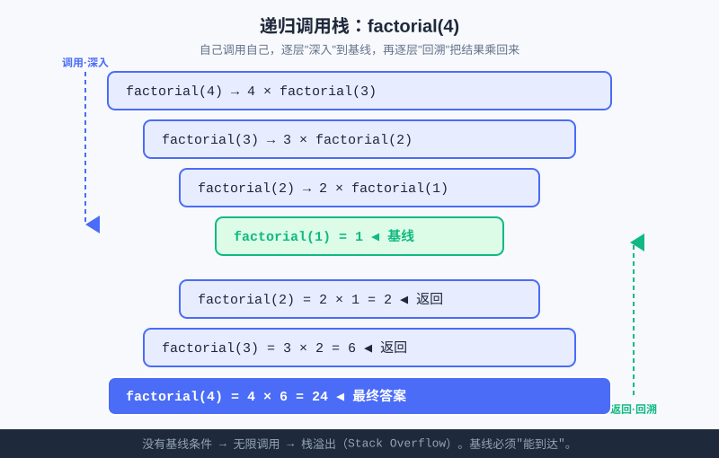

<div style="display:flex; gap:12px; margin-bottom:24px; flex-wrap:wrap; align-items:center;">
  <span style="background:#f0f4ff; color:#4A6CF7; padding:4px 12px; border-radius:20px; font-size:0.85em; font-weight:600; border:1px solid rgba(74,108,247,0.2);">📖 第15章</span>
  <span style="background:#f0fdf4; color:#16a34a; padding:4px 12px; border-radius:20px; font-size:0.85em; border:1px solid rgba(22,163,74,0.2);">⏱️ ~35 min read</span>
  <span style="background:#fef9ec; color:#d97706; padding:4px 12px; border-radius:20px; font-size:0.85em; border:1px solid rgba(100,100,100,0.15);">🎯 Intermediate</span>
</div>

# Chapter 15: 作用域与递归初步 —— 函数如何"自己调用自己"

> 📝 **Before You Continue:** 先读完 [第14章 函数入门](functions-intro.md)，确保你懂了 `def`、参数、`return` 和封装。本章在"会写函数"的基础上，往里钻两层：**函数里的变量归谁管**（作用域），以及**函数能不能调用自己**（递归）。

想象一套俄罗斯套娃：打开一个，里面还是一个更小的同款娃娃；再打开，还是一个更小的……直到最小的那个没法再开。这种"**大问题里套着小一号的同款问题**"的结构，在计算机里有个专门的名字——**递归（recursion）**。而要让递归跑得起来，你得先搞清楚：函数里的变量，到底活在哪个"房间"里？否则套娃套到一半，变量就找不到了。

<div class="story-scene">
<strong>🎬 开场小剧场：套娃师傅的规矩</strong>
<p>游乐场来了一个神秘任务：把一座由很多层组成的魔法塔拆开。小派想一层层硬拆，越拆越乱。套娃师傅 recursion 说：“别急。你只需要会拆最外面一层，剩下的小一号魔法塔，交给另一个自己。”</p>
<p>小派问：“那会不会一直拆下去？”师傅敲了敲最小的套娃：“当然不会。每个递归魔法都必须有一句停手咒，也就是基线条件。”</p>
</div>

<div class="quest-card">
<strong>🎯 本章任务卡</strong>
<ul>
<li>分清函数房间里的局部变量和客厅里的全局变量。</li>
<li>理解列表、字典这种可变对象传进函数后为什么会被改动。</li>
<li>看懂递归：函数怎样调用自己。</li>
<li>掌握递归三要素：基线条件、递归步、向基线收敛。</li>
<li>能判断一个递归会不会变成无限递归。</li>
</ul>
</div>

<div class="boss-bug">
<strong>👾 本章 Boss Bug：无限递归黑洞</strong>
<p>它最喜欢让函数一层层调用自己，却永远不靠近终点。打败它只靠三问：什么时候停？每次有没有变小？真的会走到停手条件吗？</p>
</div>

---

## 15.1 局部变量：函数"房间"里的私有物

<div class="try-it">
<strong>🧩 练一练 15.1</strong>
<p>题目：在函数里定义的变量，函数外面能直接用吗？</p>
<details><summary>💡 看看答案</summary>
<p>答案：<b>不能</b>。那是<b>局部变量</b>，只活在这个函数的“房间”里。</p>
</details>
</div>

函数内部定义的变量，只在这个函数里有效，叫**局部变量（local variable）**。函数一结束，它们就被"回收"了，外面访问不到：

```python
def make_ticket(name):
    code = "T-" + name       # code 是局部变量，只活在 make_ticket 里
    return code

print(make_ticket("小明"))    # T-小明
print(code)                  # ❌ 报错：NameError: name 'code' is not defined
```

> 🤔 **Why 局部变量外面找不到？** 因为 Python 给每个函数分配了一个独立的"命名空间"（可以想象成独立房间）。`code` 写在 `make_ticket` 的房间里，你站在房间外喊 `code`，自然没人应。这样设计的好处是：**不同函数可以用同名变量而不打架**——A 函数里的 `x` 和 B 函数里的 `x` 互不相干。

---

## 15.2 全局变量：所有函数共享的"客厅"

<div class="try-it">
<strong>🧩 练一练 15.2</strong>
<p>题目：全局变量和局部变量的主要区别？</p>
<details><summary>💡 看看答案</summary>
<p>答案：全局变量<b>所有函数共享</b>（像客厅），局部变量只在自己函数内有效（像卧室私物）。</p>
</details>
</div>

写在函数**外面**、所有函数都能看到的变量，叫**全局变量（global variable）**。它像家里的"客厅"，谁都能进：

```python
total_guests = 0              # 全局变量，客厅里的东西

def enter_park(name):
    global total_guests       # 声明：我要改的是客厅那个，不是新造一个
    total_guests = total_guests + 1
    print(name + " 入园，当前共 " + str(total_guests) + " 人")

enter_park("小明")            # 小明 入园，当前共 1 人
enter_park("小红")            # 小红 入园，当前共 2 人
print(total_guests)           # 2，外面也能读到
```

> ⚠️ **Warning:** 在函数里**读**全局变量一般没问题；但想**改**它，必须写 `global 变量名` 声明，否则 Python 会以为你要新建一个同名的局部变量，改的只是"冒牌货"，真正的全局变量纹丝不动。上面若漏了 `global total_guests`，两次调用后 `total_guests` 仍是 `0`。

> 🐛 **Common Bug:** 忘了 `global` 却不报错，只是"没生效"。这类 bug 最难查，因为程序不崩、只是结果不对。经验法则：**尽量少用全局变量**；要共享数据，优先用参数传进去、`return` 交出来（第 14 章的套路）。

---

## 15.3 参数传递：值传递还是引用传递？（浅提）

<div class="try-it">
<strong>🧩 练一练 15.3</strong>
<p>题目：列表这种“可变对象”作为参数传进函数，在里面被修改，会影响外面的原列表吗？</p>
<details><summary>💡 看看答案</summary>
<p>答案：<b>会</b>。因为传的是同一个对象的引用，函数里改了，外面也跟着变。</p>
</details>
</div>

你可能会问：把变量传给函数，函数里改了，外面会变吗？Python 的规则可以一句话概括：**传的是"对象的引用"（call by sharing）**。落到代码上分两种情况：

- **不可变对象**（数字 `int`、字符串 `str`、元组）：函数里改，外面的原值**不变**。
- **可变对象**（列表 `list`、字典 `dict`）：函数里就地改，外面的原值**会跟着变**。

```python
def change_number(x):
    x = x + 10          # x 是不可变数字，新建了一个值，外面不受影响
    print("函数内 x =", x)

def change_list(lst):
    lst.append(99)      # lst 是可变列表，就地修改，外面跟着变

n = 5
change_number(n)
print("外面 n =", n)    # 外面 n = 5（没变）

data = [1, 2, 3]
change_list(data)
print("外面 data =", data)  # 外面 data = [1, 2, 3, 99]（变了）
```

> 📝 **Note:** 这条规则不用死记硬背，先建立"**数字/字符串改不动，列表/字典能改动**"的直觉即可。等学到算法（比如排序一个列表）你会反复用到——传列表进函数排序，原列表直接就排好了，不用 `return`。

---

## 15.4 递归：函数调用它自己

<div class="try-it">
<strong>🧩 练一练 15.4</strong>
<p>题目：用递归思想算 factorial(5)：写出“大问题 = 小一号的同问题”这个关系。</p>
<details><summary>💡 看看答案</summary>
<p>答案：<code>factorial(n) = n * factorial(n-1)</code>，基线 <code>factorial(1)=1</code>。大问题化成小一号的自己。</p>
</details>
</div>

真正的重头戏来了。**递归（recursion）= 一个函数在自己的函数体里调用自己**。听起来像"套娃悖论"，但只要有正确的"停手条件"，它就非常优雅。

先看一个生活类比：**数一排人有多少**。你不想自己数，就问前一个人"你后面还有几个？"；他也不数，继续问前面的人……直到最前面那个人说"我后面 0 个"——这个答案一层层传回来，每个人 `+1` 报给后面，最后你拿到总数。这就是递归：**大问题（总数）= 小一号的同问题（前面人的后面人数）+ 一步处理（+1）。**

### 阶乘：递归的第一个玩具

阶乘 `n! = n × (n-1) × … × 1`。注意它有个天然递归结构：

```
n! = n × (n-1)!
```

也就是"算 n 的阶乘，先算小一号的 (n-1) 的阶乘"。用代码写出来：

```python
def factorial(n):
    if n == 1:                 # ① 基线条件（base case）：最小的那个套娃
        return 1
    return n * factorial(n - 1)   # ② 递归步：调用自己，处理小一号的问题


print(factorial(4))            # 4 * 3 * 2 * 1 = 24
print(factorial(5))            # 120
```



上图把 `factorial(4)` 的执行画成了"调用栈"：先一层层**深入**调用更小的 `factorial`，直到碰到基线 `factorial(1)=1`，再一层层**回溯**把结果乘回来，最后得到 24。这正是所有递归的运行轨迹。

---

## 15.5 递归三要素（写递归的 checklist）

<div class="try-it">
<strong>🧩 练一练 15.5</strong>
<p>题目：写递归的三个要素（checklist）是？</p>
<details><summary>💡 看看答案</summary>
<p>答案：① <b>基线条件</b>（何时停）；② <b>递归步</b>（调用自己，规模变小）；③ <b>向基线收敛</b>（每步都更接近停下）。</p>
</details>
</div>

任何一个正确的递归，都必须同时具备这三样东西，缺一个都可能"套娃套到天荒地老"：

1. **基线条件（Base Case）**：最小的、不用再递归就能直接给出答案的情况。比如 `factorial(1) = 1`。
2. **递归步（Recursive Step）**：函数调用自己，去解决"小一号"的同款问题。比如 `n * factorial(n-1)`。
3. **向基线收敛**：每次递归，问题规模都必须**严格变小**，确保迟早撞上基线。比如 `n-1` 让参数一步步逼近 `1`。

> 💡 **Key Insight:** 记住口诀——**"有底线、调自己、规模减"**。写递归前先问自己这三句，三句都答得上，递归就稳了。

### 斐波那契：另一个玩具（附诚实提醒）

斐波那契数列：`1, 1, 2, 3, 5, 8, …`，每项等于前两项之和。递归写法很直观：

```python
def fib(n):
    if n == 1 or n == 2:       # 基线：前两项都是 1
        return 1
    return fib(n - 1) + fib(n - 2)   # 递归步：前两项之和


print(fib(7))                  # 13
```

> ⚠️ **Warning（诚实提醒）：** 这个写法"好看但低效"——`fib(7)` 会重复计算大量子问题，`fib(50)` 直接卡死（指数级）。在 [第17章起的算法篇](../algorithms/big-o.md) 你会学到：这种重复用**记忆化 / 动态规划**解决。玩具归玩具，真要算大数，迭代或 memo 才是正道。先体会"递归思想"，效率后面补。

### 🔍 计算思维聚焦：递归思想（Recursion）

> **自己调用自己，把大问题化成小一号的同款问题，直到小到能直接回答。** 递归是"分而治之"思想的近亲：它不靠循环把问题"摊平"，而是靠"信任"——相信"小一号的问题已经被同款函数解决了"，自己只负责把小答案拼成大答案。

递归思想在算法竞赛里无处不在：第 20 章的**分治**（快排、归并）、树的遍历、回溯搜索，本质都是递归。今天你先和"套娃"交个朋友。

> 🧮 **算法小课堂（前置彩蛋）：** 递归的运行依赖"调用栈"——每次调用都压一层，返回再弹一层。理解了第 15.4 节那张栈图，你就懂了为什么递归能"记住回到哪"。第 20 章讲**递归与分治**时，这张图会升级成"问题分解树"，到时候你会回来感谢今天。

---

## 15.6 🛠️ 项目工坊：算法游乐场"无限套娃装饰"

游乐场想搞一棵"会分叉的魔法树"当招牌装饰。普通循环画不出"枝上生枝"的自相似结构，但**递归一句话就搞定**：画一根树枝 = 画两根更小的树枝。`turtle`（海龟）正好适合画这种分形。

下面是一段**自包含**的递归海龟代码（本地环境运行，在线环境可能弹不出窗口）：

```python
import turtle

def draw_branch(t, length, depth):
    """递归画一根树枝：到头前，分叉画左右两根更小的树枝。"""
    if depth == 0:                 # ① 基线：太短就不画了
        return
    t.forward(length)              # 画当前这段
    t.left(30)
    draw_branch(t, length * 0.7, depth - 1)   # ② 左子树（更小、更浅）
    t.right(60)
    draw_branch(t, length * 0.7, depth - 1)   # ③ 右子树（更小、更浅）
    t.left(30)
    t.backward(length)             # 退回起点，准备画别的枝


t = turtle.Turtle()
t.speed(0)                 # 最快速度
t.left(90)                 # 朝上长
draw_branch(t, 100, 5)     # 主干长 100，递归 5 层
turtle.done()
```

跑起来你会看到一棵对称的"魔法树"：每根枝都再生两根更小的枝，直到第 5 层停手。**现在游乐场多了"无限套娃装饰"——`draw_branch(t, length, depth)` 一个函数，靠"自己调用自己 + 每层的 depth 减 1"画出了整棵树。** 这就是递归三要素活生生的例子：基线 `depth==0`、递归步 `draw_branch(..., depth-1)`、收敛 `depth` 逐层减小。

> ⚡ **Pro Tip:** 想让树更茂盛，把 `draw_branch(t, 100, 5)` 的 `5` 改成 `6`、`7`。但别太大——递归层数太深会触及 Python 的默认上限（约 1000 层），而且画得超慢。玩具级别 5~7 层最合适。

---

## 15.7 ⚔️ 挑战擂台

**擂台 1 — 倒着数：** 写一个递归函数 `countdown(n)`，从 `n` 打印到 `1`（基线 `n==0` 时不打印直接返回）。调用 `countdown(3)` 应输出三行 `3 / 2 / 1`。

**擂台 2 — 递归求和：** 不用循环，用递归写 `sum_to(n)` 返回 `1+2+…+n`。提示：`sum_to(n) = n + sum_to(n-1)`，基线 `n==1` 返回 `1`。

---

## 🏅 本章通关徽章：套娃术入门

<div class="badge-card">
<strong>如果你能做到下面 4 件事，就获得“套娃术入门”徽章：</strong>
<ul>
<li>能解释局部变量为什么只活在函数房间里。</li>
<li>能判断列表/字典作为参数传入后是否会被函数改动。</li>
<li>能写出一个带基线条件的递归函数。</li>
<li>能检查递归有没有一步步靠近停止条件。</li>
</ul>
</div>

---

## ⚠️ Common Mistakes in Chapter 15

| # | 误区 | 示例 | 为什么错 | 修正 |
|---|------|------|---------|------|
| 1 | 忘写 `global` 就改全局 | 函数里 `total += 1` 没声明 | 改的是新建的局部变量，全局没动 | 函数内改全局前加 `global total` |
| 2 | 函数外访问局部变量 | `print(code)` | 局部变量函数结束就被回收 | 用 `return` 把值交出来再用 |
| 3 | 递归没有基线条件 | `def f(n): return f(n-1)` | 永远调自己，直到栈溢出崩溃 | 必须有 `if n==...: return ...` 兜底 |
| 4 | 递归不向基线收敛 | `return f(n + 1)` | 问题越变越大，永远碰不到基线 | 每次调用要让参数"更小/更接近基线" |
| 5 | 误以为数字传参会被改 | `change(n)` 里 `n+=1` | 数字是不可变对象，外面不变 | 要改就用 `return` 交回新值 |
| 6 | 元组/字符串当列表改 | `s.append(...)` | 它们是不可变的，没有改的方法 | 改用可变对象，或返回新字符串 |

---

## Chapter Summary

### 📌 Key Takeaways

| 概念 | 要点 | 为什么重要 |
|------|------|------------|
| 局部变量 | 函数内定义，函数外消失 | 不同函数可用同名，互不干扰 |
| 全局变量 | 函数外定义，需 `global` 才能改 | 共享数据，但易出隐蔽 bug，少用 |
| 参数传递 | 数字/字符串改不动，列表/字典能改 | 决定"传进去的东西会不会变" |
| 递归 | 函数自己调用自己 | "大问题 = 小一号同问题 + 一步" |
| 递归三要素 | 基线条件 + 递归步 + 向基线收敛 | 缺一则可能无限递归崩溃 |
| 调用栈 | 每次调用压一层，返回弹一层 | 理解递归如何"深入再回溯" |

### ❓ FAQ

**Q1: 递归和循环（`for`/`while`）能互相替代吗？**
> A: 理论上，能用循环写的往往也能用递归写，反之亦然。但**风格和可读性**不同：递归适合"自相似、层层分解"的问题（树、分治、回溯）；循环适合"重复 N 次"的平铺场景。初学不必强求递归，遇到"问题里套着小一号同问题"时再想起它。

**Q2: 忘了 `global` 真的不报错吗？**
> A: 很多时候不报错，只是"没生效"——你在函数里新建了一个同名的局部变量，改的是它，全局那个原值毫发无损。这种"静默错误"最坑，所以约定：**能不用全局就不用；要用就牢记 `global` 声明。**

**Q3: 递归会不会很慢 / 很费内存？**
> A: 会，比等价循环慢且占栈空间（每调用一层都要压栈）。像第 15.5 节的斐波那契直接递归是"指数级"低效。但它胜在**思路清晰、代码短**，很多算法问题用递归表达最自然；效率问题后面用记忆化、迭代来补。竞赛里递归是利器，但要会用对地方。

### 🔗 Connections to Later Chapters

- **[Chapter 16: 模块与标准库](../functions/modules.md)** 讲如何把函数（包括递归函数）组织进模块、复用标准库。
- **[第17章 · 大 O 记法](../algorithms/big-o.md)** 会量化"递归为什么有时慢"——比如斐波那契的指数复杂度。
- **[第20章 · 递归与分治](../algorithms/recursion-divide.md)** 是递归的"正式舞台"：快排、归并、回溯搜索，全建立在今天的递归思想上。

---


## 🎮 加练任务包

> 下面这些题目不一定比章末题更难，但更适合“多刷几遍、把手感练出来”。建议先独立做，再展开提示。

### 加练 15.A · 变量房间 🟢

函数里定义的 `temp`，函数外能直接访问吗？为什么？

<details>
<summary>💡 提示 / 答案要点</summary>

不能。它是局部变量，只活在函数自己的房间里，函数结束后外面看不到。

</details>

---

### 加练 15.B · 阶乘关系 🟢

写出 `factorial(5)` 的递归关系，不必写完整代码。

<details>
<summary>💡 提示 / 答案要点</summary>

`factorial(5) = 5 * factorial(4)`，一直缩小到 `factorial(1)=1`。

</details>

---

### 加练 15.C · 列表参数会变吗 🟡

函数里对传入列表执行 `append(99)`，函数外的原列表会变吗？

<details>
<summary>💡 提示 / 答案要点</summary>

会。列表是可变对象，函数里和外面指向同一个列表。若不想改原列表，先复制一份。

</details>

---


---

## Practice Problems

---

**Problem 15.1 — 写递归算 n 的阶乘** 🟢 Easy

用第 15.4 节的思路写一个递归 `factorial(n)`，基线 `n==1` 返回 `1`。调用 `factorial(6)` 并打印。

**Sample Output:** `720`

<details>
<summary>💡 Solution (click to reveal)</summary>

**Approach:** 三要素齐活——基线 `n==1` 返回 1；递归步 `n * factorial(n-1)`；收敛靠 `n-1` 逼近 1。

```python
def factorial(n):
    if n == 1:
        return 1
    return n * factorial(n - 1)

print(factorial(6))     # 720
```

**Key points:**
- 基线条件必须写在递归步之前，否则永远不会触发"停手"。
- `factorial(6)` = `6 * 5 * 4 * 3 * 2 * 1` = 720。

</details>

---

**Problem 15.2 — 递归倒计时** 🟡 Medium

写递归 `countdown(n)`：从 `n` 打印到 `1`；当 `n <= 0` 时直接 `return`（基线）。调用 `countdown(3)`。

**Sample Output:**
```
3
2
1
```

<details>
<summary>💡 Solution (click to reveal)</summary>

**Approach:** 先打印当前的 `n`，再递归处理 `n-1`；基线 `n<=0` 时停手。注意打印要在递归调用**之前**，才能从大到小输出。

```python
def countdown(n):
    if n <= 0:            # 基线：到头了
        return
    print(n)
    countdown(n - 1)      # 递归步 + 收敛

countdown(3)
```

**Key points:**
- 若把 `print(n)` 放在 `countdown(n-1)` 之后，会"从小到大"打印；顺序决定输出方向。
- 基线 `n <= 0` 比 `n == 0` 更稳，避免负数无限递归。

</details>

---

**Problem 15.3 — 局部 vs 全局** 🟡 Medium

下面代码想让全局计数器 `visitors` 在调用后变成 2，但写错了。请修正并解释原因。

```python
visitors = 0
def add_visitor():
    visitors = visitors + 1     # 这里有问题
add_visitor()
add_visitor()
print(visitors)
```

期望输出：`2`，实际输出：`0`（且没报错）。

<details>
<summary>💡 Solution (click to reveal)</summary>

**Approach:** 函数内想改全局变量，必须加 `global` 声明，否则 `visitors = visitors + 1` 新建的是局部变量，全局的 `visitors` 从未被碰。

```python
visitors = 0
def add_visitor():
    global visitors            # 声明改的是全局那个
    visitors = visitors + 1

add_visitor()
add_visitor()
print(visitors)                # 2
```

**Key points:**
- 漏 `global` 时不报错、只是"没生效"，是典型的静默 bug。
- 更好做法是用参数 + `return` 传值，避免依赖全局变量；这里仅为演示 `global` 语法。

</details>

---

**Problem 15.4 — 🏆 Challenge：递归反转字符串** 🏆 Challenge

写递归函数 `reverse(s)`，返回字符串 `s` 的反转。思路：反转 = "最后一个字符" + "前面部分的反转"。基线：空串或单字符直接返回。用 `reverse("算法游乐场")` 测试。

**Sample Output:** `场乐游法算`

<details>
<summary>💡 Solution (click to reveal)</summary>

**Approach:** 递归步 `s[-1] + reverse(s[:-1])`——取出最后一个字符，拼上"去掉最后一位的前缀"的反转；基线：长度 ≤ 1 时直接返回。

```python
def reverse(s):
    if len(s) <= 1:            # 基线：空串或单字符
        return s
    return s[-1] + reverse(s[:-1])   # 末字符 + 前缀的反转

print(reverse("算法游乐场"))   # 场乐游法算
```

**Key points:**
- `s[-1]` 是最后一个字符，`s[:-1]` 是去掉最后一位的前缀，规模每次减 1，必然收敛。
- 这是"自相似分解"的完美示例：反转整串 = 末字符 + 反转小一号的前缀。
- 字符串不可变，所以靠 `return` 拼接出新串，而不是就地改。

</details>

---

> 💡 **记住这一句：** 递归就是"套娃"——**相信自己能解决小一号的问题，再把它拼成大问题的答案；但别忘了留一个最小的娃娃当底线。**
