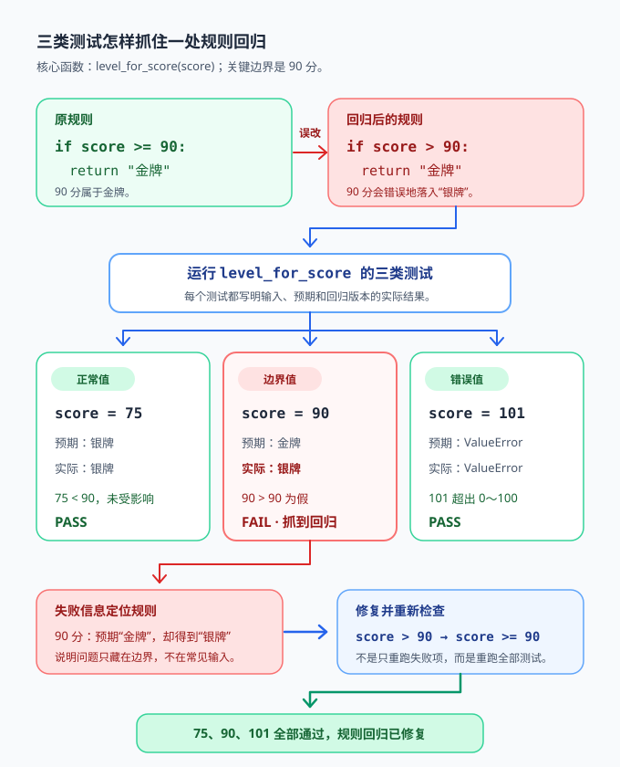

<div style="display:flex; gap:12px; margin-bottom:24px; flex-wrap:wrap; align-items:center;">
  <span style="background:#f0f4ff; color:#4A6CF7; padding:4px 12px; border-radius:20px; font-size:0.85em; font-weight:600; border:1px solid rgba(74,108,247,0.2);">Chapter 16C</span>
  <span style="background:#f0fdf4; color:#16a34a; padding:4px 12px; border-radius:20px; font-size:0.85em; border:1px solid rgba(22,163,74,0.2);">约 40 分钟</span>
  <span style="background:#fef9ec; color:#d97706; padding:4px 12px; border-radius:20px; font-size:0.85em; border:1px solid rgba(100,100,100,0.15);">零基础必修</span>
</div>
# Chapter 16C: 类型提示与自动化测试

> **承接前章：** 16A 章让函数清楚地拒绝坏数据，16B 章让数据可以保存。现在要为函数写“使用说明”和“自动检查员”，让修改代码后也敢确认结果仍然正确。

小派写了一个计算团体票价的函数，隔天却忘了参数应该传数字还是字符串。他修好后只试了 `3` 张票，没发现 `0` 和 `11` 张时规则有问题。**类型提示（type hint）**帮助人和编辑器读懂预期类型，**自动化测试（automated test）**则用代码反复检查行为。

本章只用 Python 自带功能就能完成主线。最后有一个很小的 `pytest` 选读入口，安装和运行统一使用 `uv`。

本章完成后，你能够：
- 为参数、返回值和常见容器添加类型提示；
- 解释为什么类型提示不会自动阻止运行时错误；
- 设计正常、边界和错误三类测试；
- 编写并运行普通测试函数；
- 只在测试和内部不变量中使用 `assert`；
- 选读用 `uv` 运行最小 `pytest` 测试。
---
## 16C.1 类型提示是代码旁边的说明牌

先看没有提示的函数：
```python
def total_price(count, price):
    return count * price
```
读者需要猜：`count` 是整数吗？`price` 能否是小数？返回值是什么？加上类型提示后更清楚：
```python
def total_price(count: int, price: float) -> float:
    """计算 count 张票的总价。"""
    return count * price

print(total_price(3, 19.5))
```
逐项阅读：
1. `count: int` 表示预期票数是整数；
2. `price: float` 表示预期单价是浮点数；
3. `-> float` 表示函数预期返回浮点数；
4. 类型提示不会改变乘法逻辑，只是把约定写在函数签名里。

常见基础类型包括：

| 类型 | 表示的数据 | 示例 |
|------|------------|------|
| `int` | 整数 | `3` |
| `float` | 小数 | `19.5` |
| `str` | 文本 | `"小云"` |
| `bool` | 真或假 | `True` |
| `None` | 没有返回值 | `-> None` |

只打印、不返回结果的函数可以这样写：
```python
def greet(name: str) -> None:
    """打印欢迎语。"""
    print(f"欢迎你，{name}！")


greet("小云")
```
类型提示首先服务于阅读。编辑器和类型检查工具也可以利用它们发现可疑代码，但 Python 解释器通常不会仅因提示不匹配而拒绝运行。
---
## 16C.2 容器类型提示：说明里面装什么

只写 `list` 只能说明“这是列表”，却没说明列表元素。可以在方括号中写出元素类型：
```python
def average(scores: list[int]) -> float:
    """计算整数成绩列表的平均分。"""
    return sum(scores) / len(scores)

print(average([80, 90, 100]))
```
`list[int]` 表示“元素都是整数的列表”。其他常见写法：
```python
def unique_names(names: set[str]) -> list[str]:
    """把姓名集合按字母顺序转成列表。"""
    return sorted(names)

def find_score(scores: dict[str, int], name: str) -> int | None:
    """找到成绩时返回整数，否则返回 None。"""
    return scores.get(name)

print(unique_names({"Mia", "Ada", "Bob"}))
print(find_score({"小云": 90}, "小雨"))
```
逐项解释：
- `set[str]`：字符串集合；
- `list[str]`：字符串列表；
- `dict[str, int]`：键是字符串、值是整数的字典；
- `int | None`：结果可能是整数，也可能是 `None`。

嵌套类型也能写，例如 `list[dict[str, int]]`。但提示太长时会难读，可以先把数据结构拆成更清楚的小部分，不必追求一行塞下所有信息。
---
## 16C.3 类型提示不会自动拦住错误

下面故意传入字符串：
```python
def double(number: int) -> int:
    """返回整数的两倍。"""
    return number * 2

print(double("哈"))
```
虽然参数标成 `int`，程序仍会运行并输出 `哈哈`。这说明：**类型提示是约定，不是自动的运行时门卫。**

如果数据来自用户输入，仍要在程序边界转换和校验：
```python
def parse_positive_int(text: str) -> int:
    """把外部文本转换为正整数。"""
    try:
        number = int(text)
    except ValueError:
        raise ValueError("请输入整数")
    if number <= 0:
        raise ValueError("数字必须大于 0")
    return number

print(parse_positive_int("12"))
```
类型提示与运行时校验解决的是不同问题：

| 工具 | 主要回答 | 什么时候发挥作用 |
|------|----------|------------------|
| 类型提示 | “这里预期什么类型？” | 阅读、编辑、静态检查时 |
| `if` / `raise` | “这次真实数据合法吗？” | 程序运行时 |
| 自动化测试 | “函数在代表性情况中仍正确吗？” | 每次执行测试时 |

三者可以合作，不能互相替代。
---
## 16C.4 测试不只试“刚好能用”的情况

假设规则是：一次购买 `1` 到 `6` 张票，每张 20 元。函数如下：
```python
def ticket_cost(count: int) -> int:
    """返回 1 到 6 张票的总价。"""
    if not 1 <= count <= 6:
        raise ValueError("票数必须在 1 到 6 之间")
    return count * 20
```
只测试 `ticket_cost(3)` 不够。至少要考虑三类测试：

| 类别 | 要回答的问题 | 本例输入 |
|------|----------------|----------|
| 正常测试 | 常见输入能否得到正确结果？ | `3` |
| 边界测试 | 刚好在范围边缘时是否正确？ | `1`、`6` |
| 错误测试 | 不合法输入是否按约定失败？ | `0`、`7` |

边界是最容易藏错的地方。若把条件误写成 `1 < count < 6`，普通输入 `3` 会通过，但合法边界 `1` 和 `6` 会被拒绝。

测试不是为了证明程序永远没有错误，而是把重要约定变成可重复执行的检查。修代码后重新运行，就能更快发现旧功能是否被破坏。
---
## 16C.5 用测试函数和 assert 自动检查

Python 自带的 `assert` 很适合表达测试预期：
```python
def ticket_cost(count: int) -> int:
    """返回 1 到 6 张票的总价。"""
    if not 1 <= count <= 6:
        raise ValueError("票数必须在 1 到 6 之间")
    return count * 20

def test_normal_case() -> None:
    """检查常见票数。"""
    assert ticket_cost(3) == 60

def test_boundary_cases() -> None:
    """检查合法范围的两个边界。"""
    assert ticket_cost(1) == 20
    assert ticket_cost(6) == 120


test_normal_case()
test_boundary_cases()
print("正常与边界测试通过")
```
`assert 实际结果 == 预期结果` 的意思是：“这个条件应该为真，否则测试失败。”通过时通常不用输出每个细节，失败时 Python 会抛出 `AssertionError` 并指出位置。

测试函数有三个好习惯：
1. 名字以 `test_` 开头，一眼能认出用途；
2. 一个函数检查一类行为；
3. 每次运行都独立，不依赖上次留下的数据。

不要写只会打印、却不会自动判断的“测试”：
```python
def show_result() -> None:
    print(ticket_cost(3))
```
看到 `60` 后由人判断当然可以，但重复很多次容易漏看。`assert` 能让失败自动变得醒目。
---
## 16C.6 如何测试预期异常

错误测试要确认两件事：确实抛出了异常，而且异常类型正确。不依赖第三方库时，可以直接用 `try` / `except`：
```python
def ticket_cost(count: int) -> int:
    """返回 1 到 6 张票的总价。"""
    if not 1 <= count <= 6:
        raise ValueError("票数必须在 1 到 6 之间")
    return count * 20

def test_rejects_zero() -> None:
    """确认 0 张票会被拒绝。"""
    try:
        ticket_cost(0)
    except ValueError as error:
        assert str(error) == "票数必须在 1 到 6 之间"
    else:
        raise AssertionError("ticket_cost(0) 应该抛出 ValueError")


test_rejects_zero()
print("错误测试通过")
```
逐步追踪：
1. 测试尝试调用 `ticket_cost(0)`；
2. 正确实现会抛出 `ValueError`，进入 `except`；
3. 测试继续检查错误消息；
4. 如果函数忘了抛异常，就会进入 `else`，测试主动失败。

这也是 `else` 的一个好用途：它表示 `try` 中没有异常发生，而这一次“没有异常”反倒是错误结果。
---
## 16C.7 assert 的正确边界

`assert` 适合两类地方：

**第一类：测试预期。**
```python
def add(left: int, right: int) -> int:
    return left + right


assert add(2, 3) == 5
assert add(-1, 1) == 0
```
**第二类：程序内部不变量。** 不变量是程序设计保证“走到这里一定成立”的条件：
```python
def middle_item(items: list[str]) -> str:
    """返回奇数长度列表的中间元素。"""
    if not items or len(items) % 2 == 0:
        raise ValueError("列表必须非空且长度为奇数")

    middle = len(items) // 2
    assert 0 <= middle < len(items)
    return items[middle]

print(middle_item(["红", "黄", "蓝"]))
```
外部输入先用 `if` 和 `raise` 校验。后面的 `assert` 检查由前面逻辑保证的内部事实；若它失败，通常说明程序员写错了代码。

不要这样校验用户年龄：
```python
age = int(input("年龄："))
assert age >= 0
```
Python 优化模式可能跳过断言，而且 `AssertionError` 也不是友好的用户提示。外部数据应使用 `if age < 0: raise ValueError(...)` 或请用户重新输入。
---
## 16C.8 完整可运行示例：给计分规则配测试

下面的文件同时包含业务函数和四个测试函数，不需要安装任何库。
```python
def level_for_score(score: int) -> str:
    """根据 0 到 100 的分数返回等级。"""
    if not 0 <= score <= 100:
        raise ValueError("分数必须在 0 到 100 之间")
    if score >= 90:
        return "金牌"
    if score >= 60:
        return "银牌"
    return "继续加油"

def test_normal_scores() -> None:
    assert level_for_score(95) == "金牌"
    assert level_for_score(75) == "银牌"
    assert level_for_score(40) == "继续加油"

def test_boundaries() -> None:
    assert level_for_score(0) == "继续加油"
    assert level_for_score(60) == "银牌"
    assert level_for_score(90) == "金牌"
    assert level_for_score(100) == "金牌"

def check_raises_value_error(score: int) -> None:
    """确认指定分数会触发 ValueError。"""
    try:
        level_for_score(score)
    except ValueError:
        return
    raise AssertionError(f"level_for_score({score}) 应抛出 ValueError")

def test_invalid_scores() -> None:
    check_raises_value_error(-1)
    check_raises_value_error(101)

def run_tests() -> None:
    """执行本文件中的全部测试。"""
    test_normal_scores()
    test_boundaries()
    test_invalid_scores()
    print("全部测试通过")

if __name__ == "__main__":
    run_tests()
```
把代码保存为 `score_rules.py`，运行：
```bash
python score_rules.py
```
正常时输出 `全部测试通过`。可以故意把 `score >= 90` 改成 `score > 90`，再运行一次；边界测试会立刻发现 `90` 分的规则被破坏。



*普通输入可能看不出回归，`90` 这个边界值会准确暴露 `>=` 被误改为 `>` 的问题。*

这个过程就是最小自动化测试循环：
1. 写清预期；
2. 运行测试；
3. 看到失败并定位；
4. 修复代码；
5. 再次运行全部测试。
---
## 16C.9 选读：用 uv 运行最小 pytest

当测试变多时，可以选用第三方测试框架 `pytest`。它不是本章主线；前面的普通测试函数已经能完成基础自动检查。

在已有项目目录中添加开发依赖：
```bash
uv add --dev pytest
```
建立 `test_score_rules.py`：
```python
import pytest

from score_rules import level_for_score

def test_gold_boundary() -> None:
    assert level_for_score(90) == "金牌"

def test_rejects_too_large_score() -> None:
    with pytest.raises(ValueError):
        level_for_score(101)
```
运行测试：
```bash
uv run pytest
```
`pytest` 会自动寻找以 `test_` 开头的函数。`pytest.raises(ValueError)` 用来说明“这里预期出现 `ValueError`”。项目是否使用 `pytest` 取决于任务需要；不要为了一个小脚本强行增加依赖。
---
## 16C.10 Common Mistakes

| 常见错误 | 为什么有问题 | 正确做法 |
|----------|--------------|----------|
| 以为类型提示会自动检查输入 | Python 通常仍会执行 | 在程序边界做运行时校验 |
| 只测一个普通数字 | 边界错误容易漏掉 | 覆盖正常、边界、错误情况 |
| 测试只 `print()` | 仍要靠人盯着输出 | 用 `assert` 自动比较 |
| 用 `assert` 校验用户输入 | 可能被跳过，提示也不友好 | 使用 `if`、`raise` 或重试 |
| 一个测试依赖另一个测试先运行 | 单独运行时可能失败 | 每个测试自己准备数据 |
| 为了测试改坏正式函数 | 测试与实现互相污染 | 测试调用公开行为，不篡改规则 |

类型提示也不必写得过度复杂。先标清函数边界上的参数和返回值，再为重要容器补充元素类型，已经能显著提高可读性。
---
## 16C.11 Chapter Summary

- **参数提示写在冒号后**，返回值提示写在 `->` 后。
- **容器提示说明元素类型**：如 `list[int]`、`dict[str, int]`。
- **类型提示不是运行时校验**：外部数据仍需 `if`、转换和 `raise`。
- **测试覆盖三类情况**：正常、边界、错误。
- **测试函数自动判断**：用 `assert` 比较实际结果与预期结果。
- **`assert` 有边界**：用于测试和内部不变量，不用于外部输入。
- **`pytest` 是选读工具**：需要时用 `uv add --dev pytest` 和 `uv run pytest`。

测试不能证明所有输入都正确，但能把最重要的规则固定下来。每修一个错误，就考虑补一条能重现它的测试。
## 16C.12 Practice Problems
### Problem 16C.1 补全类型提示 🟢 Easy

为“找出最高分”函数补全参数和返回值类型，并处理空列表：空列表返回 `None`。
<details>
<summary>查看参考答案</summary>

```python
def highest(scores: list[int]) -> int | None:
    """返回最高分；空列表返回 None。"""
    if not scores:
        return None
    return max(scores)

print(highest([70, 95, 82]))
print(highest([]))
```
`list[int]` 说明元素是整数，`int | None` 说明结果有两种可能。
</details>
### Problem 16C.2 设计三类测试 🟡 Medium

函数 `is_valid_level(level)` 只接受 `1` 到 `10`。分别写一个正常测试、一个边界测试和一个错误测试的输入清单。
<details>
<summary>查看参考答案</summary>


- 正常：`5`；
- 边界：`1`、`10`；
- 错误：`0`、`11`。

正常值检查常见路径，边界值检查比较符号，错误值检查拒绝规则。若函数还接收外部文本，则应另外测试 `"五"` 等无法转换的输入。
</details>
### Problem 16C.3 测试温度转换 🟡 Medium

编写 `celsius_to_fahrenheit(celsius: float) -> float`，公式为 `celsius * 9 / 5 + 32`。再写测试函数检查 `0`、`100` 和 `-40`。
<details>
<summary>查看参考答案</summary>

```python
def celsius_to_fahrenheit(celsius: float) -> float:
    """把摄氏温度转换为华氏温度。"""
    return celsius * 9 / 5 + 32

def test_celsius_to_fahrenheit() -> None:
    assert celsius_to_fahrenheit(0) == 32
    assert celsius_to_fahrenheit(100) == 212
    assert celsius_to_fahrenheit(-40) == -40


test_celsius_to_fahrenheit()
print("温度测试通过")
```
三个值覆盖常见基准点和负数情况。
</details>
### Problem 16C.4 测试错误情况 🏆 Challenge

编写 `percentage(part, whole)`：`whole <= 0` 时抛出 `ValueError`，否则返回百分比。写测试确认正常结果和错误结果。
<details>
<summary>查看参考答案</summary>

```python
def percentage(part: float, whole: float) -> float:
    """计算百分比，整体必须大于零。"""
    if whole <= 0:
        raise ValueError("整体必须大于 0")
    return part / whole * 100

def test_percentage() -> None:
    assert percentage(1, 4) == 25
    try:
        percentage(1, 0)
    except ValueError:
        pass
    else:
        raise AssertionError("whole 为 0 时应抛出 ValueError")


test_percentage()
print("百分比测试通过")
```
测试中的 `assert` 检查结果；正式函数中的 `if` 和 `raise` 校验运行时参数。
</details>
---

> **记住这一句：** 类型提示告诉人“应该怎么用”，自动化测试反复确认“实际还能不能这样用”。

*上一章：[Chapter 16B：文件、路径与结构化数据](files-data.md) · 下一章：[第17章：算法与效率入门（Big-O 直觉）](../algorithms/big-o.md)*
