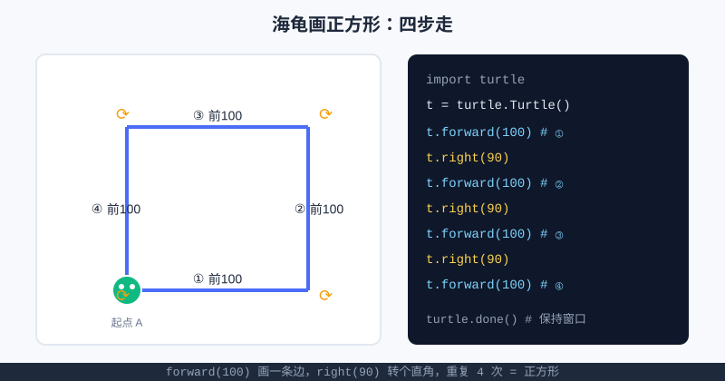

<div style="display:flex; gap:12px; margin-bottom:24px; flex-wrap:wrap; align-items:center;">
  <span style="background:#f0f4ff; color:#4A6CF7; padding:4px 12px; border-radius:20px; font-size:0.85em; font-weight:600; border:1px solid rgba(74,108,247,0.2);">📖 第1章</span>
  <span style="background:#f0fdf4; color:#16a34a; padding:4px 12px; border-radius:20px; font-size:0.85em; border:1px solid rgba(22,163,74,0.2);">⏱️ ~30 min read</span>
  <span style="background:#f0fdf4; color:#16a34a; padding:4px 12px; border-radius:20px; font-size:0.85em; border:1px solid rgba(22,163,74,0.2);">🎯 Beginner</span>
</div>

# Chapter 1: 你好，Python！

> 📝 **Before You Continue:** 装好本地环境（[第0章](install.md)）或准备用**在线环境**都行。两种都讲，你挑顺手的。

有一种快乐很特别：你敲几行字，电脑就**真的照做了**。这一章就要让你体验它——先让电脑说句话，再让一只"海龟"替你画出第一幅画。这就是编程最上头的地方：**你下指令，世界（的窗口）就变了。**

<div class="story-scene">
<strong>🎬 开场小剧场：第一声咒语</strong>
<p>小派站在游乐场控制台前，屏幕黑黑的，什么都没有。他敲下第一句 <code>print("你好，Python！")</code>，按下运行，电脑真的回了一句话。</p>
<p>海龟画笔 turtle 也探出脑袋：“别只让屏幕说话，给我几条前进和转弯的命令，我还能把你的想法画出来。”第一章，就是让你亲眼看见代码改变世界。</p>
</div>

<div class="quest-card">
<strong>🎯 本章任务卡</strong>
<ul>
<li>用在线环境或本地环境跑第一段代码。</li>
<li>用 <code>print()</code> 让电脑输出文字。</li>
<li>理解引号和括号为什么不能乱丢。</li>
<li>请出 <code>turtle</code> 画出第一幅图。</li>
<li>学会运行、观察输出、修改参数再运行。</li>
</ul>
</div>

<div class="boss-bug">
<strong>👾 本章 Boss Bug：引号逃跑怪</strong>
<p>它会偷偷拿走文字两边的英文引号，让 Python 把普通文字当成陌生指令。打败它的口诀是：<b>要原样输出的文字，必须用英文引号包住</b>。</p>
</div>

---

## 1.0 在线环境跑起来（等不及？走这条）

<div class="try-it">
<strong>🧩 练一练 1.1</strong>
<p>题目：在在线环境里，点"运行"后，代码的输出显示在哪里？</p>
<details><summary>💡 看看答案</summary>
<p>答案：显示在编辑器<b>下方的控制台 / 输出区</b>。如果没看到，确认你按了"运行 / Run"按钮。</p>
</details>
</div>

不想先装东西？完全 OK。打开浏览器就行：

1. 搜 **Replit**（或 Google **Colab**、国内可访问的类似在线 Python 环境）。
2. 新建一个 **Python** 文件 / 笔记本。
3. 直接敲下面 1.1 的 `print` 代码，点"运行"。

> 💡 **Key Insight:** 在线环境把"安装 Python + 编辑器"打包成了网页，你只要会打字就能跑。等尝到甜头，再回头看 [第0章](install.md) 装本地环境也不迟。

> 📝 **Note:** 下面 1.2 的**海龟画图**在部分在线环境里看不到图形窗口（它要弹窗）。`print` 版在哪都能跑；海龟画不出图时，先练 `print`，本地环境装好后再补画图体验。

---

## 1.1 你的第一行代码：`print()`

<div class="try-it">
<strong>🧩 练一练 1.2</strong>
<p>题目：让电脑打印出你自己的名字。</p>
<details><summary>💡 看看答案</summary>
<p>答案：<code>print("小龙")</code> 会输出 <code>小龙</code>。<code>print()</code> 括号里用引号包住文字即可。</p>
</details>
</div>

`print()` 是让电脑"说一句话"的命令。把想说的话放进**英文引号**里：

```python
print("你好，Python！")   # 运行时，引号里的内容会被原样打印出来
```

**运行后你会看到：**
```
你好，Python！
```

> 🤔 **Why 要引号？** 引号告诉 Python：这一串是"要原样输出的文字"，不是命令。漏了引号，Python 会把 `你好` 当成不认识的指令而报错。

再来几个，感受一下它能输出什么：

```python
print("我叫小明")
print("1 + 1 =", 1 + 1)   # 逗号隔开，2 会先算好再拼接
print("今天天气真好")
```

**输出：**
```
我叫小明
1 + 1 = 2
今天天气真好
```

> 🧠 **计算思维聚焦（抽象 Abstraction）：** 你写的 `print("...")` 是"指令"，屏幕上出现的话是"结果"。**把"想做的事"写成"指令"让机器执行**——这就是编程最核心的一步抽象。哪怕只是打印一句话，你已经在"指挥"电脑了。

---

## 1.2 海龟画图：画出第一幅画

<div class="try-it">
<strong>🧩 练一练 1.3</strong>
<p>题目：让海龟画一个正方形（提示：forward 前进 + right 右转各 4 次）。</p>
<details><summary>💡 看看答案</summary>
<p>答案：<code>import turtle</code> 后，<code>for _ in range(4): t.forward(100); t.right(90)</code>。</p>
</details>
</div>

Python 自带一个超好玩的画图工具叫 **`turtle`（海龟）**。想象一只小海龟趴在画布上，你下"前进、转弯"的指令，它就用尾巴画出轨迹。

### 🧠 Mental Model: 海龟与画布

<div class="try-it">
<strong>🧩 练一练 1.5</strong>
<p>题目：海龟刚启动时，它面朝哪个方向？</p>
<details><summary>💡 看看答案</summary>
<p>答案：面朝<b>右（东）</b>。<code>forward(100)</code> 让它朝当前面向前进 100 步，<code>right(90)</code> 原地右转 90°。</p>
</details>
</div>

<div style="text-align:center; margin:20px 0;">
<svg width="420" height="220" viewBox="0 0 420 220" xmlns="http://www.w3.org/2000/svg" style="max-width:100%;">
  <rect x="20" y="20" width="380" height="180" rx="10" fill="#ffffff" stroke="#e2e8f0" stroke-width="2"/>
  <circle cx="80" cy="150" r="18" fill="#10b981" stroke="#fff" stroke-width="2"/>
  <circle cx="74" cy="146" r="3" fill="#fff"/>
  <circle cx="86" cy="146" r="3" fill="#fff"/>
  <line x1="98" y1="150" x2="180" y2="150" stroke="#4A6CF7" stroke-width="4"/>
  <text x="139" y="142" text-anchor="middle" font-size="13" fill="#1e293b">前进</text>
  <text x="80" y="195" text-anchor="middle" font-size="12" fill="#64748b">小海龟（听指令）</text>
  <text x="300" y="115" text-anchor="middle" font-size="13" fill="#64748b">你下指令 →</text>
  <text x="300" y="138" text-anchor="middle" font-size="13" fill="#64748b">它画轨迹</text>
</svg>
<p style="color:#888; font-size:0.9em; margin-top:6px;">你只管说"前进 100、右转 90"，画什么由海龟代劳。</p>
</div>

下面这段代码，让海龟画一个**正方形**（四条边、四个直角）：

```python
import turtle              # 把海龟工具请进来

t = turtle.Turtle()        # 召出一只海龟，取名 t
t.forward(100)            # 前进 100 步，画出边①
t.right(90)              # 原地右转 90 度
t.forward(100)            # 边②
t.right(90)              # 右转
t.forward(100)            # 边③
t.right(90)              # 右转
t.forward(100)            # 边④，回到起点
turtle.done()             # 保持窗口（在线环境可能可省略）
```



上图左边是海龟走过的轨迹（四边 + 四个转角），右边是对应的代码。**每两行 = "画一条边 + 转个直角"**，重复四次，正方形就闭合了。

> 💡 **Key Insight:** 重复的结构你已经看见了——"前进、右转"说了四次。将来学 **`for` 循环**（第二篇），这两行能缩成一句 `for _ in range(4):`。这就是"先能跑，再学更省事写法"的节奏。

---

## 1.3 让画"活"起来：再试几个图形

<div class="try-it">
<strong>🧩 练一练 1.4</strong>
<p>题目：让海龟画一个等边三角形（每个外角是 120°）。</p>
<details><summary>💡 看看答案</summary>
<p>答案：<code>for _ in range(3): t.forward(100); t.right(120)</code>。每画一条边右转 120° 刚好合拢。</p>
</details>
</div>

同样两只命令（`forward` 前进、`right`/`left` 转弯），换个数字就能画别的。试试：

```python
import turtle
t = turtle.Turtle()

# 画一个三角形（三条边，每次转 120 度）
for side in range(3):        # 这里先照抄，循环下章细讲
    t.forward(120)
    t.right(120)

turtle.done()
```

> 📝 **Note:** 上面用了 `for` 循环，你现在**不用懂它**，照抄感受"换个角度就变图形"即可。第二篇会正式拆开讲它——到时候你会恍然大悟："原来那两行能省这么多！"

想挑战？把 `right(120)` 换成 `right(72)` 并改成 `range(5)`，看看画出什么（答案：正五边形 pentagon）。

---

## 🏅 本章通关徽章：第一声咒语师

<div class="badge-card">
<strong>如果你能做到下面 4 件事，就获得“第一声咒语师”徽章：</strong>
<ul>
<li>能用 <code>print()</code> 输出一句话。</li>
<li>能解释为什么文字要放进英文引号。</li>
<li>能运行代码并观察输出区。</li>
<li>能用 <code>turtle</code> 画出一个简单图形。</li>
</ul>
</div>

---

## ⚠️ Common Mistakes in Chapter 1

| # | 误区 | 示例 | 为什么错 | 修正 |
|---|------|------|---------|------|
| 1 | 引号用成中文引号 | `print("你好")` | Python 只认英文 `" "` | 切换输入法，用英文引号 |
| 2 | `print` 少了括号 | `print "你好"` | 现代 Python 必须带 `()` | 写成 `print("你好")` |
| 3 | 海龟画不出图（在线环境） | 代码对但没窗口 | 在线环境弹不了图形窗口 | 先练 `print` 版，本地装好再画 |
| 4 | 漏写 `import turtle` | `turtle.Turtle()` 报红 | 没"请进"工具就用 | 开头加上 `import turtle` |
| 5 | 转角角度算错 | 正方形用 `right(45)` | 转不够，图形不闭合 | 正方形用 `90`、三角形用 `120` |

---

## Chapter Summary

### 📌 Key Takeaways

| 概念 | 要点 | 为什么重要 |
|------|------|------------|
| `print()` | 让电脑输出一句话，内容放英文引号 | 第一个"指挥电脑"的动作 |
| 在线环境 | 浏览器即用，零安装 | 不被环境卡住，先跑起来 |
| `turtle` 海龟 | `forward` 前进、`right/left` 转弯 | 用画画获得即时成就感 |
| 抽象 | 把"想做"写成"指令"让机器执行 | 编程最底层的心智模型 |
| 循环伏笔 | "前进+右转"重复四次可缩成一句 | 为第二篇 `for` 循环埋期待 |

### ❓ FAQ

**Q1: 一定要先装环境才能学吗？**
> A: 不用。第 1.0 节的在线环境零安装就能跑 `print` 和大部分内容；海龟画图若在线看不到窗口，本地装好后再补。

**Q2: 引号为什么非用英文的？**
> A: Python 的语法规则只认英文符号。中文引号 `""` 会被当成普通文字，导致它找不到字符串开头，于是报错。

**Q3: `turtle.done()` 一定要写吗？**
> A: 本地 VS Code 运行时写上能"保持窗口不秒关"；在线环境常可省略。漏了通常也不影响画图，只是窗口可能一闪而过。

**Q4: 那个 `for` 循环看不懂怎么办？**
> A: 完全正常，本章只是让你"见一眼"。第二篇会专门、慢慢讲循环，到时候回看 1.3 会特别顺。

### 🔗 Connections to Later Chapters

- **第二篇 · 循环 `for` 与 `while`** 正式拆开 1.3 里你照抄的循环，让你真正掌控"重复"。
- **第一篇 · 变量与数据类型** 教你把 `t.forward(100)` 里的 `100` 存进变量，画图画得更灵活。
- **第六篇 · 综合项目** 会把这些积木拼成完整小作品（包括"算法游乐场"的第一块招牌）。

---


## 🎮 加练任务包

> 下面这些题目不一定比章末题更难，但更适合“多刷几遍、把手感练出来”。建议先独立做，再展开提示。

### 加练 1.A · 让电脑介绍你 🟢

写 3 行 `print()`：输出你的名字、喜欢的项目、今天的学习目标。

<details>
<summary>💡 提示 / 答案要点</summary>

示例：`print("我叫小龙")`、`print("我想做小游戏")`、`print("今天学会 print")`。文字要放在英文引号里。

</details>

---

### 加练 1.B · 海龟三角形 🟢

把正方形改成等边三角形：海龟需要前进几次？每次右转多少度？

<details>
<summary>💡 提示 / 答案要点</summary>

前进 3 次，每次右转 120 度。因为三角形外角是 120°，可写 `for _ in range(3): t.forward(100); t.right(120)`。

</details>

---

### 加练 1.C · 引号逃跑案 🟡

下面代码为什么会报错：`print(你好，Python！)`？请修复。

<details>
<summary>💡 提示 / 答案要点</summary>

`你好，Python！` 没有引号，Python 会把它当成变量/指令名。修复：`print("你好，Python！")`。

</details>

---


---

## Practice Problems

---

**Problem 1.1 — 让电脑自我介绍** 🟢 Easy

用 `print()` 打印三行：你的名字、一句"我在学 Python"、以及 `1 + 1 =` 和计算结果。

**Sample Output:**
```
小明
我在学 Python
1 + 1 = 2
```

<details>
<summary>💡 Solution (click to reveal)</summary>

**Approach:** 三行独立 `print`，第三行用逗号把文字和算式隔开，Python 会先算出 `1+1` 再拼接。

```python
print("小明")
print("我在学 Python")
print("1 + 1 =", 1 + 1)   # 逗号后接表达式，自动求值
```

**Key points:**
- 每个 `print(...)` 输出一行。
- 逗号分隔的多个内容会空格拼在一起。

</details>

---

**Problem 1.2 — 海龟画一个更大的正方形** 🟢 Easy

修改 1.2 的代码，把边长改成 `150`，画出更大的正方形。

**Sample Input:** （改 `forward(100)` → `forward(150)`，其余不变）
**Sample Output:** 一个边长 150 的正方形

<details>
<summary>💡 Solution (click to reveal)</summary>

**Approach:** 只改前进的步数，转角 `right(90)` 不变（正方形永远转直角）。

```python
import turtle
t = turtle.Turtle()
t.forward(150)
t.right(90)
t.forward(150)
t.right(90)
t.forward(150)
t.right(90)
t.forward(150)
turtle.done()
```

**Key points:**
- 改变"前进距离"就改变大小，结构不用动。
- 这正是"抽象"的体现：命令不变，参数一改，结果就变。

</details>

---

**Problem 1.3 — 猜图形（挑战思考）** 🟡 Medium

如果把 1.3 三角形的 `t.right(120)` 改成 `t.right(72)` 并把重复次数改成 `5`，会画出什么正多边形？用代码验证你的猜想。

**Sample Input:**
```python
import turtle
t = turtle.Turtle()
for side in range(5):
    t.forward(120)
    t.right(72)
turtle.done()
```
**Sample Output:** 一个正五边形

<details>
<summary>💡 Solution (click to reveal)</summary>

**Approach:** 正 `n` 边形每次转角 = `360 / n`。`360 / 5 = 72`，重复 5 次正好绕一圈闭合 → 正五边形。

```python
import turtle
t = turtle.Turtle()
for side in range(5):        # 重复 5 次
    t.forward(120)
    t.right(72)              # 360 / 5 = 72 度
turtle.done()
```

**Key points:**
- 规律：边数 `n` ↔ 转角 `360/n`。
- 这是"找规律"的计算思维雏形，后面算法篇会经常用到。

</details>
