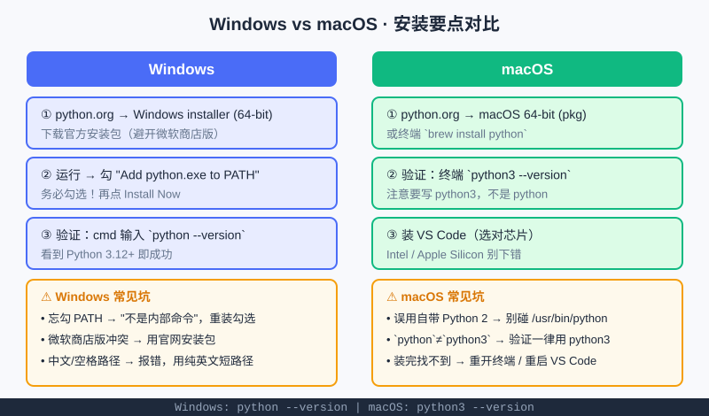

<div style="display:flex; gap:12px; margin-bottom:24px; flex-wrap:wrap; align-items:center;">
  <span style="background:#f0f4ff; color:#4A6CF7; padding:4px 12px; border-radius:20px; font-size:0.85em; font-weight:600; border:1px solid rgba(74,108,247,0.2);">📖 第0章</span>
  <span style="background:#f0fdf4; color:#16a34a; padding:4px 12px; border-radius:20px; font-size:0.85em; border:1px solid rgba(22,163,74,0.2);">⏱️ ~25 min read</span>
  <span style="background:#f0fdf4; color:#16a34a; padding:4px 12px; border-radius:20px; font-size:0.85em; border:1px solid rgba(22,163,74,0.2);">🎯 Beginner</span>
</div>

# Chapter 0: 安装开发环境（Windows / Mac 分讲）

> 📝 **Before You Continue:** 先读 [开篇导言](../README.md) 想清"为什么学"。如果你**等不及**想马上跑代码，可以跳过本章直接去 [第1章 你好，Python！](hello-python.md) 用**在线环境**——装环境是"可选项"，不是门槛。

装环境这件事，最怕的就是"Windows 和 Mac 混着讲"——两套系统的终端、自带 Python 情况、PATH 配置差别很大，混讲只会两头劝退。所以本章**分开讲**，你只看自己那一半就行。

<div class="story-scene">
<strong>🎬 开场小剧场：装备领取处排队</strong>
<p>Python 算法游乐场开园前，小派先来到装备领取处。有人拿 Windows 电脑，有人拿 Mac，大家都问同一个问题：“我到底该点哪个下载按钮？”</p>
<p>装备管理员 install 把队伍分成两列：“别混着看。Windows 走 Windows 通道，Mac 走 Mac 通道。装环境不是考试，是给后面的冒险领工具。”</p>
</div>

<div class="quest-card">
<strong>🎯 本章任务卡</strong>
<ul>
<li>判断自己该走在线环境还是本地环境。</li>
<li>在 Windows 上正确安装 Python 并勾选 PATH。</li>
<li>在 macOS 上用 <code>python3</code> 验证版本。</li>
<li>安装 VS Code 和 Python 扩展。</li>
<li>跑通第一行本地 Python 代码。</li>
</ul>
</div>

<div class="boss-bug">
<strong>👾 本章 Boss Bug：PATH 迷路怪</strong>
<p>它最喜欢让你明明装了 Python，却在终端里提示“找不到命令”。打败它的关键是：Windows 安装时勾选 <code>Add python.exe to PATH</code>。</p>
</div>

---

## 0.0 两条路怎么选

<div class="try-it">
<strong>🧩 练一练 0.1</strong>
<p>题目：如果你只想 5 分钟跑出第一幅画，该走哪条路？</p>
<details><summary>💡 看看答案</summary>
<p>答案：走<b>在线环境</b>（Replit / Colab），不用本地安装就能跑。等想长期写代码、打比赛，再回来看本章本地安装。</p>
</details>
</div>

你其实有两条路，先决定走哪条：

<div style="text-align:center; margin:20px 0;">
<svg width="600" height="200" viewBox="0 0 600 200" xmlns="http://www.w3.org/2000/svg" style="max-width:100%;">
  <defs>
    <marker id="ar" markerWidth="10" markerHeight="10" refX="8" refY="3" orient="auto"><path d="M0,0 L8,3 L0,6 Z" fill="#4A6CF7"/></marker>
  </defs>
  <rect x="20" y="20" width="250" height="70" rx="8" fill="#e8ecff" stroke="#4A6CF7" stroke-width="2"/>
  <text x="145" y="50" text-anchor="middle" font-size="16" font-weight="bold" fill="#1e293b">路 A：在线环境</text>
  <text x="145" y="72" text-anchor="middle" font-size="13" fill="#64748b">浏览器打开即用，零安装</text>
  <rect x="330" y="20" width="250" height="70" rx="8" fill="#dcfce7" stroke="#10b981" stroke-width="2"/>
  <text x="455" y="50" text-anchor="middle" font-size="16" font-weight="bold" fill="#1e293b">路 B：本地环境</text>
  <text x="455" y="72" text-anchor="middle" font-size="13" fill="#64748b">装好长期写代码 / 参赛</text>
  <line x1="270" y1="55" x2="328" y2="55" stroke="#4A6CF7" stroke-width="2" marker-end="url(#ar)"/>
  <text x="300" y="190" text-anchor="middle" font-size="13" fill="#64748b">建议：先用路 A 尝鲜，再回头走路 B</text>
</svg>
<p style="color:#888; font-size:0.9em; margin-top:6px;">两条路不冲突：在线先玩起来，本地环境随时再装。</p>
</div>

- **路 A（只想先学着玩）** → 直接用第 1 章的在线环境（Replit / Google Colab / 国内可访问的类似平台），**不用装任何东西**。
- **路 B（想长期写、参加竞赛、用 VS Code）** → 按 0.1（Windows）或 0.2（macOS）装本地环境。

> 💡 **Key Insight:** 装环境的目的只有一个——让你在自己的电脑上随时写、随时运行 Python。它**不是学编程的前提**，所以别被它卡住；卡住了就先走在线环境。

---

## 0.1 Windows 专享步骤

<div class="try-it">
<strong>🧩 练一练 0.2</strong>
<p>题目：在 Windows 安装 Python 时，那个必须勾上的小框叫什么？不勾会怎样？</p>
<details><summary>💡 看看答案</summary>
<p>答案：勾 <code>Add python.exe to PATH</code>。不勾的话，在命令行输入 <code>python</code> 会提示“找不到命令”，后面每步都踩坑。</p>
</details>
</div>

> ⚠️ **Warning:** Windows 自带一个"微软商店版 Python"，会偷偷装、且常不在 PATH 里，极易踩坑。**统一用 python.org 官方安装包最稳。**

**步骤 1 — 下载**
打开浏览器搜 "Python 官网"，进 `python.org` → 点 `Downloads` → 下载 **Windows installer (64-bit)**。

**步骤 2 — 运行并勾选（关键！）**
双击安装包 → **务必勾选最下方 "Add python.exe to PATH"**（不勾，后面全乱）→ 点 `Install Now`。

> 🐛 **Common Bug:** 很多人一路狂点 "Next" 把那行 PATH 勾选漏掉，结果后面敲 `python` 报"不是内部或外部命令"。**这一个勾，决定后面顺不顺利。**

**步骤 3 — 验证**
按 `Win + R` → 输入 `cmd` 回车 → 在黑色窗口输入：

```powershell
python --version
```

看到 `Python 3.12.x`（或类似 3.12+）就成功了。如果报错"不是内部命令"，说明步骤 2 没勾 PATH，**重装一次**即可。

**步骤 4 — 装 VS Code**
搜 "VS Code 官网" 下载 **User Installer** → 一路下一步 → 打开后在扩展商店搜 **Python**（作者 Microsoft）安装。

**步骤 5 — 跑第一行**
在 VS Code 里新建 `hello.py`，输入下面这行，右键"在终端中运行"：

```python
print("你好，Python！")   # ← 让你的电脑说出这句话
```

> 📝 **Note:** 文件**别存到中文路径或桌面深层目录**，路径里避免空格和中文，能省去无数莫名其妙的报错。

---

## 0.2 macOS 专享步骤

<div class="try-it">
<strong>🧩 练一练 0.3</strong>
<p>题目：在 macOS 终端里，你应该输入 python 还是 python3？为什么？</p>
<details><summary>💡 看看答案</summary>
<p>答案：用 <code>python3</code>。macOS 自带一个老旧的 <code>python</code> 指向 Python 2（已淘汰），用它会踩一堆坑。</p>
</details>
</div>

> ⚠️ **Warning:** macOS 自带一个很老的 **Python 2**（早已淘汰），**不要碰它**。我们用全新安装的 Python 3，和系统是两码事。

**步骤 1 — 下载**
去 `python.org` 下载 **macOS 64-bit installer**（pkg 格式），双击按提示装完。
（进阶可选：用 Homebrew 在终端执行 `brew install python`，适合以后想玩更硬核工具的同学。）

**步骤 2 — 验证（注意 python3！）**
打开 **终端**（Launchpad 搜"终端"），输入：

```bash
python3 --version
```

> 🤔 **Why `python3` not `python`?** Mac 上 `python` 往往指向那个淘汰的老 Python 2，而我们要用的是新装的 Python 3，命令就叫 `python3`。**记住：Mac 上验证一律用 `python3`。**

看到 `Python 3.12+` 即成功。

**步骤 3 — 装 VS Code**
去 `code.visualstudio.com` 下载 Mac 版——**注意选对芯片**：关于本机 → 芯片，Apple 芯片选 "Apple Silicon"，Intel 选对应版 → 拖进"应用程序" → 打开装 **Python 扩展**。

**步骤 4 — 跑第一行**
在 VS Code 新建 `hello.py`，输入：

```python
print("你好，Python！")   # ← 让电脑说出这句话
```

> 💡 **Pro Tip:** 装完若 `python3` 仍找不到，**重开终端或重启 VS Code** 再试——新装的程序有时要等终端"刷新"一下才认得。

---

## 0.3 验证安装是否成功（两系统通用）

<div class="try-it">
<strong>🧩 练一练 0.4</strong>
<p>题目：写出两条能“证明 Python 装好了”的命令。</p>
<details><summary>💡 看看答案</summary>
<p>答案：① <code>python3 --version</code>（或 <code>python --version</code>）显示版本号；② <code>python3</code> 进入 <code>&gt;&gt;&gt;</code> 交互模式，能直接算 <code>1+1</code>。</p>
</details>
</div>

不管 Windows 还是 Mac，装完都做这 3 步确认：

| 检查 | Windows | macOS |
|------|---------|--------|
| 看版本 | `python --version` | `python3 --version` |
| 进交互 | `python` 看到 `>>>` 提示符 | `python3` 看到 `>>>` 提示符 |
| 算一下 | 在 `>>>` 里输 `1 + 1` 应得 `2`，`exit()` 退出 | 同左 |

还能正常打印 `你好，Python！` → **环境 OK，可以开始第 1 章了** 🎉



上图把两条系统的"下载 → 勾选/注意 → 验证"和各自专属坑并排摆好，卡住时回来对照即可。

---

## 0.4 （可选）用 uv 管理环境与包

<div class="try-it">
<strong>🧩 练一练 0.5</strong>
<p>题目：uv 是干什么的？零基础现在必须装它吗？</p>
<details><summary>💡 看看答案</summary>
<p>答案：uv 用来管虚拟环境、装第三方包。<b>不必</b>——学到第 16 章“模块”再装也不迟。</p>
</details>
</div>

对零基础**不强求**，等学到"模块与标准库"一章再正式引入。先知道两件事就够：

- **装第三方库**：在终端用 `pip install 包名`（Mac 可能要 `pip3 install 包名`）。
- **更现代的工具 `uv`**：速度更快、能管虚拟环境，感兴趣可搜 "astral uv" 了解，本书后续章节会再提一句。

> 📝 **Note:** 第三方库就像"别人写好的积木"——比如画图的 `turtle` 是自带的，但做网站的 `django`、做数据的 `pandas` 需要 `pip` 装。先有体感，不用背。

---

## 🏅 本章通关徽章：装备领取员

<div class="badge-card">
<strong>如果你能做到下面 4 件事，就获得“装备领取员”徽章：</strong>
<ul>
<li>能判断自己先用在线环境还是本地环境。</li>
<li>知道 Windows 安装 Python 时必须勾选 PATH。</li>
<li>知道 macOS 验证 Python 3 要用 <code>python3</code>。</li>
<li>能在 VS Code 中跑通一个 <code>hello.py</code> 文件。</li>
</ul>
</div>

---

## ⚠️ Common Mistakes in Chapter 0

| # | 误区 | 示例 | 为什么错 | 修正 |
|---|------|------|---------|------|
| 1 | Windows 忘勾 PATH | 装完敲 `python` 报"不是内部命令" | 系统找不到 python 程序 | 重装时勾 "Add python.exe to PATH" |
| 2 | Windows 误装微软商店版 | 从商店点装的 Python 不在 PATH | 行为与官方版不一致、易冲突 | 一律用 python.org 官方安装包 |
| 3 | macOS 用 `python` | `python` 指向老 Python 2 | 版本老、语法不兼容 | 验证/运行一律用 `python3` |
| 4 | macOS 碰系统自带 Python | 改 `/usr/bin/python` 导致系统异常 | 那是系统用的，动不得 | 装独立 Python 3，绝不碰系统那份 |
| 5 | 文件放中文/空格路径 | `C:\用户\我的代码\hello.py` | 路径解析报错 | 放纯英文短路径，如 `~/python_practice` |

---

## Chapter Summary

### 📌 Key Takeaways

| 概念 | 要点 | 为什么重要 |
|------|------|------------|
| 两条路 | 在线环境零安装；本地环境长期用 | 不被安装卡住，先跑起来最重要 |
| Windows 关键 | 勾 "Add to PATH"、避开微软商店版 | 一个勾决定后续顺不顺 |
| macOS 关键 | 用 `python3`、别碰自带 Python 2 | Mac 上 `python`≠`python3` |
| 验证三连 | 版本 / 交互 `>>>` / 打印测试 | 装没装好，三步走一遍就知道 |
| 包管理 | `pip install` 装积木；`uv` 更现代 | 学会借力，不重复造轮子 |

### ❓ FAQ

**Q1: 我能不能完全不装，一直用在线环境？**
> A: 可以。在线环境足够学完本书大部分内容。只有想认真长期写、参加竞赛、用 VS Code 的智能提示时，本地环境才更舒服。

**Q2: 我是 Windows，不小心装了微软商店版怎么办？**
> A: 去"设置 → 应用"里卸载它，再按 0.1 用官网安装包重装并勾 PATH。两套并存容易打架。

**Q3: Mac 上 `python3` 还是找不到？**
> A: 先确认步骤 1 真的装完了；然后**重开终端**（或重启 VS Code）。还不行就搜 "Mac python3 command not found" 按官方指引排查。

**Q4: 版本号是 3.10 / 3.11 也行吗？**
> A: 行。只要是 3.x（x ≥ 8 左右）都够用，新书都基于 3.10+。无需追最新小版本。

### 🔗 Connections to Later Chapters

- **[Chapter 1: 你好，Python！](hello-python.md)** 会让你用刚装好的环境（或在线环境）跑出第一行 `print` 和第一幅海龟画。
- **第四篇 · 模块与标准库** 正式讲 `pip` / `uv` 装第三方库，并带你用别人写好的"积木"。
- **第六篇 · 下一步去哪？** 会给出竞赛、AI、Web 等多条路线，那时本地环境就是你的主战场。

---


## 🎮 加练任务包

> 下面这些题目不一定比章末题更难，但更适合“多刷几遍、把手感练出来”。建议先独立做，再展开提示。

### 加练 0.A · 帮同学选路线 🟢

同学说：“我只想今天先跑一段 Python，不想安装。”请你建议他走在线环境还是本地环境，并说明原因。

<details>
<summary>💡 提示 / 答案要点</summary>

建议先走在线环境。原因：不用安装，浏览器打开就能跑；等确定长期学习后，再回头装本地环境。

</details>

---

### 加练 0.B · 版本验证小侦探 🟢

Windows 输入 `python --version`，Mac 输入 `python3 --version`。如果都能看到 `Python 3.x.x`，说明什么？

<details>
<summary>💡 提示 / 答案要点</summary>

说明 Python 已经能被终端找到，基础安装成功。Windows 重点看 PATH，Mac 重点用 `python3`。

</details>

---

### 加练 0.C · PATH 迷路修复 🟡

Windows 同学安装后输入 `python` 提示“不是内部或外部命令”。请写出最可能原因和修复方案。

<details>
<summary>💡 提示 / 答案要点</summary>

最可能是安装时没勾 `Add python.exe to PATH`。最稳修复：重新运行官方安装包，勾选 PATH，或在安装器里选择 Modify/Repair 后添加 PATH。

</details>

---


---

## Practice Problems

做完这几题，确认你的环境真的能用了。

---

**Problem 0.1 — 查看你的 Python 版本** 🟢 Easy

在终端（Windows 用 `cmd`，Mac 用"终端"）输入版本命令，把看到的版本号写下来。

**Sample Input:** （在终端执行）
```
python --version        # Windows
python3 --version       # macOS
```
**Sample Output:** `Python 3.12.1`（具体数字看你装的版本）

<details>
<summary>💡 Solution (click to reveal)</summary>

**Approach:** 这是最基础的"环境体检"——能正确回版本号，说明 Python 已装好且在 PATH 中。

**Key points:**
- Windows 用 `python`，macOS 用 `python3`，别混。
- 看到 `Python 3.x.y` 即成功；报错就回 0.1 / 0.2 重做勾选那步。

</details>

---

**Problem 0.2 — 打印一句问候** 🟢 Easy

在 VS Code（或在线环境）新建 `hello.py`，写入下面代码并运行，把输出抄下来。

**Sample Input:**
```python
print("你好，Python！")
```
**Sample Output:** `你好，Python！`

<details>
<summary>💡 Solution (click to reveal)</summary>

**Approach:** 验证"写文件 → 运行 → 看到输出"这条完整链路通不通。

```python
print("你好，Python！")   # 运行时，引号里的内容会被原样打印
```

**Key points:**
- `print(...)` 是让电脑"说一句话"的命令。
- 若运行没反应或报错，检查文件后缀是不是 `.py`、引号是不是英文引号。

</details>

---

**Problem 0.3 — 装一个第三方库试试（可选）** 🟡 Medium

用 `pip` 装一个叫 `emoji` 的库，然后写两行代码打印一个表情。

**Sample Input:**
```bash
pip install emoji        # macOS 可能用 pip3 install emoji
```
```python
import emoji
print(emoji.emojize("Python 真好玩 :rocket:"))
```
**Sample Output:** `Python 真好玩 🚀`

<details>
<summary>💡 Solution (click to reveal)</summary>

**Approach:** 体验"借别人的积木"——`pip` 从网上把别人写好的库下载到本地，`import` 后就能直接用。

**Key points:**
- Mac 若 `pip` 报错，换成 `pip3`。
- 装库一次即可，之后 `import` 就能反复用。这就是 0.4 说的"不重复造轮子"。

</details>
