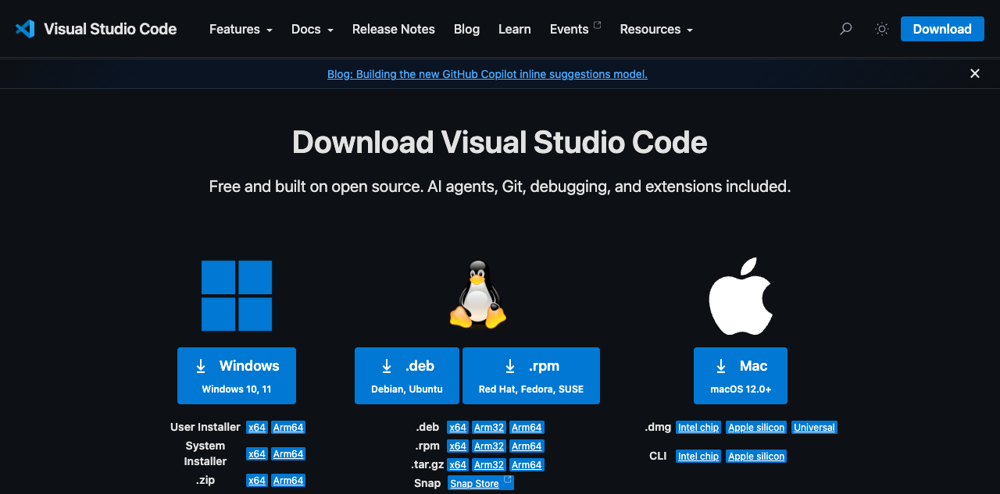
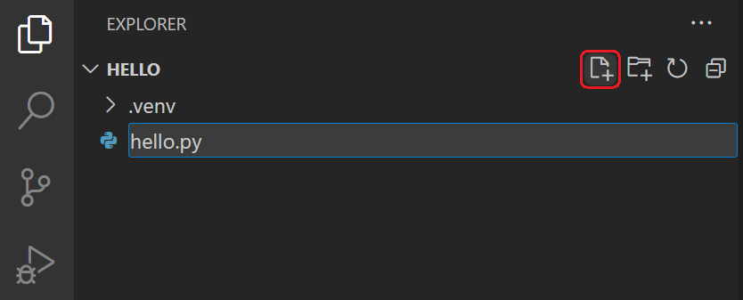
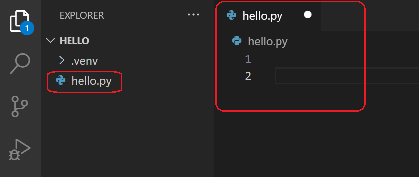
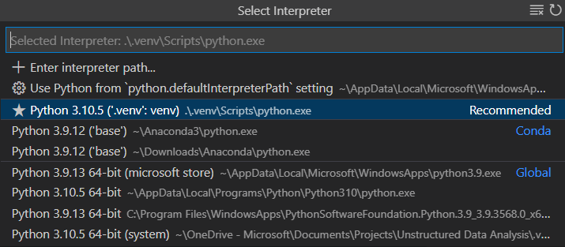
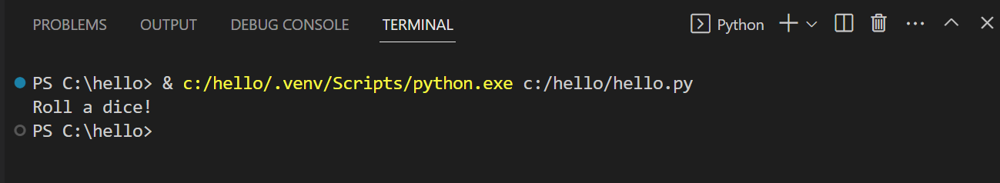
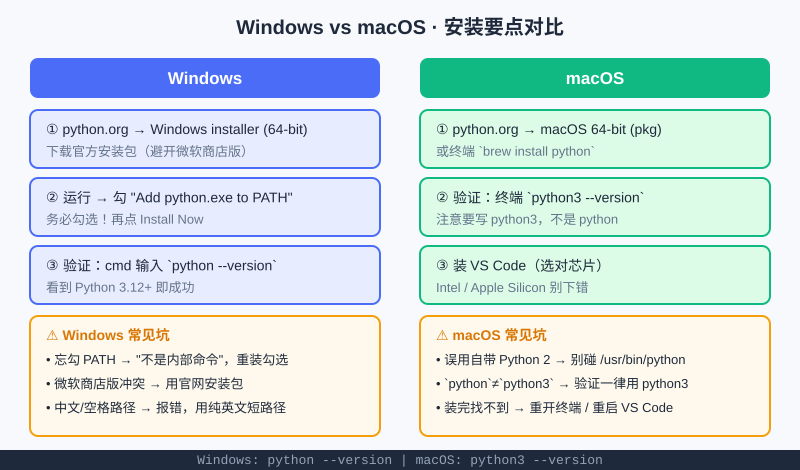

<div style="display:flex; gap:12px; margin-bottom:24px; flex-wrap:wrap; align-items:center;">
  <span style="background:#f0f4ff; color:#4A6CF7; padding:4px 12px; border-radius:20px; font-size:0.85em; font-weight:600; border:1px solid rgba(74,108,247,0.2);">📖 第0章</span>
  <span style="background:#f0fdf4; color:#16a34a; padding:4px 12px; border-radius:20px; font-size:0.85em; border:1px solid rgba(22,163,74,0.2);">⏱️ ~25 min read</span>
  <span style="background:#f0fdf4; color:#16a34a; padding:4px 12px; border-radius:20px; font-size:0.85em; border:1px solid rgba(22,163,74,0.2);">🎯 Beginner</span>
</div>

# Chapter 0: 安装开发环境：Python + VS Code（Windows / Mac 分讲）

> 📝 **Before You Continue:** 先读 [开篇导言](../) 想清"为什么学"。如果你**等不及**想马上跑代码，可以跳过本章直接去 [第1章 你好，Python！](hello-python.md) 用**在线环境**——装环境是"可选项"，不是门槛。

装环境这件事，最怕的就是"Windows 和 Mac 混着讲"——两套系统的终端、自带 Python 情况、PATH 配置差别很大，混讲只会两头劝退。所以本章**分开讲**，你只看自己那一半就行。

<div class="story-scene">
<strong>🎬 开场小剧场：装备领取处排队</strong>
<p>Python 算法游乐场开园前，小派先来到装备领取处。有人拿 Windows 电脑，有人拿 Mac，大家都问同一个问题：“我到底该点哪个下载按钮？”</p>
<p>装备管理员 install 把队伍分成两列：“别混着看。Windows 走 Windows 通道，Mac 走 Mac 通道。装环境不是考试，是给后面的冒险领工具。”</p>
</div>

<div class="quest-card">
<strong>🎯 本章任务卡</strong>
<ul>
<li>判断自己该走在线环境还是本地环境。</li>
<li>在 Windows 上正确安装 Python 并勾选 PATH。</li>
<li>在 macOS 上用 <code>python3</code> 验证版本。</li>
<li>安装 VS Code 和 Python 扩展。</li>
<li>跑通第一行本地 Python 代码。</li>
</ul>
</div>

<div class="boss-bug">
<strong>👾 本章 Boss Bug：PATH 迷路怪</strong>
<p>它最喜欢让你明明装了 Python，却在终端里提示“找不到命令”。打败它的关键是：Windows 安装时勾选 <code>Add python.exe to PATH</code>。</p>
</div>

---

## 0.0 两条路怎么选
你其实有两条路，先决定走哪条：

<div style="text-align:center; margin:20px 0;">
<svg width="600" height="200" viewBox="0 0 600 200" xmlns="http://www.w3.org/2000/svg" style="max-width:100%;">
  <defs>
    <marker id="ar" markerWidth="10" markerHeight="10" refX="8" refY="3" orient="auto"><path d="M0,0 L8,3 L0,6 Z" fill="#4A6CF7"/></marker>
  </defs>
  <rect x="20" y="20" width="250" height="70" rx="8" fill="#e8ecff" stroke="#4A6CF7" stroke-width="2"/>
  <text x="145" y="50" text-anchor="middle" font-size="16" font-weight="bold" fill="#1e293b">路 A：在线环境</text>
  <text x="145" y="72" text-anchor="middle" font-size="13" fill="#64748b">浏览器打开即用，零安装</text>
  <rect x="330" y="20" width="250" height="70" rx="8" fill="#dcfce7" stroke="#10b981" stroke-width="2"/>
  <text x="455" y="50" text-anchor="middle" font-size="16" font-weight="bold" fill="#1e293b">路 B：本地环境</text>
  <text x="455" y="72" text-anchor="middle" font-size="13" fill="#64748b">装好长期写代码 / 参赛</text>
  <line x1="270" y1="55" x2="328" y2="55" stroke="#4A6CF7" stroke-width="2" marker-end="url(#ar)"/>
  <text x="300" y="190" text-anchor="middle" font-size="13" fill="#64748b">建议：先用路 A 尝鲜，再回头走路 B</text>
</svg>
<p style="color:#888; font-size:0.9em; margin-top:6px;">两条路不冲突：在线先玩起来，本地环境随时再装。</p>
</div>

- **路 A（只想先学着玩）** → 直接用第 1 章的在线环境（Replit / Google Colab / 国内可访问的类似平台），**不用装任何东西**。
- **路 B（想长期写、参加竞赛、用 VS Code）** → 先完成 0.1 的 VS Code 安装，再按 0.2（Windows）或 0.3（macOS）安装 Python。

> 💡 **Key Insight:** 装环境的目的只有一个——让你在自己的电脑上随时写、随时运行 Python。它**不是学编程的前提**，所以别被它卡住；卡住了就先走在线环境。

---

## 0.1 先安装 VS Code（Windows / macOS 都要做）

先记住一个非常重要的分工：**VS Code 不是 Python 本身。**

| 角色 | 它像什么 | 你要做什么 |
|------|---------|------------|
| VS Code | 写作本 | 用它创建、保存、阅读代码 |
| Python | 翻译官 | 真正把代码变成电脑能执行的命令 |
| Python 扩展 | 连接线 | 让 VS Code 找到 Python、提示代码并一键运行 |

所以安装顺序是：**先装 VS Code → 再装 Python → 回到 VS Code 装 Python 扩展 → 写 `hello.py`。** 不要漏掉中间的“扩展”。

### 步骤 1：只从官网下载 VS Code

打开浏览器，输入 **`code.visualstudio.com/download`**。页面会自动展示 Windows、Mac 和 Linux 三个大按钮；你只点自己电脑对应的那个。



> 图源：Visual Studio Code 官方下载页（访问日期：2026-09）。**不要**在搜索广告、软件管家或不认识的下载站里下载。

- **Windows**：点蓝色的 **Windows** 按钮，下载完成后双击 `.exe` 安装包；初学者选 **User Installer** 即可。
- **Mac**：点蓝色的 **Mac** 按钮，下载完成后会得到 `.dmg` 文件；打开它，把 **Visual Studio Code** 图标拖进 **Applications（应用程序）** 文件夹。

> 💡 **小朋友检查点：** 安装完成后，能在“开始菜单”（Windows）或“应用程序”（Mac）里找到蓝色的 VS Code 图标，就说明这一关过了。

### 步骤 2：第一次打开，先打开一个专用文件夹

不要把练习散落在桌面。先建一个英文名字的文件夹，例如 `python_practice`，再在 VS Code 顶部菜单点击：**File（文件）→ Open Folder...（打开文件夹）**，选中它。

如果弹出“是否信任这个文件夹”，只有当它是**你自己刚建的文件夹**时才点信任；陌生人发来的代码先不要信任。

### 步骤 3：安装 Python 扩展（最容易漏的一步）

打开左侧的 **Extensions（扩展）** 图标，在搜索框输入 `Python`。点开名字叫 **Python**、发布者是 **Microsoft** 的结果，点击绿色 **Install（安装）**。装好后按钮会变成“已安装”或 “Disable”。


> 图源：Visual Studio Code 官方文档《Extension Marketplace》（真实界面截图，访问日期：2026-09）。截图中的按钮显示为 `Disable`，是因为该扩展已经安装；你的电脑第一次安装时这里显示 `Install`。

你只需核对两件事：**扩展名是 Python，发布者是 Microsoft**。不要随便安装名字很像、来源不明的扩展。

### 步骤 4：新建 `hello.py`（真实截图跟着做）

等后面的 Python 安装完成，再回到 VS Code。

**4.1 点击新建文件按钮**

打开 `python_practice` 文件夹后，左侧“资源管理器”最上方有一排小图标。点击像“一张纸加号”的 **New File（新建文件）** 按钮。红框圈出的就是真实 VS Code 里的位置。



> 图源：Visual Studio Code 官方 Python 教程（真实界面截图，访问日期：2026-09）。你的 VS Code 若是中文界面，图标位置相同。

**4.2 输入文件名 `hello.py` 并按回车**

注意最后的 **`.py`** 不能少：它是在告诉 VS Code“这是 Python 文件”。创建后，文件会出现在左侧，右边会打开可以写代码的页面。



> 图源：Visual Studio Code 官方 Python 教程（真实界面截图，访问日期：2026-09）。

**4.3 输入代码并保存**

在右边大编辑区输入下面一行，再按 `⌘S`（Mac）或 `Ctrl+S`（Windows）：

```python
print("你好，Python！")
```

**4.4 选择 Python 解释器**

点击 VS Code 窗口右下角显示的 Python 版本；在弹出的列表里选你刚装好的 **Python 3.x**。下面是真实的解释器选择列表：有星标或 `Recommended` 的通常就是最合适的那个。



> 图源：Visual Studio Code 官方 Python 教程（真实界面截图，访问日期：2026-09）。不同电脑看到的版本数字和路径会不同，只要选 Python 3.x 即可。

**4.5 点击右上角的 ▶ 运行**

保存后，看编辑区右上角的三角形 **▶ Run Python File** 按钮，点它一次。不要点左侧边栏的三角形，那是“调试”入口；我们现在只运行。


> 图源：Visual Studio Code 官方 Python 教程（真实界面截图，访问日期：2026-09）。截图里的示例文字不同，但运行按钮位置完全相同。

**4.6 在下方终端检查结果**

VS Code 会自动在下方打开“终端”。看到 `你好，Python！` 就通关了；官方截图中的输出是 `Roll a dice!`，因为它运行的是另一个示例文件。



> 图源：Visual Studio Code 官方 Python 教程（真实界面截图，访问日期：2026-09）。

> 🐛 **如果右上角没有 ▶：** 先确认文件名是 `hello.py`，再确认 Python 扩展已经装好；不行就按 `⌘⇧P`（Mac）或 `Ctrl+Shift+P`（Windows），搜索并运行 `Python: Select Interpreter`，选择 Python 3.x。

---

## 0.2 Windows 专享：安装 Python
> ⚠️ **Warning:** Windows 自带一个"微软商店版 Python"，会偷偷装、且常不在 PATH 里，极易踩坑。**统一用 python.org 官方安装包最稳。**

**步骤 1 — 下载**
打开浏览器搜 "Python 官网"，进 `python.org` → 点 `Downloads` → 下载 **Windows installer (64-bit)**。

**步骤 2 — 运行并勾选（关键！）**
双击安装包 → **务必勾选最下方 "Add python.exe to PATH"**（不勾，后面全乱）→ 点 `Install Now`。

> 🐛 **Common Bug:** 很多人一路狂点 "Next" 把那行 PATH 勾选漏掉，结果后面敲 `python` 报"不是内部或外部命令"。**这一个勾，决定后面顺不顺利。**

**步骤 3 — 验证**
按 `Win + R` → 输入 `cmd` 回车 → 在黑色窗口输入：

```powershell
python --version
```

看到 `Python 3.12.x`（或类似 3.12+）就成功了。如果报错"不是内部命令"，说明步骤 2 没勾 PATH，**重装一次**即可。

**下一步 — 回到 VS Code**
Python 验证成功后，回到上面的 [0.1 步骤 3](#01-先安装-vs-codewindows--macos-都要做)：安装 **Python（Microsoft）** 扩展；再按步骤 4 创建并运行 `hello.py`。

> 📝 **Note:** 路径里有空格时，终端命令要用英文引号包住，例如 `cd "C:\我的代码\python practice"`。中文路径通常可以使用；为了让初学练习更容易找到，建议统一放在短路径（例如 `C:\python_practice` 或 `~/python_practice`），不要层层嵌套在桌面深处。

---

## 0.3 macOS 专享：安装 Python
> ⚠️ **Warning:** macOS 上不要依赖 `python` 这个命令：它可能根本不存在，也可能指向你自己安装的其他环境。我们统一安装并验证 Python 3。

**步骤 1 — 下载**
去 `python.org` 下载 **macOS 64-bit installer**（pkg 格式），双击按提示装完。
（进阶可选：用 Homebrew 在终端执行 `brew install python`，适合以后想玩更硬核工具的同学。）

**步骤 2 — 验证（注意 python3！）**
打开 **终端**（Launchpad 搜"终端"），输入：

```bash
python3 --version
```

> 🤔 **Why `python3` not `python`?** macOS 上 `python` 可能不存在，也可能指向你自己配置的其他环境，不能用它判断是否装好了 Python 3。**记住：Mac 上检测版本一律用 `python3 --version`。**

看到 `Python 3.12+` 即成功。

**下一步 — 回到 VS Code**
Python 验证成功后，回到上面的 [0.1 步骤 3](#01-先安装-vs-codewindows--macos-都要做)，安装 **Python（Microsoft）** 扩展；接着按步骤 4 写下 `hello.py` 并点击右上角的 ▶。

> 💡 **Pro Tip:** 装完若 `python3` 仍找不到，重开终端或重启 VS Code 再试——新开的终端才会读取刚更新的系统配置。

---

## 0.4 验证安装是否成功（两系统通用）
不管 Windows 还是 Mac，装完都做这 3 步确认：

| 检查 | Windows | macOS |
|------|---------|--------|
| 看版本 | `python --version` | `python3 --version` |
| 进交互 | `python` 看到 `>>>` 提示符 | `python3` 看到 `>>>` 提示符 |
| 算一下 | 在 `>>>` 里输 `1 + 1` 应得 `2`，`exit()` 退出 | 同左 |

还能正常打印 `你好，Python！` → **环境 OK，可以开始第 1 章了** 🎉



上图把两条系统的"下载 → 勾选/注意 → 验证"和各自专属坑并排摆好，卡住时回来对照即可。

---

## 0.5 （推荐）用 uv 管理项目、环境与第三方包

前面你已经能写并运行一个 `hello.py`。但当一个项目开始用到 `rich`、`pandas`、`pygame` 这类第三方库时，会出现一个新问题：**这个项目装的库，会不会和另一个项目打架？**

`uv` 就是 Python 项目的“装备管理员”。它一次帮你做三件事：

| 它负责什么 | 它帮你做的动作 | 你得到什么 |
|---|---|---|
| 创建项目 | `uv init` | 一套整齐的项目骨架 |
| 隔离环境 | 自动创建 `.venv` | 每个项目有自己的 Python 和库，不互相干扰 |
| 管理依赖 | `uv add 包名` | 记录项目需要什么库，换电脑也能复现 |
| 运行程序 | `uv run 文件名.py` | 自动使用正确环境运行，不必手动激活环境 |

> 💡 **先说结论：** 你现在不用死记全部命令，但建议在完成第 1 章后把 uv 装好。从此以后，做每个稍微正式一点的小项目都用它；依赖统一用 `uv add` 加入项目环境。

### 0.5.1 安装 uv：只选自己系统的一条命令

先打开 VS Code 的终端：顶部菜单 **Terminal（终端）→ New Terminal（新建终端）**。然后按自己的电脑复制一条命令并按回车。

| 系统 | 推荐安装命令 | 说明 |
|---|---|---|
| macOS，已安装 Homebrew | `brew install uv` | 最省心；Homebrew 会负责后续升级 |
| macOS，没装 Homebrew | `curl -LsSf https://astral.sh/uv/install.sh | sh` | uv 官方安装脚本；执行后重开 VS Code 终端 |
| Windows | `winget install --id=astral-sh.uv -e` | 在 PowerShell 中运行；适合大多数新版 Windows |
| Windows，不能用 winget | `powershell -ExecutionPolicy ByPass -c "irm https://astral.sh/uv/install.ps1 | iex"` | uv 官方 PowerShell 安装脚本 |

安装后**关掉当前终端，再新建一个终端**，输入：

```bash
uv --version
```

看到类似 `uv 0.x.x` 的版本号就成功了。若提示“找不到 uv”，通常不是安装失败，而是新终端还没读取新的 PATH：彻底退出并重新打开 VS Code 后再试。

> ⚠️ **安全习惯：** 上面的链接都指向 uv 官方域名 `astral.sh`。不要复制博客、群聊或短视频评论区里来源不明的安装命令。

### 0.5.2 第一个 uv 项目：只做一次完整流程

下面我们创建一个叫 `my_first_uv_project` 的小项目。所有命令都在 VS Code 的终端中输入；每敲一行、按一次回车，再输入下一行。

**第 1 步：创建项目并进入项目文件夹**

```bash
uv init my_first_uv_project
cd my_first_uv_project
```

此时左侧文件区会出现这些重要文件：

| 文件 / 文件夹 | 先这样理解 |
|---|---|
| `pyproject.toml` | 项目的“配方单”：项目名字、Python 要求、需要哪些第三方库都写在这里 |
| `.python-version` | 告诉 uv 这个项目优先使用哪一个 Python 版本 |
| `src/` | 放以后更正式的项目代码；初学阶段先在项目根目录写 `main.py` 也可以 |
| `.venv/` | uv 自动创建的“私人工具箱”；不需要手动打开或修改 |
| `uv.lock` | uv 记录每个库精确版本的“购物小票”；不要手改它 |

> 📝 **关键理解：** `.venv` 不是多余文件夹。它就是“这个项目专用的 Python 小房间”。项目 A 装 `rich`，不会让项目 B 突然多出 `rich`。

**第 2 步：给项目添加一个真实的第三方库**

我们用 `rich` 做演示：它能让终端输出更漂亮。输入：

```bash
uv add rich
```

这条命令会同时完成三件事：下载 `rich`、把它装进 `.venv`、把依赖写入 `pyproject.toml` 和 `uv.lock`。因此不用再手动创建虚拟环境、单独安装依赖或记录版本号。

**第 3 步：创建 `main.py` 并写代码**

在 VS Code 左侧点击“新建文件”，输入 `main.py`。复制下面代码并保存：

```python
from rich import print

print("[bold green]你好，uv！[/bold green]")
```

第一行的意思是“使用刚才安装的 `rich` 工具”；第二行会打印一句绿色加粗的话。

**第 4 步：让 uv 运行代码**

回到 VS Code 终端，输入：

```bash
uv run main.py
```

第一次运行时，uv 会自动创建 `.venv`；以后每次运行，它都会先确认“项目依赖和环境是否仍然匹配”，然后再执行代码。你应该看到：

```text
你好，uv！
```

### 0.5.3 回到 VS Code：选择项目自己的解释器

打开 `my_first_uv_project` 文件夹后，点击 VS Code 右下角的 Python 版本；在列表里选择路径中含有 **`.venv`** 的 Python。例如 macOS 常见路径形如 `.venv/bin/python`，Windows 常见路径形如 `.venv\Scripts\python.exe`。

这样做以后，编辑器的补全、报错提示和右上角 ▶ 运行按钮，都会使用这个项目自己的库。若 `from rich import print` 下面出现红色波浪线，九成是因为 VS Code 还选着电脑的公共 Python，重新选择 `.venv` 即可。

### 0.5.4 最常见的 4 个问题

| 现象 | 最可能原因 | 直接修复 |
|---|---|---|
| `uv: command not found` / “不是内部或外部命令” | 安装后旧终端没有刷新 PATH | 关掉终端并新建；还不行就重启 VS Code |
| `No module named 'rich'` | 没在项目文件夹中执行，或忘了 `uv add rich` | 在终端输入 `cd my_first_uv_project`，再执行 `uv add rich` |
| VS Code 把 `rich` 标红 | 解释器选错了 | 右下角选择 `.venv` 里的 Python |
| 想把项目发给同学 | 只把 `.py` 文件发过去了 | 连同 `pyproject.toml` 和 `uv.lock` 一起发；同学执行 `uv sync` 即可装出同样环境 |

> 📝 **兼容说明：** 本书新项目统一使用 `uv add` + `uv run`。只有维护未使用 uv 的旧项目时，才使用 `python -m pip install 包名`；这种写法能明确调用当前 Python 对应的 pip，不使用容易指错环境的裸 `pip` / `pip3`。

---

## 🏅 本章通关徽章：装备领取员

<div class="badge-card">
<strong>如果你能做到下面 4 件事，就获得“装备领取员”徽章：</strong>
<ul>
<li>能判断自己先用在线环境还是本地环境。</li>
<li>知道 Windows 安装 Python 时必须勾选 PATH。</li>
<li>知道 macOS 验证 Python 3 要用 <code>python3</code>。</li>
<li>能在 VS Code 中跑通一个 <code>hello.py</code> 文件。</li>
</ul>
</div>

---

## ⚠️ Common Mistakes in Chapter 0

| # | 误区 | 示例 | 为什么错 | 修正 |
|---|------|------|---------|------|
| 1 | Windows 忘勾 PATH | 装完敲 `python` 报"不是内部命令" | 系统找不到 python 程序 | 重装时勾 "Add python.exe to PATH" |
| 2 | Windows 误装微软商店版 | 从商店点装的 Python 不在 PATH | 行为与官方版不一致、易冲突 | 一律用 python.org 官方安装包 |
| 3 | macOS 用 `python` 检测版本 | `python` 可能不存在或指向其他用户环境 | 不能确认 Python 3 是否可用 | 检测版本一律用 `python3 --version` |
| 4 | macOS 碰系统自带 Python | 改 `/usr/bin/python` 导致系统异常 | 那是系统用的，动不得 | 装独立 Python 3，绝不碰系统那份 |
| 5 | 路径带空格却没加引号 | `cd C:\我的代码\python practice` | 空格会把命令拆成多段 | 用引号包住路径，如 `cd "C:\我的代码\python practice"`；练习也可放短路径 |

---

## Chapter Summary

### 📌 Key Takeaways

| 概念 | 要点 | 为什么重要 |
|------|------|------------|
| 两条路 | 在线环境零安装；本地环境长期用 | 不被安装卡住，先跑起来最重要 |
| Windows 关键 | 勾 "Add to PATH"、避开微软商店版 | 一个勾决定后续顺不顺 |
| macOS 关键 | 用 `python3 --version` 检测 Python 3 | `python` 可能不存在或指向其他用户环境 |
| 验证三连 | 版本 / 交互 `>>>` / 打印测试 | 装没装好，三步走一遍就知道 |
| 包管理 | `uv add` 添加依赖，`uv run` 运行程序 | 隔离项目环境并记录依赖 |

### ❓ FAQ

**Q1: 我能不能完全不装，一直用在线环境？**
> A: 可以。在线环境足够学完本书大部分内容。只有想认真长期写、参加竞赛、用 VS Code 的智能提示时，本地环境才更舒服。

**Q2: 我是 Windows，不小心装了微软商店版怎么办？**
> A: 去“设置 → 应用”里卸载它，再按 0.2 用官网安装包重装并勾 PATH。两套并存容易打架。

**Q3: Mac 上 `python3` 还是找不到？**
> A: 先确认步骤 1 真的装完了；然后**重开终端**（或重启 VS Code）。还不行就搜 "Mac python3 command not found" 按官方指引排查。

**Q4: 版本号是 3.10 / 3.11 也行吗？**
> A: 行。只要是 3.x（x ≥ 8 左右）都够用，新书都基于 3.10+。无需追最新小版本。

### 🔗 Connections to Later Chapters

- **[Chapter 1: 你好，Python！](hello-python.md)** 会让你用刚装好的环境（或在线环境）跑出第一行 `print` 和第一幅海龟画。
- **第四篇 · 模块与标准库** 正式讲用 `uv` 管理第三方库，并带你用别人写好的"积木"；`python -m pip` 只作为旧项目兼容方式说明。
- **第六篇 · 下一步去哪？** 会给出竞赛、AI、Web 等多条路线，那时本地环境就是你的主战场。

---


## 🎮 加练任务包

> 下面这些题目不一定比章末题更难，但更适合“多刷几遍、把手感练出来”。建议先独立做，再展开提示。

### 加练 0.A · 帮同学选路线 🟢

同学说：“我只想今天先跑一段 Python，不想安装。”请你建议他走在线环境还是本地环境，并说明原因。

<details>
<summary>💡 提示 / 答案要点</summary>

建议先走在线环境。原因：不用安装，浏览器打开就能跑；等确定长期学习后，再回头装本地环境。

</details>

---

### 加练 0.B · 版本验证小侦探 🟢

Windows 输入 `python --version`，Mac 输入 `python3 --version`。如果都能看到 `Python 3.x.x`，说明什么？

<details>
<summary>💡 提示 / 答案要点</summary>

说明 Python 已经能被终端找到，基础安装成功。Windows 重点看 PATH，Mac 重点用 `python3`。

</details>

---

### 加练 0.C · PATH 迷路修复 🟡

Windows 同学安装后输入 `python` 提示“不是内部或外部命令”。请写出最可能原因和修复方案。

<details>
<summary>💡 提示 / 答案要点</summary>

最可能是安装时没勾 `Add python.exe to PATH`。最稳修复：重新运行官方安装包，勾选 PATH，或在安装器里选择 Modify/Repair 后添加 PATH。

</details>

---


---

## Practice Problems

做完这几题，确认你的环境真的能用了。

---

**Problem 0.1 — 查看你的 Python 版本** 🟢 Easy

在终端（Windows 用 `cmd`，Mac 用"终端"）输入版本命令，把看到的版本号写下来。

**Sample Input:** （在终端执行）
```
python --version        # Windows
python3 --version       # macOS
```
**Sample Output:** `Python 3.12.1`（具体数字看你装的版本）

<details>
<summary>💡 Solution (click to reveal)</summary>

**Approach:** 这是最基础的"环境体检"——能正确回版本号，说明 Python 已装好且在 PATH 中。

**Key points:**
- Windows 用 `python`，macOS 用 `python3`，别混。
- 看到 `Python 3.x.y` 即成功；报错就回 0.2 / 0.3 重做安装步骤。

</details>

---

**Problem 0.2 — 打印一句问候** 🟢 Easy

在 VS Code（或在线环境）新建 `hello.py`，写入下面代码并运行，把输出抄下来。

**Sample Input:**
```python
print("你好，Python！")
```
**Sample Output:** `你好，Python！`

<details>
<summary>💡 Solution (click to reveal)</summary>

**Approach:** 验证"写文件 → 运行 → 看到输出"这条完整链路通不通。

```python
print("你好，Python！")   # 运行时，引号里的内容会被原样打印
```

**Key points:**
- `print(...)` 是让电脑"说一句话"的命令。
- 若运行没反应或报错，检查文件后缀是不是 `.py`、引号是不是英文引号。

</details>

---

**Problem 0.3 — 用 uv 添加一个第三方库（可选）** 🟡 Medium

用 `uv` 创建项目并添加 `emoji` 库，然后在 `main.py` 中打印一个表情。

**Sample Input:**
```bash
uv init emoji_demo
cd emoji_demo
uv add emoji
```
```python
import emoji

print(emoji.emojize("Python 真好玩 :rocket:"))
```
```bash
uv run main.py
```
**Sample Output:** `Python 真好玩 🚀`

<details>
<summary>💡 Solution (click to reveal)</summary>

**Approach:** 体验"借别人的积木"——`uv add emoji` 会把依赖加入当前项目，`uv run main.py` 会在项目环境中运行代码。

**Key points:**
- 先进入包含 `pyproject.toml` 的项目目录，再执行 `uv add emoji`。
- `uv` 会把依赖记录在项目配置和锁文件中；以后仍用 `uv run main.py` 运行。

</details>
