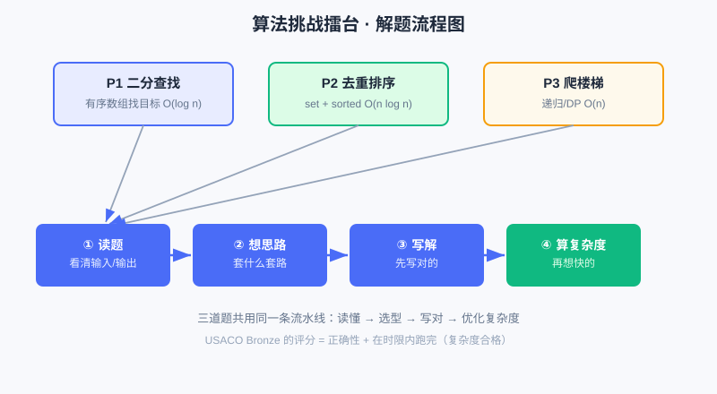

<div style="display:flex; gap:12px; margin-bottom:24px; flex-wrap:wrap; align-items:center;">
  <span style="background:#f0f4ff; color:#4A6CF7; padding:4px 12px; border-radius:20px; font-size:0.85em; font-weight:600; border:1px solid rgba(74,108,247,0.2);">📖 第25章</span>
  <span style="background:#fef9ec; color:#d97706; padding:4px 12px; border-radius:20px; font-size:0.85em; font-weight:600; border:1px solid rgba(245,158,11,0.2);">⏱️ ~45 min read</span>
  <span style="background:#fef2f2; color:#ef4444; padding:4px 12px; border-radius:20px; font-size:0.85em; font-weight:600; border:1px solid rgba(239,68,68,0.2);">🎯 Advanced</span>
</div>

# Chapter 25: 项目三 · 算法挑战擂台（USACO Bronze 风格）

> **支持等级：独立挑战 + 分级提示（低支持）** 每题先只看样例与边界测试；卡住时依次展开一级、二级、三级提示，最后才查看完整解答。

> 📝 **Before You Continue:** 本章是"算法启蒙篇"的实战收口，假定你已见过：
> - [第17章 大 O 与复杂度](../algorithms/big-o.md) —— 衡量算法快慢的尺子
> - [第18章 查找算法](../algorithms/searching.md) —— 本题一"找目标"的来路
> - [第19章 排序算法](../algorithms/sorting.md) —— 本题二"排序"的来路
> - [第20章 递归与分治](../algorithms/recursion-divide.md) —— 本题三"递归"的来路
> - [第21章 基础数据结构](../algorithms/basic-structures.md) —— `set`/`list` 等工具箱
> - [第22章 贪心与模拟](../algorithms/greedy-simulation.md) —— "按规则一步步推"的思维

前面两章分别带你补代码、按骨架组装程序。这一章撤掉大部分脚手架：你要先独立完成三道挑战，再按需领取提示。USACO（美国计算机奥赛）的 Bronze 组，考的是把题目翻译成正确、不过慢的代码。

本章不再从头重讲二分与递归。忘记算法细节时，回看[第18章 查找算法](../algorithms/searching.md)和[第20章 递归与分治](../algorithms/recursion-divide.md)；这里专注“读约束 → 写样例 → 补边界 → 验证复杂度”。

<div class="story-scene">
<strong>🎬 开场小剧场：算法擂台开赛</strong>
<p>游乐场中央升起一座擂台，屏幕上出现三道挑战题。小派看见题干就想直接写代码，擂台裁判 arena 立刻吹哨：“先读题！输入是什么？输出是什么？数据有多大？”</p>
<p>裁判指着计时器说：“Bronze 不考花哨魔法，考的是把题意翻译成正确代码，还不能太慢。”这章就是把前面的搜索、排序、递归拉到实战场上。</p>
</div>

<div class="quest-card">
<strong>🎯 本章任务卡</strong>
<ul>
<li>按“题干 → 样例 → 边界 → 代码 → 复杂度”拆竞赛题。</li>
<li>用二分查找解决有序数组找目标。</li>
<li>用集合和排序处理去重排序。</li>
<li>用递归、记忆化和 DP 解决爬楼梯。</li>
<li>养成先写对、再优化的竞赛节奏。</li>
</ul>
</div>

<div class="boss-bug">
<strong>👾 本章 Boss Bug：读题跳步怪</strong>
<p>它会催你没看清输入输出就开始敲代码。打败它的流程是：圈出数据、写样例、说出朴素解，再决定要不要优化。</p>
</div>

---

## 25.1 ⚔️ 擂台规则
- **输入即给定**：题干会给数组/数字，我们直接用变量接住，专注"处理逻辑"。
- **要的是"对 + 不太慢"**：Bronze 的数据量一般 ≤ 10⁵，所以 O(n²) 往往危险、O(n log n) 或 O(n) 才稳。
- **先写对的，再想快的**：能跑出正确答案最重要；复杂度是"进阶分"。

> 💡 **Key Insight:** 竞赛和平时项目一样——**先有正确版本，再优化**。很多人卡在"一上来就想最优解"，结果写错还调试不动。本题三的解法演进（递归→记忆化→DP）完美演示这条路。



上图是做每道题的固定流程：先读懂输入输出并补齐边界测试，再写出可运行解，最后用 [第17章 大 O](../algorithms/big-o.md) 估一下快慢。只有卡住时才展开提示。

---

## 25.2 Problem 1 · 有序数组里找目标（二分查找）

### 挑战

实现 `binary_search(arr, target)`：`arr` 已按升序排列，找到时返回目标下标，否则返回 `-1`。不要调用 `list.index()` 或 `bisect`。

**样例：**

| 输入 | 预期输出 |
|------|----------|
| `([2, 5, 8, 12, 16, 23, 38, 56, 72, 91], 23)` | `5` |
| `([2, 5, 8], 6)` | `-1` |

**边界测试：**

- `([], 1) → -1`：空数组不能访问中点。
- `([7], 7) → 0`：只剩一个元素时仍要比较。
- `([1, 3, 5], 1) → 0`、`([1, 3, 5], 5) → 2`：首尾都可能命中。

先独立写代码并跑完四类测试。算法定义与区间写法可回看[第18章 18.3 节](../algorithms/searching.md#183-代码实现while-版二分查找)。

<details>
<summary>一级提示：抓住循环中的“不变量”</summary>

答案如果存在，它始终位于闭区间 `[left, right]`。循环每轮只比较中点，并排除不可能的一半。

</details>

<details>
<summary>二级提示：确定循环条件</summary>

当 `left == right` 时还有一个候选元素，因此循环条件应允许等号。

</details>

<details>
<summary>三级提示：确定区间如何收缩</summary>

中点已经比较过。目标更大时令 `left = mid + 1`；目标更小时令 `right = mid - 1`，否则区间可能不收缩。

</details>

<details>
<summary>完整解答（通过边界测试后再看）</summary>

```python
def binary_search(arr, target):
    left, right = 0, len(arr) - 1     # 当前搜索区间 [left, right]
    while left <= right:
        mid = (left + right) // 2     # 中点（整除）
        if arr[mid] == target:
            return mid                 # 找到了，返回下标
        elif arr[mid] < target:
            left = mid + 1             # 目标在右半边
        else:
            right = mid - 1            # 目标在左半边
    return -1                          # 区间空了还没找到

arr = [2, 5, 8, 12, 16, 23, 38, 56, 72, 91]
print(binary_search(arr, 23))   # 5
print(binary_search(arr, 100))  # -1
print(binary_search(arr, 2))    # 0
```

</details>

### 复杂度验收

- **时间：O(log n)**，每轮排除一半候选区间。
- **空间：O(1)**，只维护边界和中点。

如果写成从头扫描，结果仍可能正确，但复杂度是 O(n)，不算通过本题的算法验收。

---

## 25.3 Problem 2 · 乱序去重后排序

### 挑战

实现 `dedupe_and_sort(nums)`：删除重复整数，返回从小到大排列的**新列表**，不要修改输入列表。

**样例：**

| 输入 | 预期输出 |
|------|----------|
| `[5, 3, 9, 3, 5, 1, 9, 7, 1]` | `[1, 3, 5, 7, 9]` |
| `[4, 4, 4]` | `[4]` |

**边界测试：**

- `[] → []`：空输入仍返回列表。
- `[-1, 2, -1, 0] → [-1, 0, 2]`：负数参与正常排序。
- 调用后原列表保持不变：函数返回结果，不在原列表上删除元素。

<details>
<summary>一级提示：把任务拆成两个动词</summary>

题目只有两步：先“去重”，再“排序”。先为每一步选择最直接的数据结构或内置函数。

</details>

<details>
<summary>二级提示：选择去重结构</summary>

`set` 天生不保存重复值。将所有元素加入集合后，不必自己写嵌套循环比较。

</details>

<details>
<summary>三级提示：补回题目要求的顺序</summary>

集合不承诺从小到大。把集合交给 `sorted()`，返回值正好是新的有序列表。相关工具可复习[第19章排序](../algorithms/sorting.md)与[第21章集合](../algorithms/basic-structures.md)。

</details>

<details>
<summary>完整解答（通过边界测试后再看）</summary>

```python
def dedupe_and_sort(nums):
    seen = set()            # 集合：自动去重
    for x in nums:
        seen.add(x)
    return sorted(seen)     # sorted 返回排好序的新列表

nums = [5, 3, 9, 3, 5, 1, 9, 7, 1]
print(dedupe_and_sort(nums))        # [1, 3, 5, 7, 9]
print(sorted(set(nums)))            # 一行版，结果相同
```

</details>

### 复杂度验收

- **时间：O(n log n)**，排序主导总成本。
- **空间：O(n)**，集合和返回列表需要额外空间。

直接 `list(set(nums))` 只完成了去重，没有保证升序，不能通过样例验收。

---

## 25.4 Problem 3 · 爬楼梯方法数（递归 + 优化）

### 挑战

每次可以跨 1 级或 2 级台阶，输入 `n` 是**非负整数**。分别实现 `climb_rec(n)`、`climb_memo(n)` 和 `climb_dp(n)`，让三种写法返回相同的方法数；其中 DP 版额外空间必须是 O(1)。

**样例：**

| 输入 | 预期输出 | 一种核对方式 |
|------|----------|--------------|
| `n = 3` | `3` | `1+1+1`、`1+2`、`2+1` |
| `n = 4` | `5` | 在 `n=3` 的方案后跨 1，或在 `n=2` 的方案后跨 2 |

**边界测试：**

- `n = 0 → 1`：站在地面算一种“不移动”的方案。
- `n = 1 → 1`，`n = 2 → 2`：最小规模决定后续递推是否正确。
- `n = 10 → 89`：三种函数应完全一致。
- `n = 40 → 165580141`：只用记忆化或 DP 验证，不要用纯递归硬跑。
- `n = 1000`：`climb_dp(1000)` 照样秒出，但 `climb_memo(1000)` 会抛 `RecursionError`——**记忆化省的是重复计算，省不掉递归的层数**，每一层仍然要占用调用栈。想处理这么大的 n，就用迭代版的 `climb_dp`。

递归树、边界条件和记忆化已经在[第20章 20.5 节](../algorithms/recursion-divide.md#205-记忆化别让电脑做重复功)讲过；这里直接把它们用于验收。

<details>
<summary>一级提示：只观察“最后一步”</summary>

到第 `n` 级的最后一步，只可能来自 `n-1` 或 `n-2`。把两类互不重叠的方案数相加。

</details>

<details>
<summary>二级提示：先写递推与边界</summary>

递推式是 `f(n) = f(n - 1) + f(n - 2)`；先确定 `f(0)` 与 `f(1)`，再写递归。

</details>

<details>
<summary>三级提示：删除重复计算</summary>

记忆化缓存每个 `f(k)`。DP 则从 `f(0)`、`f(1)` 向上推；若只保留最近两项，就能把额外空间降为 O(1)。

</details>

<details>
<summary>完整解答（通过小规模测试后再看）</summary>

```python
# ① 纯递归：好懂，但慢
def climb_rec(n):
    if n == 0 or n == 1:
        return 1
    return climb_rec(n - 1) + climb_rec(n - 2)

# ② 记忆化：用 lru_cache 缓存算过的值，避免重复算
from functools import lru_cache
@lru_cache(maxsize=None)
def climb_memo(n):
    if n == 0 or n == 1:
        return 1
    return climb_memo(n - 1) + climb_memo(n - 2)

# ③ 动态规划（DP）：从底向上推，只用两个变量，最快最省内存
def climb_dp(n):
    if n == 0 or n == 1:
        return 1
    a, b = 1, 1            # 分别代表 dp[0], dp[1]
    for _ in range(2, n + 1):
        a, b = b, a + b    # 滚动更新：新 b = 前两项之和
    return b

for n in [1, 2, 3, 4, 5, 10]:
    print(n, climb_rec(n), climb_memo(n), climb_dp(n))   # 三档结果一致
print("n=40:", climb_dp(40))   # 165580141，瞬间出
```

</details>

### 复杂度验收

| 版本 | 时间 | 空间 | 能扛多大的 n |
|------|------|------|--------------|
| 纯递归 | O(2ⁿ) | O(n) 调用栈 | 只适合 n≈30 上下；n=40 已经是 3 亿多次调用 |
| 记忆化 | O(n) | O(n) | 时间是够快了，但仍受**递归深度**限制：n 接近 1000 会抛 `RecursionError` |
| DP 滚动变量 | O(n) | O(1) | 真正能扛大 n，几十万也毫无压力 |

所以"记忆化能通过大输入验收"这句话要带上范围：**在递归深度允许以内**（大致 n < 1000）成立。要突破这条线，就换成 `climb_dp` 的迭代写法——它根本没有递归调用，不受深度限制。

三种解法的返回值必须一致；性能不同不等于答案可以不同。

---

## 25.5 总结：Bronze 到底考什么
把三题放一起看，Bronze 的套路很清楚：

1. **利用数据的"序"或"结构"**（题一的有序 → 二分；题二的集合去重）。
2. **把大问题拆成相同的子问题**（题三的递归 / DP）。
3. **永远关心复杂度**：能跑对只是及格，O(n²) 常在大数据下超时，要想 O(n log n) 或 O(n)。

> 🔍 **计算思维聚焦：模式识别 + 抽象** 做题时你在做两件事：① **模式识别**——"这题是不是二分？是不是 DP？"把新题套进见过的套路；② **抽象**——忽略具体数字，抓住"输入→输出→约束"的骨架。这两件事，比背代码值钱得多。

---

## 🏅 本章通关徽章：算法擂台选手

<div class="badge-card">
<strong>如果你能做到下面 4 件事，就获得“算法擂台选手”徽章：</strong>
<ul>
<li>能把题干拆成输入、输出和约束。</li>
<li>能写出至少一种正确解法。</li>
<li>能用复杂度判断解法是否可能超时。</li>
<li>能从朴素解一步步升级到更快解。</li>
</ul>
</div>

---

## ⚠️ Common Mistakes in Chapter 25

| # | 误区 | 示例 | 为什么错 | 修正 |
|---|------|------|---------|------|
| 1 | 二分写 `while left < right` | 单元素区间被跳过，漏解 | 应允许 `left == right` 再比一次 | 改成 `while left <= right` |
| 2 | 二分更新用 `mid` 不 ±1 | 可能死循环（区间不收缩） | 已比过 `mid` 必须排除 | `left = mid + 1` / `right = mid - 1` |
| 3 | 去重后忘了排序 | `list(set(nums))` 是乱序 | 题干要求"从小到大" | 套一层 `sorted(...)` |
| 4 | 爬楼梯用纯递归解大 n | n=40 卡死/超时 | 指数级 O(2ⁿ) | 用 `@lru_cache` 或 DP |
| 5 | 递归边界漏 `n==0` | `climb(2)` 调到 `climb(0)` 报错 | 没把地面当合法起点 | 边界写 `if n==0 or n==1: return 1` |

---

## Chapter Summary

### 📌 Key Takeaways

| 题 | 套路 | 复杂度 | 关键提醒 |
|----|------|--------|---------|
| ① 二分查找 | 利用"有序"，每次砍半 | 时间 O(log n)，空间 O(1) | `left<=right` 且 `mid±1` |
| ② 去重排序 | `set` 去重 + `sorted` | 时间 O(n log n)，空间 O(n) | 去重后必须再排序 |
| ③ 爬楼梯 | 递归/记忆化/DP（斐波那契） | 纯递归 O(2ⁿ) → DP O(n) | 大 n 禁用纯递归 |

### ❓ FAQ

**Q1: 二分查找必须数组有序吗？**
> A: 必须。无序时"中间比目标大"不能推出"目标在左半边"，二分的前提直接崩塌。若无序，先 `sorted`（O(n log n)）再二分，或干脆线性查找。

**Q2: `set` 去重后顺序乱了，怎么保持"原顺序去重"？**
> A: 用 `dict.fromkeys(nums)`（Python 3.7+ 字典保插入序）或列表推导：`seen=set(); [seen.add(x) or x for x in nums if x not in seen]`。但本题只要"排序后"，所以 `sorted(set(nums))` 最简。

**Q3: 爬楼梯的 DP 为什么 `a, b = b, a+b` 是对的不是错乱的？**
> A: 这是"同时赋值"：右边先用旧 `a,b` 算出新值，再一次性赋给左边。等价于 `new_b = a+b; new_a = b`，正确滚动斐波那契。若分开写 `a=b; b=a+b` 就错（第二行用了刚改的 a）。

### 🔗 Connections to Later Chapters

- **[第22章 贪心与模拟](../algorithms/greedy-simulation.md)** 是 Bronze 另一大常客——"按局部最优一步步推"，和本题"拆子问题"互补。
- **[第26章 下一步去哪？](next-steps.md)** 的 **USACO 路线**会告诉你：刷完 Bronze 套路，下一步是 Silver（堆/二分答案/前缀和），本章就是地基。
- **AI/ML 路线**里，递归与 DP 的思想也会以"动态规划/序列模型"的形式再次出现。

---


## 🎮 加练任务包

> 下面这些题目不一定比章末题更难，但更适合“多刷几遍、把手感练出来”。建议先独立做，再展开提示。

### 加练 25.A · 读题三问 🟢

看到一道竞赛题，动手写代码前先问哪三个问题？

<details>
<summary>💡 提示 / 答案要点</summary>

输入是什么？输出是什么？数据范围多大？这三问决定代码结构和复杂度要求。

</details>

---

### 加练 25.B · 样例自测 🟢

为什么自己要再造 2-3 个小样例？

<details>
<summary>💡 提示 / 答案要点</summary>

样例能暴露边界问题，如空列表、目标不存在、最小输入、重复元素等。

</details>

---

### 加练 25.C · 从慢到快 🟡

如果 O(n²) 会超时，下一步应该怎么想？

<details>
<summary>💡 提示 / 答案要点</summary>

先找是否能排序、用集合/字典、二分、前缀和或减少重复计算。目标是把重复工作删掉。

</details>

---


---

## Practice Problems

⚔️ **挑战擂台：** 下面每题都按"题干 → 自己先想 → 点开看解"的擂台节奏来。

---

**Problem 25.1 — 二分查找的"第一次出现"** 🟡 Medium

数组可能含重复元素且已排序，如 `[1,2,2,2,3,4]`，目标 `2`。请返回目标**第一次出现**的下标（这里是 `1`），不存在返回 `-1`。提示：找到后别急着返回，继续往左半边找更小的下标。

<details>
<summary>💡 Solution (click to reveal)</summary>

**Approach:** 标准二分，但命中时不立即返回，而是记录答案并继续向左（`right = mid - 1`）。

```python
def first_pos(arr, target):
    left, right = 0, len(arr) - 1
    ans = -1
    while left <= right:
        mid = (left + right) // 2
        if arr[mid] == target:
            ans = mid
            right = mid - 1      # 可能左边还有更早的
        elif arr[mid] < target:
            left = mid + 1
        else:
            right = mid - 1
    return ans

print(first_pos([1,2,2,2,3,4], 2))   # 1
```

**Key points:**
- 用 `ans` 暂存"目前为止最左的命中"。
- 复杂度仍是 O(log n)。

</details>

---

**Problem 25.2 — 统计"出现次数"** 🟡 Medium

接上题，返回目标在有序数组里的**出现次数**（如 `[1,2,2,2,3,4]` 中 `2` 出现 `3` 次）。要求比"线性数一遍"更快。

<details>
<summary>💡 Solution (click to reveal)</summary>

**Approach:** 用上题的"首次出现"和对称的"末次出现"下标相减 +1。

```python
def last_pos(arr, target):
    left, right = 0, len(arr) - 1
    ans = -1
    while left <= right:
        mid = (left + right) // 2
        if arr[mid] == target:
            ans = mid
            left = mid + 1       # 继续向右找更晚的
        elif arr[mid] < target:
            left = mid + 1
        else:
            right = mid - 1
    return ans

def count(arr, target):
    a, b = first_pos(arr, target), last_pos(arr, target)
    return b - a + 1 if a != -1 else 0

print(count([1,2,2,2,3,4], 2))   # 3
```

**Key points:**
- 两次二分都是 O(log n)，整体远快于线性扫描。
- 这是二分"变形题"的通用套路：把"找值"改成"找边界"。

</details>

---

**Problem 25.3 — 爬楼梯升级：一次可跨 1/2/3 级** 🔴 Hard

若每次可跨 1、2 或 3 级，爬到第 `n` 级有多少种方法？写出 DP 解法，并说清状态转移。

<details>
<summary>💡 Solution (click to reveal)</summary>

**Approach:** 到第 n 级，最后一步来自 n-1 / n-2 / n-3，故 `dp[n] = dp[n-1]+dp[n-2]+dp[n-3]`。

```python
def climb3(n):
    if n == 0: return 1
    if n == 1: return 1
    if n == 2: return 2          # 1+1, 2
    dp = [0] * (n + 1)
    dp[0], dp[1], dp[2] = 1, 1, 2
    for i in range(3, n + 1):
        dp[i] = dp[i-1] + dp[i-2] + dp[i-3]
    return dp[n]

for n in range(1, 8):
    print(n, climb3(n))          # 1,2,4,7,13,24,44
```

**Key points:**
- 状态转移从"两项和"变成"三项和"，思想完全一样。
- 用数组 `dp` 自底向上，O(n) 时间、O(n) 空间；也可滚动三个变量压到 O(1)。

</details>

---

**Problem 25.4 — 自己命题并解出** 🏆 Challenge

模仿题二，设计一个"给定字符串列表，返回**去重后按长度排序**的单词列表"的函数（长度相同按字典序）。写出代码并用 `["banana","apple","pear","apple","kiwi","pear"]` 验证。

<details>
<summary>💡 Solution (click to reveal)</summary>

**Approach:** `set` 去重后，`sorted` 用 `key` 指定"先按长度、再按字典序"。

```python
def unique_by_len(words):
    uniq = list(set(words))
    return sorted(uniq, key=lambda w: (len(w), w))

words = ["banana","apple","pear","apple","kiwi","pear"]
print(unique_by_len(words))
# ['kiwi', 'pear', 'apple', 'banana']  (长度 4,4,5,6；长度相同的 kiwi 排在 pear 前)
```

**Key points:**
- `key=lambda w: (len(w), w)` 是"多关键字排序"：先比长度，相等再比字符串本身。
- 这把题二的"去重+排序"套到了字符串上，证明套路可迁移。

</details>

---

> 💡 **记住这一句：** 竞赛不是比谁代码长，而是比谁先把"对的解"想清楚、再把"慢的解"换成"快的解"——二分、集合、DP，就是你武器库里的前三件。
