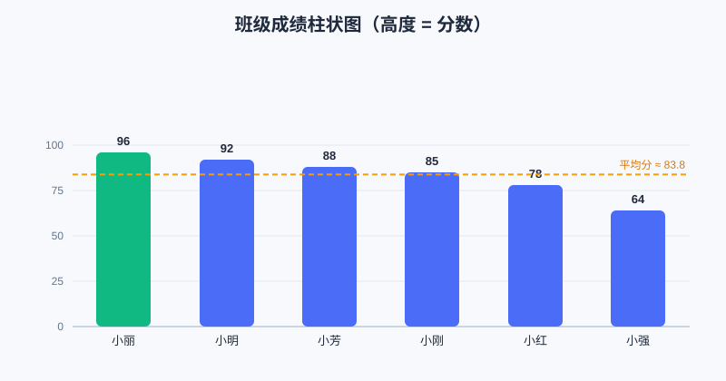

<div style="display:flex; gap:12px; margin-bottom:24px; flex-wrap:wrap; align-items:center;">
  <span style="background:#f0f4ff; color:#4A6CF7; padding:4px 12px; border-radius:20px; font-size:0.85em; font-weight:600; border:1px solid rgba(74,108,247,0.2);">📖 第24章</span>
  <span style="background:#fef9ec; color:#d97706; padding:4px 12px; border-radius:20px; font-size:0.85em; font-weight:600; border:1px solid rgba(245,158,11,0.2);">⏱️ ~45 min read</span>
  <span style="background:#fef9ec; color:#d97706; padding:4px 12px; border-radius:20px; font-size:0.85em; font-weight:600; border:1px solid rgba(245,158,11,0.2);">🎯 Intermediate</span>
</div>

# Chapter 24: 项目二 · 数据小分析《班级成绩体检》

> 📝 **Before You Continue:** 本章把"数据"当作主角。请确认你已见过：
> - [第10章 列表 list](../data-structures/lists.md) —— 装一串数字（每个人的分数）
> - [第12章 字典 dict](../data-structures/dictionaries.md) —— 把"名字 → 分数"配对存放
> - [第19章 排序算法](../algorithms/sorting.md) —— 本章用排序给成绩"排队"

你月考后，老师发下一张成绩表。一堆数字看着头晕：谁最高？谁最低？全班平均多少？谁需要加油？人脑看 40 个数字会眼花，电脑却最擅长这种"批量算账"。本章我们就用 Python 给一份**硬编码**的成绩单做"体检"：算最高/最低/平均、排个名次、再画一张**柱状图**——让数据自己"说话"。

做完你会发现：**数据分析 = 把原始数字，变成能做决定的信息**。这正是 AI、科研、商业都离不开的能力。

<div class="story-scene">
<strong>🎬 开场小剧场：数据观察员翻开成绩单</strong>
<p>班主任把一张成绩单交给小派：“谁进步最大？平均分是多少？哪些同学需要帮助？”小派看着一串数字发呆，眼睛都快变成蚊香圈。</p>
<p>数据观察员 analysis 推来一块白板：“数字本身不会说话。我们要帮它算平均、找最高、排顺序、画图。把数字变成结论，这就是数据分析。”</p>
</div>

<div class="quest-card">
<strong>🎯 本章任务卡</strong>
<ul>
<li>用字典保存名字和成绩。</li>
<li>计算最高分、最低分和平均分。</li>
<li>按成绩排序生成排行榜。</li>
<li>用简单柱状图让数据可视化。</li>
<li>把原始数字变成可解释的结论。</li>
</ul>
</div>

<div class="boss-bug">
<strong>👾 本章 Boss Bug：名单分数错位怪</strong>
<p>它最喜欢让名字列表和分数列表对不上号。打败它的武器是字典：让“名字 → 分数”绑在一起，不给错位机会。</p>
</div>

---

## 24.1 数据从哪来：先有一份"成绩单"

<div class="try-it">
<strong>🧩 练一练 24.1</strong>
<p>题目：做数据分析，数据一般先从哪来？</p>
<details><summary>💡 看看答案</summary>
<p>答案：先<b>有一份数据</b>——可以是硬编码的列表（练习用），也可以是读入的文件（实战用）。</p>
</details>
</div>

为了让你立刻能跑、不依赖外部文件，我们直接把数据写进代码（术语叫"硬编码"）。用**字典**把"名字"和"分数"一一对应——这比两个并排的列表更安全（不会对错人）。

```python
# 名字 → 分数。dict 让"谁考多少"一目了然
scores = {
    "小明": 92,
    "小红": 78,
    "小刚": 85,
    "小丽": 96,
    "小强": 64,
    "小芳": 88,
}
```

> 💡 **Key Insight:** 为什么用字典而不是两个列表 `names` 和 `points`？因为字典保证"名字和分数永远绑在一起"。用两个列表时，万一插错一个位置，就变成"小明的分数算到小红头上"——这种 bug 极难发现。数据要"成组"，就用能成组的结构。

---

## 24.2 用列表和循环做统计

<div class="try-it">
<strong>🧩 练一练 24.2</strong>
<p>题目：不用内置函数，自己用循环算 [80, 90, 70] 的平均分。</p>
<details><summary>💡 看看答案</summary>
<p>答案：<code>total=0</code> 遍历累加得 240，再 <code>total/len(scores)</code> = 80.0。</p>
</details>
</div>

最高分、最低分、平均分，Python 自带好用的工具。但我们先**手动用循环写一遍**，理解它到底在干什么——竞赛里经常不允许用现成函数，得会自己写。

### 24.2.1 直接用内置函数（日常最快）

```python
highest = max(scores.values())              # 最高分
lowest  = min(scores.values())              # 最低分
average = sum(scores.values()) / len(scores)  # 平均分

print("最高分:", highest)                    # 96
print("最低分:", lowest)                     # 64
print("平均分:", round(average, 2))          # 83.83（保留 2 位小数）
```

- `scores.values()` 取出所有分数（一个"视图"，可当可迭代对象用）；
- `max` / `min` / `sum` / `len` 都是内置函数，[第10章 列表](../data-structures/lists.md) 里见过它们；
- `round(x, 2)` 把小数四舍五入到 2 位。

### 24.2.2 自己用循环写（理解原理）

```python
total = 0
count = 0
highest_loop = -1
for score in scores.values():
    total += score            # 累加
    count += 1
    if score > highest_loop:  # 边走边记录最大值
        highest_loop = score
print("平均分:", total / count)
print("最高分:", highest_loop)
```

> 🤔 **Why 两种写法都要学？** 内置函数是"别人写好的轮子"，平时直接用最省事；但循环版让你看清洗脑式的逻辑：**累加器**（`total`）、**计数器**（`count`）、**擂台法求最大**（`highest_loop` 像擂台，谁大谁上台）。这三板斧在算法题里无处不在。

---

## 24.3 排序：给成绩"排队"

<div class="try-it">
<strong>🧩 练一练 24.3</strong>
<p>题目：给成绩列表排序，用内置的什么方法 / 函数？</p>
<details><summary>💡 看看答案</summary>
<p>答案：原地排用 <code>scores.sort()</code>，不改动原列表拿新列表用 <code>sorted(scores)</code>。</p>
</details>
</div>

想知道名次？用**排序**。Python 的 `sorted` 返回一个新的已排序列表，不改原数据。我们按分数从高到低排：

```python
# items() 得到 [(名字, 分数), ...]；key 指定"按分数排"；reverse=True 从高到低
ranked = sorted(scores.items(), key=lambda x: x[1], reverse=True)
print(ranked)
# [('小丽', 96), ('小明', 92), ('小芳', 88), ('小刚', 85), ('小红', 78), ('小强', 64)]
```

- `scores.items()` 把字典变成"键值对"的列表；
- `key=lambda x: x[1]` 告诉排序："比较时看每对的第 2 个元素（分数）"，`x[0]` 才是名字；
- `reverse=True` 让大的排前面。

> 🧠 **Mental Model: 排序就像排队量身高**。`key` 就是"比什么"——这里我们比的是分数而不是名字。`sorted` 背后用的正是 [第19章 排序算法](../algorithms/sorting.md) 里讲的思路（Python 内部用 Timsort，平均 O(n log n)）。

> ⚡ **Pro Tip:** 想看"进步空间"，把 `reverse=True` 去掉就是"从低到高"，垫底的同学立刻排第一——一眼看出谁最需要帮助。

---

## 24.4 画一张柱状图

<div class="try-it">
<strong>🧩 练一练 24.4</strong>
<p>题目：用纯文本画柱状图，每行怎么表示一个人？</p>
<details><summary>💡 看看答案</summary>
<p>答案：打印 <code>名字 + " " + "*" * 次数</code>。星号个数代表数值高低，永远能跑。</p>
</details>
</div>

数字会骗眼睛，图不会。我们画柱状图：每根柱子高度 = 分数。先做**纯文本版**（任何环境都能跑），再做**海龟版**（更漂亮，需要本地环境看窗口）。

### 24.4.1 文本柱状图（永远能跑）

```python
print("成绩柱状图（每 2 分一个 █）:")
for name, score in ranked:            # ranked 已是排好序的列表
    bar = "█" * (score // 2)          # 分数整除 2，控制柱子长度
    print(f"{name} | {bar} {score}")
```

运行效果（节选）：

```
小丽 | ████████████████████████████████████████████████ 96
小明 | ██████████████████████████████████████████████ 92
小强 | ████████████████████████████████ 64
```

> `score // 2` 是**整除**（向下取整），把 0–100 的分数压缩到 0–50 个字符宽，终端里不会撑爆。`█` 是方块字符，视觉上像实心柱子。

### 24.4.2 海龟柱状图（升级版，需本地环境）

用我们熟悉的 `turtle`，每根柱子画一个**实心矩形**，高度 = `分数 × 2`。

```python
import turtle

def draw_bar(t, x, y, width, height, color, label):
    """在 (x, y) 画一个宽 width、高 height 的实心柱子，并标注。"""
    t.penup()
    t.goto(x, y)
    t.pendown()
    t.fillcolor(color)
    t.begin_fill()
    for _ in range(2):              # 画矩形：宽→高→宽→高
        t.forward(width)
        t.left(90)
        t.forward(height)
        t.left(90)
    t.end_fill()
    # 在柱子下方写名字，上方写分数
    t.penup()
    t.goto(x + width / 2, y - 20)
    t.write(label, align="center")
    t.goto(x + width / 2, y + height + 5)
    t.write(str(height // 2), align="center")   # 还原成真实分数

def turtle_bar_chart(data):
    screen = turtle.Screen()
    screen.setworldcoordinates(-50, -50, 420, 250)   # 自定义坐标系，省去手动换算
    t = turtle.Turtle()
    t.speed(0)
    t.hideturtle()
    x = 20
    for name, score in data.items():
        draw_bar(t, x, 0, 30, score * 2, "#4A6CF7", name)  # 高度放大 2 倍更明显
        x += 55                                          # 每根柱子向右挪
    turtle.done()

turtle_bar_chart(scores)
```

> 📝 **Note:** `setworldcoordinates` 把画布左下角设成 `(-50,-50)`、右上设成 `(420,250)`，于是"柱子高度 = `score*2`（最大 192）"正好落进画面。海龟版需要**本地环境**才能看到弹窗；在线环境跑不出图形时，用 24.4.1 的文本版一样能"看见"数据。



上图就是文本柱状图的"视觉版"——柱子越长分越高，谁强谁弱一眼看清。

---

## 24.5 完整代码 & 如何运行

<div class="try-it">
<strong>🧩 练一练 24.5</strong>
<p>题目：这份数据分析代码怎么运行？</p>
<details><summary>💡 看看答案</summary>
<p>答案：保存为 <code>analyze.py</code>，终端运行 <code>python analyze.py</code> 看统计结果和图表。</p>
</details>
</div>

把下段保存为 `analyze.py`，终端运行：

```bash
python analyze.py        # Windows
python3 analyze.py       # macOS
```

<details>
<summary>📦 点击展开：analyze.py 完整代码</summary>

```python
"""
班级成绩体检 —— 统计 + 排序 + 柱状图
运行：python analyze.py  （macOS 用 python3 analyze.py）
"""

scores = {
    "小明": 92,
    "小红": 78,
    "小刚": 85,
    "小丽": 96,
    "小强": 64,
    "小芳": 88,
}

# ---- 统计 ----
highest = max(scores.values())
lowest  = min(scores.values())
average = sum(scores.values()) / len(scores)

print("==== 班级成绩体检 ====")
print("最高分:", highest)
print("最低分:", lowest)
print("平均分:", round(average, 2))

# ---- 排序（从高到低） ----
ranked = sorted(scores.items(), key=lambda x: x[1], reverse=True)
print("\n名次:", ranked)

# ---- 文本柱状图 ----
print("\n成绩柱状图（每 2 分一个 █）:")
for name, score in ranked:
    bar = "█" * (score // 2)
    print(f"{name} | {bar} {score}")

# ---- （可选）海龟柱状图：需要本地环境看窗口 ----
import turtle

def draw_bar(t, x, y, width, height, color, label):
    t.penup()
    t.goto(x, y)
    t.pendown()
    t.fillcolor(color)
    t.begin_fill()
    for _ in range(2):
        t.forward(width)
        t.left(90)
        t.forward(height)
        t.left(90)
    t.end_fill()
    t.penup()
    t.goto(x + width / 2, y - 20)
    t.write(label, align="center")
    t.goto(x + width / 2, y + height + 5)
    t.write(str(height // 2), align="center")

def turtle_bar_chart(data):
    screen = turtle.Screen()
    screen.setworldcoordinates(-50, -50, 420, 250)
    t = turtle.Turtle()
    t.speed(0)
    t.hideturtle()
    x = 20
    for name, score in data.items():
        draw_bar(t, x, 0, 30, score * 2, "#4A6CF7", name)
        x += 55
    turtle.done()

# 取消下一行注释即可弹出图形窗口（在线环境可能不支持）
# turtle_bar_chart(scores)
```

</details>

🛠️ **项目工坊：** 先跑通上面的文本版，再试着取消最后一行注释、在本地环境看海龟图——对比两种"可视化"的差别。

---

## 24.6 🔍 计算思维聚焦：从"数"到"洞察"

整个流程其实是一个**流水线（pipeline）**：

```
原始数据(字典) → 统计(max/min/avg) → 排序(排队) → 可视化(柱状图) → 决策
```

每一步都把数据"提纯"一点：原始数字是原料，统计和排序是加工，图表是呈现，最后的"谁要加油 / 题太难了吗"才是**洞察**。计算思维在这里体现为**抽象**（用 dict 表示成绩）和**自动化**（让循环替你算 40 个人的账）。以后你学 `pandas`、做 AI，骨架和这完全一样，只是数据更大、工具更猛。

> 💡 **Key Insight:** 数据分析不是"算几个数"，而是"用计算替你看见人眼看不出的规律"。你今天给 6 个人体检，明天就能给 6 万人。

---

## 🏅 本章通关徽章：数据观察员

<div class="badge-card">
<strong>如果你能做到下面 4 件事，就获得“数据观察员”徽章：</strong>
<ul>
<li>能用字典保存一份小型成绩单。</li>
<li>能算出最高、最低、平均等统计指标。</li>
<li>能按分数排序并解释排行榜。</li>
<li>能用图表把数字变成更直观的信息。</li>
</ul>
</div>

---

## ⚠️ Common Mistakes in Chapter 24

| # | 误区 | 示例 | 为什么错 | 修正 |
|---|------|------|---------|------|
| 1 | 平均分用整数除 | `sum(...) / len(...)` 在 Python 2 得整数 | 老版本整除丢小数 | Python 3 下 `/` 本就返回浮点；保留位数用 `round(x,2)` |
| 2 | `sorted` 改了原字典 | 以为 `ranked = sorted(scores)` 后 `scores` 变了 | `sorted` 返回新列表，不动原数据 | 需要原顺序就用原变量，需要排序用返回值 |
| 3 | `key` 写反 | `key=lambda x: x[0]` 变成"按名字排" | 分数是第 2 个元素 `x[1]` | 记住 `items()` 每对是 `(名字, 分数)`，比分数用 `x[1]` |
| 4 | 柱状图撑爆终端 | 直接用 `score` 当字符数（96 个 █） | 太长不好看 | 用 `score // 2` 或 `score // 4` 压缩宽度 |
| 5 | 海龟图坐标算错 | 柱子飞出画面看不到 | 没设好坐标系 | 用 `setworldcoordinates` 或先 `goto` 到合理位置 |

---

## Chapter Summary

### 📌 Key Takeaways

| 概念 | 要点 | 为什么重要 |
|------|------|------------|
| dict 存数据 | 名字→分数成对，不会对错人 | 成组数据首选结构 |
| 统计三件套 | `max`/`min`/`sum`/`len`；循环版理解原理 | 日常快 + 竞赛会手写 |
| 排序 | `sorted(items(), key=lambda x:x[1], reverse=True)` | 排名、找极值的前置 |
| 文本柱状图 | `"█" * (score//2)` | 零依赖，任何环境可见 |
| 海龟可视化 | 画实心矩形，高度=分数×2 | 直观好看，需本地环境 |

### ❓ FAQ

**Q1: 数据能从文件读吗？比如 Excel / csv？**
> A: 可以，而且那是真实场景。本书先硬编码让你专注"处理逻辑"；之后学 `csv` 模块或 `pandas` 就能读文件。逻辑（统计/排序/画图）完全不变，只是"数据来源"换了。

**Q2: `sorted` 和 `list.sort()` 有什么区别？**
> A: `sorted(任何可迭代)` 返回**新**列表，原数据不动；`scores_list.sort()` 是列表的**方法**，会**原地**改掉原列表、返回 `None`。一般想要"保留原顺序"就用 `sorted`。

**Q3: 海龟图在线环境画不出来怎么办？**
> A: 没关系。文本柱状图（24.4.1）在任何环境都能跑，已经完成了"可视化"的目的。海龟版只是锦上添花，本地环境装好后随时补。

### 🔗 Connections to Later Chapters

- **[第25章 算法挑战擂台](algorithm-arena.md)** 会正式考"排序/去重/查找"——本章的 `sorted` 和"擂台法求最大"正是热身。
- **[第17章 大 O 与复杂度](../algorithms/big-o.md)** 解释为什么 `max` 是 O(n)、`sorted` 是 O(n log n)，帮你估代码的快慢。
- **[第26章 下一步去哪？](next-steps.md)** 的 AI/数据路线里，这种"清洗→统计→可视化"是 daily 基本功。

---


## 🎮 加练任务包

> 下面这些题目不一定比章末题更难，但更适合“多刷几遍、把手感练出来”。建议先独立做，再展开提示。

### 加练 24.A · 平均分 🟢

成绩为 `[80, 90, 70]`，平均分是多少？用代码思路说明。

<details>
<summary>💡 提示 / 答案要点</summary>

总和 240，人数 3，平均 80。代码可用 `sum(scores) / len(scores)`。

</details>

---

### 加练 24.B · 前三名 🟢

给成绩字典，怎样按分数从高到低取前三名？

<details>
<summary>💡 提示 / 答案要点</summary>

可用 `sorted(scores.items(), key=lambda x: x[1], reverse=True)[:3]`。

</details>

---

### 加练 24.C · 文字柱状图 🟡

分数 8、5、3，怎样用星号画成三行柱状图？

<details>
<summary>💡 提示 / 答案要点</summary>

每个分数打印对应数量的 `*`：`print("*" * score)`。这就是最小可视化。

</details>

---


---

## Practice Problems

🛠️ **项目工坊（扩展挑战）：** 把"成绩体检"改造成你自己的小分析工具。

---

**Problem 24.1 — 找出"需要加油"的同学** 🟢 Easy

在统计之后，打印出所有分数**低于平均分**的同学名字。提示：遍历 `scores.items()`，用 `if score < average` 判断。

<details>
<summary>💡 Solution (click to reveal)</summary>

**Approach:** 先有平均分，再过滤。

```python
print("低于平均分的同学：")
for name, score in scores.items():
    if score < average:
        print(f"  {name}（{score} 分）")
```

**Key points:**
- `average` 用前面算好的浮点数比较。
- 遍历 `items()` 同时拿到名字和分数。

</details>

---

**Problem 24.2 — 按名字排序（而不是分数）** 🟢 Easy

把 `ranked` 改成"按名字拼音/字母从小到大"排。只改 `sorted` 的参数，其余不动。

<details>
<summary>💡 Solution (click to reveal)</summary>

**Approach:** 排序键换成名字（每对第 0 个），并去掉 `reverse`。

```python
by_name = sorted(scores.items(), key=lambda x: x[0])   # 按名字，默认升序
print(by_name)
```

**Key points:**
- `x[0]` 是名字，`x[1]` 是分数——换键就换排序依据。
- 默认 `reverse=False`（升序），不用写。

</details>

---

**Problem 24.3 — 统计"及格率"** 🟡 Medium

设定 60 分及格。计算并输出：及格人数、不及格人数、及格率（百分比，保留 1 位小数）。

<details>
<summary>💡 Solution (click to reveal)</summary>

**Approach:** 用计数器统计及格人数，再算比例。

```python
passed = 0
for score in scores.values():
    if score >= 60:
        passed += 1
total = len(scores)
rate = passed / total * 100
print(f"及格 {passed} 人，不及格 {total - passed} 人，及格率 {rate:.1f}%")
```

**Key points:**
- `{rate:.1f}` 是格式化输出，保留 1 位小数。
- 及格率 = 及格人数 / 总人数 × 100。

</details>

---

**Problem 24.4 — 给数据"分组"（区间统计）** 🔴 Hard

把分数分成三档：优秀(≥90)、良好(70–89)、待加油(<70)。输出每档有哪些人。提示：用字典 `buckets = {"优秀":[], "良好":[], "待加油":[]}` 收集。

<details>
<summary>💡 Solution (click to reveal)</summary>

**Approach:** 遍历时按区间 append 到对应列表。

```python
buckets = {"优秀": [], "良好": [], "待加油": []}
for name, score in scores.items():
    if score >= 90:
        buckets["优秀"].append(name)
    elif score >= 70:
        buckets["良好"].append(name)
    else:
        buckets["待加油"].append(name)
for grade, names in buckets.items():
    print(f"{grade}: {names}")
```

**Key points:**
- 用列表 `append` 把人归到对应档。
- `elif` 保证每个分数只进一个桶（区间不重叠）。

</details>

---

**Problem 24.5 — 换成"运动数据"做分析** 🏆 Challenge

把 `scores` 改成一组"本周每日跑步里程"（比如 `{"周一":3.2, "周二":5.1, ...}`），复用本章的统计+排序+柱状图代码，算出总里程、单日最长/最短、并画里程柱状图。（提示：柱状图宽度可用 `int(mile * 10)` 控制。）

<details>
<summary>💡 Solution (click to reveal)</summary>

**Approach:** 数据换成浮点里程，统计函数几乎不变；柱状图把 `score//2` 换成 `int(mile*10)`。

```python
runs = {"周一": 3.2, "周二": 5.1, "周三": 2.0, "周四": 4.4, "周五": 6.0}
total = sum(runs.values())
best = max(runs.values()); worst = min(runs.values())
ranked = sorted(runs.items(), key=lambda x: x[1], reverse=True)
print(f"总里程 {total:.1f} km，最长 {best}，最短 {worst}")
for day, km in ranked:
    print(f"{day} | {'█' * int(km * 10)} {km}")
```

**Key points:**
- 同一套逻辑适配不同数据 = 抽象的价值。
- 浮点用 `int(km*10)` 转成整数个字符，避免 `█" * 3.2` 报错。

</details>

---

> 💡 **记住这一句：** 数据本身不会说话，是你用"统计→排序→可视化"这条流水线，替它开了口。
