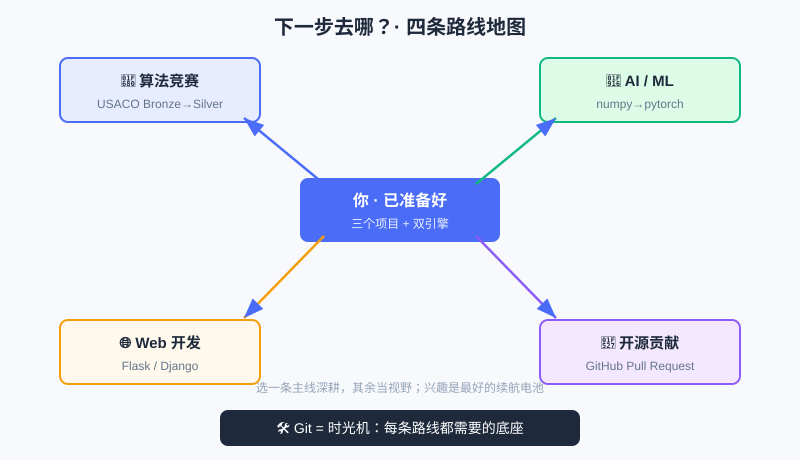

<div style="display:flex; gap:12px; margin-bottom:24px; flex-wrap:wrap; align-items:center;">
  <span style="background:#f0f4ff; color:#4A6CF7; padding:4px 12px; border-radius:20px; font-size:0.85em; font-weight:600; border:1px solid rgba(74,108,247,0.2);">📖 第26章</span>
  <span style="background:#fef9ec; color:#d97706; padding:4px 12px; border-radius:20px; font-size:0.85em; font-weight:600; border:1px solid rgba(245,158,11,0.2);">⏱️ ~30 min read</span>
  <span style="background:#fef9ec; color:#d97706; padding:4px 12px; border-radius:20px; font-size:0.85em; font-weight:600; border:1px solid rgba(245,158,11,0.2);">🎯 Intermediate</span>
</div>

# Chapter 26: 下一步去哪？（路线地图 + Git 入门）

> 📝 **Before You Continue:** 你已亲手做完三个项目：
> - [第23章 互动文字冒险](text-adventure.md) —— 字典 + 函数 + 状态机
> - [第24章 数据小分析](data-analysis.md) —— 列表/字典 + 排序 + 可视化
> - [第25章 算法挑战擂台](algorithm-arena.md) —— 二分 / 去重排序 / 递归 DP
>
> 这一章不再写新代码，而是给你一张**地图**：往哪走、怎么走、带什么工具走。

走到这里，你已经不是"零基础"了——你会用 Python 表达想法、组织数据、写出能跑的小作品，甚至能解 USACO Bronze 风格的题。接下来不是"学完了"，而是"**选一条路继续深入**"。本章给你四条常见路线 + 一个必备工具（Git）+ 一份资源清单，最后送你一句话。

<div class="story-scene">
<strong>🎬 开场小剧场：毕业路线图导师递来地图</strong>
<p>算法游乐场终于建成了：入口、灯光、档案室、擂台、数据看板都能运行。小派站在出口却有点迷茫：“接下来我该去哪？”</p>
<p>毕业路线图导师 roadmap 把地图摊开：“你不是结束了，而是有资格选择路线了。竞赛、AI、Web、开源，每条路都从今天的 Python 地基长出来。”</p>
</div>

<div class="quest-card">
<strong>🎯 本章任务卡</strong>
<ul>
<li>盘点自己已经掌握的 Python 和算法能力。</li>
<li>选择算法竞赛、AI、Web 或开源路线。</li>
<li>理解 Git 为什么是长期学习的底座工具。</li>
<li>学会用作品集记录自己的项目。</li>
<li>制定下一阶段的学习计划。</li>
</ul>
</div>

<div class="boss-bug">
<strong>👾 本章 Boss Bug：学完就丢怪</strong>
<p>它会让你看完一本书就停下，不复盘、不做项目、不保存代码。打败它的方法是：把作品放进 Git 仓库，选一条路线继续做下去。</p>
</div>

---

## 26.1 你已经拥有什么（先盘点）

<div class="try-it">
<strong>🧩 练一练 26.1</strong>
<p>题目：学完本书，盘点一下你已经掌握了什么？</p>
<details><summary>💡 看看答案</summary>
<p>答案：变量/循环/函数/数据结构，外加<b>计算思维与基础算法</b>（搜索、排序、递归、贪心）。这是后续路线的地基。</p>
</details>
</div>

别急着往前冲，先看清背包里有什么：

- **计算思维双引擎**：能把大问题拆小（分解）、找规律（模式识别）、抽象成结构、设计步骤（算法）。
- **代码基本功**：变量、字符串、控制流、函数、列表/字典/集合、递归。
- **算法直觉**：知道"慢的解"和"快的解"差在哪（O(n) vs O(n²) vs O(log n)）。
- **项目经验**：三个完整可运行的作品，能写进你的"作品集"。

> 💡 **Key Insight:** 这些能力是"可迁移"的——不管你选哪条路线，它们都是底盘。路线不同，只是"往上叠什么"不同。

下面这张图把四条路线和它们共用的底座（Git）一次摆清，你可以把它当作本章的"总地图"：



图中央是"已经准备好的你"，四条彩线分别通向竞赛 / AI / Web / 开源；底部的深色条提醒你：无论走哪条，Git 都是绕不开的底座。

---

## 26.2 🚀 路线 A：算法竞赛（USACO）

<div class="try-it">
<strong>🧩 练一练 26.2</strong>
<p>题目：路线 A“算法竞赛”指的是什么？</p>
<details><summary>💡 看看答案</summary>
<p>答案：指参加 <b>USACO</b> 等信息学竞赛，用本书的算法基础继续刷题干到 Silver/Gold。</p>
</details>
</div>

如果你喜欢"解谜 + 比快慢"，这是最纯粹的思维训练。

- **下一步目标**：从 Bronze 刷到 Silver。Silver 会考堆、二分答案、前缀和、简单图论——[第25章](algorithm-arena.md) 的二分和 DP 正是地基。
- **怎么练**：每天 1–2 道，先保证写对，再逼自己想更快的解法。
- **心态**：竞赛不是为了奖牌，而是把"脑子练快、写码写稳"——这对做任何事都有用。

> 📝 **Note:** 国内也有类似赛事（如 CSP-J/S、NOIP），路线相通。先打地基，再按自己所在体系选赛。

---

## 26.3 🤖 路线 B：AI / 机器学习

<div class="try-it">
<strong>🧩 练一练 26.3</strong>
<p>题目：路线 B“AI / 机器学习”需要什么基础？</p>
<details><summary>💡 看看答案</summary>
<p>答案：扎实的 <b>Python + 数学 + 数据结构与算法</b>，再加机器学习框架（如 PyTorch）。</p>
</details>
</div>

如果你想让电脑"从数据里学规律"，这是当下最热的方向。

- **地基**：本章的[数据处理](data-analysis.md)（统计、清洗、可视化）就是 AI 的 daily 基本功；[递归/DP](algorithm-arena.md) 的思想也会在序列模型里重现。
- **进阶阶梯**：Python → `numpy`/`pandas`（数据处理）→ `matplotlib`（画图）→ `scikit-learn`（传统 ML）→ `pytorch`/`tensorflow`（深度学习）。
- **入门建议**：先用手写数字识别（MNIST）这类"经典小项目"体会"训练→预测"全流程，再深入理论。

---

## 26.4 🌐 路线 C：Web 开发

<div class="try-it">
<strong>🧩 练一练 26.4</strong>
<p>题目：路线 C“Web 开发”大致做些什么？</p>
<details><summary>💡 看看答案</summary>
<p>答案：做<b>网站</b>——前端（页面）和后端（服务器/数据库），Python 可用 Django / FastAPI 写后端。</p>
</details>
</div>

如果你想做出"别人能打开网页就用"的东西。

- **后端用 Python**：`Flask` 或 `Django` 框架，把你的函数变成"网站背后的逻辑"。你写的 `def` 函数，摇身一变成"处理用户请求的接口"。
- **前端配合**：HTML/CSS/JavaScript 负责页面长相；你不必精通，先会"接起来"即可。
- **小目标**：把你第23章的"文字冒险"做成网页版——输入方向、点按钮移动，超有成就感。

---

## 26.5 🔧 路线 D：开源贡献

如果你想在"真实项目"里和全球程序员一起写代码，这是最快的成长方式。

- **是什么**：GitHub 上有无数公开项目（库、工具、网站），任何人都能提"改进建议"（Pull Request）。
- **怎么开始**：先给文档挑错字、补例子这种"小 PR"练手，再慢慢碰代码。读别人的代码，比自己闷头写进步更快。
- **为什么值**：作品集 + 协作经验 + 真实工程习惯，升学和求职都加分。

---

## 26.6 🛠️ Git 入门：给你的代码装"时光机"

<div class="try-it">
<strong>🧩 练一练 26.5</strong>
<p>题目：Git 的三次“存档”动作，对应哪三条常用命令？</p>
<details><summary>💡 看看答案</summary>
<p>答案：<code>git add</code>（暂存）→ <code>git commit</code>（存档）→ <code>git push</code>（推到远程如 GitHub）。</p>
</details>
</div>

四条路线迟早都要用 **Git**——它是"版本管理"工具：记录你每次改动、能随时回到过去、能多人协作不打架。GitHub 则是把 Git 仓库放到网上的平台。

### 直觉：三次"存档"

把 Git 想成打游戏的**存档点**：

```
你的文件夹  --git add-->  暂存区(准备存档的东西)  --git commit-->  历史存档(永久快照)  --git push-->  GitHub(云端备份)
```

### 最常用的几条命令

```bash
# 1) 在一个文件夹里"开启"版本管理（只需一次）
git init

# 2) 把改动"放进暂存区"（告诉 Git：这些文件我要存）
git add adventure.py          # 只存某个文件
git add .                     # 存当前目录所有改动

# 3) "存档"——提交一次快照，并写一句说明
git commit -m "完成了古堡探险的第一版"

# 4) 把本地存档推到 GitHub（先在网上建好仓库并关联）
git push                      # 推送到远程

# 5) 从 GitHub 把项目下载/更新到本地
git clone <仓库地址>          # 第一次下载
git pull                      # 之后拉取别人/其他设备的更新
```

> 🤔 **Why 要 `add` 再 `commit` 两步？** `add` 是"挑选这一批要存什么"，`commit` 是"真正拍快照"。分开让你能灵活地"这次只存档游戏逻辑、不存档调试用的临时文件"——精细控制每一次存档的内容。

> ⚠️ **Warning:** 第一次 `push` 前要在 GitHub 网页建一个**空仓库**，并用 `git remote add origin <地址>` 把本地和云端连起来。别把密码写进代码再 `push`——敏感信息（密钥、token）永远放本地配置文件，别提交。

> 💡 **Key Insight:** Git 不是"写代码"的工具，而是"**保护你写代码成果**"的工具。哪怕你只走 AI 或 Web 一条路，养成"每次完成一点就 `commit`"的习惯，将来一定感谢现在的自己。

---

## 26.7 📚 学习资源清单

| 类型 | 推荐 | 说明 |
|------|------|------|
| 书（入门） | 《Python Crash Course》《Automate the Boring Stuff with Python》 | 边做边学，趣味强 |
| 书（思维） | 本书《Python 入门：像计算机科学家一样思考》 | 双引擎：计算思维 + 算法启蒙 |
| 书（算法进阶） | 《算法图解》→ 之后可挑战 CLRS《算法导论》 | 从直观到严谨 |
| 网课 | Harvard CS50、MIT 6.0001（Python 入门） | 名校公开、质量高 |
| AI 方向 | fast.ai、吴恩达《Machine Learning》 | 入门到系统 |
| 题库 | USACO 官网(usaco.org)、LeetCode、Codeforces | 刷题练手感 |
| 社区 | GitHub、Stack Overflow、国内技术论坛 | 提问、读源码、找伙伴 |

> 📝 **Note:** 资源在精不在多。挑**一门课 + 一个题库**坚持半年，远胜收藏 20 个链接从不打开。

---

## 26.8 💡 计算思维是一辈子的超能力

不管你最后走哪条路，甚至将来不写代码——**计算思维**都会留下来：

- 遇到复杂问题，你会本能地"先拆小、再各个击破"；
- 看到混乱信息，你会想"怎么抽象成结构、怎么自动化"；
- 面对不确定，你会用"试错 + 验证"代替空想。

这些，是 AI 也替代不了的底色。你今天学的不是"一门语言"，而是一种**更清楚地思考世界的方式**。

> 💡 **记住这一句：** 你已经会用代码让想法变成现实——这不是终点，而是你拥有"创造超能力"的起点。

---

## 🏅 本章通关徽章：路线图制定者

<div class="badge-card">
<strong>如果你能做到下面 4 件事，就获得“路线图制定者”徽章：</strong>
<ul>
<li>能盘点自己已经完成的项目和能力。</li>
<li>能在竞赛、AI、Web、开源中选择下一条路线。</li>
<li>能说清 Git 对长期学习和作品管理的作用。</li>
<li>能给自己写出下一阶段 4 周学习计划。</li>
</ul>
</div>

---

## ⚠️ Common Mistakes in Chapter 26

| # | 误区 | 示例 | 为什么错 | 修正 |
|---|------|------|---------|------|
| 1 | 想"一次学完所有路线" | 同时啃竞赛+AI+Web，全半途而废 | 精力分散，难深入 | 先选**一条**主线深耕，其余当视野 |
| 2 | 收藏资源不行动 | 存 20 个链接从没打开 | 输入≠掌握 | 选 1 门课 + 1 个题库，立刻开干 |
| 3 | Git 直接 `commit` 不 `add` | 发现改动能提交但忘了暂存 | 新文件未跟踪需先 `add` | 新文件先 `git add` 再 `commit` |
| 4 | 把密码/密钥 `push` 上 GitHub | 账号泄露 | 敏感信息进公开仓库 | 密钥放本地配置，用 `.gitignore` 忽略 |
| 5 | 觉得"学完本书就结束了" | 不再写代码，能力退化 | 编程靠持续练 | 把三个项目当起点，每周写点小东西 |

---

## Chapter Summary

### 📌 Key Takeaways

| 内容 | 要点 | 为什么重要 |
|------|------|------------|
| 四条路线 | 竞赛 / AI / Web / 开源 | 同一底盘，往上叠不同能力 |
| Git 直觉 | add(暂存) → commit(快照) → push(云端) | 保护成果、协作必备 |
| 资源策略 | 少而精，立刻行动 | 收藏≠掌握 |
| 计算思维 | 拆问题/抽象/自动化 | 一辈子的超能力，超越代码本身 |

### ❓ FAQ

**Q1: 我该先选哪条路线？**
> A: 跟着"让你最上头"的那个走。喜欢解谜选竞赛，喜欢让数据说话选 AI，喜欢做能用的东西选 Web，喜欢读别人代码选开源。**兴趣**是最好的续航电池。

**Q2: Git 很难，要现在就学吗？**
> A: 不急，但越早越好。本章的命令足够你"单人存档 + 推 GitHub 备份"。协作功能（分支、PR）等真要多人做项目时再学也不迟。

**Q3: 不打算当程序员，这些还有用吗？**
> A: 极有用。计算思维帮你更清晰地拆解任何复杂问题，Git 帮你管理任何"会变动的文件"，而"让想法变成现实"的掌控感，会渗透到你学习和生活的方方面面。

### 🔗 Connections to Later Chapters

这是全书的**最后一章**——没有"下一章"，只有"你自己的下一章"。你可以把本章当作一份**出发地图**：

- 走 **竞赛** 路线 → 回到 [第25章 算法擂台](algorithm-arena.md) 把 Bronze 套路刷熟，再攻 Silver。
- 走 **AI** 路线 → 回到 [第24章 数据小分析](data-analysis.md)，把"统计→排序→可视化"练成肌肉记忆。
- 走 **Web / 开源** 路线 → 用 [第23章 文字冒险](text-adventure.md) 当第一个能展示的作品。
- 工具上 → 把本章的 **Git** 用起来，给每个练习建一个仓库。

---


## 🎮 加练任务包

> 下面这些题目不一定比章末题更难，但更适合“多刷几遍、把手感练出来”。建议先独立做，再展开提示。

### 加练 26.A · 路线选择 🟢

如果你最喜欢解谜和比赛，四条路线里更适合先走哪条？

<details>
<summary>💡 提示 / 答案要点</summary>

算法竞赛路线。它最强调解题、复杂度和代码稳定性。

</details>

---

### 加练 26.B · Git 提交信息 🟢

给“完成文字冒险游戏”写一条简洁 Git commit message。

<details>
<summary>💡 提示 / 答案要点</summary>

示例：`Add text adventure game` 或中文 `完成文字冒险项目`。重点是短、清楚、说明做了什么。

</details>

---

### 加练 26.C · 四周计划 🟡

为自己设计一个 4 周继续学习计划，每周一个目标。

<details>
<summary>💡 提示 / 答案要点</summary>

示例：第1周复盘基础；第2周做一个小游戏；第3周刷搜索/排序题；第4周把项目放进 Git 仓库并写说明。

</details>

---


---

## Practice Problems

🛠️ **项目工坊（出发任务）：** 这一章的"练习"是**真正的行动**——选一条路，迈出第一步。

---

**Problem 26.1 — 写下你的路线宣言** 🟢 Easy

从四条路线（竞赛 / AI / Web / 开源）里选**一条**作为接下来三个月的主线，用三句话写下：① 为什么选它；② 这周要做的第一件小事；③ 怎么判断自己"在进步"。

<details>
<summary>💡 Solution (click to reveal)</summary>

**Approach:** 这不是编程题，而是"给自己定目标"的练习。示例（选 Web）：

```
① 我选 Web，因为我想做出同学能直接打开用的小工具。
② 这周：用 Flask 把第23章的文字冒险做成网页版（输入方向、点按钮移动）。
③ 进步标志：能独立从零跑起一个本地网页，并解释每段代码在干嘛。
```

**Key points:**
- 目标要具体、可检验，别写"我要变强"这种空话。
- 写下来 = 给自己一个承诺。

</details>

---

**Problem 26.2 — 用 Git 存起你的第一个项目** 🟢 Easy

在第23章的 `adventure.py` 所在文件夹里，执行 `git init`，把文件 `add` 并 `commit` 一次，提交说明写"迷雾古堡探险 v1"。验证 `git log` 能看到这条记录。

<details>
<summary>💡 Solution (click to reveal)</summary>

**Approach:** 按 26.6 的四步来。

```bash
cd <adventure.py 所在文件夹>
git init
git add adventure.py
git commit -m "迷雾古堡探险 v1"
git log --oneline          # 应看到一条提交记录
```

**Key points:**
- `git log` 是"查看存档历史"，能确认提交成功。
- 出错时 `git status` 会告诉你当前处在哪一步。

</details>

---

**Problem 26.3 — 把成绩项目改成"可复用函数"** 🟡 Medium

把 [第24章](data-analysis.md) 的统计逻辑，封装成一个函数 `report(scores: dict)`，打印最高/最低/平均并画出文本柱状图。这样换一份数据只要调用一次。

<details>
<summary>💡 Solution (click to reveal)</summary>

**Approach:** 把第24章散落的代码收进一个函数。

```python
def report(scores):
    hi = max(scores.values())
    lo = min(scores.values())
    avg = sum(scores.values()) / len(scores)
    print(f"最高 {hi} / 最低 {lo} / 平均 {avg:.2f}")
    ranked = sorted(scores.items(), key=lambda x: x[1], reverse=True)
    for name, s in ranked:
        print(f"{name} | {'█' * (s // 2)} {s}")

# 换数据只要换字典
report({"A": 70, "B": 90, "C": 85})
```

**Key points:**
- 封装后"数据"和"逻辑"彻底分离，正是工程化的第一步。
- 这也为你"作品集"里可复用的小工具打了样。

</details>

---

**Problem 26.4 — 给开源项目挑一个"小毛病"** 🔴 Hard

去 GitHub 找一个你用过/感兴趣的项目，读它的 `README` 和文档，找一处**错别字、过时链接或不清楚的说明**，按项目 `CONTRIBUTING` 指引提一个修正（文档类 PR 最友好）。

<details>
<summary>💡 Solution (click to reveal)</summary>

**Approach:** 这是"协作入门"，不写算法，只练流程。

1. 在 GitHub 打开目标仓库 → 点 `Fork` 复制到你自己账号。
2. 改那一处文档 → `git commit` → `git push` 到你 Fork。
3. 回原仓库点 `New Pull Request`，写清"改了什么、为什么"。

**Key points:**
- 文档 PR 几乎不会被拒，是安全的第一次协作。
- 重点不是改了什么，而是**走通"fork→改→提 PR"全流程**——之后改代码就轻车熟路。

</details>

---

**Problem 26.5 — 设计你的"下一个作品"** 🏆 Challenge

结合你选的路线，设计下一个完整小项目（1 段描述 + 用到的 3 个本书知识点 + 一个最小可运行原型的目标）。例如竞赛路线："写一个'给定数组找两数之和下标'的小工具，用到列表、循环、字典；原型能读输入并打印结果。"

<details>
<summary>💡 Solution (click to reveal)</summary>

**Approach:** 用"描述 + 知识点 + 原型目标"三要素框定范围，避免眼高手低。

```
路线：Web
描述：一个"今日待办"网页，能添加/勾选/删除任务，数据存在本地。
本书知识点：字典(存任务)、函数(增删改)、循环(渲染列表)。
原型目标：本地能跑起来，添加一条待办后页面出现它，刷新不丢(用文件存)。
```

**Key points:**
- "最小可运行原型"比"宏大蓝图"重要——先让它能跑，再慢慢加。
- 明确用到的本书知识点，能帮你确认"地基够不够"。

</details>

---

> 💡 **记住这一句：** 本书合上的一刻，才是你真正开始用代码创造世界的那一刻——选一条路，迈出第一步，剩下的交给时间和练习。
