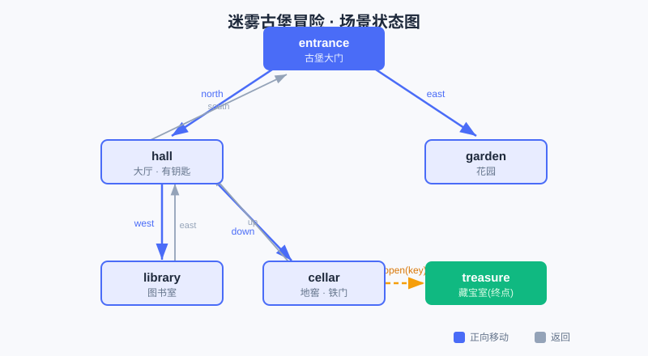

<div style="display:flex; gap:12px; margin-bottom:24px; flex-wrap:wrap; align-items:center;">
  <span style="background:#f0f4ff; color:#4A6CF7; padding:4px 12px; border-radius:20px; font-size:0.85em; font-weight:600; border:1px solid rgba(74,108,247,0.2);">📖 第23章</span>
  <span style="background:#fef9ec; color:#d97706; padding:4px 12px; border-radius:20px; font-size:0.85em; font-weight:600; border:1px solid rgba(245,158,11,0.2);">⏱️ ~45 min read</span>
  <span style="background:#fef9ec; color:#d97706; padding:4px 12px; border-radius:20px; font-size:0.85em; font-weight:600; border:1px solid rgba(245,158,11,0.2);">🎯 Intermediate</span>
</div>

# Chapter 23: 项目一 · 互动文字冒险《迷雾古堡探险》

> 📝 **Before You Continue:** 本章把前面几块"积木"拼成第一个完整作品。请确认你已见过：
> - [第6章 条件判断 if](../control-flow/conditionals.md) —— 用来决定"走不通时怎么办"
> - [第8章 循环 for](../control-flow/for-loops.md) —— 用来遍历一个场景里的所有方向
> - [第12章 字典 dict](../data-structures/dictionaries.md) —— 本章存放"整个古堡"的核心武器
> - [第14章 函数入门](../functions/functions-intro.md) —— 把"移动、捡物品、显示场景"封装成函数

你玩过文字冒险游戏吗？屏幕上是一段描述："你站在古堡大门前，冷风灌进脖子……你可以往北走，或往东走。"你打字选一个方向，故事就往前推进。听起来很"复古"，但它是**练习编程的绝佳沙盒**：一个游戏 = 一堆"场景" + "你在哪" + "怎么移动"。把这三件事用代码说清楚，你就拥有了一个属于自己的小世界。

本章我们要做《迷雾古堡探险》——用**字典**装下整座古堡，用**函数**驱动每一次移动，用 **`input`** 让玩家实时选择。做完你会发现：原来"做个游戏"没那么神秘，它只是把你已经会的东西，**组织**在了一起。

<div class="story-scene">
<strong>🎬 开场小剧场：文字冒险导演喊开机</strong>
<p>算法游乐场决定拍一部互动电影。玩家不是看主角怎么走，而是自己输入方向：north、east、take key。小派发现，故事能不能推进，取决于“当前在哪”和“下一步去哪”。</p>
<p>文字冒险导演 adventure 说：“别把游戏想得太神秘。场景是字典，位置是变量，移动是函数。把它们接起来，屏幕上就有了一个小世界。”</p>
</div>

<div class="quest-card">
<strong>🎯 本章任务卡</strong>
<ul>
<li>用字典设计古堡场景地图。</li>
<li>用变量记录玩家当前位置和背包。</li>
<li>用函数封装移动、捡物品、显示场景。</li>
<li>用 <code>input</code> 接收玩家命令。</li>
<li>做出一个能通关的文字冒险游戏。</li>
</ul>
</div>

<div class="boss-bug">
<strong>👾 本章 Boss Bug：状态丢失幽灵</strong>
<p>它会让玩家明明捡了钥匙，下一步却像没捡过一样。打败它的方法是：把当前位置、背包、场景变化这些状态放在清楚的位置统一管理。</p>
</div>

---

## 23.1 先把"古堡"想清楚：数据长什么样

<div class="try-it">
<strong>🧩 练一练 23.1</strong>
<p>题目：动手写文字冒险前，先把“古堡”想成什么数据结构？</p>
<details><summary>💡 看看答案</summary>
<p>答案：想成<b>字典</b>——键是场景名，值是该场景的信息（描述 + 可走的方向）。</p>
</details>
</div>

动手写代码前，先像计算机科学家一样**抽象**：这座古堡由若干个"场景"组成，每个场景有：

1. **一段描述**（玩家看到的话）；
2. **一些可走的方向**（比如"北 → 大厅"）；
3. （可选）**这里有没有能捡的东西**（比如一把钥匙）。

只要把每个场景都按"同一个模板"记下来，电脑就能统一管理它们。这正好是一张**字典**的活儿：用场景名当"键"，用"描述 + 方向 + 物品"当"值"。

> 🧠 **Mental Model: 古堡 = 一张地图**
> 想象古堡是一张地铁图：每个站是一个场景，站与站之间的连线是"方向"。玩家手里的"当前站在哪"是一个会移动的红点。代码要做的，就是**根据红点所在的站，告诉他能去哪，并按他的输入移动红点**。



上图就是本章游戏的场景图：`entrance`（大门）→ `hall`（大厅）/ `garden`（花园）→ … → `treasure`（藏宝室）。金色虚线是"用钥匙开门"这条特殊转移。后面写代码时，这张图就是我们的"施工蓝图"。

---

## 23.2 用字典存"整个古堡"

<div class="try-it">
<strong>🧩 练一练 23.2</strong>
<p>题目：每个“场景”字典里，至少要有哪两类信息？</p>
<details><summary>💡 看看答案</summary>
<p>答案：① <b>描述</b>（这个场景长啥样）；② <b>可选方向</b>（能去哪、对应哪个场景）。</p>
</details>
</div>

我们给每个场景建一个**内层字典**，再用一个**外层字典**把它们按名字收在一起。看代码：

```python
# 外层字典：键是场景名，值是这个场景的信息（又是一个字典）
scenes = {
    "entrance": {                              # 古堡大门
        "desc": "你站在迷雾古堡锈迹斑斑的大门前。冷风灌进脖子里。",
        "choices": {"north": "hall", "east": "garden"},   # 北→大厅，东→花园
        "item": None,                          # 这里没有物品
    },
    "hall": {                                  # 大厅
        "desc": "大厅中央的吊灯在摇晃。地上有一把闪着微光的铜钥匙。",
        "choices": {"south": "entrance", "west": "library", "down": "cellar"},
        "item": "key",                         # 这里有一把钥匙
    },
    "garden": {
        "desc": "荒废的花园里杂草齐腰。一只乌鸦盯着你，似乎在看守什么。",
        "choices": {"west": "entrance"},
        "item": None,
    },
    "library": {
        "desc": "满墙的书落满灰尘。一本摊开的日记写着：『钥匙能打开地窖的铁门。』",
        "choices": {"east": "hall"},
        "item": None,
    },
    "cellar": {                                # 地窖
        "desc": "阴冷的地窖尽头是一扇铁门。门上有一个钥匙孔。",
        "choices": {"up": "hall", "open": "treasure"},    # open 是"开门"这个特殊方向
        "item": None,
    },
    "treasure": {                              # 藏宝室（终点）
        "desc": "铁门后是一座小小的藏宝室！你找到了古堡的秘宝，成功逃出生天！",
        "choices": {},                         # 空字典：没有别的路了
        "item": None,
    },
}
```

> 💡 **Key Insight:** 注意 `choices` 本身也是一个字典——`"north": "hall"` 表示"往北走会到 hall"。于是"去哪"这件事，变成了一个**查字典**操作：`scenes["entrance"]["choices"]["north"]` 直接得到 `"hall"`。不用写一堆 `if direction == "north": ...`，这就是字典的威力。

> 🤔 **Why 用字典而不是很多个变量？** 如果用 `scene1`、`scene2`……几十个变量，玩家移动时你就得写几十个 `if` 判断"现在在哪"。用字典后，无论古堡有 6 个还是 600 个场景，"移动"的代码**一行都不用改**——数据多了，逻辑不变。这就是"用数据结构组织复杂性"。

---

## 23.3 用函数驱动冒险

<div class="try-it">
<strong>🧩 练一练 23.3</strong>
<p>题目：用函数驱动冒险时，负责“显示当前场景”的函数通常叫什么？</p>
<details><summary>💡 看看答案</summary>
<p>答案：常叫 <code>show_room()</code> 之类——它根据当前场景打印描述和可走方向。</p>
</details>
</div>

光有数据不会动。我们需要几个**函数**把"重复的活"封装起来：显示场景、捡物品、移动。

### 23.3.1 显示当前场景

```python
def show_scene(scene_id):
    """打印一个场景的描述和可走方向。"""
    scene = scenes[scene_id]
    print("\n" + "=" * 40)
    print(scene["desc"])
    # 如果这里有物品、且背包里还没有，提示可以捡
    if scene["item"] and scene["item"] not in inventory:
        print(f"你可以捡起这里的物品：{scene['item']}（输入 'take' 捡起）")
    if scene["choices"]:
        print("可走的方向：")
        for direction, target in scene["choices"].items():   # 遍历所有方向
            print(f"  - {direction}（去 {target}）")
    else:
        print("这里没有别的路了——探险结束！")
```

这里的 `for direction, target in scene["choices"].items():` 正是 [第8章 循环 for](../control-flow/for-loops.md) 的用武之地：不管一个场景有 1 个还是 5 个方向，这段代码都能把它们**逐个**列出来。

### 23.3.2 捡物品 & 移动

```python
def take_item(scene_id):
    """捡起当前场景的物品，放进背包。"""
    scene = scenes[scene_id]
    if scene["item"] and scene["item"] not in inventory:
        inventory.append(scene["item"])          # 用列表 append 把钥匙装进背包
        print(f"你捡起了 {scene['item']}，已放进背包。")
    else:
        print("这里没有可以捡的东西。")


def go(direction):
    """根据方向移动到下一个场景；走不通就留在原地。"""
    global current                               # current 在函数外，改它要声明 global
    scene = scenes[current]
    if direction == "take":
        take_item(current)
        return
    if direction == "open":
        if "open" in scene["choices"]:
            if "key" in inventory:               # 开门需要钥匙
                current = scene["choices"]["open"]
            else:
                print("铁门锁着，你需要一把钥匙。")
        else:
            print("这里没有门可以开。")
        return
    if direction in scene["choices"]:
        current = scene["choices"][direction]    # 查字典，直接"瞬移"到下一场景
    else:
        print("那个方向走不通，换一个试试。")     # 走不通，留在原地
```

> 🐛 **Common Bug:** 在 `go` 里直接写 `current = ...` 会报 `UnboundLocalError`。因为函数里给 `current` 赋值，Python 会把它当成本地变量；想改函数**外面**那个 `current`，必须加 `global current`。这是 [第14章 函数与作用域](../functions/functions-intro.md) 里最容易踩的坑之一。

> ⚡ **Pro Tip:** "开门"我们当成一种特殊的"方向"塞进了 `choices`（`"open": "treasure"`）。这样 `go` 函数不必为开门单独写一套逻辑——它和"往北走"走的是**同一条路**。把特殊情况伪装成普通情况，是让代码变短变稳的小聪明。

---

## 23.4 主循环：让游戏一直跑下去

<div class="try-it">
<strong>🧩 练一练 23.4</strong>
<p>题目：主循环要让游戏一直跑下去，直到发生什么才停？</p>
<details><summary>💡 看看答案</summary>
<p>答案：直到玩家<b>输入退出命令</b>、或<b>到达胜利场景</b>。用 <code>while</code> 循环 + 退出条件实现。</p>
</details>
</div>

游戏要"一直玩到结束"，所以用一个 `while True` 主循环，每次：显示场景 → 问玩家要做什么 → 执行 → 检查是否到达终点或退出。

```python
inventory = []        # 背包：用列表存捡到的东西
current = "entrance"  # 当前所在场景，红点一开始在大门

def play():
    print("欢迎来到《迷雾古堡探险》！")
    print("指令：north/south/east/west/down/up 移动，take 捡物品，open 开门，quit 退出。")
    while True:
        show_scene(current)
        if current == "treasure":               # 到达终点
            print("\n通关！你用一把钥匙解开了古堡的秘密。")
            break
        command = input("\n你要怎么做？> ").strip().lower()   # 读玩家输入
        if command == "quit":
            print("下次再来探险吧！")
            break
        go(command)
```

> 📝 **Note:** `input("...")` 会**暂停**程序、等你在终端打字，回车后把内容作为字符串返回。`.strip()` 去掉首尾空格，`.lower()` 把大写转小写，这样玩家打 `NORTH` 或 ` north ` 都能正常识别——这是做交互程序的好习惯。

---

## 23.5 完整代码 & 如何运行

<div class="try-it">
<strong>🧩 练一练 23.5</strong>
<p>题目：这个冒险游戏怎么运行？</p>
<details><summary>💡 看看答案</summary>
<p>答案：把代码保存成 <code>adventure.py</code>，在终端运行 <code>python adventure.py</code> 即可开玩。</p>
</details>
</div>

把下面整段保存为 `adventure.py`（和前面各小节拼起来就是完整程序），然后在终端运行：

```bash
python adventure.py        # Windows
python3 adventure.py       # macOS（若 python 指向旧版）
```

<details>
<summary>📦 点击展开：adventure.py 完整代码</summary>

```python
"""
迷雾古堡探险 —— 一个用字典 + 函数驱动的互动文字冒险
运行：python adventure.py  （macOS 用 python3 adventure.py）
"""

# ---------- 1. 用字典描述整个古堡 ----------
scenes = {
    "entrance": {
        "desc": "你站在迷雾古堡锈迹斑斑的大门前。冷风灌进脖子里。",
        "choices": {"north": "hall", "east": "garden"},
        "item": None,
    },
    "hall": {
        "desc": "大厅中央的吊灯在摇晃。地上有一把闪着微光的铜钥匙。",
        "choices": {"south": "entrance", "west": "library", "down": "cellar"},
        "item": "key",
    },
    "garden": {
        "desc": "荒废的花园里杂草齐腰。一只乌鸦盯着你，似乎在看守什么。",
        "choices": {"west": "entrance"},
        "item": None,
    },
    "library": {
        "desc": "满墙的书落满灰尘。一本摊开的日记写着：『钥匙能打开地窖的铁门。』",
        "choices": {"east": "hall"},
        "item": None,
    },
    "cellar": {
        "desc": "阴冷的地窖尽头是一扇铁门。门上有一个钥匙孔。",
        "choices": {"up": "hall", "open": "treasure"},
        "item": None,
    },
    "treasure": {
        "desc": "铁门后是一座小小的藏宝室！你找到了古堡的秘宝，成功逃出生天！",
        "choices": {},
        "item": None,
    },
}

# ---------- 2. 玩家状态 ----------
inventory = []
current = "entrance"


# ---------- 3. 函数：显示 / 捡物品 / 移动 ----------
def show_scene(scene_id):
    scene = scenes[scene_id]
    print("\n" + "=" * 40)
    print(scene["desc"])
    if scene["item"] and scene["item"] not in inventory:
        print(f"你可以捡起这里的物品：{scene['item']}（输入 'take' 捡起）")
    if scene["choices"]:
        print("可走的方向：")
        for direction, target in scene["choices"].items():
            print(f"  - {direction}（去 {target}）")
    else:
        print("这里没有别的路了——探险结束！")


def take_item(scene_id):
    scene = scenes[scene_id]
    if scene["item"] and scene["item"] not in inventory:
        inventory.append(scene["item"])
        print(f"你捡起了 {scene['item']}，已放进背包。")
    else:
        print("这里没有可以捡的东西。")


def go(direction):
    global current
    scene = scenes[current]
    if direction == "take":
        take_item(current)
        return
    if direction == "open":
        if "open" in scene["choices"]:
            if "key" in inventory:
                current = scene["choices"]["open"]
            else:
                print("铁门锁着，你需要一把钥匙。")
        else:
            print("这里没有门可以开。")
        return
    if direction in scene["choices"]:
        current = scene["choices"][direction]
    else:
        print("那个方向走不通，换一个试试。")


# ---------- 4. 主循环 ----------
def play():
    print("欢迎来到《迷雾古堡探险》！")
    print("指令：north/south/east/west/down/up 移动，take 捡物品，open 开门，quit 退出。")
    while True:
        show_scene(current)
        if current == "treasure":
            print("\n通关！你用一把钥匙解开了古堡的秘密。")
            break
        command = input("\n你要怎么做？> ").strip().lower()
        if command == "quit":
            print("下次再来探险吧！")
            break
        go(command)


if __name__ == "__main__":
    play()
```

</details>

🛠️ **项目工坊：** 上面的代码就是本章的"成品"。复制粘贴就能跑——先跑通它，再往下看"怎么改出你自己的游戏"。

---

## 23.6 🔍 计算思维聚焦：状态 + 转移

这个游戏藏着计算思维里一个超重要的模式——**状态机（State Machine）**：

- **状态（State）**：你现在在哪个场景（`current`）、背包里有什么（`inventory`）。
- **转移（Transition）**：玩家输入一个方向，`go` 函数按规则把"当前状态"变成"下一状态"。

你会发现，游戏再复杂，本质也就是"状态 + 转移"的不断重复。这种"把世界拆成『现在在哪 + 怎么动』"的思维方式，后面做**算法、AI、游戏、甚至 App** 都会反复用到。你已经不知不觉用上了。

> 💡 **Key Insight:** 好的程序不是"写一长串指令"，而是"设计好数据结构（古堡怎么存）+ 几个能复用的函数（怎么动）+ 一个主循环（一直跑）"。本章就是这套套路的迷你样板。

---

## 🏅 本章通关徽章：文字冒险导演

<div class="badge-card">
<strong>如果你能做到下面 4 件事，就获得“文字冒险导演”徽章：</strong>
<ul>
<li>能用字典描述一个游戏地图。</li>
<li>能用变量记录玩家当前位置和背包状态。</li>
<li>能用函数组织移动、显示和捡物品逻辑。</li>
<li>能让玩家通过输入推动故事前进。</li>
</ul>
</div>

---

## ⚠️ Common Mistakes in Chapter 23

| # | 误区 | 示例 | 为什么错 | 修正 |
|---|------|------|---------|------|
| 1 | 移动函数漏写 `global current` | `def go(d): current = ...` 报 `UnboundLocalError` | 函数内给外部变量赋值必须声明 `global` | 函数开头加 `global current` |
| 2 | 方向写错导致查不到 | 输入 `go north` 但 `choices` 里键是 `"north"`；多了空格 | 字典查不到键 | 用 `.strip().lower()` 归一化输入，并先用 `in` 判断 |
| 3 | 把 `choices` 当成列表用 | `scene["choices"][0]` 想取第一个方向 | `choices` 是字典不是列表 | 用 `for d, t in scene["choices"].items():` 遍历 |
| 4 | 终点判断写错位置 | 到了藏宝室却还能继续走 | 没在显示后检查 `current == "treasure"` | 在循环里、`go` 之后立刻判断终点并 `break` |
| 5 | 钥匙判定永远失败 | 写了"`if key in inventory`"但从不 `append` | 玩家没真正把钥匙装进背包 | 在 `hall` 场景走 `take` 触发 `inventory.append("key")` |

---

## Chapter Summary

### 📌 Key Takeaways

| 概念 | 要点 | 为什么重要 |
|------|------|------------|
| 字典存场景 | 外层字典键=场景名，内层含 `desc`/`choices`/`item` | 数据集中管理，加场景不改逻辑 |
| `choices` 也是字典 | `"north": "hall"` 让"去哪"变成查字典 | 免写一堆 `if`，扩展性好 |
| 函数封装 | `show_scene`/`take_item`/`go` 各管一件事 | 逻辑清晰、可复用、好调试 |
| `global` 状态 | 改函数外的 `current` 要声明 `global` | 否则报 `UnboundLocalError` |
| 状态机思维 | 状态(`current`+`inventory`) + 转移(`go`) | 复杂交互程序的通用骨架 |

### ❓ FAQ

**Q1: 我想加更多场景，难吗？**
> A: 不难。只要在 `scenes` 里再加一个键值对，并在相邻场景的 `choices` 里补上"怎么走到它"。`go`、`show_scene` 一行都不用改——这就是字典方案的可扩展性。

**Q2: 玩家输入大小写或带空格怎么办？**
> A: 用 `input(...).strip().lower()` 归一化（去空格、转小写），再交给 `go`。这样 ` NORTH `、`North`、`north` 都等效。

**Q3: 能不能做成"打怪/血量"那种更硬核的游戏？**
> A: 可以。给玩家状态加一个 `hp` 变量（也是字典或整数），在 `go` 或专门的函数里根据场景扣血、判断 `hp <= 0` 就 `game over`。骨架不变，只是状态更丰富。

### 🔗 Connections to Later Chapters

- **[第24章 数据小分析](data-analysis.md)** 继续用字典和列表，但把"场景"换成"真实数据"，练统计与可视化。
- **[第25章 算法挑战擂台](algorithm-arena.md)** 会在"能跑的小项目"之外，正式上算法题——搜索/排序/递归，正是竞赛底子。
- **[第26章 下一步去哪？](next-steps.md)** 给你几条把本书能力继续放大的路线（竞赛 / AI / Web / 开源）。

---


## 🎮 加练任务包

> 下面这些题目不一定比章末题更难，但更适合“多刷几遍、把手感练出来”。建议先独立做，再展开提示。

### 加练 23.A · 新增房间 🟢

给古堡新增一个 `tower` 场景，至少需要哪些字段？

<details>
<summary>💡 提示 / 答案要点</summary>

至少需要描述 `desc`、可走方向 `choices`，可选字段如 `item`。还要把别的场景连接到 tower。

</details>

---

### 加练 23.B · 背包检查 🟢

玩家是否有钥匙，应该查哪个数据？

<details>
<summary>💡 提示 / 答案要点</summary>

查背包列表/集合，比如 `"key" in inventory`。不要只看当前场景。

</details>

---

### 加练 23.C · 命令解析 🟡

玩家输入 `take key`，你会怎样拆出动作和物品？

<details>
<summary>💡 提示 / 答案要点</summary>

用 `parts = command.split()`，动作是 `parts[0]`，物品可能是 `parts[1]`。还要处理输入不完整的情况。

</details>

---


---

## Practice Problems

🛠️ **项目工坊（扩展挑战）：** 本章的"练习"就是**把游戏改成你自己的**。下面每题都是一道"扩展挑战"，做完你就有专属版本。

---

**Problem 23.1 — 加一个"暗道"场景** 🟢 Easy

在 `scenes` 里新增一个场景 `secret`（比如"墙上的暗格，里面藏着一张藏宝图"），并让 `library` 可以通过 `north` 走到它。要求：不改 `go` / `show_scene` 任何一行。

<details>
<summary>💡 Solution (click to reveal)</summary>

**Approach:** 只动数据，不动逻辑——这正是字典方案的优势。

```python
# 1) 在 scenes 里加一个新键值对
"secret": {
    "desc": "墙上的暗格轻轻弹开，里面藏着一张泛黄的藏宝图。",
    "choices": {"south": "library"},
    "item": "map",
},
# 2) 给 library 的 choices 加一条
"library": {
    "desc": "...",
    "choices": {"east": "hall", "north": "secret"},   # 新增 north
    "item": None,
},
```

**Key points:**
- `go` 靠 `direction in scene["choices"]` 工作，新方向自动生效。
- 这就是"数据驱动"：加内容不必改代码。

</details>

---

**Problem 23.2 — 给游戏加"血量"** 🟡 Medium

给玩家加一个 `hp = 3`。设定：在 `garden`（花园）里若不先 `take` 任何护身物就 `west` 离开，会被乌鸦啄一下，`hp` 减 1；`hp` 到 0 就游戏结束。提示：在 `go` 里对 `garden` 的离开做特殊判断。

<details>
<summary>💡 Solution (click to reveal)</summary>

**Approach:** 加状态变量 + 在转移时触发扣血。

```python
hp = 3

def go(direction):
    global current, hp
    scene = scenes[current]
    if direction in scene["choices"]:
        nxt = scene["choices"][direction]
        # 从 garden 离开且血量为正：被乌鸦啄
        if current == "garden" and hp > 0:
            hp -= 1
            print(f"乌鸦啄了你一下！hp 剩 {hp}")
            if hp <= 0:
                print("你被啄晕了，探险失败……")
                return
        current = nxt
    else:
        print("那个方向走不通，换一个试试。")
```

**Key points:**
- 状态变量 `hp` 和 `current` 一样用 `global` 声明。
- 扣血后先判断再移动，避免"死了还继续走"。

</details>

---

**Problem 23.3 — 让胜利条件更讲究** 🔴 Hard

现在"到达 treasure 就赢"。改成：必须**同时拥有 `key` 和 `map`** 才算真正通关；若只拿钥匙进藏宝室，提示"还差藏宝图"，并把玩家弹回 `cellar`。

<details>
<summary>💡 Solution (click to reveal)</summary>

**Approach:** 到达 `treasure` 时不急着 `break`，先校验背包。

```python
def play():
    ...
    while True:
        show_scene(current)
        if current == "treasure":
            if "key" in inventory and "map" in inventory:
                print("\n真正通关！钥匙 + 藏宝图，秘宝归你！")
                break
            else:
                print("还差藏宝图，你被弹回地窖。")
                current = "cellar"   # 弹回，不结束
                continue
        ...
```

**Key points:**
- 终点判断从"到了就赢"升级为"到了且满足条件才赢"。
- 不满足就把 `current` 改回 `cellar` 并 `continue` 继续循环。

</details>

---

**Problem 23.4 — 把古堡画成"可玩地图文件"** 🏆 Challenge

把 `scenes` 字典单独存成 `castle.json`（用 `json` 模块），让 `adventure.py` 启动时 `open` 读进来。这样"改地图"连代码文件都不用碰。写出读写两处关键代码。

<details>
<summary>💡 Solution (click to reveal)</summary>

**Approach:** 字典和 JSON 天然对应，`json.dump` / `json.load` 互转。

```python
import json

# 保存地图（只需做一次）
with open("castle.json", "w", encoding="utf-8") as f:
    json.dump(scenes, f, ensure_ascii=False, indent=2)

# 启动时读取
with open("castle.json", encoding="utf-8") as f:
    scenes = json.load(f)
```

**Key points:**
- `ensure_ascii=False` 保证中文不被转成 `\uXXXX`。
- 数据外置后，策划（设计关卡的人）和程序（跑游戏的人）可以分工——这是真实游戏开发的做法。

</details>

---

> 💡 **记住这一句：** 一个游戏不是"一长串指令"，而是"状态 + 转移"的不断重复——把世界装进字典，你就握住了造物主的笔。
